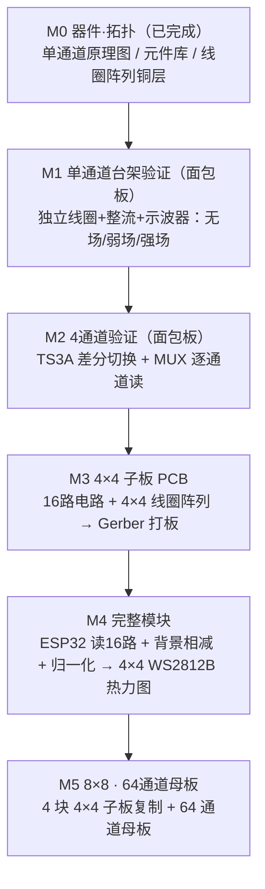

# AuroraTessellation-NFC
Aurora Tessellation NFC（NFC极光镶嵌）：一款桌面级NFC磁场可视化工具。灵感来自极光——太阳风在地球磁场中留下的光痕；用64个线圈组成的“磁像素”阵列，将13.56 MHz的近场磁场分布实时呈现为极光热力图。

## 项目状态

当前从 4×4、16 通道子板开始验证，使用 ESP32-S3 和 4×4 WS2812B 显示模块。第一阶段采用“全波整流 + TS3A44159 差分背景采样”方案，实施顺序和验收标准见 [4×4 子板验证文档](docs/phase-1-4x4-validation.md)。

## 产品形态（最终目标）

桌面级 NFC 磁场可视化模块——“磁像素”阵列，把 13.56 MHz 近场磁场分布实时呈现为极光热力图。

- **阵列规模**：8×8 = **64 个 PCB 铜箔线圈**（磁像素），每个线圈 1:1 对应 **64 颗 WS2812B（5050 封装）LED**，1 采样通道 ↔ 1 LED
- **线圈**：φ19 mm、6 匝、0.2 mm 线宽、20 mm 中心间距 → 阵列覆盖约 **160×160 mm**（4×4 版为 16 线圈、80×80 mm）
- **采集**：每通道全波整流 + 差分背景采样（2×BAT54S + 10 kΩ/100 nF RC）→ TS3A44159 → CD74HC4067 → ESP32-S3 ADC1
- **控制**：ESP32-S3 控制板（WROOM-1 + USB Type-C + CH340 + 3.3 V LDO + EN/BOOT，待建）
- **结构**：**4 块 4×4 传感子板**（每块 16 线圈）拼到 **64 通道母板**，配 8×8 WS2812B 显示
- **尺寸预估（8×8）**：
  - 传感面：**160 × 160 mm**（单板）；或 **4 块 80 × 80 mm** 4×4 子板拼 **64 通道母板**（含连接器 + 控制区约 180~200 × 180~200 mm）。计算：8 线圈 × 20 mm 中心间距 → 首尾 140 mm + φ19 + 板边 0.5×2 = 160 mm。
  - 显示面（8×8 显示布局三方案，2026-08-30 定）：
    - **方案 A · 叠层 1:1（磁像素）**：20 mm 间距定制 LED 板（160×160 mm）叠在线圈板背面，每颗 LED 对准一个线圈 → 热力图与磁场位置 1:1。留作后续优化。
    - **方案 B · LED 嵌线圈孔径**：LED 装在线圈中心孔（φ8）背面往上打光，视觉“镶嵌”感最强；LED 金属可能轻微失谐，需实测。进阶方案，定型后再试。
    - **方案 C · 独立显示板（当前采用）**：现成 7.5 mm 间距 WS2812B 模块（4×4≈30×30 mm、8×8≈60×60 mm）做独立热力图，不追求与线圈 1:1 物理对齐（现成模块间距 7.5 mm ≠ 线圈 20 mm）。
  - 整机：约 **170 × 170 × 30 mm** 桌面盒（传感层 + 显示层堆叠，中间夹控制板）。

## 开发过程总览（4×4 验证 → 8×8 量产）

先小步验证再放大：单通道 → 4 通道 → 4×4 子板 → 完整模块 → 8×8。

要点：

- **PCB 线圈不是独立子板**——它是传感子板 PCB 的顶层铜箔走线（`coil_4x4_array`），随子板一起验证。面包板阶段用绕制独立线圈（φ20≈φ19）验证信号链和信号量级。
- 可选降险：先打一张**极小的单线圈测试板**（1 个 φ19 线圈 + 2 焊盘），用示波器/网分确认电感和谐振，再铺满 4×4。
- 单通道子板（`hardware/subboard_4x4/single-channel/`）已按**方案 C** 拆分：**无 MCU**，接口为 **J1（8 个网络标签，标注 ESP32-S3-DevKitC-1 IO1/IO2/3V3/IO4/IO5/IO6/IO7/GND，无排针/焊盘元件，实物连接点 M3 布局阶段再加）**，接独立的 ESP32 控制板；面包板原型用 DevKitC-1 经 J1 引线连接。
- 显示侧已验证：`ws2812b-single-test`、`ws2812b-4x4-test`（16 颗 5050，灯序右下角起、每列从下往上）均已跑通。
- **当前进度：M0 基本完成**，下一步是 M1——按 `single-channel-breadboard-wiring.md` 在面包板搭建，接示波器验证。

### Fritzing 部件进度（fritzing-parts-langhua）

| 部件 | 状态 |
|---|---|
| NFC Coil（20mm 6 匝平面感应线圈） | ✅ 已完成并提交 |
| coil_4x4_array（φ19mm 4×4 阵列铜层） | ✅ 已完成 |
| BAT54S（SOT-23 双肖特基二极管） | ✅ 已完成并提交 |
| TS3A44159（TSSOP-16 差分开关） | ✅ 已完成并提交（`TS3A44159PWR.fzpz`，引脚 13~16 已按 SCDS225 核对） |
| CD74HC4067（24 脚 MUX） | ✅ 已完成并提交（`CD74HC4067.fzpz`，四视图 icon/schematic/breadboard/PCB 按 datasheet 绘制） |

## 文档

- [4×4 子板验证文档](docs/phase-1-4x4-validation.md)
- [Fritzing 自定义部件开发指南](../fritzing-parts-langhua/docs/part-dev-guide.md)（位于 fritzing-parts-langhua 部件库，做 BAT54S、TS3A44159 等部件前必读）

## 重要设计说明

本项目输出的是 13.56 MHz NFC 近场磁场的相对分布，不等同于经过校准的 A/m 绝对场强测量仪。打板前必须确认整流拓扑：BAT54S 是双二极管器件，不能直接视为完整四二极管全波整流桥。
