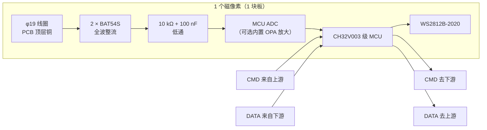

# 磁像素板（P1 智能像素）设计规格

> 状态（2026-09-23）
>
> - ✅ **架构已定：P1「智能像素」** —— 每块板自带 MCU，既是**可单独销售**的单线圈探测板，也是 4×4 / 8×8 阵列的积木。
> - ✅ **MCU 已定：CH32V003 级**（5 V 直供、自带 10-bit ADC，见 §4）。
> - ⏳ **阵列间距 20 mm / 22 mm 待定** —— 由 §6 的 coupon 实测决定，**不猜**。
>
> 本文件是像素板的设计依据。`docs/phase-1-4x4-validation.md` 与 `hardware/subboard_4x4/*` 记录的是
> **集中式（P2）**方案（TS3A44159 开关 + CD74HC4067 MUX），**保持不变**；其中 single-channel 板
> （已送厂，3~4 天回板）验证的「线圈 → 2×BAT54S → RC」模拟前端，**正是本像素板的核心，仍然有效**。

*像素板 = 1 个线圈 + 1 路整流 + 1 颗 MCU + 1 颗 2020 LED*

## 1. 定位

- **单卖**：一片小方板 + 5 V 输入，线圈朝向被测物体 → 板载 LED 的亮度/颜色表示 13.56 MHz 近场场强。
- **阵列**：N 块用**一条链**串起来就是磁像素阵列（4×4 = 16 块，8×8 = 64 块）。

| 阵列 | 像素数 | 20 mm 间距 | 22 mm 间距 |
|---|---|---|---|
| 4×4 | 16 | 80 × 80 mm | 88 × 88 mm |
| 8×8 | 64 | 160 × 160 mm | 176 × 176 mm |

## 2. 架构（P1）

信号链：**线圈 → 全波整流 → RC 低通 → MCU ADC → LED**（每块独立完成）。
阵列模式下，每块 MCU 把上游命令**转发**给下游，同时在回传方向上**插入自己的读数** ——
主控在链尾收齐全部像素值，再把颜色下发。

> **为什么不需要 TS3A44159 / CD74HC4067**：每块自己有 ADC，没有"共用一个 ADC 逐通道扫描"的需求。
> 开关最多留 1 路做**基线漂移补偿**（可选）。这是 P1 相对 P2 最大的简化。

## 3. 每块元件清单

| 位号 | 元件 | 封装 | 数量 | 说明 |
|---|---|---|---|---|
| L1 | NFC 线圈 φ19 / 6 匝 / 0.2 mm | PCB 顶层铜 | 1 | 复用 `NFC-Coil`（库内已有，实测铜箔外径 19.0 mm） |
| D1/D2 | BAT54S 双肖特基 | SOT-23 | 2 | 组成四二极管全波桥（库内已有） |
| R1 | 10 kΩ | 0603 | 1 | RC 串联 |
| C1 | 100 nF | 0603 | 1 | RC 对地 |
| U1 | CH32V002 / CH32V003 | **SOP8**（J4M6，见 §4） | 1 | 5 V 直供、内置 ADC；1.27 mm 间距好手焊 |
| LED1 | WS2812B | **2020** | 1 | 板载显示（库内已有） |
| C2 | 100 nF | 0603 | 1 | MCU 去耦 |
| — | 过压钳位（可选） | SOD-323 | 1 | 整流输出 < VDD（防场强过大） |

## 4. MCU：CH32V002 / CH32V003（SOP8，2026-09-23 定）

### 4.1 型号：两者**同封装同引脚，可互换**

WCH 原文：CH32V002「**its pins and functionality are compatible with the CH32V003**」。

| | CH32V003J4M6（SOP8） | CH32V002J4M6（SOP8） |
|---|---|---|
| ADC | 10-bit | **12-bit，3 Msps** |
| 内置 OPA | **有 1 组** | 无 |
| RAM / Flash | 2 KB / 16 KB | 4 KB / 16 KB |
| 供电 | 3.3 / 5 V | 2.5 / 3.3 / 5 V |
| GPIO | 6 | 6 |

⇒ **不必现在选**：等 single-channel 板回来实测整流包络幅度 —— 够大用 12-bit 的 V002，太小用带 OPA 的 V003，**板子不用改**。

### 4.2 SOP8 引脚（datasheet §2.2 表 2-1 + 封装图；两者引脚号一致）

| pin | 引脚 | 可做输出 | 备注 |
|---|---|---|---|
| 1 | **PD6 / PA1**（die 焊盘共用一脚） | ❌ 不能 | ADC_IN6 / ADC_IN1 ⇒ **适合做线圈包络输入** |
| 2 | VSS | — | GND |
| 3 | PA2 | ✅ | ADC_IN0；可做 LED 数据 |
| 4 | VDD | — | 5 V |
| 5 | PC1 | ✅ | 单总线 DATA |
| 6 | PC2 | ✅ | 备用 |
| 7 | PC4 | ✅ | ADC_IN2；备用 |
| 8 | **PD1 / PD4 / PD5**（die 焊盘共用一脚） | ⚠️ 受限 | PD1 = SWIO（烧录） |

⚠️ **V002 datasheet Note 3/4 明确**：SOP8（J4M6）内部把 PD6+PA1 短接、PD1+PD4+PD5 短接
（die 焊盘共用封装脚），并**禁止这两个节点做输出**。
⇒ SOP8 实际只有 **6 个电气节点**，其中 2 个只能当输入/专用 ⇒ 输出请用 PA2 / PC1 / PC2 / PC4 ✓

### 4.3 引脚分配（6 个节点用 4~5 个）

| 用途 | 引脚 | 数量 |
|---|---|---|
| 线圈包络 ADC 输入 | pin1（PD6/PA1） | 1 |
| 链 DATA_IN | pin3（PA2） | 1 |
| 链 DATA_OUT | pin5（PC1） | 1 |
| LED 数据（**A2 / B 需要**；A1 由 LED 硬件链自理） | pin6（PC2） | 0~1 |
| SWIO 烧录调试 | pin8（PD1） | 1 |
| 备用 | pin7（PC4） | 1 |

⇒ **SOP8 够用** ✓（✅ **已定 A2**：用 5 个，余 1 个备用）—— 三方案对比见 §5.2

### 4.4 封装与面积（datasheet §4）

SOP8 = **3.9 × 5.0 mm**，引脚间距 **1.27 mm**（50 mil），含焊盘占地 **≈ 30 mm²** ⇒ 手焊/维修最友好 ✓

## 5. 链路架构：LED 与传感数据（✅ 已定 A2）

### 5.1 先看 WS2812B 本身：单向单链

数据从 DIN 进 → 吃掉自己的 24 bit → **再生转发**给 DOUT → 下一颗：

- **没有回读**（不能反向传数据）、**没有地址**，位置 = 物理顺序；断一颗，后面全灭。
- 它是「硬件」菊花链 ⇒ 若让 LED 自己串成链，链就得在每块板中间断开接进本板的 2020，
  接插件得引出 LED_IN / LED_OUT 两根。

（我们**不**这么做 —— A2 让每块 MCU 自己驱动自己那颗 LED，那两根就省掉了，见 §5.2）

### 5.2 传感数据 + 颜色：三种做法

| 方案 | 板间线 | MCU 引脚 | 位置（谁在哪） | LED 时序 |
|---|---|---|---|---|
| **A1** LED 硬件直穿链 + 传感链 | 6 根：5V/GND/**LED_IN/LED_OUT**/SENS_IN/SENS_OUT | 4/6 | ✅ 天然 | LED 自己再生（最稳） |
| **A2** 一条链跑「颜色下行 + 读数下行」，MCU 自驱 LED | **4 根**：5V/GND/DATA_IN/DATA_OUT | 5/6 | ✅ 天然 | MCU 产生（SPI+DMA） |
| **B** 共享总线轮询，MCU 自驱 LED | 3 根：5V/GND/DATA | 4/6 | ⚠️ 需一次性标定 | MCU 产生（SPI+DMA） |

- **A1 为什么有 LED_IN/LED_OUT**：WS2812B 是**硬件**菊花链，链要在每块板中间「断开」接进这一颗 2020
  （本板 2020 的 DIN 接上游、DOUT 接下游）⇒ 接插件必须引出这两根。
  它们不是额外功能线，**就是 WS2812B 链本身穿过这块板**。
- **A2**：LED 不串硬件链，而是每块 MCU 自己驱动自己那颗 2020；颜色随链下发，
  每个 MCU 像 WS2812 一样「吃掉自己那 3 字节、把剩下的转发」✓ 读数则附在帧尾继续往下送
  ⇒ 同一条链同时完成 颜色下行 + 读数回报，**顺序天然明确、不需要标定** ✓
  代价：MCU 要自己产生 WS2812 时序（用 SPI + DMA 3bit 编码，芯片都有 ✓）。

> ✅ **已定（2026-09-23）：A2** —— 板间 **4 根线**（5V/GND/DATA_IN/DATA_OUT），MCU 自驱 LED，
> 一条链同时跑「颜色下行 + 读数下行」；A1（带 LED_IN/LED_OUT 的硬件链）作为「零 LED 时序风险」备选保留。

单独销售形态：单块 5 V 上电即工作（固件内置局部归一化）；串联时用 4 线对接。
电流预算待查 2020 datasheet（64 块全亮的 5 V 电流要与电源选型一起核）。

## 6. 间距与尺寸预算（由 coupon 实测决定）

要能拼成阵列，像素板边长必须 ≤ 阵列中心间距 ⇒ 只剩约 0.5 mm 板边 ⇒ **元件只能进线圈中心 φ8 孔**。

面积账（每块）：

| 元件 | 占地（含焊盘） |
|---|---|
| 2 × BAT54S（SOT-23） | ~19 mm² |
| R + C + C（0603 × 3） | ~6 mm² |
| MCU | SOP8 **~30 mm²** |
| WS2812B-2020 | ~8 mm² |
| **合计** | **≈ 63 mm²** |

可用面积：

- **20 mm 间距**：只有 φ8 中心孔 ⇒ **50 mm² / 面**（双面共 100 mm²）
  ⇒ **SOP8 版必须正反面都用**（≈63 > 50）；想单面放下得换更小封装 / 用 0402 元件。
- **22 mm 间距**：孔以外还多出约 **130 mm² 窄边条**（约 1.5 mm 宽，只放得下小件），
  大件（MCU / LED）仍进孔 ⇒ 余量明显更宽松。

两个方案都要**实测**才知道哪个信号更好；同时**贴片工艺**（手焊 TSSOP vs 贴片 QFN）也要一起选。

### Coupon 实验（打样一张小对照板）

| 编号 | 线圈 | 中心间距 | 孔内/孔下放元件 | 要测什么 |
|---|---|---|---|---|
| C0 | φ19 / 6 匝 / 0.2 mm | 单只 | 无 | **基准**：L、Q、自谐振、13.56 MHz 阻抗 |
| C1 | 同上 | 20 mm | 无 | 相邻线圈**互感/失谐量** |
| C2 | 同上 | 20 mm | **有**（按真实布局复刻元件） | 孔内元件造成的衰减 → **20 mm 是否可行** |
| C3 | 同上 | 22 mm | 有 | 22 mm 对照（元件宽松版） |
| C4 | 同上 | 22 mm | 有 | **V-cut 拼版试掰**：V 槽吃料后的尺寸偏差/毛刺，验证 1.5 mm 边条够不够 |

测法与判定（阈值**暂定**，看完第一轮数据再校准）：

1. **L / Q / 自谐振**：网分 S11 单端口（或 LCR 表）；
2. **相邻互感**：比对 C1 单只 vs 双只（邻圈开路/短路）的 L 变化量 → 耦合系数 k；
3. **孔内元件影响**：C0 vs C2 的 L、Q，以及接同一个整流+RC 负载后的**包络幅度**对比；
4. 判定：L 变化 < 5%、Q 下降 < 20% ⇒ 该方案可用；否则跳 22 mm，或孔内改用更小封装（SOT-323 / DFN）。
5. **V-cut 边条**（C4）：掰开后量中心距偏差与毛刺，目标 ±0.2 mm 内；20 mm 版不做 V-cut（见 §7）。

## 7. 制造方式：拼版 vs 整板（2026-09-23 定）

**决定：分开下单。** single-channel 与 coupon 不做「不同设计拼一张」—— 拼版会把
已封版的 single-channel Gerber 坐标平移成面板文件，作废刚核对过的 v0.1.3。

| 拼版方式 | 相邻间距 | 结论 |
|---|---|---|
| **同款多连片**（一块面板放 N 块相同的板） | — | ✅ 首选，按「一片板」计价：100 × 100 mm 面板可放 **25 块 20 × 20** 像素板，单块成本掉一个数量级 |
| **铣槽**（routing） | 槽宽 ~1.6~2.4 mm | ❌ **不能用来拼阵列**：板 20 mm ＋ 槽 2 mm ⇒ 线圈中心距变 22 mm；强行保持 20 mm ⇒ 板只剩 18 mm，装不下 φ19 线圈 |
| **V-cut** | 0 | ⚠️ 无间隙，但 V 槽从每块板边各吃 ~0.25 mm ⇒ 20 mm 板只剩 ~0.25 mm 容差；**22 mm 有 1.5 mm 边条才稳** ✅ |

⇒ 两条产品线（共用同一套像素电路，只是分割方式不同）：

| SKU | 做法 | 用途 |
|---|---|---|
| **单卖像素板** | 同款多连片拼版（V-cut / 邮票孔），掰开单片卖 | 演示件、零售 |
| **4×4 阵列板** | **一整块 80 × 80**（16 个像素电路在同一板上，无接缝、栅格精确） | 桌面热力图（自用/整机） |

⇒ 阵列对齐**不靠拼版**；**20 mm 只配「整板阵列」，22 mm 才同时支持「拼版单卖」**。

## 8. 待办 / 依赖

- [ ] **CH32V002 / CH32V003 元件库**（`fritzing-parts-langhua/svg/CH32V002/`）：按芯片工作流做 icon → 面包板 → 原理图 → PCB（**SOP8**，引脚表见 §4.2；源：`D:\Downloads\CH32V002DS0.PDF`、`CH32V003DS0.PDF`）。
- [ ] **Coupon 板设计 + 打样**（§6 的 C0~C4，**单独下单**，不与 single-channel 拼版）→ **定间距**。
- [ ] **single-channel 板回板（3~4 天）** → 实测整流包络量级 → 决定是否用内置 OPA 放大。
- [ ] 像素板 `fzz` + Gerber（等 coupon 数据）。
- [ ] 主控板（ESP32-S3 控制板，待建）+ 链协议固件。

## 9. 与既有文档的关系

| 文档 | 内容 | 在 P1 下的状态 |
|---|---|---|
| `docs/phase-1-4x4-validation.md` | 集中式方案 M0~M5、TS3A/MUX 拓扑 | 历史记录，**不改**；M1 模拟前端验证仍有效 |
| `hardware/subboard_4x4/schematic-spec.md` | 16 路 + 4×TS3A + MUX 连接表 | 同上（P2 方案依据） |
| `hardware/subboard_4x4/single-channel/` | 已送厂的单通道板（Gerber v0.1.3） | **照原计划打板**，用于验证模拟前端量级 |
| 本文件 | P1 像素板 | **新方向** |
