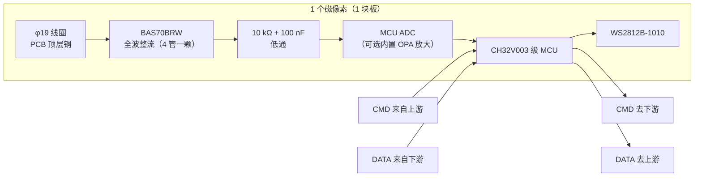

# 磁像素板（P1 智能像素）设计规格

> 状态（2026-09-23）
>
> - ✅ **架构已定：P1「智能像素」** —— 每块板自带 MCU，既是**可单独销售**的单线圈探测板，也是 4×4 / 8×8 阵列的积木。
> - ✅ **MCU 已定：`CH32V003F4U6`（QFN20，3 × 3 mm）** ✓ SPI ✓ + OPA ✓；`CH32V002F4U6` 同封装 drop-in ✓（见 §4）。
> - ⏳ **阵列间距 20 mm / 22 mm 待定** —— 由 §6 的 coupon 实测决定，**不猜**。
>
> 本文件是像素板的设计依据。`docs/phase-1-4x4-validation.md` 与 `hardware/subboard_4x4/*` 记录的是
> **集中式（P2）**方案（TS3A44159 开关 + CD74HC4067 MUX），**保持不变**；其中 single-channel 板
> （已送厂，3~4 天回板）验证的「线圈 → 2×BAT54S → RC」模拟前端，**正是本像素板的核心，仍然有效**
> （像素板把那 2 颗 BAT54S 换成 **1 颗 `BAS70BRW`** ✓ —— 同样的 4 管全波桥，见 §3）。

*像素板 = 1 个线圈 + 1 路整流 + 1 颗 MCU + 1 颗 1010 LED*

## 1. 定位

- **单卖**：一片小方板 + 5 V 输入，线圈朝向被测物体 → 板载 LED 的亮度/颜色表示 13.56 MHz 近场场强。
- **阵列**：N 块用**一条链**串起来就是磁像素阵列（4×4 = 16 块，8×8 = 64 块）。

| 阵列 | 像素数 | 20 mm 间距 | 22 mm 间距 |
|---|---|---|---|
| 4×4 | 16 | 80 × 80 mm | 88 × 88 mm |
| 8×8 | 64 | 160 × 160 mm | 176 × 176 mm |

## 2. 架构（P1）

信号链：**线圈 → 全波整流 → RC 低通 → MCU ADC → LED**（每块独立完成）。
阵列模式下，每块 MCU 把上游命令**转发**给下游，同时在回传方向上**插入自己的读数** ——
主控在链尾收齐全部像素值，再把颜色下发。

> **为什么不需要 TS3A44159 / CD74HC4067**：每块自己有 ADC，没有"共用一个 ADC 逐通道扫描"的需求。
> 开关最多留 1 路做**基线漂移补偿**（可选）。这是 P1 相对 P2 最大的简化。

## 3. 每块元件清单

| 位号 | 元件 | 封装 | 数量 | 说明 |
|---|---|---|---|---|
| L1 | NFC 线圈 φ19 / 6 匝 / 0.2 mm | PCB 顶层铜 | 1 | 复用 `NFC-Coil`（库内已有，实测铜箔外径 19.0 mm） |
| D1 | `BAS70BRW`（4 × 70 V 肖特基）| SOT-363（SC-70-6）| 1 | **一颗就是整个全波桥** ✓（库内已有 ✓；70 V 耐压 ✓、对线圈加载更小 ✓）|
| R1 | 10 kΩ | 0603 | 1 | RC 串联 |
| C1 | 100 nF | 0603 | 1 | RC 对地 |
| U1 | CH32V003F4U6 / CH32V002F4U6 | **QFN20**（3 × 3 mm，见 §4） | 1 | 5 V 直供、内置 ADC（+ OPA ✓）、**有 SPI** ✓；两颗 drop-in 可互换 ✓ |
| LED1 | WS2812B | **1010** | 1 | 1.0 × 1.0 mm，板载显示（库内已有 ✓） |
| C2 | 100 nF | 0603 | 1 | MCU 去耦 |
| — | 过压钳位（可选） | SOD-323 | 1 | 整流输出 < VDD（防场强过大） |

## 4. MCU：`CH32V003F4U6`（QFN20，3 × 3 mm，2026-09-25 定）

### 4.1 型号：两颗 **同封装同引脚，drop-in 可互换** ✓

WCH 原文：CH32V002「**its pins and functionality are compatible with the CH32V003**」✓

| | `CH32V003F4U6` | `CH32V002F4U6` |
|---|---|---|
| ADC | 10-bit | **12-bit，3 Msps** |
| 内置 OPA | **1 组 ✓** | 无 |
| RAM / Flash | 2 KB / 16 KB | 4 KB / 16 KB |
| 供电 | 3.3 / 5 V | 2.5 / 3.3 / 5 V |
| GPIO | 18 | 18 |

⇒ **不必现在选**：等 single-channel 板回来实测整流包络幅度 —— 够大用 12-bit 的 V002，
太小用带 OPA 的 V003，**板子不用改** ✓（两颗库内都已建好 ✓）。

> 2026-09-25 选型过程：QFN12（`CH32V002D4U6`，2×2 mm）最小但**没有 SPI** ✗；
> SOP8（`J4M6`）有 OPA 但**也没有 SPI** ✗（`PC5/PC6/PC7` 不在它的 8 个脚里 ✗）
> ⇒ 定回 **QFN20** ✓（3×3 mm，**SPI + OPA 都有** ✓，面积仍远小于 SOP8 ✓）。

### 4.2 QFN20 引脚（`CH32V003F4U6` / `CH32V002F4U6`，datasheet §2.2 表 2-1 + §4 封装表）

**封装：3.0 × 3.0 mm，脚距 0.4 mm**（datasheet §4 封装表 ✓）⇒ 批量用**钢网 + 回流**；**手焊/返修：风枪 + 焊锡膏即可 ✓**（用户实测 ✓）。

**18 个 GPIO**（20 脚去掉 VDD / VSS×2），**而且没有 SOP8 那种“内部短接”限制** ✓ ——
datasheet 的 **Note 3 / Note 4 明文只针对 `CH32V002J4M6`（SOP8）** ✗
⇒ QFN20 上 **PA1 / PD1 / PD4 都能正常做输出** ✓。

| pin | 引脚 | ADC | 可用外设（节选） | 本板用途 |
|---|---|---|---|---|
| **0** | **VSS（EPAD）** | — | — | ⚠️ **独立成网**（**不进 `<buses>` 的 GND 总线** ✗），布线时特意接到 GND ✓（与 4 脚同为 VSS ✓）|
| 1 | PD7 | — | **NRST**（复位）/ TIM2_CH4 | 备用 |
| 2 | PA1 | **ADC_IN1** | TIM1_CH2 | **线圈包络输入** ✓（也是 OPA 输入 `OPN0` ✓）|
| 3 | PA2 | **ADC_IN0** | TIM1_CH2N | **链 DATA（半双工）** ✓ |
| 4 | VSS | — | — | GND ✓ |
| 5 | PD0 | — | 通用 I/O | 备用 |
| 6 | **VDD** | — | — | 5 V |
| 7 | PC0 | — | TIM2_CH3 | 备用 |
| 8 | PC1 | — | **SPI_NSS** | 备用 |
| 9 | PC2 | — | I2C_SCL / USART_RTS | 备用 |
| 10 | PC3 | — | TIM1_CH3 | 备用 |
| 11 | PC4 | **ADC_IN2** | TIM1_CH4 / MCO | 备用（第 2 路 ADC ✓）|
| 12 | PC5 | — | **SPI_SCK** | 备用（SPI 只走 MOSI ✓、SCK 不用引出 ✓）|
| 13 | PC6 | — | **SPI_MOSI** | **LED 数据（WS2812，SPI + DMA ✓）** ✓ |
| 14 | PC7 | — | **SPI_MISO** | 备用 |
| 15 | **PD1** | — | **SWIO**（烧录）| 烧录/调试 ✓ |
| 16 | PD2 | **ADC_IN3** | 通用 I/O | 备用 |
| 17 | PD3 | **ADC_IN4** | 通用 I/O | 备用 |
| 18 | PD4 | **ADC_IN7** | **OPA 输出 `OPO`** / TIM2_CH1_ETR | 备用 / **OPA 输出**（真要放大时用 ✓）|
| 19 | PD5 | **ADC_IN5** | 通用 I/O | 备用 |
| 20 | PD6 | **ADC_IN6** | 通用 I/O | 备用 |

✅ **本颗有 SPI** ✓ —— datasheet 产品资源表里 `CH32V003F4U6` / `CH32V002F4U6`（QFN20）的
SPI 栏都是 **1** ✓，引脚就是 **`PC5/PC6/PC7` = SCK/MOSI/MISO**（pin 12/13/14 ✓）
⇒ §5.2 里“用 **SPI + DMA** 产生 WS2812 时序”那条**成立** ✓
（1 个 WS2812 位 = **3 个 SPI bit**，只用 MOSI ⇒ SCK 不用接 ✓）。

> 旧 **SOP8 / QFN12** 引脚表（已作废，存 git 历史 ✓）：SOP8 实际只有 6 个电气节点 ✗、
> 而且**没有 SPI** ✗；QFN12 也没有 SPI、没有 OPA ✗。

### 4.3 引脚分配（18 个 GPIO 只用了 4 个）

| 用途 | 引脚 | 数量 |
|---|---|---|
| 线圈包络 ADC 输入 | **PA1（pin 2）** | 1 |
| 链 DATA（半双工・收发同线） | **PA2（pin 3）** | 1 |
| LED 数据（WS2812，走 `SPI_MOSI` ✓） | **PC6（pin 13）** | 1 |
| SWIO 烧录调试 | **PD1（pin 15）** | 1 |
| **备用 / 扩展** | PD7 / PD0 / PC0 / PC1 / PC2 / PC3 / PC4 / PC5 / PC7 / PD2 / PD3 / PD4 / PD5 / PD6 | **14** |

⇒ 比 SOP8 宽裕得多 ✓（SOP8 只剩 1 个备用 ✗）；半双工三线总线的接插件做法见
[`connector-plan.md`](connector-plan.md) ✓，时序/帧格式见 [`bus-protocol.md`](bus-protocol.md) ✓

### 4.4 封装与面积（datasheet §4 封装表）

**QFN20（`CH32V003F4U6` / `CH32V002F4U6`）= 3.0 × 3.0 mm，脚距 0.4 mm** ✓
批量：**钢网 + 回流**；**手焊/返修：风枪 + 焊锡膏即可 ✓**（用户实测 ✓，QFN 底面焊盘没那么难 ✓）。
比 SOP8（3.9 × 5.0 mm，~30 mm²）**更小** ✓，而且 **SPI ✓ + OPA ✓**、备用引脚管够 ✓
（取舍见 `connector-plan.md §6` ✓）。

> 旧 QFN12（`CH32V002D4U6`）= 2 × 2 mm，更小但**没 SPI、没 OPA** ✗；
> 旧 SOP8 = 3.9 × 5.0 mm、脚距 1.27 mm、手焊友好 ✓ 但**没 SPI** ✗ ⇒ 都已弃用（存 git 历史 ✓）

## 5. 链路架构：LED 与传感数据（✅ 已定 **3 线方案**）

### 5.1 先看 WS2812B 本身：单向单链

数据从 DIN 进 → 吃掉自己的 24 bit → **再生转发**给 DOUT → 下一颗：

- **没有回读**（不能反向传数据）、**没有地址**，位置 = 物理顺序；断一颗，后面全灭。
- 它是「硬件」菊花链 ⇒ 若让 LED 自己串成链，链就得在每块板中间断开接进本板的 1010，
  接插件得引出 LED_IN / LED_OUT 两根。

（我们**不**这么做 —— **3 线方案**让每块 MCU 自己驱动自己那颗 LED，那两根就省掉了，见 §5.2）

### 5.2 传感数据 + 颜色：三种做法

| 方案 | 板间线 | MCU 引脚 | 位置（谁在哪） | LED 时序 |
|---|---|---|---|---|
| **6 线方案** LED 硬件直穿链 + 传感链 | 6 根：5V/GND/**LED_IN/LED_OUT**/SENS_IN/SENS_OUT | 4/18 | ✅ 天然 | LED 自己再生（最稳） |
| **4 线方案**（原定，已废弃 ✗）| **4 根**（板间 `DATA_IN`/`DATA_OUT` 各一根）—— **2026-09-26 起板间改 3 根；板上仍是 2 根数据网** ✓ | 5/18 | ✅ 天然 | MCU 产生（**SPI + DMA** ✓）|
| **3 线方案** ✅ **采用** 接力链（同 WS2812），MCU 自驱 LED | **3 根**：5V/GND/**DATA**（一根跑双向：下行接力转发 + 回读低脉冲接力）| 5/18 | ✅ 链序 = 物理序（上电枚举一次 `index` ✓）| MCU 产生（**SPI + DMA** ✓）|

- **6 线方案为什么有 LED_IN/LED_OUT**：WS2812B 是**硬件**菊花链，链要在每块板中间「断开」接进这一颗 1010
  （本板 1010 的 DIN 接上游、DOUT 接下游）⇒ 接插件必须引出这两根。
  它们不是额外功能线，**就是 WS2812B 链本身穿过这块板**。
- **4 线 / 3 线方案（✅ 采用的是 3 线方案的接线）**：LED 不串硬件链，而是每块 MCU 自己驱动自己那颗 1010；颜色随链下发，
  每个 MCU 像 WS2812 一样「吃掉自己那 3 字节、把剩下的转发」✓ 读数则附在帧尾继续往下送
  ⇒ 同一条链同时完成 颜色下行 + 读数回报，**链序 = 物理序** ✓（只需上电做一次 `index` 枚举 ✓）
  代价：MCU 要自己产生 WS2812 时序 —— **走 `SPI_MOSI` + DMA ✓**（QFN20 有 SPI ✓；1 个 WS2812 位 = 3 个 SPI bit ✓）。
  **与 4 线方案的区别**：**只在板间** —— 4 线要两根数据线（各走一向 ✓），3 线**只拉一根**
  （下行靠“吃了再转发”✓、回读靠**低脉冲逐级接力** ✓）⇒ 接插件 4 根 → **3 根** ✓；
  **板上仍是 2 个数据脚 / 2 根网** ✓（`DATA_IN` = `PA2`/pin 3 收、`DATA_OUT` = `PD0`/pin 5 发 ✓），
  而且**两口同型、都能当上游或下游用** ✓（见 [`connector-plan.md`](connector-plan.md) ✓）。

> ✅ **已定（2026-09-25 ，2026-09-26 修正拓扑）：3 线方案 —— 板间 3 根线（5V / GND（**居中**）/ **DATA**）** ✓
> MCU 自驱 LED，一条链同时跑「颜色下行 + 读数回报」；拓扑是**与 WS2812 完全一致的单向接力链** ✓：
> 每块“吃掉自己那 3 字节、把剩下的原样转发” ✓；两个口**同型、都能当上游或下游** ✓（固件自动识别哪边在收 ✓）；
> **两个口的第 3 针不许短接** ✗（短接就成了真总线，回读时隙会打架 ✗）；
> **断一块、下游全灭** ✗ —— 见 [`bus-protocol.md`](bus-protocol.md) §2 ✓。
> **4 线方案 vs 3 线方案**：差的只是**板间那根线** ✓（板上数据脚数一样 ✓）—— 3 线少掉的是“回程”那根 ✗，
> 靠**低脉冲接力**补上 ✓。
> **6 线方案**（带 LED_IN/LED_OUT 的硬件链）作为「零 LED 时序风险」备选保留。

单独销售形态：单块 5 V 上电即工作（固件内置局部归一化）；串联时用 **3 线**对接（`SH-1.0-3P-V` 立贴，**最小尺寸** ✓，两口等价 ⇒ 随便插 ✓）。
电流预算待查 **1010** datasheet（64 块全亮的 5 V 电流要与电源选型一起核）。

## 6. 间距与尺寸预算（由 coupon 实测决定）

要能拼成阵列，像素板边长必须 ≤ 阵列中心间距 ⇒ 只剩很窄的板边 ⇒ 元件**优先塞进中心 φ8 孔**（放不下可以压到绕组下方，见 §6.1）。

间距换算：

| 间距 | 4×4 | 8×8 |
|---|---|---|
| 20 mm | 80 × 80 mm | 160 × 160 mm |
| 22 mm | 88 × 88 mm | 176 × 176 mm |
| 25 mm | 100 × 100 mm | 200 × 200 mm |

面积账（每块）：

| 元件 | 占地（含焊盘） |
|---|---|
| `BAS70BRW`（SOT-363）| **~7.5 mm²**（焊盘外廓 2.60 × 2.90 ✓）|
| R + C + C（0603 × 3） | ~6 mm² |
| MCU | QFN20 **~9 mm²**（3 × 3 ✓） |
| WS2812B-1010 | **~1 mm²**（1 × 1 ✓） |
| **合计** | **≈ 24 mm²** |

可用面积：

- **20 mm 间距**：只有 φ8 中心孔 ⇒ **50 mm² / 面**（双面共 100 mm²）
  ⇒ **单面就能放下**（≈24 < 50 ✓）—— 比 SOP8 版（≈63 必须双面）宽裕得多 ✓。
- **22 mm 间距**：孔以外还多出约 **130 mm² 窄边条**（约 1.5 mm 宽，只放得下小件），
  大件（MCU / LED）仍进孔 ⇒ 余量明显更宽松。

两个方案都要**实测**才知道哪个信号更好；同时**贴片工艺**（QFN20 手焊用风枪即可，见 §4.4 ✓）也要一起选。

### 6.1 铜与元件的分级规则（2026-09-24 放宽）

原来说「线圈投影区一律不许放元件/铜」——**做不到**（25 × 25 mm 的板都排不下），按影响分级：

| 级别 | 内容 | 理由 |
|---|---|---|
| ❌ **绝对不要** | 线圈投影区内的**大片铜 / 地平面** | 涡流最强、L 降最多，还会让相邻像素互相耦合 |
| ⚠️ **尽量避免** | 压在**绕组正下方**的元件 | 优先塞进中心 φ8 孔；塞不下的才压绕组 |
| ✅ **推荐** | **中心 φ8 孔**内的元件 | 离绕组最远，NFC 标签（NTAG）就是芯片放天线中心 |

**为什么可以放宽**：本设计是**非谐振**包络检测（线圈直接进整流桥 + RC 低通，**没有并联谐振电容**）
⇒ 不需要高 Q；附近小金属主要造成幅度上的**系统性偏差**，而每个像素的元件完全相同
⇒ 这是**共模误差**，归一化/标定就能抹掉（我们显示的是相对分布）。

**要守住的几条**：

- 不铺地平面 / 大片铜（也影响像素间耦合）；
- 走线尽量短、尽量走在孔内，避免长距离与绕组平行；
- 元件金属尽量**对称**分布；
- **16 块板必须同一版型**（同样的系统偏差才抵得掉）。

### 实板对比实验（替代原 coupon 方案，2026-09-24 定）

**不做参数测试板（coupon）了** —— 直接打像素板、**打两块同版板对比**（详见 [`coupon-layout.md`](coupon-layout.md)）：

| 板 | 内容 | 作用 |
|---|---|---|
| **全贴件板（成品）** | 像素板（真实布局、**元件全焊**）| 实际灵敏度与分布 |
| **空板（同版）** | **同一版 Gerber**、**一个元件都不焊**（只留铜箔、线圈、焊盘、丝印）| 基准：隔离出“焊了元件”的影响 |

两块板放同一位置、同一激励源比输出 ⇒ **两板铜完全一样** ✓ ⇒
「全贴件板（成品）」−「空板（同版）」= **纯“元件”的影响** ✓。
第一版按 **25 × 25 mm** 打（当前布线的尺寸），灵敏度不够再缩到 22 / 20 mm。

原 coupon 方案的实测项（L / Q / 自谐振、相邻耦合、孔内元件衰减）**不再单独做板**，
需要时用「全贴件板 / 空板」两板的包络幅度对比代替 ✓。

## 7. 制造方式：拼版 vs 整板（2026-09-23 定）

**决定：分开下单。** single-channel 与 coupon 不做「不同设计拼一张」—— 拼版会把
已封版的 single-channel Gerber 坐标平移成面板文件，作废刚核对过的 v0.1.3。

| 拼版方式 | 相邻间距 | 结论 |
|---|---|---|
| **同款多连片**（一块面板放 N 块相同的板） | — | ✅ 首选，按「一片板」计价：100 × 100 mm 面板可放 **25 块 20 × 20** 像素板，单块成本掉一个数量级 |
| **铣槽**（routing） | 槽宽 ~1.6~2.4 mm | ❌ **不能用来拼阵列**：板 20 mm ＋ 槽 2 mm ⇒ 线圈中心距变 22 mm；强行保持 20 mm ⇒ 板只剩 18 mm，装不下 φ19 线圈 |
| **V-cut** | 0 | ⚠️ 无间隙，但 V 槽从每块板边各吃 ~0.25 mm ⇒ 20 mm 板只剩 ~0.25 mm 容差；**22 mm 有 1.5 mm 边条才稳** ✅ |

⇒ 两条产品线（共用同一套像素电路，只是分割方式不同）：

| SKU | 做法 | 用途 |
|---|---|---|
| **单卖像素板** | 同款多连片拼版（V-cut / 邮票孔），掰开单片卖 | 演示件、零售 |
| **4×4 阵列板** | **一整块 80 × 80**（16 个像素电路在同一板上，无接缝、栅格精确） | 桌面热力图（自用/整机） |

⇒ 阵列对齐**不靠拼版**；**20 mm 只配「整板阵列」，22 mm 才同时支持「拼版单卖」**。

## 8. 待办 / 依赖

- [x] **MCU 元件库** ✓ —— `fritzing-parts-langhua` 里 **`CH32V003F4U6` / `CH32V002F4U6`（QFN20）** 已建好
  （icon → 面包板 → 原理图 → PCB 全视图 ✓）、**已部署到 MINE** ✓；引脚表见 §4.2（源：`D:\Downloads\CH32V003DS0.PDF` ✓）。
- [ ] **像素板 v0 打样**（25 × 25 mm 第一版）+ **不贴件对照板** → 实测灵敏度 / 分布后再定间距。
- [ ] **single-channel 板回板（3~4 天）** → 实测整流包络量级 → 决定是否用内置 OPA 放大。
- [ ] 像素板 `fzz` + Gerber（等 coupon 数据）。
- [ ] 主控板（ESP32-S3 控制板，待建）+ 链协议固件。

## 9. 与既有文档的关系

| 文档 | 内容 | 在 P1 下的状态 |
|---|---|---|
| `docs/phase-1-4x4-validation.md` | 集中式方案 M0~M5、TS3A/MUX 拓扑 | 历史记录，**不改**；M1 模拟前端验证仍有效 |
| `hardware/subboard_4x4/schematic-spec.md` | 16 路 + 4×TS3A + MUX 连接表 | 同上（P2 方案依据） |
| `hardware/subboard_4x4/single-channel/` | 已送厂的单通道板（Gerber v0.1.3） | **照原计划打板**，用于验证模拟前端量级 |
| 本文件 | P1 像素板 | **新方向** |
