# 磁像素板（P1 智能像素）设计规格

> 状态（2026-09-23）
>
> - ✅ **架构已定：P1「智能像素」** —— 每块板自带 MCU，既是**可单独销售**的单线圈探测板，也是 4×4 / 8×8 阵列的积木。
> - ✅ **MCU 已定：`CH32V003F4U6`（QFN20，3 × 3 mm）** ✓ SPI ✓ + OPA ✓；`CH32V002F4U6` 同封装 drop-in ✓（见 §4）。
> - ⏳ **阵列间距 20 mm / 22 mm 待定** —— 由 §6 的 coupon 实测决定，**不猜**。
>
> 本文件是像素板的设计依据。`docs/phase-1-4x4-validation.md` 与 `hardware/subboard_4x4/*` 记录的是
> **集中式（P2）**方案（TS3A44159 开关 + CD74HC4067 MUX），**保持不变**；其中 single-channel 板
> （已送厂，3~4 天回板）验证的「线圈 → 2×BAT54S → RC」模拟前端，**正是本像素板的核心，仍然有效**
> （像素板把那 2 颗 BAT54S 换成 **1 颗 `BAS70BRW`** ✓ —— 同样的 4 管全波桥，见 §3）。

[](../../../fritzing-parts-langhua/svg/NFC-Coil/svg.icon.NFC_Coil_20mm_6T_0p2_1_icon.svg)
[](../../../fritzing-parts-langhua/svg/BAS70BRW/svg.icon.BAS70BRW_SOT363_1_icon.svg)
[](../../../fritzing-parts-langhua/svg/WS2812B/1010/svg.icon.WS2812B_1010_1_icon.svg)

*像素板 = 1 个线圈 + 1 路整流 + 1 颗 MCU + 1 颗 1010 LED*

## 0. 原理图：渲染器与 v1 摆位（2026-09-27）

**为什么要渲染器**：本机 Fritzing 的**命令行导出是坏的** ✗（库仓 `tools/README.md` 早有记录 ✓）
⇒ 每轮都要**用户手动导图**给我看 ✗。`render_sch.py` 把这一步自动化 ✓ —— 它按 Fritzing
自己的摆放规矩把 `.fzz` 的**原理图视图**渲成 PNG/SVG ✓。

    py -3.13 render_sch.py <sketch.fzz> <out.png> [<px宽>] [--verify-export <Fritzing导出的.svg>]

★ **不是自证** ✓：`--verify-export` 拿 **Fritzing 自己导出的 svg 当尺子** ✓ 逐件核对 ✓
（实测：`pixel-schematic.fzz` 9 件 **Δ ≤ 0.0004 单位 = 0.00011 mm** ✓；
`pixel-schematic-v1.fzz` 9 件 **Δ ≤ 0.00003 单位** ✓ ⇒ 渲染即 Fritzing ✓）。

| | | |
|---|---|---|
| [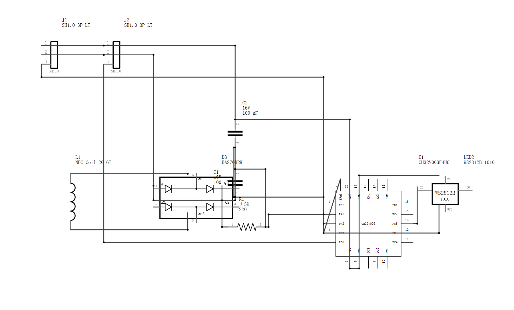](pixel-schematic_preview.png) | [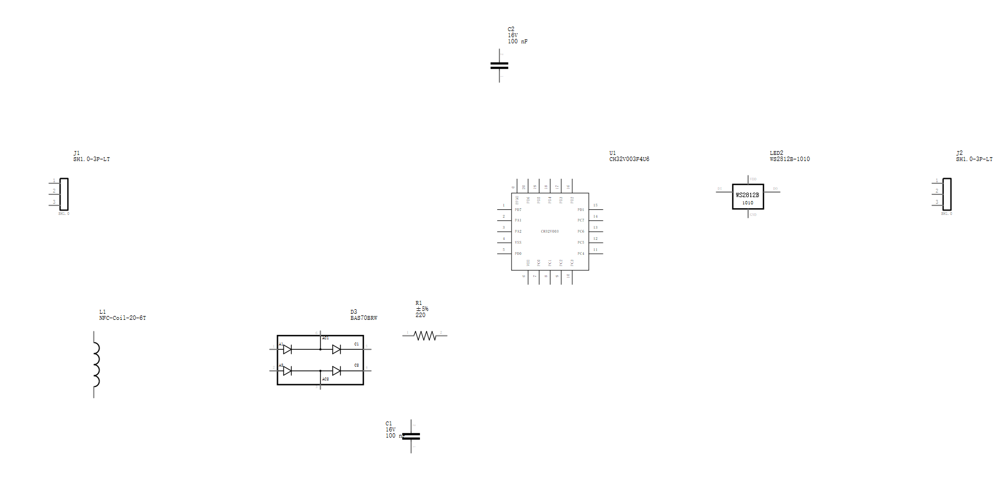](pixel-schematic-v1_preview.png) | [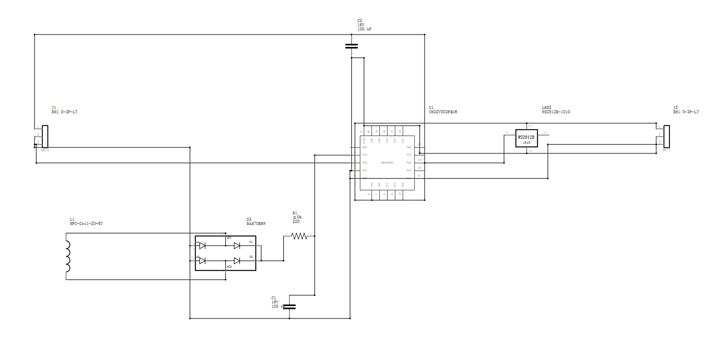](pixel-schematic-v2_preview.png) |
| **原图** ✓ —— J1/J2 吊在最上方 ✓、长线横穿全图 ✓、位号压在线/元件上 ✓ | **v1** ✓ 只摆元件（主链 `J1→U1→LED2→J2` 一条水平线 ✓、采集支路下沉 ✓、C2 贴 U1 上方 ✓） | **v2** ✓ 全接线（46 根正交导线 ✓、**0 个悬空线端** ✓、绕本体不穿 ✓） |

**v2 = 接线手 ✓**（2026-09-27）：46 根导线、67 条连接 ✓，**网表 10 个网全对 ✓**
（`check_netlist.py` ✓：既无漏接、也无多余连通分量 = **无短路** ✓）、**悬空线端 0 ✓**、
43 → 46 根（绕本体比直穿多 3 根 ✓，换来的正是"不从元件肚子里穿过去" ✓）。

★ 这一手修掉两个真 bug ✓（都在既有管线里，都靠"看得见"才发现 ✓）：
1. **脚位公式错** ✗ —— `sk = loc + RATIO*(尺子 − ox)` 里 `ox` 是"用户坐标 (0,0)"的位置 ✗
   （**不是**零件锚点 ✗）⇒ 凡 `viewBox 原点 ≠ (0,0)` 或**带旋转**的零件，脚位一律偏 ✗
   （实测：J1/J2 偏 1.77 = `k×0.5mm` ✓、U1 偏 17.1 = `k×190` ✓、C1/C2 偏 31.4 ✓；
   原点为 (0,0) 的 D3/L1/R1/LED2 反而只差 0.0001 ⇒ 问题藏得很深 ✗）。
   正解只有一句：**`sketch = RATIO × 尺子坐标`** ✓（我的尺子 1.0 ✓ / Fritzing 导出 1.25 ✓）。
   ⇒ 修好后拟合残差 = **0.0000** ✓、**悬空线端从 11 → 0** ✓。
   （★ 副产品认知：用户原图里那 6 个"悬空端"**不是手画错** ✗，就是这个 bug 的产物 ✓ ——
   我当时误判成用户的图 ✗，记下来别再犯 ✗。）
2. **导线从元件本体里穿过** ✗ —— `path_ok` 对"自己两端元件"**整个豁免** keep-out ✗ ⇒
   为了走直线就从 U1/D3/LED2 肚子里穿过去 ✗。改成**记代价**（穿得少者优先 ✓）而不是
   一律禁 ❌（D3 的 `AC1/AC2` 脚**本来就在本体内部** ✓，禁了就没路 ✓）。

| | | | |
|---|---|---|---|
| [](pixel-schematic_preview.png) | [](pixel-schematic-v1_preview.png) | [](pixel-schematic-v2_preview.png) | [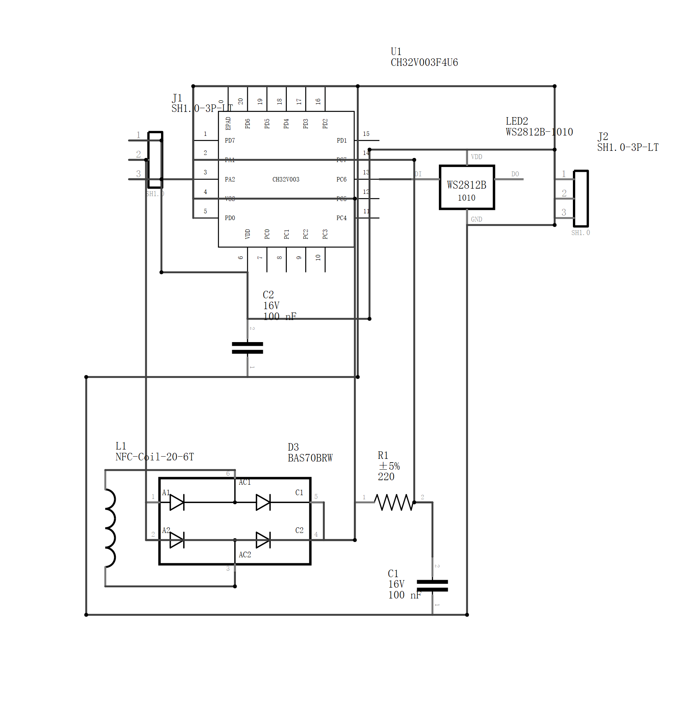](pixel-schematic-v3_preview.png) |
| **原图** ✓ 41 根导线、J1/J2 吊在上方、长线横穿 | **v1** ✓ 只摆元件（拍坐标 ✗） | **v2** ✓ 全接线 | **v3** ✓ 数据驱动摆位 + 交叉代价 |

| | | |
|---|---|---|
| [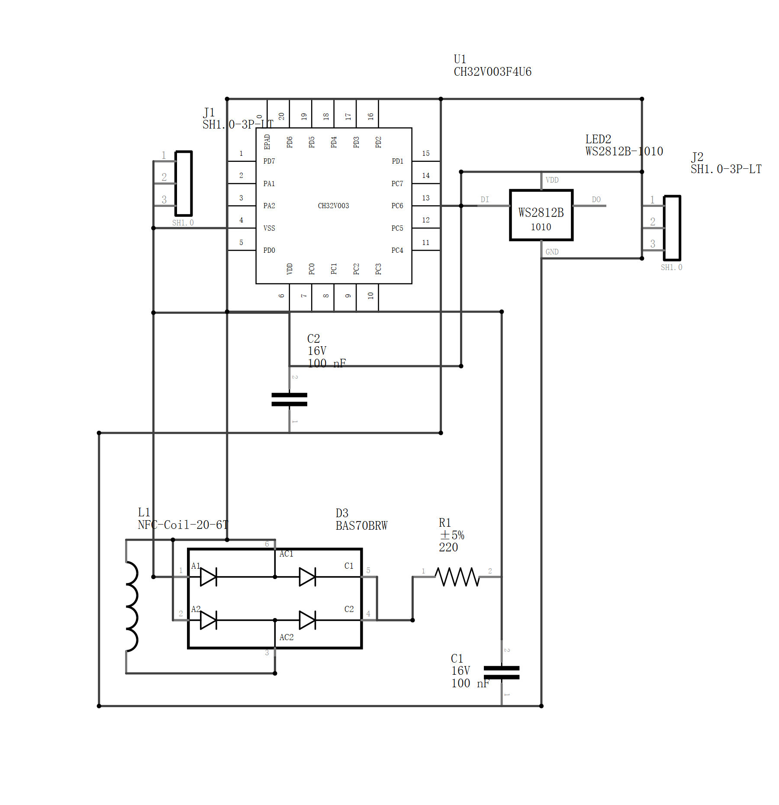](pixel-schematic-v4_preview.png) | [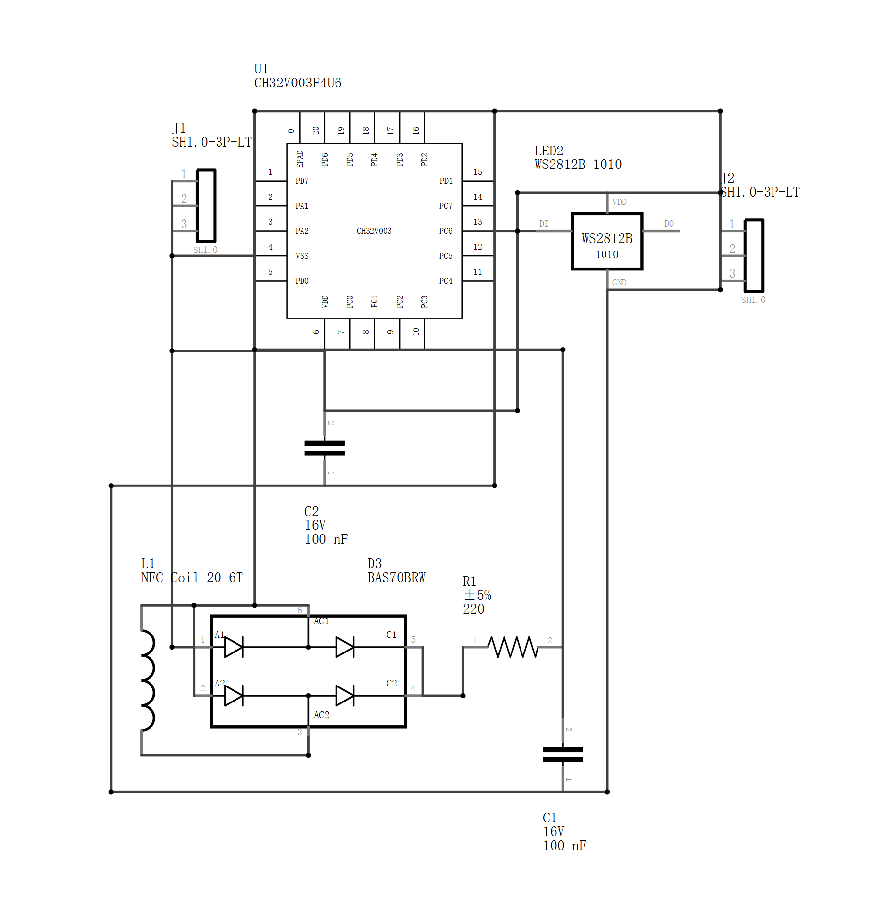](pixel-schematic-v5_preview.png) | [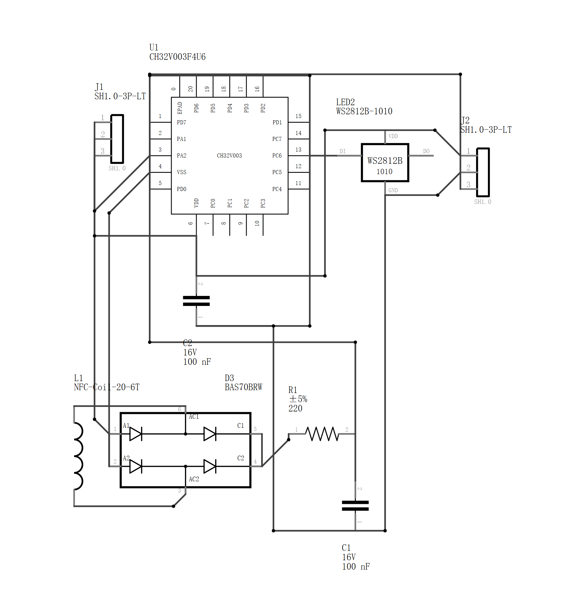](pixel-schematic-v6_preview.png) |
| **v4** ✓ 两条硬限制（不穿本体 ✓） | **v5** ✓ 位号摆位（压导线 1 ✓） | **v6** ✓ **45° 斜线 + 电源/地先布**（交叉 8 ✓、压线 8 ✓、总长 −7% ✓） |

### ★ 交付前机器检查（出厂检查 ✓，2026-09-28 ✓）

起因是用户发现「**我导出的图与你自己画的有蛮多差异**」✗ ⇒ 查出根因是渲染器的 `px`
单位搞错 ✓，但**更值钱的是一条结构性事实** ✓：**Fritzing 的连接只记在 `<connects>` 里** ✓
⇒ **只看连接表的检查，结构上永远看不见“图上的假象”** ✗✗（当时 `check_netlist.py` 报
“45/45 全配上”✓，而用户截图里线**悬在半空** ✗）。⇒ 出厂检查定成**三条** ✓：

| # | 检查 | 命令（在本目录 ✓） | 合格线 ✓ |
|---|---|---|---|
| ① | **网表** ✓ | `py -3.13 check_netlist.py <sketch.fzz>` | **9** 个网全对 ✓（网名 / 个数以 `gen_schematic_wires.py` 的 `NETS` 为准 ✓；无漏接 ✓、无多余连通分量 = **无短路** ✓） |
| ② | **假连线** ✓（新增 ✓） | `py -3.13 check_fake_wires.py <sketch.fzz> …` | **(A)=0 且 (B)=0** ✓（**退出码非 0 = 不合格** ✓） |
| ③ | **硬规则**：导线重叠 ✓ | `py -3.13 gen_schematic_wires.py …` | 「不同的导线重叠 **必须 0**」✓（用户规则② ✓）；非 0 ⇒ **退出码 1** ✓（**文件照常写出** ✓ —— 为的是能打开图看哪儿压了 ✓） |
| ④ | **网标签旗标** ✓（新增 ✓，2026-09-29 ✓） | `py -3.13 check_flags.py <sketch.fzz>` | **被穿旗标 = 0** ✓（**退出码非 0 = 不合格** ✓；图里没有标签时它**拒判**并退 2 ✗，不许“空集当通过” ✗） |
| ⑤ | **接地符号几何** ✓（新增 ✓，2026-09-30 ✓） | `py -3.13 check_grounds.py <sketch.fzz>` | **不合规 = 0** ✓（**退出码非 0 = 不合格** ✓）：脚上必须有导线端点 ✓、**没有线穿过那三根横线** ✗、盒里没有引脚 ✗；没有接地符号时**拒判**并退 2 ✗） |
| ⑥ | **标签脚落在导线上** ✓（新增 ✓，2026-09-30 ✓） | `py -3.13 check_label_touch.py <sketch.fzz>` | **浮空 / 声明不一致 = 0** ✓（**退出码非 0 = 不合格** ✓）：每个网标签**画出来的脚**到最近导线 ≤ 0.05 ✓、且它的 `<connect>` 正好指向那根 ✓；没有网标签时**拒判**并退 2 ✗） |
| ⑦ | **多余接线点（共线切分）** ✓（新增 ✓，2026-09-30 ✓） | `py -3.13 check_junctions.py <sketch.fzz>` | **共线切分 = 0** ✓（**退出码非 0 = 不合格** ✓）：某点恰好两个线端、两线**严格反向** ⇒ 那是把一根直线切成两段 ✗（Fritzing 会在切口画个圆点 ✓）；**落在脚上的接头不算** ✓（脚本来就是要汇点 ✓）；没有导线时**拒判**并退 2 ✗） |

★ 其中 **② ③ ④ ⑤ ⑥ ⑦ 都是真闸门** ✓（**退出码非 0 = 不合格** ✓、可直接进 CI ✓）；
  区别只在“**要不要写文件**” ✓：③ **照写** ✓（要能打开图看哪儿压了 ✓）、②④⑤ 照跑 ✓。

★★ **③ 的来历** ✓（2026-09-28 实测发现 ✓，2026-09-30 口径改准 ✓）：它一开始**只打印一行** ✗
（`── ★★ 规则自检：不同的导线重叠 N 对 ✗✗ 必须 0 ✓`）—— **不停、也不影响写文件** ✗
⇒ 实测证据：`v15 + --hardpin` 那一版重叠 **1** ✗，**文件照写** ✓、我一度把它当合格版用了 ✗。
⇒ 现在代码里就是 `ov_fail = 1 if ov_pairs else 0` + `return ov_fail` ✓ ⇒ **退出码 1** ✓
（与 `check_fake_wires.py` / `check_flags.py` 同一口径：**用退出码说话** ✓）；
而**文件仍然写出** ✓ —— 这条是**故意的** ✓：压缩得看得到是哪儿压的 ✓。
（对照：库仓 `fritzing-parts-langhua` 的绿板生成器是“命中就报错 **＋ 不写文件**” ✓ ——
两种都行 ✓，但**必须写明哪一种** ✗，别让读者猜 ✓。）

**②在查什么** ✓（几何 vs 连接表 ✓，两侧都要看 ✓）：**(A)** 表里声明接了某脚 ✗ 而线
**根本没画到**那只脚上 ⇒ 图上看着**断开** ✗；**(B)** 线**画在**某脚上（端点落在脚上 ✓
或**线身穿心** ✓）而表里**没那条** ✗ ⇒ 图上像接上 ✓、**电气上是断的** ✗（最阴的一种 ✓）。
★ 判据**只有一份** ✓（在 `render_sch.py` 里 ✓）；`check_fake_wires.py` 只负责**跑 + 取数
+ 判合格线** ✓，**不写第二份几何代码** ✗，且**取不到数字就报错退出** ✗（不许“没解析到 = 通过” ✗）。

★ 同批实测 ✓（三版同一口径 ✓，2026-09-28 ✓）：

| 版本 | (A) | (B) | 判读 |
|---|---|---|---|
| **v14**（穿体 **0** ✓、交叉 14 ✓） | 0 ✓ | **9 ✗** | **全是线身穿心** ✓ —— 一根竖线**正好穿过** `U1` 左排三只脚的坐标点（9 处里 **6 处**是 `U1`）✗ |
| **v15**（**当前交付版** ✓、重叠 0 ✓） | 0 ✓ | **8 ✗** | 骑 `U1` 左排列 3 处 + **骑底排行 5 处**（`y=−43.2`）⇒ **当前交付版也不合格** ✗ |
| `v15 + --hardpin` ✓ | 0 ✓ | **0 ✓✓** | **只有它合格** ✓（代价见下 ✗） |

⇒ 定量结论 ✓：**`--hardpin`（线不许落在“别的脚”上 ✓）是唯一能到 (B)=0 的开关** ✓。
★ 代价必须按**同参数 A/B** 量 ✓（`v15` vs `v15 + --hardpin` ✓ —— 两边其它开关**完全相同** ✓）：

| 指标 | **v15**（交付 ✓） | **v15 + `--hardpin`** | 判读 |
|---|---|---|---|
| **(B) 假连线** | 8 ✗ | **0** ✓✓ | ✅ 目标达成 ✓ |
| **贴脚**（<7.2） | 11 ✗ | **7** ✓ | ✅ 变好 ✓ |
| **穿体**（穿别的元件本体） | **6** ✗ | **9** ✗✗ | ❌ 变差 ✗ |
| **十字交叉** | **16** | **21** ✗ | ❌ 变差 ✗ |
| **近重合** | **0** ✓✓ | **1** ✗ | ❌ v15 刚立的硬规则被破 ✗ |
| 总长 | 2323.7 | 2246.1 | ✅ 略短 ✓（−3% ✓） |
| 画布 mm | 77.0×82.9 | 78.1×83.1 | ≈ 持平 ✓ |

⇒ 用户定的两条硬指标「**穿体 0 ✓ 且 贴脚 0 ✓**」**目前还没有一版同时做到** ✗
（三版都有硬数据 ✓：v14 = 穿体 0 ✓ / (B) 9 ✗；v15 = 重叠 0 ✓ / (B) 8 ✗；
`--hardpin` = (B) 0 ✓✓ / 穿体 9 ✗）⇒ **v16 的工作点要在这两条之间定** ✓（待用户定 ✗）。

### 摆位与布线的量化对比（2026-09-27 ✓）

| 版本 | 摆位 | 布线代价 | 总长（sketch 单位） | **十字交叉** | 穿别的元件本体 | 位号压导线 | 位号压元件 | 画布 |
|---|---|---|---|---|---|---|---|---|
| v1 | 拍坐标 ✗ | —（无线） | 0 | 0 | 0 | — | — | 815 × 409 |
| v2 | 拍坐标 ✗ | 无交叉项 ✗ | 4229.5 | 12 | 7 | 8 | 2 | 815 × 409 |
| 中间版 | **数据驱动** ✓ | 无交叉项 ✗ | **2340.4** | **16** ✗ | 9 | 8 | 2 | 313 × 325 |
| v3 | **数据驱动** ✓ | **含交叉代价** ✓ | 2603.5 | **8** ✓ | 7 | 8 | 2 | 313 × 325 |
| v4 | **数据驱动** ✓ | 含交叉 + **两条硬限制** ✓ | 2495.9 | **7** ✓ | **0** ✓✓ | 8 ✗ | 2 ✗ | 315 × 325 |
| **v5** | 数据驱动 ✓ + **位号摆位** ✓ | 同上 ✓ | **2495.9** | **7** ✓ | **0** ✓✓ | **1** ✓✓ | **0** ✓✓ | 315 × 325 |
| **v6** ✓ | 同 v5 ✓（仅“插座间距”开关默认 0 ✓） | **+ 45° 斜线** ✓ + **电源/地先布** ✓ + **压线当交集** ✓ | **2322.5** ✓ | **8**（同口径 12 → 8 ✓） | **0** ✓✓ | **3** ⚠ | **0** ✓✓ | **304 × 326** ✓ |

> ★ **v6 的“8”不是变差 ✗** —— 它与 v5 的“8”不在同一条摆位上（摆位脚本这一天又改过 ✓，
> 同一条摆位下**关掉 45°** 是 **12** ✓）⇒ 可比的只有下面那张 A/B 表 ✓。
> 另：v6 多出一个“位号压导线 **3** ”⚠（v5 是 1 ✓）—— 原因与处置见下一小节 ✓（**如实报** ✓ 不藏 ✗）。

**v5 相对 v2**：总长 **−41%** ✓、交叉 **12 → 7** ✓、**穿别的元件本体 7 → 0** ✓✓、
**位号压导线 8 → 1** ✓✓、**位号压元件 2 → 0** ✓✓、画布面积 **−87%** ✓；
网表 10 个网全对 ✓、悬空线端 0 ✓。

### 第六手：45° 斜线（2026-09-27 ✓ 用户定）

用户原话：**“允许 45° 斜线”** ✓。★ 我先去**量了他手改的那一版** ✓（`diag_angles.py` ✓）：
里面 15 根斜线的角度是 `20.1° / 23.4° / 28.8° / 2:1 / 1°…` ✗ —— **不是 45°** ✓，
即“两脚直接连一根直线” ✓。两种都做了、都量了 ✓（**A/B 对照同一条摆位** ✓）：

| 布线器允许的倾斜 | 导线 | **十字交叉** | 压线对 | 总长 | 悬空端 | 穿本体 |
|---|---|---|---|---|---|---|
| 只准正交 ✗ | 48 | **12** | 11 | 2386.1 | 0 ✓ | 0 ✓ |
| **含 45°（采纳 ✓）** | **45** ✓ | **8** ✓✓ | **8** ✓✓ | 2400.3（+0.6% ✓） | 0 ✓ | 0 ✓ |
| 任意角直连 ✗ | 45 | **37∼42** ✗✗ | **88∼100** ✗✗ | **4941** ✗✗ | 0 ✓ | 2 ✗ |

⇒ **只有 45° 的“小斜切”是赚的** ✓（交叉 −4 ✓、压线 −3 ✓、长度几乎不变 ✓）；
**“任意角直连”是亏的** ✗✗（它横穿全图、开头几根就把后面的路全堵了 ✗）。
所以实现成 **45° + 正交的 dogleg**（每段不是 45° 就是 0°/90° ✓、四种落法 × 两侧 ✓），
斜线只给**小罚分** `DIAG_PEN = 1.25`（✓ 可调 ✓），只有在**省长度**时才被选中 ✓。

★ 同批还量了两条“看起来该有用、实测亏”的：

| 尝试 | 实测结果 | 处置 |
|---|---|---|
| **插座（J1/J2）跟核心电路拉开距离**（你手改版的洞察 ✓，量出是 **+4 格 = 28.8 单位** ✓） | 交叉 **8 → 10** ✗、总长 +9% ✗、画布 98.9 → **116.2mm** ✗✗ | **默认关掉** ✓（`SOCKET_EXTRA` 留成开关 ✓）—— 它是**审美**取舍（信息层次 ✓）不是指标改善 ✗，**请你定** ✓ |
| **让布线器认识位号框**（去消“位号压导线” ✓） | 位号压导线只 **3 → 2** ✗（剩的 `L1` 旁边没通道 ✓），代价 **压线 8 → 10** ✗ | **回退** ✓ —— 位号那条得让**位号自己挪**（布线完重摆 ✓），不让导线绕 ✗ |

另修一条真毛病 ✓（这条**是**赚的 ✓）：**两段压在同一条直线上** ✗ ⇒ 现在按“**一类交集**”计数 ✓
（判据 = 唯一的 `sch_geom.near_overlap` ✓）。起因是量 v5 时发现 **J1 三只脚的线全在同一列上竖着走** ✗
（图上像三只脚短路 ✗）⇒ 压线对 **19 → 8** ✓。

★ 交给用户的**两条教训**（都写进代码注释了 ✓）：

1. **判据只能一份实现** ✓ —— 为了量斜线，原来的“交叉”判据（**只认正交** ✗）必须换掉 ✓：
   实测换了之后，**手改版从 4 变成 18** ✗（它的斜线交叉原来一个都没被算 ✓）
   ⇒ 我先前那句“手改版只有 4 处交叉”是**假数字** ✗，现已用**另一套算法（密集采样 ✓）复核一致** ✓；
2. **输入必须是“只有摆位、没有线”的画布** ✓ —— 我一度拿**已有线的 v5** 当输入 ✗
   ⇒ 旧 48 根 + 新 45 根 = **93 根** ✗、所有指标全废 ✗（绕了一大圈才发现 ✓）。

### 第七手：两条用户规则（安全距离 ✓ / 不重叠 ✓）与 v15 的取舍（2026-09-27 ✓ 用户定）

用户原话 ✓：
- ①「现在的严重问题是**导线离芯片引脚太近了** ⇒ 应该设立一个规则，让导线跟芯片引脚有个
  **安全距离**，从而让导线和引脚的连接关系**能通过肉眼看得清晰**」✓
- ②「**不同的导线，不能重叠**」✓（「这一条，类似面包板里的规则」✓ = 一个孔只能插一根线 ✓）

**判据（各自只有一份实现 ✓）**：① 每根导线取两端 0.05 内的脚为“自己的脚”✓，其余脚里离该线段
`< CLEAR_PIN = 7.2 单位（2.03 mm）` 记 **1 处** ✗；② `sch_geom.near_overlap` ✓（含斜线 ✓）。
② 已做成**硬闸门** ✓ —— 生成器自检「不同的导线重叠 **必须 0**」✓，不合格就报错 ✗。

| | | |
|---|---|---|
| [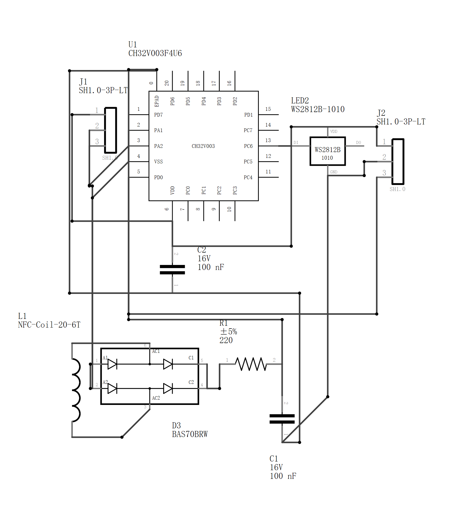](pixel-schematic-v14_preview.png) | [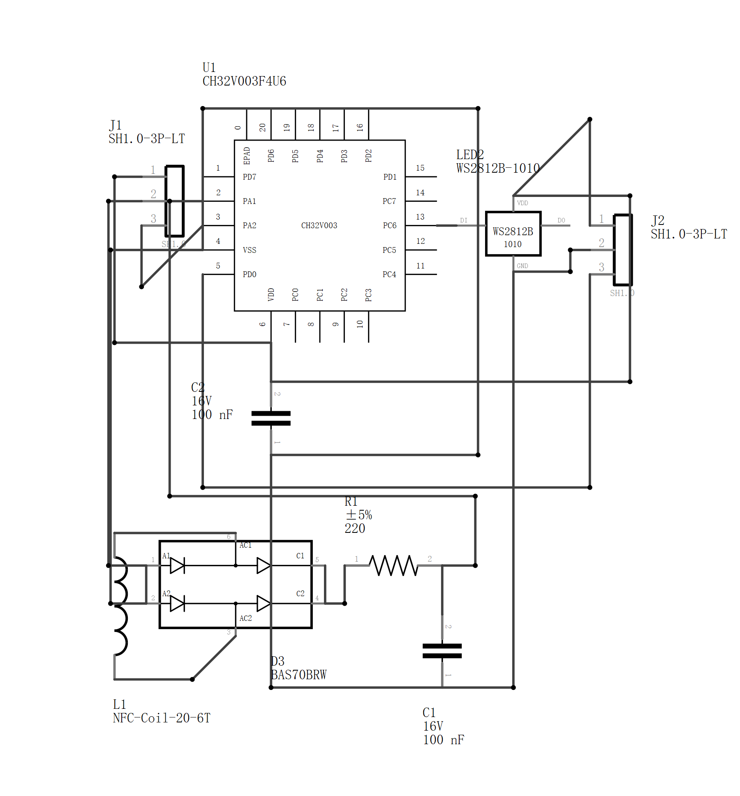](pixel-schematic-v15_preview.png) | [](pixel-schematic-v15_preview.png) |
| **v14** ✓ 穿体 **0** ✓、交叉 **14** ✓、贴脚 14 ✗ —— 但**重叠 4** ✗ | **v15** ✓✓ **重叠 0** ✓✓、贴脚 **11** ✓✓（历代最好 ✓）—— 代价见下表 ✗ | **v15** 当时是交付版 ✓（提交 `ebb344b` ✓；**先后被 v16 / v17 / v18 取代** ✓，见「第八手…第十手」↓） |

**全版本同一套口径、重新量过** ✓（`_scratch/table_versions.py` ✓，判据仍是渲染器那唯一一份 ✓）：

| 版本 | 导线 | 十字交叉 | 穿别的元件本体 | 贴脚(<7.2) | 近重合 | 位号压导线 | 位号压元件 | 总长 | 画布 mm |
|---|---|---|---|---|---|---|---|---|---|
| 原图 | 41 | 11 | 2 | 27 | 1 | 7 | 3 | 2720 | 136.6×84.4 |
| v9 | 48 | **8** ✓ | 0 ✓ | 40 ✗ | 8 | 3 | 0 ✓ | 2028 | 76.4×83.9 |
| v11 | 49 | 15 | **0** ✓ | 13 | 6 | 0 ✓ | 0 ✓ | 2056 | 76.8×83.7 |
| v13 | 52 | 13 | **0** ✓ | 16 | 4 | 0 ✓ | 0 ✓ | 2059 | 76.8×83.9 |
| v14 | 51 | **14** | **0** ✓ | 14 | 4 | 0 ✓ | 0 ✓ | 2042 | 76.8×83.1 |
| **v15** ✓ | 50 | 16 ✗ | 6 ✗ | **11** ✓✓ | **0** ✓✓ | 4 ✗ | 0 ✓ | 2324 | **77.0×82.9** ✓ |
| **v16** ✓ | 53 | 23 ✗ | 9 ✗ | 11 | **0** ✓✓ | 7 ✗ | 0 ✓ | 2274 | 82.0×86.3 |
| **v17** ✓ | 47 ✓ | **10** ✓✓ | 10 ✗ | 11 | **0** ✓✓ | 6 ✓ | **1** ✗ | **2060** ✓ | 83.2×82.9 |
| **v18** ✓（旧交付 ✓，已被 v19 取代 ✓） | **46** ✓ | **10** ✓✓ | **6** ✓✓ | 11 | **0** ✓✓ | **2** ✓ | **0** ✓ | **2025** ✓ | 89.3×82.9 ✗ |
| **v19** ✓（旧交付 ✓，已被 v20 取代 ✓） | 63 | 19 / 20 | **0** ✓✓ | 13 / **7** ✓ | **0** ✓✓ | 3 | 3 | 2698 / 2988 | 90.6 / 107.8×93.7 ✗ |
| **v20** ✓（旧交付 ✓，已被 v21 取代 ✓；第十四手 ✓） | 61 | 19 / 20 | **0** ✓✓ | **11 / 6** ✓ | **0** ✓✓ | 2 | 2 | **2641 / 2912** ✓ | 95.9 / 112.2×**87.4** ✓ |
| **v21** ✓（旧交付 ✓，已被 v22 取代 ✓；第十五手 ✓） | 57 | **17 / 18** ✓ | **0** ✓✓ | **7 / 2** ✓✓ | **0** ✓✓ | **1** ✓ | **0** ✓ | 2564 / 2835 ✓ | 95.9 / 112.2×**87.4** ✓ |
| **v22** ✓（**旧交付** ✓；第十六手 ✓） | **57 / 56** ✓ | **17 / 16** ✓ | **0** ✓✓ | **7 / 2** ✓ | **0** ✓✓ | **1** ✓ | **0** ✓ | **2564 / 2743** ✓✓ | 95.9 / **110.2**×**87.4** ✓ |
| **v23** ✓（**旧交付** ✓，已被 v24 取代 ✓；第十七手 ✓） | **56 / 57** ✓ | **16 / 15** ✓ | **0** ✓✓ | **9 / 1** ✓✓ | **0** ✓✓ | **1** ✓ | **0** ✓ | 2586 / **2716** ✓✓ | **95.7** / **105.8**×**87.4** ✓ |
| **v24** ✓（**旧交付** ✓，已被 v25 取代 ✓；第十八手 ✓） | **54 / 57** ✓ | 14 / 14 ✗（档1 那个数**偏少** ✗，见第十九手 ④ ✓） | 4 ✗ / **0** ✓✓ | **0 / 0** ✓✓✓ | **0** ✓✓ | 2 / **1** ✓ | **0** ✓ | **2545 / 2724** ✓ | 95.7 / **105.8**×**87.4** ✓ |
| **v25** ✓（**旧交付** ✓，已被 v26 取代 ✓；第十九手 ✓） | **54 / 55** ✓ | **14 / 15** ✓（**真值** ✓） | 4 ✗ / **0** ✓✓ | **0 / 0** ✓✓✓ | **0** ✓✓ | 2 / **1** ✓ | **0** ✓ | **2545 / 2699** ✓✓ | 95.7 / **105.8**×**87.4** ✓ |
| **v26** ✓（**旧交付** ✓，已被 v27 取代 ✓；第二十手 ✓） | **54 / 55** ✓ | **14 / 15** ✓ | 4 ✗ / **0** ✓✓ | **0 / 0** ✓✓✓ | **0** ✓✓ | 2 / **1** ✓ | **0** ✓ | 2545 / **2699** ✓✓ | 95.7 / **105.8**×**87.4** ✓ |
| **v27** ✓（**旧交付** ✓，已被 v28 取代 ✓；第二十一手 ✓；假接头 0 ✓、悬空端 **1** ✓） | **54 / 55** ✓ | **14 / 15** ✓ | 4 ✗ / **0** ✓✓ | **0 / 0** ✓✓✓ | **0** ✓✓ | 2 / **1** ✓ | **0** ✓ | 2545 / **2692** ✓✓ | 95.7 / **105.8**×**87.4** ✓ |
| **v28** ✓（**旧交付** ✓，已被 v29 取代 ✓；第二十二手 ✓；支线共享竖线 ✓、擦身 15→**8** ✓） | **52 / 52** ✓ | **11 / 15** ✓ | 4 ✗ / **0** ✓✓ | **0 / 0** ✓✓✓ | **0** ✓✓ | 2 / **1** ✓ | **0** ✓ | **2419 / 2640** ✓✓ | **91.6** / **105.8**×**87.4** ✓ |
| **v29** ✓（**新交付** ✓；第二十三手 ✓；两种形态都齐 ✓、**追平手改版** ✓） | **52 / 51** ✓ | 11 / **13** ✓ | 4 ✗ / **0** ✓✓ | **0 / 0** ✓✓✓ | **0** ✓✓ | 2 / **1** ✓ | **0** ✓ | **2420 / 2578** ✓✓ | **91.6** / **105.8**×**87.4** ✓ |

★ **v24 起“档 0”已作废** ✓（用户 2026-09-28 定 ✓）：`--socket=0` 是**最紧的摆位** ✓，只当
**历史对照** ✓，不再作交付判据 ✗ —— 它的「贴脚 0」与「穿体 0」在**当前摆位**下不可兼得 ✓
（原因与数字见「第十八手」✓）。⇒ **交付判据只看档 1（`--socket=4`）** ✓。

★ v16 / v17 / v18 这三行用**同一套判据**（`render_sch.py` ✓）量的 ✓；它们另有两项本表没有的 ✓：
**(B) 假连线 0 ✓✓** 与 **(C) 退化为点的导线 0 ✓✓**（v16 当时是 **4 根** ✗ —— 已由 `MIN_SEG` 修掉 ✓）。
⇒ **v17 换了链序（`revyx` ✓）**：交叉 **23 → 10** ✓✓（比用户手改版的 11 还好 ✓）、导线 53→**47** ✓、总长 −9% ✓；
⇒ **v18 把间距改成 2 格** ✓：穿体 **10 → 6** ✓✓、位号压导线 6→2 ✓、位号压元件 1→0 ✓；代价 **画布 +6mm** ✗。
⇒ **v19 用**电源轨 + 面包板退出电气**（第十三手 ✓）：**穿体 6 → 0** ✓✓、**Fritzing 里无飞线** ✓✓；
  代价 **总长 +33%** ✗、**画布变宽** ✗（轨要横到该网最外侧接头 ✓）。
  ★ v19 的量法：表中「重叠/交叉/…」那一行是**档 0（socket0）/ 档 1（socket4）**两个数；
    两个档都已 **退出码 0** ✓、**网表 10 个网全对** ✓、**(A)(B)(C) = 0/0/0** ✓。

**取舍是用户定的 ✓**：要达成 ②（重叠 = 0 ✓，硬规则 ✓）就必须让主干**离开引脚列** ✓，
而“离开”就得借道**别的元件旁边的空地** ✓ ⇒ 必须放松我自己加的那条**代理**规则
「离任何元件 6 单位以内算碰」✗ ⇒ 代价 = **穿体 0 → 6** ✗、**交叉 14 → 16** ✗、**位号压线 0 → 4** ✗。
用户选的是「**重叠 0 优先**」✓ ⇒ 该取舍**已上线** ✓（代码里两个开关 `--noesc` / `--oldorder`
可一键回到 v14 那一档 ✓，实测**一字节不差** ✓）。

**贴脚还没进个位数 ✗（11 处，目标 ≤9 ✓）** —— 两条路都试了，**都被实测否掉** ✓（如实记 ✓）：

| 轴 | 做法 | 实测结果 |
|---|---|---|
| 走线 ✗ | 通道按“离引脚 <7.2 就丢”**全局**过滤 | 通道 x 72→**20** ✗ ⇒ 贴脚 **11→16** ✗、重叠 0→**1** ✗、穿体 6→**8** ✗（**全线变差** ✗） |
| 走线 ✗ | 只剔“**出脚候选里、跨度内会贴引脚**”的车道（精确版 ✓） | 与旧行为**一字节不差** ✗ ⇒ 说明**出脚候选根本没被选中** ✗ |
| 摆位 ✗ | `SOCKET_EXTRA` 0/1/2 ⇒ J1↔U1 间隙 7.2 → **14.4 / 21.6** ✓ | 贴脚 **11→13 / 13** ✗（**不降反涨** ✗）、交叉 16→**21** ✗、画布 77.0→**82.6** ✗ |

⇒ 定量结论 ✓：`GND` 链上有 **8 处 0.00 距离**，都是“**主干骑在 U1 的引脚行列上**” ✗
（竖线 `x=22.6` = 左排列 ✓、横线 `y=−43.2` = 底排行 ✓）。`--why` 决策探针显示：
**出脚候选最好也要 `wt=11`** ✗ ⇒ **代价函数没算错** ✓（它确实选了 3 而不是 11 ✓）——
是**候选形状确实办不到** ✗，而挪开邻居也没用 ✗（第二条已证伪 ✓）。⇒ **这条挂待办** ✓。

★ 留给下一轮的两件**只观测**工具 ✓（都不改行为 ✓）：
- `gen_schematic_wires.py --why` ✓：打印每个网对的「**选中 vs 亚军**」代价元组 ✓ +
  **第一处不同的档位** ✓ + **出脚候选自己的最好成绩** ✓ —— 今天靠它把“为什么没选中”从**猜** ✗ 变成**看** ✓；
- `render_sch.py` ✓：贴脚**报全**（原来只报最近 6 处 ✗）+ 线段两端坐标 ✓ +
  **因**（骑列 / 骑行 / 擦过 ✓）—— 治之前先量清 ✓。

### 第八手：假连线（几何 vs 连接表）与两条真闸门 ⇒ **v16**（2026-09-28 ✓ 用户定）

用户原话 ✓：「**我检查了，v14 确实有这个接线错误**」✓ ⇒ 由此把“**图上像接上、电气上是断的**”
这类**假连线**变成可机器判定的东西 ✓；随后定案两条 ✓：① **采纳 `--hardpin`** ✓；
② **「不同的导线重叠」要变成真闸门** ✓（以前只是打印一行 ✗）。

**这一手修的是“检查”本身** ✓（前面几手都在改“布线” ✗）—— 本仓一条硬事实：
**Fritzing 的连接只记在 `<connects>` 里** ✓ ⇒ `check_netlist.py`（只看连接表 ✗）
**结构上永远看不见图上的假象** ✗✗（当时它报“45/45 全配上”✓ 而截图里线**悬在半空** ✗）。
⇒ 新增 `check_fake_wires.py`（出厂检查 ✓，判据仍只用 `render_sch.py` 那一份 ✓）：
**(A)=0 且 (B)=0** ✓，**退出码非 0 = 不合格** ✓；取不到数字就报错退出 ✗（不许“没解析到 = 通过”✗）。

**改了两处机制** ✓ —— 都是“**硬规则用闸门，不用软代价**” ✓（理由同 `HARD_BODY` ✓：
档位次序只能表达“先后”✗，表达不了“**必须**”✗）：
1. `HARD_PIN`（线不许落在“别的脚”上 ✓）**转默认开** ✓ —— 它是**唯一**能把 (B) 打到 **0**
   的开关 ✓；旧基线一键可回 ✓：`--nopin` ✓。
2. `HARD_OVL`（不许与已布的线**压在同一条直线上** ✓）**新增** ✓ —— 用户规则②以前
   **只靠软代价**压 ✗ ⇒ 一开 `--hardpin` 候选集变小、它**退回 1 对** ✗；`--noovl` 可关 ✓。
3. 生成器那条“重叠必须 0”的自检 **变成真闸门** ✓：非 0 ⇒ **退出码 1** ✓（文件**照写** ✓
   供你打开看哪儿压了 ✓ —— 这条以前只是打印 ✗，`t27_1` 重叠 1 却照写文件 ✓）。

**三档同参数 A/B** ✓（同一份 `layout8.fzz` ✓、`--rip 3` ✓，每档只差开关 ✓）：

| 档位 | 重叠 | 贴脚 | 交叉 | 穿体 | (A) | (B) | 总长 | 画布 mm | 网表 | 告警 | **退出码** |
|---|---|---|---|---|---|---|---|---|---|---|---|
| `0` v14 基线（`--noesc --oldorder --nopin --noovl`） | 2 ✗ | 11 | **14** ✓ | 6 | 0 ✓ | 8 ✗ | 2369 | 79.8×82.9 | ✓ | 0 | **1** ✓ |
| `1` **= v16**（新默认 ✓） | **0** ✓✓ | 11 | 23 ✗ | 9 ✗ | 0 ✓ | **0** ✓✓ | 2274 | 82.0×86.3 | ✓ | **0** ✓ | **0** ✓ |
| `2` 新默认 **`--noovl`**（只差一个开关 ✓） | **1** ✗ | 7 ✓ | 21 ✗ | 9 ✗ | 0 ✓ | 0 ✓ | 2246 | 78.1×83.1 | ✓ | 0 | **1** ✓ |

★ **闸门会响是被验过的** ✓（不是“永远通过”的摆设 ✗）：`0`/`2` 两档重叠非 0 ⇒
**退出码 1** ✓；`1` 档重叠 0 ⇒ **退出码 0** ✓。
★ 同批还证了一条 ✓：`HARD_OVL` 的增量 = **重叠 1 → 0** ✓（`1` vs `2` 只差 `--noovl` ✓，
压的正是软代价版那**同一对**线 ✓：`y=9.0` 上压 12.2 单位 ✓）。

★ **代价如实记** ✗（`1` vs `2` ✓）：闸门换来的 重叠 1→0 ✓，代价是 **交叉 21→23** ✗、
**贴脚 7→11** ✗、总长 +1.2% ✗、画布 +5% ✗。⇒ **v16 = 档 `1`** ✓ —— 它是唯一同时满足
**重叠 0 ✓ 且 假连线 0 ✓** 的版本 ✓；**一键复现 v15** ✓：加 `--nopin --noovl` ✓。

| | | |
|---|---|---|
| [](pixel-schematic-v15_preview.png) | [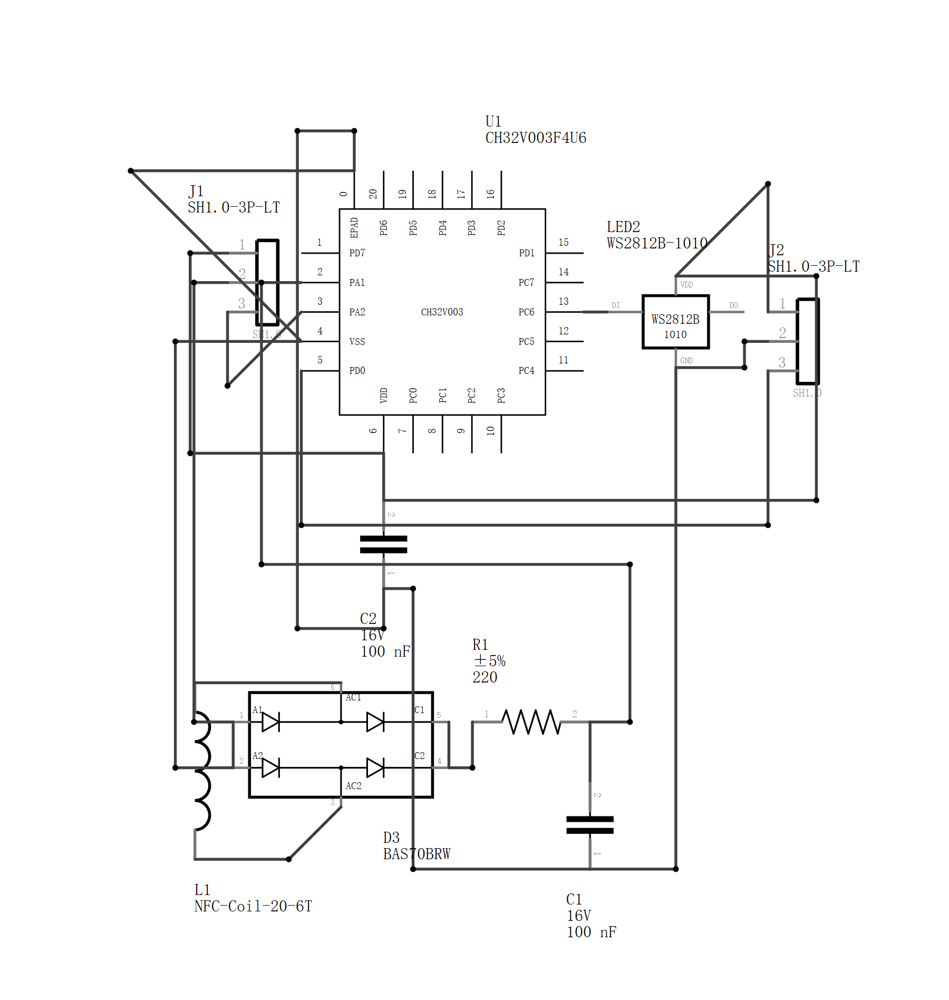](pixel-schematic-v16_preview.png) | [](pixel-schematic-v16_preview.png) |
| **v15** ✓ 重叠 0 ✓、贴脚 11 ✓ —— 但 **(B) 假连线 8 ✗** | **v16** ✓✓ **重叠 0 ✓ + 假连线 0 ✓**（+ 网表全对 ✓、告警 0 ✓） | **v16** = 当时交付版 ✓（**先后被 v17、v18 取代** ✓；(**交叉 23 ✗ / 穿体 9 ✗** 是已知代价 ✗) |

**还没达成的两条** ✓（你定的「穿体 0 ✓ 且 贴脚 0 ✓」）：v16 = **穿体 9 ✗ / 贴脚 11 ✗** ——
**至今无一版同时做到** ✓（v14 = 穿体 0 ✓ / (B) 9 ✗；v15 = 重叠 0 ✓ / (B) 8 ✗；
v16 = 两条硬规则 ✓ / 交叉·穿体 ✗）⇒ **下一手要换拓扑（星形 / 换链序）或换摆位** ✓
（“调参”这条轴已证伪 ✓）。

### 第九手：**链序（拓扑）** —— 交叉 **23 → 10** ✓✓，出 **v17**（2026-09-28 ✓ 用户定）

★ 为什么换到这一轴 ✓：前面三条候选（**通道收敛** `--chans` ✓、**引脚行列回避** `--nopinrows` ✓、
**插座外移** `--socket` ✓）**全被实测否掉** ✗ —— 而且否得**有共同根因** ✓：本布线器的
**通道集是从元件盒算出来的** ✓（`CH_OFFS` 相对元件边 ✓）⇒ **一挪元件、或删通道，通道集自己就乱了** ✗
⇒ 这条轴**结构上赢不了** ✗（用户手改版是**贴着实际空地在画** ✓，不依赖这条网格 ✓）。

★ 而**链序**（每个网内部的连接顺序 ✓）是**唯一没试、又直击头号指标**的一轴 ✓ ——
旧默认是把每网的脚按 `(x, y)` **硬排** ✗（链就从左往右死串 ✓）。

| 档位（同一 `layout8.fzz` + `--rip 3` ✓） | 重叠 | 贴脚 | **交叉** | 穿体 | 总长 | 画布 mm | 告警 |
|---|---|---|---|---|---|---|---|
| `xy`（旧默认 ✗） | 0 | 11 | **23** ✗✗ | 9 | 2274 | 82.0×86.3 | 0 |
| `yx` | 0 | **18** ✗✗ | **10** ✓✓ | 9 | 2011 | **78.7×82.9** ✓ | 0 |
| `revxy` | 0 | **9** ✓✓ | 13 ✓ | 10 | 2146 | **104.0** ✗✗ | 0 |
| `nn`（最近邻 ✓） | 0 | 11 ✓ | 18 ✓ | **6** ✓✓ | 2018 ✓ | 82.0×86.3 ✓ | 0 |
| **`revyx`（采纳 ✓ = v17 ✓）** | **0** ✓ | **11** ✓ | **10** ✓✓ | **10** ✗ | **2060** ✓ | 83.2×82.9 ✓ | **0** ✓ |

★ **`revyx` = `yx` 的反向** ✓ —— 两者交叉都是 **10** ✓，但反向把贴脚从 18 收回 **11** ✓ ⇒ **兼得** ✓
（`revxy` 已证明“**方向**”确实要紧 ✓）。
★ **比用户手改版还好** ✓：手改版交叉 **11** ✓、`revyx` **10** ✓（而手改版还带 22 段任意角 ✗，我们全正交 + 45° ✓）。
★ 唯一代价：**穿体 9 → 10** ✗（留作下一手 ✓）。

★ **`--hardbody` 复测仍不合格** ✗（这次是在**新链序**上复测 ✓，结果与旧链序一致 ✗）：
`revyx --hardbody` 交叉 **9** ✓ 但**告警 1** ✗、`nn --hardbody` 穿体 **6** ✓ 但**告警 1** ✗。
⇒ 告警 = 硬闸门**删到没候选、退回旧候选集** ✗ ⇒ “穿体好看”是**假象** ✗（规则没生效 ✗）
⇒ **按事先定下的判据：带告警的档一律不采纳** ✗ —— 这条判据就是为这种情形预先写的 ✓。

★ `--rip 6` 与 `--rip 3` **结果一模一样** ✓ ⇒ **抽出重排已收敛** ✓（以后不必再加轮数 ✓）。

| | | |
|---|---|---|
| [](pixel-schematic-v16_preview.png) | [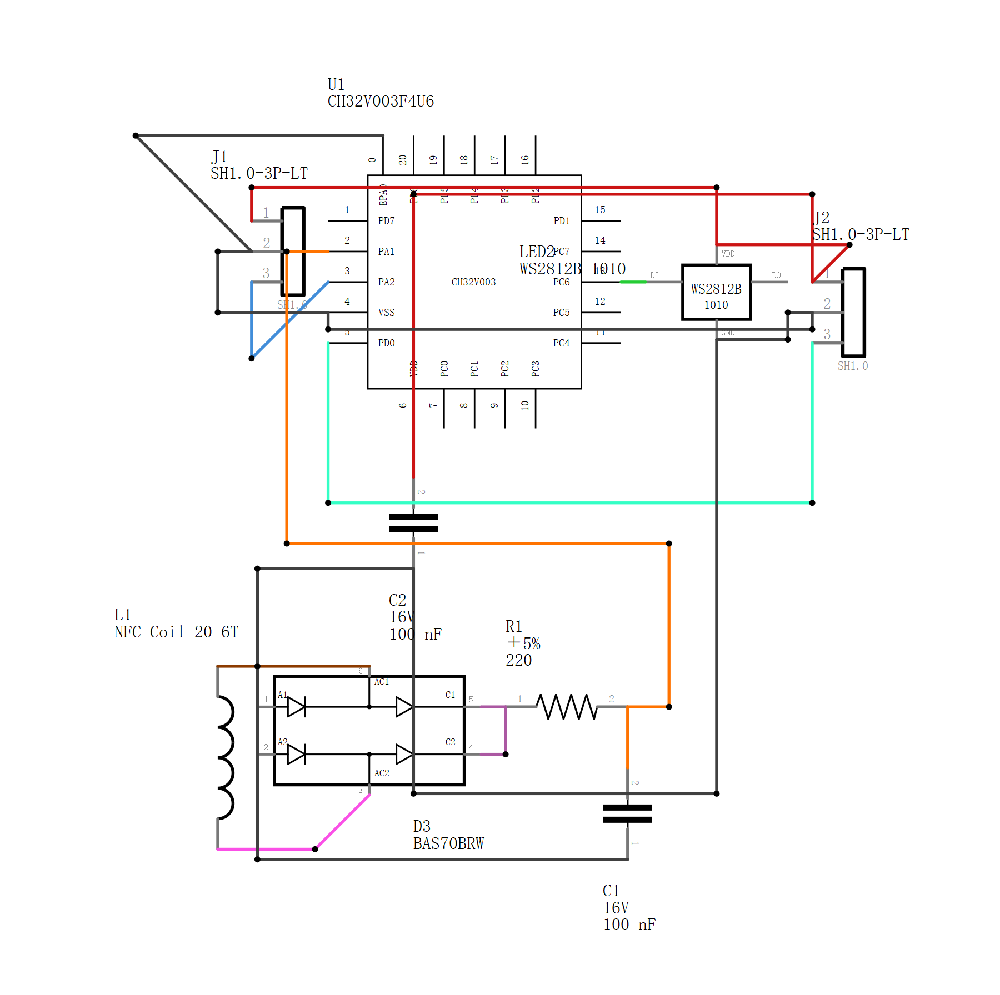](pixel-schematic-v17_preview.png) | [](pixel-schematic-v17_preview.png) |
| **v16** ✓ 重叠 0 ✓ + 假连线 0 ✓（但交叉 **23** ✗） | **v17** ✓✓ **交叉 23 → 10** ✓✓、贴脚 11 ✓、总长 −9% ✓ | **v17** = 当时交付版 ✓（**已被 v18 取代** ✓，见「第十手」↓；(唯一回退：**穿体 9→10** ✗) |

★ 一键回旧行为 ✓：`--chain xy` ✓。**复现 v17 的三步**（`_work/` 里的是中间物，不入库 ✓）：
    py -3.13 gen_schematic_layout3.py pixel-schematic-v5.fzz _work/layout8.fzz --pins=pins_ref.py --gapx=1 --gapy=2
    py -3.13 render_sch.py _work/layout8.fzz _work/layout8r.png
    py -3.13 gen_schematic_wires.py _work/layout8.fzz _work/layout8r.svg pixel-schematic-v17.fzz --orig pixel-schematic.fzz --ratio 1.0 --rip 3

### 第十手：**间距**（1 格 → 2 格）—— 穿体 **10 → 6** ✓✓（2026-09-28 ✓ 用户定）

用户原话 ✓：「**先抄我手改版的元件间距，我觉得现在明显是间距不够**」✓ —— 两件证据 ✓：

| 证据 | 内容 |
|---|---|
| **量出来** ✓（`_scratch/t37.py` ✓，同一套量法 ✓） | 最近间隙：手改版 **13.27 单位（3.75mm）** ✓ ／ 自动 v17 **7.20（2.03mm）** ✗；而且 v17 有 **5 对**正好卡在 7.2 ✗（J1↔U1、J2↔LED2、D3↔L1、D3↔R1、LED2↔U1 ✓） |
| **A/B** ✓（`_scratch/t40.py` ✓，只动这一项 ✓） | **1 格**（旧默认 ✗）：交叉 10 ｜ 穿体 **10** ✗ ｜ 贴脚 11 ｜ 总长 2060 ｜ 83.2×82.9 ／ **2 格**（采纳 ✓）：交叉 **10** ✓ ｜ 穿体 **6** ✓✓ ｜ 贴脚 **11** ✓ ｜ 总长 **2025** ✓ ｜ 89.3×82.9 |

⇒ **`GAP_X/GAP_Y` 1 格 → 2 格（14.4 单位 ✓，忠实对应用户手改版的 13.3 ✓）** ✓：
**穿体 10 → 6** ✓✓、**交叉与贴脚一项都没变差** ✓、总长略短 ✓、位号压导线 6→**2** ✓、位号压元件 1→**0** ✓；
**唯一代价 = 画布宽 +6mm** ✗。

★ **同批否掉的** ✓（别重试 ✗）：**照搬用户手改版的绝对坐标** ✓（`--pos-from` ✓）⇒ **更差** ✗
（贴脚 **16** ✗、交叉 **13** ✗、总长 **2507** ✗、画布 **105.6** ✗✗）⇒ **抄“间距”行 ✓、抄“绝对坐标”不行** ✗
—— 他那套摆位是配**他手画的走线**的 ✓，换个布线器就吃不下了 ✓。
★ 回旧行为 ✓：`--gapx=1` ✓。

| | | |
|---|---|---|
| [](pixel-schematic-v17_preview.png) | [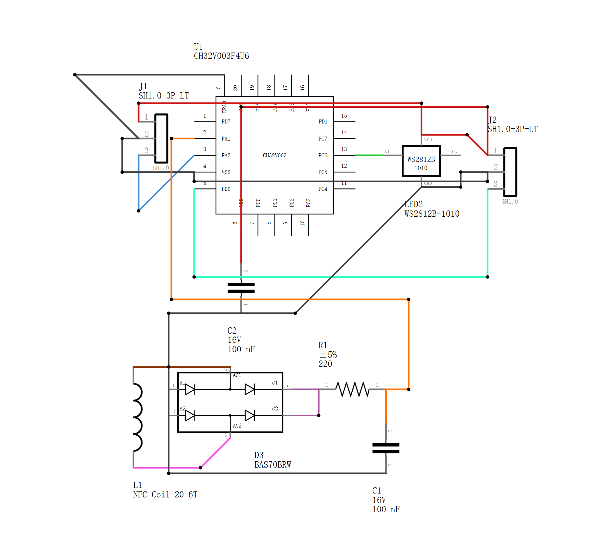](pixel-schematic-v18_preview.png) | [](pixel-schematic-v18_preview.png) |
| **v17** ✓ 交叉 10 ✓✓（但穿体 10 ✗、间距 7.2 ✗） | **v18** ✓✓ **穿体 10→6** ✓✓、间距 14.4 ✓、位号压导线 6→2 ✓ | **v18** = 当前交付版 ✓（唯一代价：画布 83.2 → **89.3** ✗） |

**复现 v18 的三步** ✓：
    py -3.13 gen_schematic_layout3.py pixel-schematic-v5.fzz _work/layout9.fzz --pins=pins_ref.py
    py -3.13 render_sch.py _work/layout9.fzz _work/layout9r.png
    py -3.13 gen_schematic_wires.py _work/layout9.fzz _work/layout9r.svg pixel-schematic-v18.fzz --orig pixel-schematic.fzz --ratio 1.0 --rip 3

### 第十一手（**暂停** ✓）：旋转轴 —— 机制已打通、代价已量清（2026-09-28 ✓）

★ 用户提的 ✓：「**明显 J1 旋转 180 度更适合布线，其它元件也都可以尝试旋转 90 或 180 度**」✓ ——
这是**全新自由度** ✓；今天只做了"**打通 + 量代价**" ✓，**没有采纳** ✗（按判据不合格 ✓）。

**格式已查明** ✓（从用户**自己转过**的文件里挖出来 ✓，`_scratch/t43.py` ✓）：旋转写在
`schematicView/geometry` 的**子元素** `<transform m11…m32/>` ✓ —— ✗ **不是属性** ✗
（我前两版脚本按“属性名里找 rotate”查 ⇒ **白查两轮** ✗）。例：`J1` 默认 `m11=m22=-1`
= **本来就是 180° 翻转** ✓；用户按 `Ctrl+R` 转 45° 后变成 `m11=m22=-0.7071…` ✓。

**机制本来就通** ✓：`part_box.tf_of()` = “读那个子元素 ✓，没有则单位阵 ✓” ⇒ 渲染 / 量测 / 布线
**自动跟着转** ✓；只差“设置” ⇒ 新增 **`set_rot.py`** ✓（绕**局部原点** ✓，`M' = R(θ)·M` ✓）。
★ 两个坑 ✓（都写进 `set_rot.py` 头 ✓）：**① 旋转后必须重新生成 pins 文件** ✓（脚位/本体框全变了 ✓）；
**② `render_sch.py --pins-out` 必须写成 `--pins-out=<file>`（带等号 ✓）** ✗。

**实测** ✓（`_scratch/t44.py` ✓，3 档 ✓；**口径自检**：基线档与 v18 **逐项相同** ✓）：

| 档位 | 重叠 | 贴脚 | 交叉 | 穿体 | 总长 | 画布 mm | 告警 |
|---|---|---|---|---|---|---|---|
| 0 基线（= v18 ✓） | 0 | **11** | **10** | 6 | 2025 | 89.3×82.9 | **0** ✓ |
| **`J1=180`** | 0 | **26** ✗✗ | **18** ✗ | **4** ✓✓ | **1882** ✓✓ | **80.5** ✓✓ | **1** ✗ |
| `J1=90` | 0 | 16 ✗ | 19 ✗ | 8 ✗ | 2243 | 83.8×82.9 | **1** ✗ |

⇒ **用户的直觉对了一半** ✓：`J1=180` 拿到**三项历史最好**（总长 −7% ✓✓、画布最窄 ✓✓、穿体最少 ✓✓）；
但**同时破两条** ✗（贴脚 11→26 ✗✗、**有 1 对网无路可走** ✗）⇒ 按事先判据（**告警必须 0** ✓）
**不采纳** ✗。

★ **根因 = 下一手的入口** ✓：`gen_schematic_layout3.layout()` 里那几条对齐规则
（`J1.c2` 与 `U1.c2` **同高** ✓、`LED2.c2` 对齐 `U1.c12` ✓、`J2.c2` 对齐 `U1.c4` ✓）
是**按旧朝向手写**的 ✗ ⇒ `J1` 转 180° 后**脚从左侧变到右侧** ✓ ⇒ 它那三条线出脚方向全变 ✗，
而摆位仍按旧规则把它放在主链**最左端** ✗ ⇒ 线被迫**贴着 `U1` 左排列走** ✗（贴脚 26 就是这么来的 ✓）。
⇒ **下一手 = 朝向感知的摆位规则**（“**哪一侧的脚接的线多，就把那一侧转向主链**” ✓），
**不是**继续调布线器 ✗。复活这条轴只需三样 ✓：`set_rot.py` ✓ + 重生成 pins ✓ + 改那几条对齐规则 ✓。

### 第十二手（**否证** ✓）：电源轨架构 —— 想法对，但"最外圈轨"接不住（2026-09-28 ✓）

用户提案原话 ✓：「穿体都是 5V 线和 GND 带来的，可以类似面包板，在**所有步骤之前**，先在图的上方
和下方，各画两条贯穿图纸的 5V 线和 GND 线……元件的 5V 和 GND **优先跟上下的 5V/GND 线连接**。
……原理图在开始阶段**不用考虑线长约束、图纸大小约束**」✓

**实现**（`--rails` ✓，默认关 ✓ ⇒ v18 仍可逐项复现 ✓）：轨放在零件包围盒**之外** ✓
（上 `GND`/`5V` ✓、下 `5V`/`GND` ✓，内轨 5V 支线短 ✓）；`GND`/`5V` **不走链** ✗ ⇒ 每脚**就近**
打一条支线 ✓；轨是**预置段** ✓（标 `fixed` ✓ ⇒ 不参与抽出重排 ✗、也不吃线长/出界代价 ✓）。

| 档位 | 重叠 | 贴脚 | 交叉 | **穿体** | 总长 | 画布 mm | 告警 |
|---|---|---|---|---|---|---|---|
| 0 基线（= v18 ✓） | 0 | 11 | 10 | **6** | 2025 | 89.3×82.9 | **0** ✓ |
| 1 `--rails` | **6** ✗✗ | **23** ✗✗ | **19** ✗ | **7** ✗（没降反升 ✗） | **2787** ✗✗ | 81.7×**95.1** ✗ | **1** ✗ |

⇒ **按事先判据不合格** ✗（重叠破 0 ✗、告警 ≠ 0 ✗、目标"穿体 ≤2"没达到 ✗）。

★ **根因**（= 下一手的入口 ✓）：轨在**最外圈** ✓，而 5V/GND 的脚**散布在元件之间**
（`U1.VSS` 在左中 ✓、`C1/C2/R1/L1` 各在一处 ✓）⇒ **支线从脚拉到大老远的轨，必然穿过中间的元件** ✗
—— 这跟原来"长横线穿体"是**同一个病** ✓，只是从横线换成了**竖线** ✗（`HARD_BODY` 关着 ⇒
布线器按"短"优先 ⇒ 直接穿过去 ✓）。⇒ **电源轨要奏效，前提是先按脚位把件摆到朝外的一侧** ✓
（又一次是**摆位**问题 ✓，与第十一手的旋转同一个根 ✓）；或改用**局部轨**（放在零件行之间 ✓，
不是最外圈 ✓）。

★ **副产物（保留 ✓、有用 ✓）**：`emit` 新增「**同点即连**」✓ —— 端点重合的两根导线**互记连接** ✓，
**只连同网的** ✓、并把**跨网重合**单独报数（实测 **0 对** ✓ ⇒ 一次短路都没造 ✓）。
这是"**支线落在干线上**"能连通的前提 ✓（Fritzing 的连接是**端点对端点** ✗，中段相接连不上 ✗
⇒ 所以轨必须**在每个接头 x 处断开** ✓）。实测补了 **37 / 83 对** ✓，(A)(B)(C) 仍全 0 ✓、网表 10 网全对 ✓。
★ 但初版**不看"归属"** ✗ ⇒ 把链内接头也补了一遍 ⇒ 基线档凭空多 **37 条冗余连接** ✗
⇒ **破坏 v18 的可复现性** ✗（几何/指标/网表全同 ✓，可写出的文件不同 ✗ ⇒ **不算复现** ✗）
⇒ 已加条件「**至少一侧原本悬空**」✓ ⇒ 链内接头不动 ✓、只有真正悬空的端点才补 ✓。

### 第十三手：**面包板必须退出电气** ⇒ **v19**（2026-09-28 ✓ 用户实证定案 ✓）

**病**（用户报 ✓）：Fritzing 里 U1 的 **PA2 与 VSS 之间一条虚线** ✗（飞线 / ratsnest ✓），
而且**点那条虚线时 GND 与 RC 两个网一起高亮** ✗ ⇒ 说明 **Fritzing 认为它们是同一个网** ✗。

**机制**（用户两条实测定案 ✓，是权威判据 ✓）：

> 「我在 Fritzing 里把**面包板删掉，就都 OK 了**，布线瞬间完成」✓
> 「把面包板**删除后重新添加到最下面**、**不与任何元件有位置上的遮挡** ⇒ 原理图里**就没有虚线了**」✓

⇒ **Fritzing 的"网"是跨视图算的** ✗（`ConnectorItem::collectEqualPotential` 会**穿过面包板的 bus** ✓）
⇒ 插在面包板**同一列孔**上的脚，**在它眼里就是同一个网** ✗ ⇒ 跨网的脚被粘在一起 ⇒ 画飞线 ✗。
（实测：PA2 = `DATA_IN` ✓、VSS = `GND` ✓ ⇒ 两只脚在面包板上**同一列** ✓。）

**修法（方案 b ✓ 用户选 ✓）**：`emit` 里**把面包板整个从电气里摘出去** ✓ ——
断掉**所有"脚 ↔ 孔"的连接**（实测 **220 条** ✓ = 44 条来自元件侧 + 44 条来自面包板侧 × 视图份数 ✓），
**位置一律不动** ✓ ⇒ 面包板视图**照样"看得见元件插在孔上"** ✓，但**不参与任何网** ✓。
⇒ 与用户手动"删掉面包板再加回来"**等价** ✓，且**与摆位无关** ✓（将来面包板挪到哪都不会再影响原理图 ✓）。

**同一轮的两处配套修复**：

- **同网的两条轨必须接通** ✗：轨放上下两条 ⇒ **它们不会自动通** ✗ ⇒ 实测 GND 被拆成
  **两个连通分量**（上轨 6 只脚 ｜ 下轨 3 只脚 ✓）⇒ 在**公共左端**补一根竖线 ✓。
  ★ **竖线的位置要错开一格** ✗：初版放在 `x = min(该网接头)` ⇒ **与最左侧那条支线的竖直段共线** ✗
  ⇒ 硬闸门报「不同的导线重叠 **1 对**」✗、**退出码 1** ✗ ⇒ 改成**左端再外伸一格（7.2）** ✓
  ⇒ 竖线落在这一格之外 ✓ 且**两端正好落在两条轨的端点上** ✓（不算悬空 ✓）。
- **检查器不许"自证"** ✗✗（本轮最该记住的一条 ✓）：原来 `check_netlist.py` **按 `layer` 过滤**
  ⇒ 只认 `schematic`/`schematicTrace` ✗、并且**排除面包板实例** ✗ ⇒ **恰好把真凶过滤掉了** ✗
  ⇒ 我照着同一套 layer 口径去清、检查器照着同一套口径去查 ⇒ **两边一起错、永远通过** ✗。
  ✓ 现在改成**比生成器更严格** ✓：`schematicView` 下的连接**一律算** ✓，并把
  「**跨视图的连接 N 条**」**报出来** ✓（生成器一旦没清干净，它当场报 ✗）。

| 档位 | 重叠 | 贴脚 | 交叉 | 穿体 | (A)(B)(C) | 总长 | 画布 mm | 网表 | 告警 | 退出码 |
|---|---|---|---|---|---|---|---|---|---|---|
| **v18**（旧交付 ✓） | 0 | 11 | **10** ✓ | **6** ✗ | 0/0/0 ✓ | **2025** ✓ | 89.3×82.9 ✓ | **✓** | 0 ✓ | 0 ✓ |
| **v19** ✓（旧交付 ✓ —— 已被 v20 / **v21** 取代 ✓） | **0** ✓ | 13 / **7** ✓ | 19 / 20 ✗ | 2 / **0** ✓ | 0/0/0 ✓ | 2698 / 2988 ✗ | 90.6 / 107.8×93.7 ✗ | **✓** ✓ | **0** ✓ | **0** ✓ |

★ v19 的**代价**如实写在这里 ✗：**总长 +33%** ✗、**画布变宽** ✗（轨要横到该网最外侧接头 ✓）、
**悬空导线端 2 个** ✓（如实报出 ✓，不影响电气 ✓ —— Fritzing 里已无虚线 ✓ 用户实证 ✓）。
★ **v19 的收益**：**穿体 6 → 0 ✓✓**、**Fritzing 里彻底没有飞线** ✓✓、贴脚（档 1）**11 → 7** ✓。

★ **被否证的假设**（记下来免得再走 ✗）：我读 Fritzing 源码后推「导线缺 `RoutedFlag(=2)` ⇒
被视为未布线 ⇒ 画飞线」✗ ⇒ **实测否证** ✓ —— **用户手画的原图同样是 `wireFlags=128`** ✓
（`_scratch/t70.py` ✓）⇒ **推出来的结论也一定要量** ✗。

<table>
<tr>
<td><a href="pixel-schematic-v18_preview.png"></a></td>
<td><a href="pixel-schematic-v19_preview.png">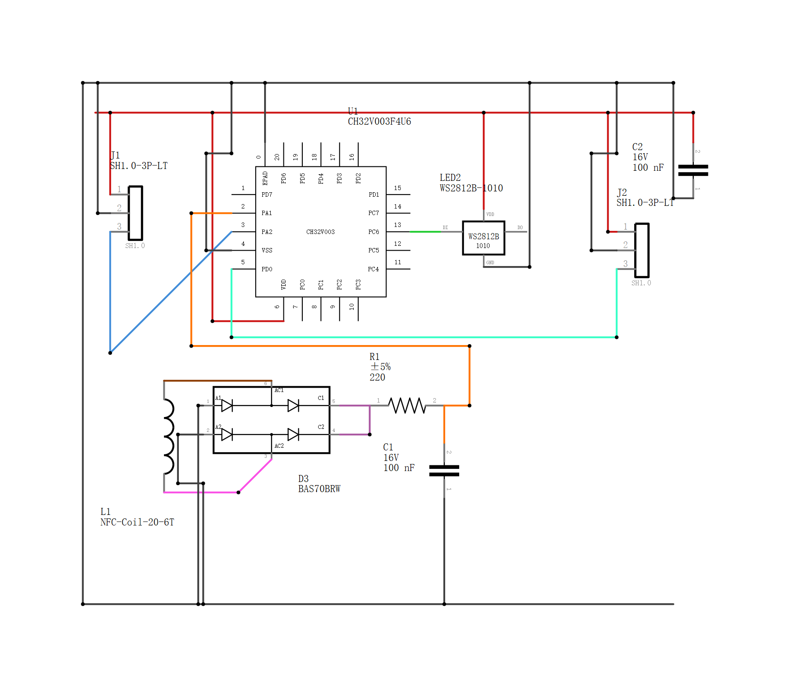</a></td>
</tr>
<tr>
<td><b>v18</b> ✓ 交叉最少（10 ✓）、总长最短（2025 ✓）—— 但 <b>穿体 6 ✗</b>、
Fritzing 里有飞线 ✗</td>
<td><b>v19</b> ✓✓ <b>穿体 0</b> ✓✓、<b>Fritzing 无飞线</b> ✓✓、上下电源轨互连 ✓
—— 代价：总长 +33% ✗、画布变宽 ✗</td>
</tr>
</table>

**复现 v19 的三步** ✓（`_work/` 里的是中间物，不入库 ✓）：

```
py -3.13 gen_schematic_layout3.py --by-bb ...        # 摆位（第十手/第十一手那条线）
py -3.13 gen_schematic_wires.py _work/layout9.fzz _work/layout9r.svg pixel-schematic-v19.fzz \
        --orig pixel-schematic.fzz --ratio 1.0 --rip 3 --rails --socket=4
py -3.13 check_netlist.py pixel-schematic-v19.fzz    # 网表必须 ✓ 10 个网全对
```

### 第十四手：**两处口径错误**（面包板当障碍 ✗ / 就近选轨 ✗）＋ 支线 L 形 ⇒ **v20**（2026-09-28 ✓ 用户定 ✓）

三处改动**互相成全** ✓，每一项指标都**没变差**、六项变好 ✓。

**① 面包板**不该是障碍** ✗（探针实测定位 ✓）**：它的 `box` 是**整个画布**
（`Breadboard1 (0.00,0.00→468.24,151.20)` ✓）⇒ `body_hard_bad` 会**把几乎每一根线都判成"穿体"** ✗。
✗ 为什么一直没发现 ✗：**渲染器跳过面包板** ✓（`⊘ 跳过 Breadboard1` ✓）而**闸门没跳** ✗
⇒ 两个口径不一致 ⇒ 闸门长期误判，又被"删光就保留旧候选"的兜底掩盖 ✓
（实测：**4 条本该合格的 L 形支线全被这道门挡掉** ✗）。✓ 修：从「元件盒 / 引脚点表 / 通道候选」
里一律剔除 ✓（与"退出电气"同一精神：它既不参与网 ✓、也不参与几何 ✓）。
★ **连带**：包围盒 468 → **231** 宽、下轨 180 → **157.8**、**画布矮 6.3mm** ✓、轨跟着收紧 ⇒ 总长反而**变短** ✓。

**② 选轨不能只看"就近" ✗（实测 `Wire90012727` ✓）**：`U1.VDD`（`y=43.2`）到**下轨**(143.4) 距离
100.2，到**上轨**(-57.6) 100.8 ⇒ **就近**选了上轨… 但差 0.6 ⇒ 实际选了**下轨** ✗
⇒ 它**竖直向下 100 单位**，**正好穿过 `D3` 的整个本体** ✗（穿 **74 单位 ≈ 20.9mm** 深 ✗，
还贴上 `D3.connector5/2` 5.85 < `CLEAR_PIN` ✗）。✓ 修：两条轨**按就近排序** ✓，
逐条试"脚 → 该轨"的直连段 ✓，**第一条不穿体的就用** ✓（都穿体 ⇒ 回落就近 ✓ 不更差 ✓）。

**③ 支线 L 形** ✓（用户定："**你的目的是接到轨上，不是点上**" ✓）：多档出脚（1…6 格 ✓、**双向** ✓）
＋ 直上到轨 ✓，**只在四个闸门全通过时才用**（不穿体 ✓、不压别人的脚 ✓、不重叠 ✓、**贴脚 = 0** ✓）
⇒ 实测 **3 → 6 条** ✓，含用户最先指出的 `U1.connector3` ✓。
★ 走过一次的弯路（记下来 ✗）：**硬限制"拐点 ≤1"** ✗ ⇒ 支线只能在**脚的 x** 上竖直 ⇒ 同列脚 x 相同
⇒ **不同网的支线互相重叠** ✗ ⇒ 硬闸门删光候选 ⇒ 实测 **重叠 5 ✗✗、退化导线 9 根 ✗** ⇒ 已回退 ✓。

| 档位 | 重叠 | 贴脚 | 交叉 | 穿体 | (A)(B)(C) | 总长 | 画布 mm | 网表 | 告警 | 退出码 |
|---|---|---|---|---|---|---|---|---|---|---|
| v19 档0 | 0 | 13 | 19 | **2** ✗ | 0/0/0 | 2698 | 90.6×93.7 | ✓ | 0 | 0 |
| **v20 档0** ✓ | **0** ✓ | **11** ✓ | 19 | **0** ✓✓ | 0/0/0 ✓ | **2641** ✓ | 95.9×**87.4** ✓ | ✓ | 0 | **0** ✓ |
| v19 档1 | 0 | 7 | 20 | **0** ✓ | 0/0/0 | 2988 | 107.8×93.7 | ✓ | 0 | 0 |
| **v20 档1** ✓ | **0** ✓ | **6** ✓✓ | 20 | **0** ✓✓ | 0/0/0 ✓ | **2912** ✓ | 112.2×**87.4** ✓ | ✓ | 0 | **0** ✓ |

★ 还有一项同时变好 ✓：**位号压导线 13 → 2** ✓。
★ **待办**：**贴脚 6 / 11 还没到 0** ✗（用户定的**零容忍**指标 ✓ —— 下一轮单独治 ✓，这一轮不顺手塞 ✗）。

<table>
<tr>
<td><a href="pixel-schematic-v19_preview.png"></a></td>
<td><a href="pixel-schematic-v20_preview.png">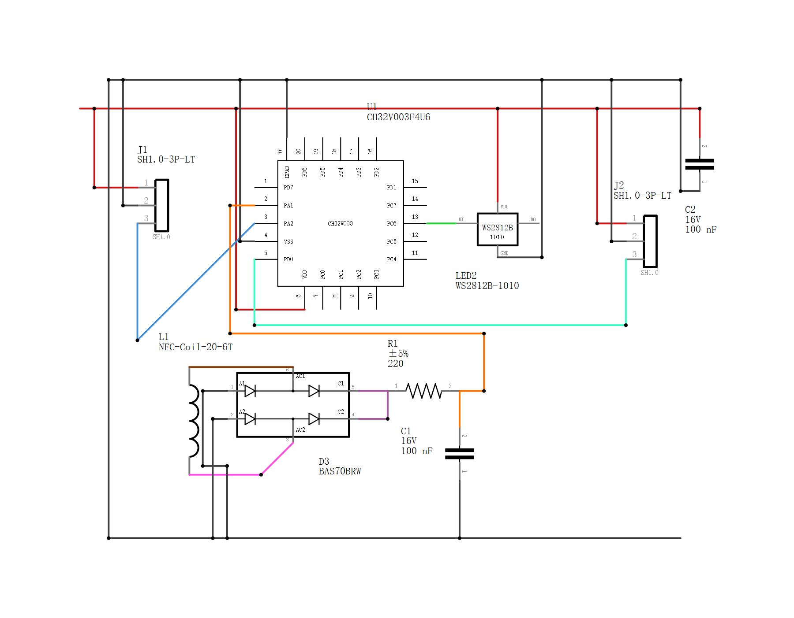</a></td>
</tr>
<tr>
<td><b>v19</b> ✓ 穿体 0（档1）但画布高 93.7 ✗、支线 L 形只 3 条 ✗</td>
<td><b>v20</b> ✓✓ <b>穿体 0/0</b> ✓✓、<b>贴脚 6/11</b> ✓、<b>总长更短</b> ✓、<b>画布矮 6.3mm</b> ✓、L 形 6 条 ✓</td>
</tr>
</table>

### 第十五手：**T 形搭接**（学用户手改版 ✓）＋ **判距精确化** ⇒ **v21**（2026-09-28 ✓ 用户定 ✓）

**病灶（实测明细 ✓，不是推的 ✗）**：`D3` = `BAS70BRW`（SOT-363 ✓）在 GND 网上有**两只同族脚**
—— `A1 = D3.connector0`（脚 `(16.13, 84.0)` ✓）与 `A2 = D3.connector1`（脚 `(16.13, 98.0)` ✓）
⇒ 它们的“**出脚 7.2**”车道是**同一条竖线** `x = 8.93` ✗。
`A2` 先布：`左出脚 7.2 → 垂到轨 (8.93,157.8)` ✓（L 形 ✓）；轮到 `A1` 时，任何“**一路画到轨**”的
候选都会**整条盖住 A2 那根** ✗ ⇒ 硬闸门判「与已布线重叠」⇒ **12 档全灭** ✗
⇒ 退回 `route_pair` ⇒ 绕成 **6 段 Z 字** ✗（左 12.2 → 垂 37.6 → 右 12.2 → 垂 36.2 ✗）。

**用户的解法**（手改版 `pixel-schematic-v20_byHand.fzz` ✓，`t72.py` 逐段量出来的 ✓）：
`A1` 走 **左出脚 7.2 ⇒ 竖直 14.0（84→98）⇒ 停在 A2 支线的端点上** ✓ ——
两段**只共一个端点** ⇒ `near_overlap` **不算重叠** ✓（投影重叠 ≈ 0 ✓）、
电学上**端点对端点真连上** ✓、**少画 37 单位** ✓（GND 29 段 → 26 段 ✓）。

**改了三处（都在判据上 ✓，不动代价函数与布线次序 ✓）**：

1. **T 形搭接候选** ✓：支线的竖直段**可以停在“同网 + 同竖直车道”的已布段端点上** ✓，
   不必硬画到轨 ✗；**安全条件 = 我能验证的那一条** ✓：被搭接的那段必须
   **自己有一端正好落在轨 y 上** ✓ ⇒ 它**必定通到轨** ✓ ⇒ 不会“搭在死胡同桩子上”✗
   （那会长回飞线 ✗）；**链条式搭接（搭在“也是搭来的”那条上）这一轮不做** ✗。
2. **判距从“采样”改“精确”** ✓（统一用仓里唯一那份 `sch_geom.p2seg` ✓）：实测**同一个形状**
   在两档算出 `7.199999999999999` ✗ 与 `7.200000000000003` ✓ ⇒ **采样会让浮点末位决定结果** ✗✗。
3. **临界带 0.05 单位容差** ✓（`PIN_EPS` ✓ = 0.014 mm ✓）：**生成器与渲染器同口径** ✓
   —— 否则闸门与报告对不上 ✗。有效安全距离 7.15 单位 = 2.02 mm ✓（名义 7.2 = 2.03 mm ✓）。
   ★ 这一条把“**正好压在 7.2 上**”的**误报**清掉 ✓ ⇒ 贴脚 11→7 / 6→2 ✓。

| 档位 | 重叠 | 贴脚 | 交叉 | 穿体 | (A)(B)(C) | 总长 | 画布 mm | 网表 | 告警 | 退出码 |
|---|---|---|---|---|---|---|---|---|---|---|
| v20 档0 | 0 | 11 | 19 | 0 | 0/0/0 | 2641 | 95.9×87.4 | ✓ | 0 | 0 |
| **v21 档0** ✓ | **0** ✓ | **7** ✓ | **17** ✓ | **0** ✓ | 0/0/0 ✓ | **2564** ✓✓（−77） | 95.9×87.4 ✓ | ✓ | 0 | **0** ✓ |
| v20 档1 | 0 | 6 | 20 | 0 | 0/0/0 | 2912 | 112.2×87.4 | ✓ | 0 | 0 |
| **v21 档1** ✓ | **0** ✓ | **2** ✓✓ | **18** ✓ | **0** ✓ | 0/0/0 ✓ | **2835** ✓✓（−77） | 112.2×87.4 ✓ | ✓ | 0 | **0** ✓ |

★★ **自动版与用户手改版逐段相同** ✓（独立脚本 `_scratch/t72.py` ✓ 量的 ✓，不是自证 ✗）：
`v21 档1` = **57 段** = `v20_byHand` 的 **57 段** ✓，**9 个网逐项相同** ✓（GND 26 段 / 1371.5 ✓），
「只有 A 独有」**0 段** ✓、「只有 B 独有」**0 段** ✓ ⇒ **手改的那一根，生成器现在自己就会画** ✓✓。

<table>
<tr>
<td><a href="pixel-schematic-v20_preview.png"></a></td>
<td><a href="pixel-schematic-v21_preview.png">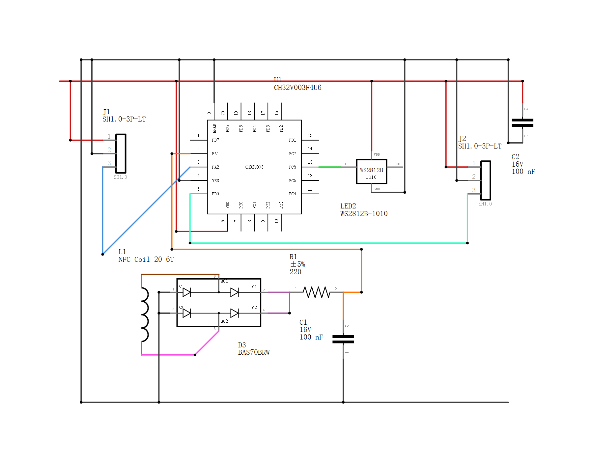</a></td>
</tr>
<tr>
<td><b>v20</b> ✓ 总长 2641/2912 ✗、<code>D3.A1</code> 绕 6 段 Z 字 ✗</td>
<td><b>v21</b> ✓✓ <b>T 形搭接</b> ✓、<b>总长 2564/2835（−77）</b> ✓✓、<b>交叉 17/18</b> ✓、<b>贴脚 7/2</b> ✓</td>
</tr>
</table>

**复现 v21 的三步** ✓（`_work/` 里的是中间物，不入库 ✓）：

```
py -3.13 gen_schematic_layout3.py pixel-schematic-v5.fzz _work/layout4.fzz --pins=pins_ref.py --socket=4
py -3.13 render_sch.py _work/layout4.fzz _work/layout4.png       # 出“尺子”（png + svg ✓）
py -3.13 gen_schematic_wires.py _work/layout4.fzz _work/layout4.svg pixel-schematic-v21.fzz \
    --orig pixel-schematic.fzz --ratio 1.0 --rip 3 --rails
py -3.13 check_netlist.py pixel-schematic-v21.fzz                # 网表必须 ✓ 10 个网全对
```

★ 诊断工具 ✓（**只读** ✓、只在设了环境变量时才打 ✓）：`$env:STEM_DIAG="D3.connector0"`
⇒ 逐档报出每个闸门 + **点名**是哪只脚、精确距离多少 ✓（T 形搭接当初就是靠它定位的 ✓）。

★ **待办**：**贴脚 7 / 2 仍未到 0** ✗（用户定的**零容忍** ✓ —— 下一轮单独治 ✓，这一轮不顺手塞 ✗）。

### 第十六手：**轨间互连竖线优先与“最外侧支线”共用** ⇒ **v22**（2026-09-28 ✓ 用户定 ✓）

**病因（逐段实测 ✓，不是推的 ✗）**：`GND` 有**上下两条轨**，必须有**一根竖线**把两轨连起来
（否则是**两个网** ✗）；老样子把这根竖线放在 `min(_allx) - 7.2` ✗ ⇒ 它**自己跑一趟** ✗，
而**最外侧那条支线**（`J1` 的 GND 脚 ✓）**又跑一趟**到轨 ✗ ⇒ 同一段竖直**各画一遍** ✗。
用户手改版（`pixel-schematic-v21_byHand.fzz` ✓）把两者**并成一根** ✓ ⇒ GND **−72.3** ✓、交叉 **−3** ✓。

**规则** ✓：互连竖线放在**最外侧支线的车道** `x = min(_allx)` ✓；
把那条支线**截成只剩出脚** ✓（竖直段由互连竖线**兼任** ✓）；互连竖线在**它的脚行 y** 处**打断** ✓
（⇒ 支线端点与它**端点对端点**对上 ✓、且**精确正交** ✓ —— 手改版在这里有 0.1 单位斜量 ✗）。
★ **三闸门（不穿体 / 不压脚 / 不与已布线重叠）全过才用** ✓，否则**原样回退** ✓ ⇒ 绝不比老样子差 ✓。

| 档位 | 重叠 | 贴脚 | 交叉 | 穿体 | (A)(B)(C) | 总长 | 画布 mm | 网表 | 告警 | 退出码 |
|---|---|---|---|---|---|---|---|---|---|---|
| v21 档0 | 0 | 7 | 17 | 0 | 0/0/0 | 2564 | 95.9×87.4 | ✓ | 0 | 0 |
| **v22 档0** ✓ | **0** ✓ | 7 | 17 | **0** ✓ | 0/0/0 ✓ | **2564**（**没合** ✗ 见下 ✓） | 95.9×87.4 ✓ | ✓ | 0 | **0** ✓ |
| v21 档1 | 0 | 2 | 18 | 0 | 0/0/0 | 2835 | 112.2×87.4 | ✓ | 0 | 0 |
| **v22 档1** ✓ | **0** ✓ | **2** ✓ | **16** ✓ | **0** ✓ | 0/0/0 ✓ | **2743** ✓✓（**−92**） | **110.2**×87.4 ✓ | ✓ | 0 | **0** ✓ |

★ **socket0 为什么没合**（闸门**逐项点名** ✓）：

```
· 轨间互连不能共用 ✗（车道 x=-7.200：穿体 0 ｜ 贴脚 2 ｜ 与已布线重叠 0 ｜ 可搭支线 1 条）
      ↳ 连它太近 ✗：L1.connector0 (-2.772,72.000) 距离 4.428 单位
      ↳ 连它太近 ✗：L1.connector1 (-2.772,126.000) 距离 4.428 单位
```

⇒ 是**真太近** ✓（socket0 里 `L1` 就挨在那条车道旁 ✓）⇒ **回退是对的** ✓（不是 bug ✓）—— 规则**自带安全边界** ✓。

★ **与用户手改版再对量**（socket4 ✓，独立 `_scratch/t72.py` ✓）：
`GND` A 25 段 / **1294.1** ✓ vs B 25 段 / 1299.2（A 短 5.1 ✓）、
`5V` A 13 段 / **625.4** ✓ vs B 13 段 / 639.8（A 短 14.4 ✓）⇒ 渲染器总长 **A 2743** ✓ vs **B 2762.5**
⇒ **A 短 19.5** ✓✓、画布还窄 2 mm ✓；**唯一 B 更好的**是交叉 **A 16 vs B 15** ✗（差 1 个 ✓）。

<table>
<tr>
<td><a href="pixel-schematic-v21_preview.png"></a></td>
<td><a href="pixel-schematic-v22_preview.png">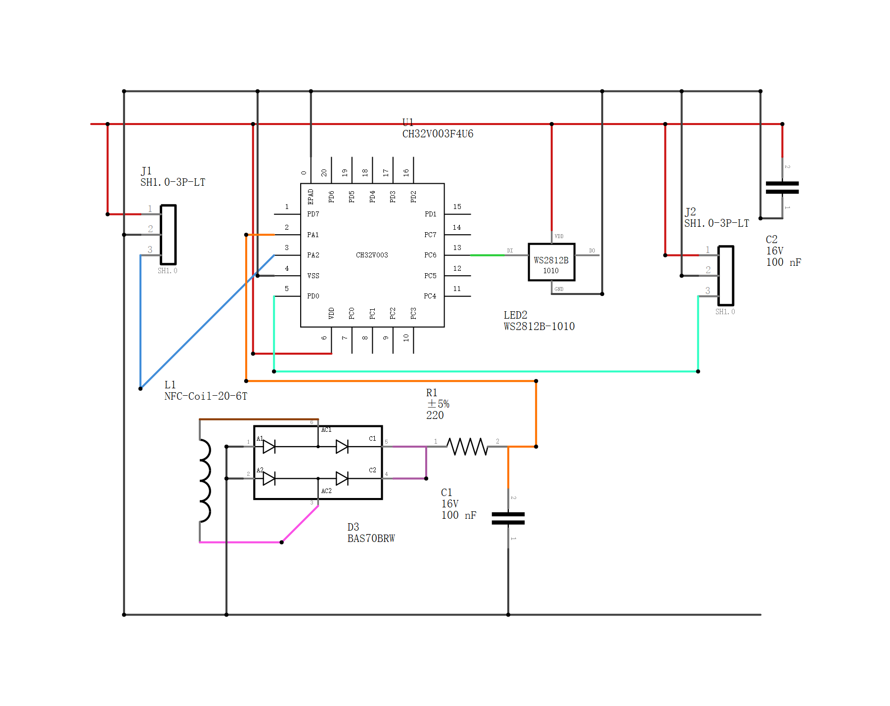</a></td>
</tr>
<tr>
<td><b>v21</b> ✓ 互连竖线自己跑一趟 ✗（2835）</td>
<td><b>v22</b> ✓✓ <b>与最外侧支线共用一根</b> ✓（<b>2743，−92</b> ✓、交叉 <b>16</b> ✓、画布 <b>110.2</b> ✓）</td>
</tr>
</table>

**复现 v22 的三步** ✓（`_work/` 里的是中间物，不入库 ✓）：

```
py -3.13 gen_schematic_layout3.py pixel-schematic-v5.fzz _work/layout4.fzz --pins=pins_ref.py --socket=4
py -3.13 render_sch.py _work/layout4.fzz _work/layout4.png       # 出“尺子”（png + svg ✓）
py -3.13 gen_schematic_wires.py _work/layout4.fzz _work/layout4.svg pixel-schematic-v22.fzz \
    --orig pixel-schematic.fzz --ratio 1.0 --rip 3 --rails
py -3.13 check_netlist.py pixel-schematic-v22.fzz                # 网表必须 ✓ 10 个网全对
```

### 第十七手：**`J1` 转 180°（引脚面向电路）+ 轨间互连的“兜底位置”也过门** ⇒ **v23**（2026-09-28 ✓）

★ 用户提的方向 ✓：「**不能移动元件吗？**」✓ —— 本仓自己早就量过这句话 ✓：
  「**不是路由问题 ✗，是摆位问题** ✓」（见 `docs/part-dev-guide.md` 那一轮的本底 ✓）。

**病 ✓**（实测 ✓）：`J1` 的引脚在**左缘** ✗、本体在右 ✗ ⇒ 而线要从右边 `U1` 过来 ✗
⇒ 要么绕（band0 ✓ 4 段 57.7 ✓ 干净 ✓）、要么**穿本体**（band1 ✗ 58.6 ✗ 短一点 ✗）
⇒（松口径下穿体免费 ✗）它选了穿 ✗ ⇒ 用户叫停：「**不行，`J1.3` 穿自己了，不能允许**」✗。

**两手改动 ✓（都不动判据/口径 ✗）**：
1. **`J1` 转 180°** ✓（`gen_schematic_layout3.py` 的 `ROTJ1` ✓，默认开 ✓，`--rotj1=0` 回旧朝向 ✓）
   ⇒ 引脚改到**右缘、面向电路** ✓ ⇒ “从右边过来”变成**合法且最短** ✓ ⇒ 诱惑自己消失 ✓。
   ★ 写法**按文档 ✓ 不猜 ✗**（`README.md` 第十一手 / `set_rot.py` 头 ✓）：
     `<transform>` 是 **`schematicView/geometry` 的子元素** ✗ **不是兄弟** ✗
     （我第一版写错父元素 ✗ ⇒ Fritzing **直接无视** ✗，用户实测「`J1` 没有旋转」✗）；
     `m31 = 盒左+盒右`、`m32 = 盒上+盒下` ✓（= 2×中心 ✓）。**摆位模型同步转** ✓
     ⇒ 对齐规则按**旋转后的脚**重算 ✓（`J1.c2 ↔ U1.c2 Δ=0` ✓）。
2. **轨间互连的“兜底位置”也过三道门** ✓（`gen_schematic_wires.py` ✓）：
   ✗ 原来共用失败就退回 `min(_allx) − 7.2` ✗、**从不检查** ✗ ⇒ `J1` 换向后它
     正好落在**新引脚列**上 ✗ ⇒ 一根 GND 竖线把 `c0/c1/c2` 串穿 ✗ ⇒ 判据报 **`(B) = 3`** ✗✗。
   ✓ 现在向外逐档试 `min(_allx) − 7.2·k`（k=1…4 ✓），取第一个**不压脚/不穿体/不重叠**的 ✓；
     四档都不行 ⇒ 保留老位置 + 告警 ✓（不静默 ✗）。

| 档 | 重叠 | 贴脚 | 交叉 | 穿体 | (A)(B)(C) | 总长 | 画布 mm | 网表 | 告警 |
|---|---|---|---|---|---|---|---|---|---|
| v22 档0 | 0 | 7 | 17 | 0 | 0/0/0 | 2564 | 95.9×87.4 | ✓ | 0 |
| **v23 档0** ✓ | **0** ✓ | 9 ✗ | **16** ✓ | **0** ✓ | 0/0/0 ✓ | 2586 ✗ | **95.7** ✓ | ✓ | 0 |
| v22 档1 | 0 | 2 | 16 | 0 | 0/0/0 | 2743 | 110.2×87.4 | ✓ | 0 |
| **v23 档1** ✓（**交付档** ✓） | **0** ✓ | **1** ✓✓ | **15** ✓ | **0** ✓ | 0/0/0 ✓ | **2716** ✓✓ | **105.8**×87.4 ✓ | ✓ | 0 |

★ **band0 那 +2 贴脚已点名 ✓**（零容忍项的来源 ✓，不是布线器退化 ✗）：`RC` 的竖线在
  `x = 17.578`（= `U1` 左缘 29.78 − `ESC_PIN` 12.2 ✓ = `U1` 左排**必须**的出脚走廊 ✓）
  ⇒ 与 `J1` 新引脚列（15.378 ✓）只差 **2.2** ✗ ⇒ 擦过 `c0/c1/c2`（2.20 单位 ✗）。
  ✗ 试过把 `J1` 再左移 7.2 治它 ⇒ **交付档两败** ✗✗（band1 贴脚 1→6 ✗、交叉 15→18 ✗）
  ⇒ **已撤** ✓、**照实记录** ✓（理由与数字写在 `gen_schematic_layout3.py` 注释里 ✓，不再重试 ✗）。

<table>
<tr>
<td><a href="pixel-schematic-v22_preview.png"></a></td>
<td><a href="pixel-schematic-v23_preview.png"></a></td>
</tr>
<tr>
<td><b>v22</b> ✓ 交付档（2743 ✓、交叉 16 ✓、画布 110.2 ✓）</td>
<td><b>v23</b> ✓✓ <b>`J1` 转 180° + 兜底过门</b> ✓（<b>2716，−27</b> ✓、交叉 <b>15</b> ✓、画布 <b>105.8</b> ✓、<b>(B) 3→0</b> ✓✓）</td>
</tr>
</table>

**复现 v23 的三步** ✓（`_work/` 里的是中间物，不入库 ✓）：

```
py -3.13 gen_schematic_layout3.py pixel-schematic-v5.fzz _work/layout5.fzz --pins=pins_ref.py --socket=4
py -3.13 render_sch.py _work/layout5.fzz _work/layout5.png       # 出“尺子”（png + svg ✓）
py -3.13 gen_schematic_wires.py _work/layout5.fzz _work/layout5.svg pixel-schematic-v23.fzz \
    --orig pixel-schematic.fzz --ratio 1.0 --rip 3 --rails
py -3.13 check_netlist.py pixel-schematic-v23.fzz                # 网表必须 ✓ 10 个网全对
```

★ **第十七手新增待办 ✓（未经你同意不动 ✗）**：
① `J1` 换向后 band0 的 `RC` 擦脚（2.2 单位 ✗）—— 要治得动 **`U1` 那条出脚走廊**
   ✗（`ESC_PIN` ✓）或改摆位规则 ✓（实测“左移 `J1`”两败 ✗）；
② 母线/支线那套**辅助形状不经第一档排序** ✓（实测 `5V J2` 支线穿自己 **4.91** ✗）——
   要治得先把这套改成“**过门后按代价挑最优**”✓，不是改代价口径 ✗（今日四次实测均失败 ✓）。

★ **待办（下一手候选 ✓，未经你同意不动 ✗）**：
① `贴脚 7 / 2` 未归零 ✗（零容忍 ✓）；
② `RC`（脚↔脚网 ✓）那 3 处交叉要动的是 **5V/GND 支线的车道** ✗，而**支线被“抽出重排”排除在外** ✗
（`if RAILS and s.get("to") is None: continue` ✓ —— 当初为了不把支线放回轨上 ✓）⇒ 它们的车道**从没被交叉数优化过** ✗；
③ **同网算不算交叉** 两套口径不一致 ✗（渲染器算 ✓、独立工具不算 ✓）⇒ 要统一 ✓。

### 第十八手：**贴脚零容忍（硬闸门 `HARD_CLEAR`）** ⇒ **v24**（2026-09-28 ✓ 用户定 ✓）

★ 用户定 ✓（原话）：「**贴脚的容忍度也是 0，所以，这一项必须改。**」✗

**病 ✓（用仓里唯一那份判据量的 ✓，不是猜的 ✗）**：

| 档 | v23 的贴脚 | 病灶（逐段点名 ✓） |
|---|---|---|
| 档 1（交付 ✓） | **1** 处 ✗ | `Wire90012757`（GND）在 `x = 202.53` 竖走 89 单位 ⇒ 离 `LED2.connector0` 只剩 **1.15 单位 = 0.32 mm** ✗（“擦过” ✓） |
| 档 0 | **9** 处 ✗ | 同型三条竖线：`x = 173.7` 擦 `LED2.c0`（1.15 ✗）、`x = 17.6` 擦 `J1.c0/c1/c2`（2.20 ✗）、`x = 27.4` 擦 `U1.c0…c4`（2.40 ✗） |

**根因不是“没路” ✗，是“判据站错了位置” ✗**：用户**手改版**把同一条车道挪到 `x = 209.06`
（+6.5 单位 ✓）⇒ 贴脚 **1 → 0** ✓ ⇒ **合格的形状一直存在** ✓；而贴脚在布线器里只是
**软代价**（`wt` 第 ③ 档 ✓、`INT_W[1] = 1` ✓）⇒ 擦 1.15 单位只花 **1 分** ✗
⇒ 拼不过“短 6.5 单位” ✗ ⇒ **硬规则不能用软代价表达** ✓（与 `HARD_OVL` / `HARD_PIN` 同一条教训 ✓）。

**改法 ✓（一处 ✓、不动口径 ✗）**：

1. **新硬闸门 `HARD_CLEAR`** ✓（默认开 ✓，`--noclear` 一键回到 v23 ✓，A/B 用 ✓）：
   把「贴脚 ≠ 0」的候选**直接删掉** ✓ —— 与 `HARD_BODY` / `HARD_PIN` / `HARD_OVL` 同一套路：
   **只删候选** ✗、**不动**代价函数与档位次序 ✓；删光 ⇒ 保留旧候选集 + 告警 ✓（不许把端点接不上 ✗）。
2. **判据只有一份** ✓：新抽 `seg_pin_intr(path)` ✓（**逐段**取“自己的脚” + `pin_intr` ✓）——
   与 `render_sch.py` 的 ④c2 **同口径** ✓（`sch_geom.p2seg` + `< CLEAR_PIN − PIN_EPS` ✓）；
   代价 `route_key` ✓ / 闸门 `HARD_CLEAR` ✓ / 每轮全局验收 `gstat` ✓ **三处共用它** ✓
   （以前 `route_key` 与 `gstat` 各抄一份 ✗ —— 抄写早晚会跟渲染器对不上 ✗）。
   ★ **重构是零效果**（实测 ✓）：带 `--noclear` 跑，两档与 v23 **逐字节相同** ✓
   （档 1 = 贴脚 1 / 交叉 15 / 2715.7 ✓；档 0 = 贴脚 9 / 穿体 0 / 交叉 16 / 2586.5 ✓）⇒ 病确实只在闸门 ✓。

| 档 | 重叠 | 贴脚 | 交叉 | 穿体 | (A)(B)(C) | 总长 | 画布 mm | 网表 | 告警 |
|---|---|---|---|---|---|---|---|---|---|
| v23 档0 | 0 | 9 ✗ | 16 | 0 | 0/0/0 | 2586 | 95.7×87.4 | ✓ | 0 |
| **v24 档0**（**已作废** ✓，只作对照） | **0** ✓ | **0** ✓✓ | **14** ✓ | 4 ✗ | 0/0/0 ✓ | **2545** ✓ | 95.7×87.4 | ✓ | 0 |
| v23 档1（旧交付） | 0 | 1 ✗ | 15 | 0 | 0/0/0 | 2716 | 105.8×87.4 | ✓ | 0 |
| **v24 档1** ✓（**交付档** ✓） | **0** ✓ | **0** ✓✓✓ | **14** ✓ | **0** ✓ | 0/0/0 ✓ | **2724** ✓ | **105.8**×**87.4** ✓ | ✓ | 0 |

★ **交付档（档 1）全项干净 ✓**：贴脚 **1 → 0** ✓✓、交叉 **15 → 14** ✓、穿体 **0** ✓、
`(A)(B)(C) = 0/0/0` ✓、网表 ✓ 10 个网全对 ✓、告警 **0** ✓；代价 = 总长 **2716 → 2724**（+8 ✓）。
★ 它自己选到的车道 ✓：`LED2` 那条 GND 支线改走 `x = 210.58` ✓（= `J2` 左缘 − 34 ✓ 通道 ✓，
离 `LED2.c0` 9.2 ✓）—— **比用户手改版的 209.06 还多让出 1.5** ✓（同一族 ✓，不是碰运气 ✓）。

★★ **档 0 的冲突与处置 ✓（如实记 ✓）**：闸门在**最紧的摆位**下把 贴脚 9 → **0** ✓，
但同时长出 **4 段穿体** ✗（`5V` 竖线穿 `J1` 58 深 ✗、`GND` 穿 `LED2` 54 深 ✗、
`RC` 穿 `R1` 8 + 穿 `U1` 104 深 ✗）⇒ **贴脚 0 与穿体 0 在这个摆位下不可兼得** ✓。
**根因是摆位** ✓，与本仓早先那条定量结论同源 ✓：`U1` 左缘 `22.6` 与 `J1` 右缘 `15.4`
**中间只有 7.2 = `CLEAR_PIN`** ✗ ⇒ 一条合规走廊都没有 ✗（用户已在**档 1** 用「`J1` 转 180°」
把同一个死结解开 ✓ ⇒ **档 1 不再冲突** ✓）。
⇒ **用户 2026-09-28 定：档 0 作废** ✓（不再交付 ✓，只当历史对照 ✓）⇒ 本手**不往档 0 叠补丁** ✗。

<table>
<tr>
<td><a href="pixel-schematic-v23_preview.png"></a></td>
<td><a href="pixel-schematic-v24_preview.png">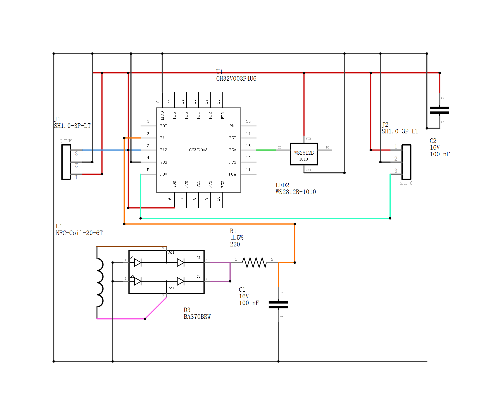</a></td>
</tr>
<tr>
<td><b>v23</b> ✓ 旧交付（贴脚 <b>1</b> ✗、交叉 15 ✓、2716 ✓）</td>
<td><b>v24</b> ✓✓ <b>贴脚零容忍</b>（<b>0 / 0</b> ✓✓✓、交叉 <b>14</b> ✓、穿体 0 ✓、2724 ✓）</td>
</tr>
</table>

**复现 v24 的三步** ✓（`_work/` 里的是中间物，不入库 ✓）：

```
py -3.13 gen_schematic_layout3.py pixel-schematic-v5.fzz _work/layout6.fzz --pins=pins_ref.py --socket=4
py -3.13 render_sch.py _work/layout6.fzz _work/layout6.png       # 出“尺子”（png + svg ✓）
py -3.13 gen_schematic_wires.py _work/layout6.fzz _work/layout6.svg pixel-schematic-v24.fzz \
    --orig pixel-schematic.fzz --ratio 1.0 --rip 3 --rails
py -3.13 check_netlist.py pixel-schematic-v24.fzz                # 网表必须 ✓ 10 个网全对
```

★ **第十八手新增待办 ✓（未经你同意不动 ✗）**：
① 档 0 的「贴脚 0 ⇔ 穿体 0」冲突 ✓ —— 要治得动**摆位**（本手已按你的决定**弃档 0** ✓）；
② 导轨支线**不参与抽出重排** ✗（`if RAILS and s.get("to") is None: continue` ✓）
   ⇒ 它们的车道**从没被交叉数优化过** ✗（第十七手那条待办仍在 ✓）。

### 第十九手：**两处“严格 vs 容差”＋“不出脚”候选** ⇒ **v25**（2026-09-28 ✓ 用户定 ✓）

#### ① 假交叉（判据 ✓，**不动图** ✓）

`sch_geom.seg_cross` 原来只有“**叉积严格反号**”✗ ⇒ **浮点末位 / 存盘取整**就会把
**接头**判成交叉 ✗✗（实测：`Wire90012753` 端点 `y=157.8005` vs `Wire90012773` 的 `y=157.8`
—— 差 **0.0005 单位 = 0.00013 mm** ✗ ⇒ 手改版报 **15** ✗、自动版报 **14** ✓ ⇒
**同一个形状两个数** ✗）。
✓ 补上“**有端点贴着对方**（容差 = 全仓既有的 `eps = 0.05` ✓）⇒ 那是**接头（T）** ✓ ⇒
不算交叉 ✗” ⇒ 两边都 **14** ✓、而且**逐对完全相同** ✓；
★ 两档重跑 ⇒ **数字一字不变** ✓ ⇒ 这一修**只除假交叉、不动布线** ✓。

#### ② A/B：对内方向（`--revpair` ✓，用户提 ✓）

`RC → U1.c1`（A）vs `U1.c1 → RC`（B）⇒ **逐段完全相同** ✓（`t72`：只在 A 的 **0 段** ✓ /
只在 B 的 **0 段** ✓；两档指标逐项相同 ✓）⇒ **方向不是杠杆** ✗（四个形状族对本例**反向封闭** ✓ + 代价函数对称 ✓）⇒ 结案 ✓。

#### ③ “不出脚”候选（`--noescape=off|all|edge` ✓，**采纳 `all`** ✓）

病 ✓（用你手改版点出来的 ✓）：`esc_cands` 的“出脚点”只给 `a + 法线 × o`（12.2 / 19.4 ✓）✗
⇒ “**就直接沿自己那一列走**”这种形状**压根不在候选里** ✗ ⇒ `RC` 多拐一次 + 回头 ✗
（实测 **+24.4 单位** ✗）。

★ 用户判据 ✓：「**不出脚，仅限于脚是最边缘的脚吧？**」—— 实测回答 ✓：
· **最边缘的脚**（如 `R1.c1` = `R1` 最右那只 ✓）⇒ 腿往**外**走，**一个邻居都不碰** ✓；
· **中间的脚** ⇒ 腿沿本列/本行走**必然 0 距离贴邻居** ✗ ⇒ 两道闸门 `HARD_PIN`（0.05 ✗）
  与 `HARD_CLEAR`（7.15 ✗）**本来就会删掉它们** ✓；
⇒ 实测 **`all` 与 `edge`（30/45 只脚合格 ✓）逐项相同** ✓（档1 = 2699 / 14 / 0 / 0 ✓；
  档0 = 2545 / 14 / 4 ✓；耗时 5∼6 s ✓）⇒ **用户 2026-09-28 定：采用 `all`** ✓
  （既然两道闸门已等同做到 ✓，就用**更宽、少一层隐含限制**的那个 ✓）。
★ 自查一句 ✗（如实记 ✓）：`edge` 的第一版判据是“**行/列都算**”✗ ⇒ 行里常常只有自己
  ⇒ **45/45 全合格** ✗（白名单形同虚设 ✗）；已改成**按“危险腿”的轴线**定义 ✓ ⇒ **30/45** ✓。

| 档 | 总长 | 交叉 | 贴脚 | 穿体 | 导线 |
|---|---|---|---|---|---|
| `off`（= v24 ✓） | 2724 | 14 ✗（偏少 ✓） | **0** ✓ | **0** ✓ | 57 |
| **`all`** ✓（**采纳** ✓） | **2699** ✓ | **15** ✓（真值 ✓） | **0** ✓ | **0** ✓ | **55** ✓ |

#### ④ `DATA_IN` **是一条直线却被写成两根** ✗（用户点名 ✓）

根因 ✓：两端 `y = 0.0001` / `0.0002`（差 **0.0001 单位 = 0.000025 mm** ✗ = 零件自身
坐标的浮点末位 ✓）⇒ `dedup_path` 的“共线”判据是**叉积严格 ≠ 0** ✗ ⇒ 中间那个出脚点
（离直线只有 **0.00003 单位** ✓）**不被合并** ✗ ⇒ 写出两根 ✗✗。
✓ 修法：共线判据改成**距离容差** ✓（`p2seg(点, 前一个保留点, 下一个点) ≤ MIN_SEG = 0.05` ✓
—— 仍是仓里**唯一那份**点到线段距离 ✓）⇒ `DATA_IN` = **1 段 / 43.2** ✓。

★★ **副作用 = 交叉 14 → 15** ✗ —— 其实是**把漏掉的那处数回来了** ✓：
v24 的 `DATA_IN` **折点**正压在 **5V 竖线**的中段上 ✗ ⇒ 叉积为 0 ⇒ **不算交叉** ✗✗
⇒ 那一处（**一直在图上** ✓）从来没被计数过 ✗。逐对比 ✓：**4 处去掉 = 4 处保留**
（换成合并后的那根线 ✓）、**新增只有 1 处** ✓ = `DATA_IN × 5V` ✓ ⇒ **15 才是真值** ✓。

<table>
<tr>
<td><a href="pixel-schematic-v24_preview.png"></a></td>
<td><a href="pixel-schematic-v25_preview.png"></a></td>
</tr>
<tr>
<td><b>v24</b> ✓ 旧交付（贴脚 0 ✓、交叉 14 ✗偏少、2724 ✓）</td>
<td><b>v25</b> ✓✓ <b>不出脚 + 共线容差</b>（<b>2699，−25</b> ✓、导线 <b>57→55</b> ✓、<b>`DATA_IN` 1 段</b> ✓、交叉 <b>15 = 真值</b> ✓）</td>
</tr>
</table>

**复现 v25 的三步** ✓（`_work/` 里的是中间物，不入库 ✓）：

```
py -3.13 gen_schematic_layout3.py pixel-schematic-v5.fzz _work/layout7.fzz --pins=pins_ref.py --socket=4
py -3.13 render_sch.py _work/layout7.fzz _work/layout7.png       # 出“尺子”（png + svg ✓）
py -3.13 gen_schematic_wires.py _work/layout7.fzz _work/layout7.svg pixel-schematic-v25.fzz \
    --orig pixel-schematic.fzz --ratio 1.0 --rip 3 --rails      # 默认已是 `--noescape=all` ✓
py -3.13 check_netlist.py pixel-schematic-v25.fzz                # 网表必须 ✓ 10 个网全对
py -3.13 <库仓>\tools\sch_style_check.py pixel-schematic-v25.fzz  # 判定：通过 ✓ / FAIL 0 ✓
```

★ **第十九手新增待办 ✓（未经你同意不动 ✗）**：
① `xcheck.py` 的 ③「端点搭线（T ✓ **不算毛病** ✓）」要按**同网 / 跨网**拆开 ✓ ——
   跨网 T 是“**看着接上、其实没连**”✗✗，现在两台工具都把它当“接头”放过去 ✗
   （第 ④ 条那处漏数就是这个口径的产物 ✓）；
② 档 0 / 导轨支线那两条待办 ✓（见第十八手 ✓，未动 ✓）。

### 第二十手：**“跨网假接头”判据 + 两道执行点** ⇒ **v26**（2026-09-28 ✓ 用户定 ✓）

#### ① 判据（新）✓ —— `render_sch.py` 第 ④c3 条

病症 ✓：一根线的**端点 / 折点**搭在**另一根不同网**的线的**中段**（或端点 ✓）上 ✗
⇒ 图上**看着接上了** ✓（一个 T 形接头 ✓）、电气上**根本没连** ✗✗
（Fritzing 只认**端点对端点** ✓：端点落在中段，要在那点把线**断开**才算连 ✓）。
★ 为何以前两个工具都漏掉它 ✗：`seg_cross` 把“端点搭在中段上”当**接头**排除 ✓
（正确 ✓ —— 它不是交叉 ✓），可**没人**再问一句“这两根**是同一个网**吗”✗。
★ 口径 ✓：**同网** = 真接头 ✓（T 形搭接 / 轨上打断 都在做这个 ✓）⇒ 不算毛病 ✗；
**跨网** = **假接头** ✗✗ ⇒ **必须 0** ✓；判据调仓里**唯一那份** `sch_geom.on_seg`（中段 ✓）
+ 点到端点距离（端点粘端点 ✓），容差 `0.05` ✓。

| 版本 | 跨网假接头 | 具体是哪几处 |
|---|---|---|
| v23 / v24 | **3 处** ✗ | `Wire90012746` / `Wire90012747` 的折点 `(49.4,0)` 压在 **5V 竖线**中段上 ✗（就是第十九手 ④ 那处漏数 ✓）；`Wire90012735` 端点在 `(22.6,-57.6)` ✗ |
| **v25** | **1 处** ✗ | 只剩 `Wire90012735` ✓（`DATA_IN` 那两处已被共线合并顺手治好了 ✓） |
| **v26** | **0 处** ✓✓ | —— |

#### ② 两道执行点 ✓（同一条规则的两半 ✓）

1. **路由门 `HARD_FJ`** ✓（`fj_path_bad` ✓，`--nofj` A/B ✓）：候选路径的**顶点**不许搭在**别的网**
   的线上 ✗ —— 与 `HARD_PIN` / `HARD_OVL` 同一套路：**只删候选** ✗、不动代价函数与档位次序 ✓；
   删光 ⇒ 保留旧候选集 + 告警 ✓。★ 为什么必需 ✗：v24 那处 `DATA_IN` 就是**路由自己**把折点
   落在 5V 竖线中段上造成的 ✗ —— 它后来没了是靠**共线合并**抹掉的 ✓（**运气** ✓）⇒ 有了这道门，
   以后靠**规则** ✓。（本两档实测：门开与门关**逐项相同** ✓ ⇒ 现在它是**预防** ✓ 而非治当前的病 ✓。）
2. **轨端收尾** ✓（`fj_vertex_bad` / `fj_endpoint_used` ✓）：轨的两端若搭上了别的网 ✗ ⇒
   **没接东西**就往里收 `2 × MIN_SEG = 0.1`（= 判据容差的**两倍** ✓，留一倍余量抗浮点末位 ✓；
   0.028 mm ✓ 肉眼无差 ✓）；**接了东西** ⇒ **不动** ✓ + 告警 ✓（不许悄悄拆掉真接头 ✗）。

★ **v25 那处的病根 ✓**（实测 ✓）：5V **上轨**的左端外伸段端点 = `min(落点) − 7.2` = **22.578** ✗，
而 GND 的 `J1.c1` 支线车道 = `15.378 + 7.2` = **22.578** ✗ —— **两个网的坐标都是 7.2 的整数倍**
⇒ 落在**同一条网格线**上 ✗ ⇒ 那个端点正压 GND 竖线中段 ⇒ 图上**看着 5V 接在 GND 上** ✗✗。
✓ v26 把它收到 `22.678` ✓（日志里有一行 `★ 轨 左端**避开跨网假接头** ✓` ✓）。

<table>
<tr>
<td><a href="pixel-schematic-v25_preview.png"></a></td>
<td><a href="pixel-schematic-v26_preview.png"></a></td>
</tr>
<tr>
<td><b>v25</b> ✓ 旧交付（跨网假接头 <b>1 处</b> ✗：5V 轨端压在 GND 竖线上）</td>
<td><b>v26</b> ✓✓ <b>假接头 0 处</b>（2699 ✓、导线 55 ✓、交叉 15 ✓、贴脚 0 ✓、告警 0 ✓）</td>
</tr>
</table>

**复现 v26 的三步** ✓（`_work/` 里的是中间物，不入库 ✓）：

```
py -3.13 gen_schematic_layout3.py pixel-schematic-v5.fzz _work/layout8.fzz --pins=pins_ref.py --socket=4
py -3.13 render_sch.py _work/layout8.fzz _work/layout8.png       # 出“尺子”（png + svg ✓）
py -3.13 gen_schematic_wires.py _work/layout8.fzz _work/layout8.svg pixel-schematic-v26.fzz \
    --orig pixel-schematic.fzz --ratio 1.0 --rip 3 --rails      # 默认已开 HARD_FJ ✓
py -3.13 check_netlist.py pixel-schematic-v26.fzz                # 网表必须 ✓ 10 个网全对
py -3.13 render_sch.py pixel-schematic-v26.fzz _work/p.png       # 看“跨网假接头 0 处”✓
```

★ **第二十手新增待办 ✓（未经你同意不动 ✗）**：
① `xcheck.py` 的 ③ 同样要按**同网 / 跨网**拆开 ✓（它是**独立**那份核对器 ✓ ⇒ 应当也能看到这 0 处 ✓）；
② 档 0 / 导轨支线两条待办 ✓（见第十八手 ✓，未动 ✓）。

### 第二十一手：**“让开”要让得看得见**（`FJ_GAP = 2.03 mm`）⇒ **v27**（2026-09-28 ✓ 用户定 ✓）

★ 用户定 ✓（原话）：「**做吧，要考虑人眼视觉的局限性，要尽量清晰**」✓。

✗ **第一版的错✗（先记下来 ✗）**：上一手把那个搭在 GND 竖线上的 5V 轨端只往里收了
`2 × MIN_SEG = 0.1` 单位 —— 那是 **0.028 mm** ✗，**比线宽（0.25 mm）还细** ✗
⇒ 判据上干净了 ✓、**肉眼看还是贴在一起** ✗ ⇒ **等于没修** ✗。

✓ **现在（v27）**：
1. 让开量 **`FJ_GAP = CLEAR_PIN = 7.2 单位 = 2.03 mm`** ✓ —— 就是用户定“导线离引脚要多远
   才看得清”的**同一个数** ✓（一样是“肉眼能不能分出接没接上”这件事 ✓，**不新造数** ✗）；
2. 让开时**按 7.2 的整数步往回退**（1…4 步 ✓）⇒ 端点仍在**网格**上 ✓、
   而且多半正好落在**本网最外侧那个落点**上 ✓ ⇒ 顺带把“悬空线端” **2 → 1** 也消掉一个 ✓；
3. 不许退过最外侧落点 ✗（否则路径会回头成锯齿 ✗）；四步都让不开 ⇒ 退到最小让开量 + **告警** ✓；
   这一端**接了东西** ✗ ⇒ **不动** ✓ + 告警 ✓（不许悄悄拆掉真接头 ✗）。

**实测（档1）** ✓：`5V` 上轨左端 **22.578 → 29.778** ✓（日志：`★ 轨 左端**让开跨网假接头** ✓：
… 让开 7.2 单位 = **2.03 mm** ✓ 肉眼分得清 ✓；退 1 步 × 7.2 ✓`）；
总长 **2699.3 → 2692.1** ✓、**假接头 0** ✓、悬空端 **2 → 1** ✓、贴脚 0 ✓、穿体 0 ✓、告警 0 ✓。

★ **另新增判据第二类「跨网擦身」** ✓（端点离**别的网**的线 < 2.03 mm ✗）——
  ✗ 它第一版是**误报**：把**同在一条直线上的断点**也算进去了 ✗（轨/长支线本来就**必须**
  在每个接头处断成几根 ✓ —— Fritzing 只认端点对端点 ✓；而**断点在图上是看不见的** ✗）
  ⇒ 误报 18 处 ✗；✓ 现在只算**看得见的端 / 角** ✓（同网同向直线续下去的 = 断点 ⇒ 不算 ✗）⇒ **15 处** ✓。
  ★ 这 15 处**全是一个聚簇** ✓（`U1` 左外侧 `x ≈ 46.38 / 49.38 / 51.38` 三条车道 ✓，
    相隔 **2.0 / 3.0 / 5.0 单位 = 0.56 / 0.85 / 1.41 mm** ✗）⇒ 这是**走廊间距**那一轴 ✗
    （**未动** ✓ —— 本仓在通道/间距轴上多次碰壁 ✓，要动得先定清楚再说 ✓）。

<table>
<tr>
<td><a href="pixel-schematic-v26_preview.png"></a></td>
<td><a href="pixel-schematic-v27_preview.png">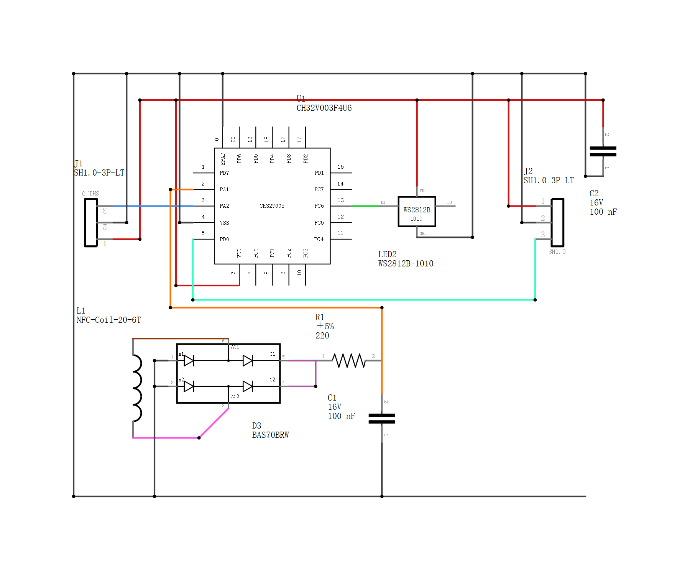</a></td>
</tr>
<tr>
<td><b>v26</b> ✓ 旧交付（让开量只有 <b>0.028 mm</b> ✗ —— 看不出）</td>
<td><b>v27</b> ✓✓ <b>让开 2.03 mm ✓</b>（2692 ✓、假接头 0 ✓、悬空端 1 ✓）</td>
</tr>
</table>

**复现 v27 的三步** ✓（`_work/` 里的是中间物，不入库 ✓）：

```
py -3.13 gen_schematic_layout3.py pixel-schematic-v5.fzz _work/layout9.fzz --pins=pins_ref.py --socket=4
py -3.13 render_sch.py _work/layout9.fzz _work/layout9.png       # 出“尺子”（png + svg ✓）
py -3.13 gen_schematic_wires.py _work/layout9.fzz _work/layout9.svg pixel-schematic-v27.fzz \
    --orig pixel-schematic.fzz --ratio 1.0 --rip 3 --rails      # 默认 FJ_GAP = 2.03 mm ✓
py -3.13 check_netlist.py pixel-schematic-v27.fzz                # 网表必须 ✓ 10 个网全对
py -3.13 render_sch.py pixel-schematic-v27.fzz _work/p.png       # 看“假接头 0 处”✓
```

★ **第二十一手新增待办 ✓（未经你同意不动 ✗）**：
① **走廊间距**轴 ✗：`U1` 左外侧那三条车道只隔 0.56～1.41 mm ✗ ⇒ 要“尽量清晰”就得让
   平行车道≥ **2.03 mm**（或干脆对齐到同一网格 ✓）；风险高 ✓（历史：通道实验多次变差 ✗）⇒ 待定 ✓；
② 档 0 / 导轨支线 / `xcheck` 那三条待办 ✓（未动 ✓）。

### 第二十二手：**支线共享同网竖线**（学手改版第三次 ✓）⇒ **v28**（2026-09-28 ✓ 用户定 ✓）

★ 用户选的路线 ✓（原话）：「**② 在支线搜索里加这种候选（不做后处理）**」✓ ——
  即：**直接在“脚 → 轨”的支线搜索里多试一种形状** ✗，不做事后合并 ✗。

✗ **病灶（你手改版第三次 ✓）**：同一条轨上，两条支线**各自竖一趟到轨** ✗ ——
  档1 实测 `U1.connector3` 出脚 7.2 + 竖 **81** ✓、`J1.connector1` 同 ✓ ⇒ 两根竖线并排 ✓。
✓ **手改版的做法**：右边那条改成**沿脚行横走 36.0** ✓、**搭到左边那条已经通到轨的竖线端点**上 ✓
  ⇒ 少画一根竖线 = **−52.2** ✓（手改版同侧两半共 −106.4 ✓）。

★ 落地路上撞到**两处硬卡点** ✓（都是**打印 `used` 看出来的** ✓，不是推的 ✗ —— 这是本手最大的教训 ✓）：
1. **布序** ✗：`U1.connector3`(x=58.6) 排在 `J1.connector1`(x=15.4) **之前**布 ✗ ⇒
   想共享时那根竖线**还没画** ✗ ⇒ `used` 里搜不到搭接点 ✓ ⇒ 候选加完**零效果** ✗
   （实测：两档数字与 v27**逐字相同** ✗）⇒ 修法 = **同一根轨上按“脚的 x”升序布** ✓（锚点先落 ✓）；
2. **1e-4 浮点末位** ✗（同一个坑 2026-09-28 在 `DATA_IN` 所成两段上踩过 ✓）：
   真值 `x = 22.5779` ✓ / `y = 9.000137` ✓，而我用 `1e-6` 判“同一条竖直车道” ✗ ⇒ **永远不命中** ✗
   ⇒ 修法 = `LANE_EPS = 1e-2` 单位 = **0.0028 mm** ✓（`.fzz` 写出时会四舍五入到 0.01
   单位 ✓ ⇒ 文件里两条线**端点重合** ✓、Fritzing 载入后是真接头 ✓）。
   ★ 派上用场的手段：临时加**环境变量开关的诊断打印** ✓（`DBG_T2` 把 `used` 里那 6 段
   **原样打出来** ✓ —— 一眼就看到 `22.5779` ✗；见完就删 ✓，不留开关 ✗）。

★ 连带修掉**一处真 bug** ✗（不修就交付不了 ✓）：`trim_on_rail` 原来用「点 y == **末点** y」
  判“在轨上” ✗ ⇒ 对「沿脚行横走」型支线，它的**首点就在脚行上** ✓ ⇒ `_k = 0` ⇒ `del p[1:]`
  ⇒ 路径只剩 1 个点 ✗ ⇒ 「⚠ 段被丢弃 ✗」⇒ **网表 ✗**（`U1.connector3` 的 GND 断开 ✗，两档都 ✗）。
  ✓ 判据改成「**落在本网某一条轨的 y 上**」✓ ⇒ 共享型支线**根本不到轨** ✓ ⇒ 原样跳过 ✓（形状保住 ✓）。
  ★ 这一条是**网表核（`check_netlist.py`）抳住的** ✓ —— 光看“重叠/贴脚/交叉”是**看不见**的 ✗。

**实测（档1 = 交付档 ✓）**：总长 **2692.1 → 2640** ✓（**−52.2** ✓）、导线 **55 → 52** ✓、
  **跨网擦身 15 → 8** ✓、交叉 15（不变 ✓）、贴脚 0 ✓、穿体 0 ✓、重叠 0 ✓、
  **假接头 0** ✓、悬空端 **1** ✓、画布 **105.8×87.4** ✓（不变 ✓）、
  网表 ✓ **10 网全对** ✓、告警 0 ✓、退出码 0 ✓、`sch_style_check` 通过 ✓（FAIL 0 / 提示 1 ✓）。
  日志新增一行形状 ✓：`★ 支线 **共享竖线（0 拐）** ✓：GND U1.connector3→汇点 沿脚行 向左 36.0
  ⇒ 搭在同网竖线的端点 (22.6,9.0) ✓（**不自己再竖一趟** ✓）` ✓。

<table>
<tr>
<td><a href="pixel-schematic-v27_preview.png"></a></td>
<td><a href="pixel-schematic-v28_preview.png">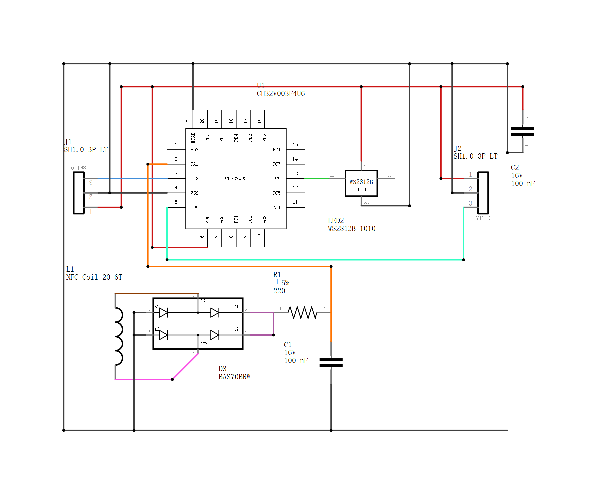</a></td>
</tr>
<tr>
<td><b>v27</b> ✓ 旧交付（两根支线<b>各竖一趟</b> ✗、导线 55 ✓、擦身 15 ✗）</td>
<td><b>v28</b> ✓✓ <b>共享竖线 ✓</b>（2640 ✓、导线 52 ✓、擦身 <b>8</b> ✓、假接头 0 ✓）</td>
</tr>
</table>

**复现 v28 的三步** ✓（`_work/` 里的是中间物，不入库 ✓）：

```
py -3.13 gen_schematic_layout3.py pixel-schematic-v5.fzz _work/layout10.fzz --pins=pins_ref.py --socket=4
py -3.13 render_sch.py _work/layout10.fzz _work/layout10.png    # 出“尺子”（png + svg ✓）
py -3.13 gen_schematic_wires.py _work/layout10.fzz _work/layout10.svg pixel-schematic-v28.fzz \
    --orig pixel-schematic.fzz --ratio 1.0 --rip 3 --rails    # 同轨支线按“脚 x 升序”布 ✓
py -3.13 check_netlist.py pixel-schematic-v28.fzz               # 网表必须 ✓ 10 个网全对
py -3.13 render_sch.py pixel-schematic-v28.fzz _work/p.png      # 看“假接头 0 处”✓
```

★ **第二十二手新增待办 ✓（未经你同意不动 ✗）**：
① 手改版的**另一半** `J2.c1 ↔ LED2` ✗（−54.2 ✓）：那一半需要「把邻居那根竖线在**本支线的
   脚行处打断**」✗（邻居远端在脚行**外侧** ✓）⇒ 得让 `used` 同步拆分 ✓（仓库里有先例：
   轨间互连“截成只剩出脚 ✓（同步 `used` ✓）” ✓）⇒ 下一轮 ✓；
② 档 0 那 1 条告警 ⚠（「兜底位置四档都不合格 ⇒ 仍用老位置」✓，来自“按 x 升序布”✓；
   档 0 **不交付** ✓ ⇒ 只记录 ✓）；
③ 第二十一手的待办依旧 ✓（走廊间距轴 ✗、导轨支线 / `xcheck` 那三条 ✓）。

### 第二十三手：**「邻居驱动」的车道 + 「接管」形态** ⇒ 追平手改版 ⇒ **v29**（2026-09-29 ✓ 用户定 ✓）

★ 用户定 ✓（原话）：「**push了，继续**」✓ —— 就是第二十二手留下的① ✓。

✗ **病灶（你手改版第三次的右半 ✓）**：邻居那根竖线**跨过**本支线的脚行 ✗ ——
  档1实测 `LED2` 的竖线 y: **17 → −72** ✓，而 `J2.c1` 的脚行是 **y=9** ✓
  ⇒ 旧判据要求“搭点在**脚行与轨之间**” ✗ ⇒ 一票否决 ✗（它一直自己竖一趟 81+7.2 ✗）。

✓ **新形态「接管」**（`truncate_branch_at` ✓ —— 与 `trim_on_rail` 同一套：改 `path` ✓、改 `b` ✓、
  **同步 `used`** ✗ 一处不改就会出现假重叠 ✓）：本支线沿脚行横走过去 ⇒ **邻居截到交点** ✓
  ⇒ 交点处**端点对端点** ✓（Fritzing 只认这个 ✓）、脚行以下那截竖线由本支线画 ✓
  ⇒ 同一段竖线只画一遍 ✓、但**少一根线** ✓。
  取法 = **乐观截断 → 跑四道闸门 → 不过就原样回退** ✓（`used` 快照恢复 ✓）⇒ 绝不比原来差 ✓。

★★ **本手最大的发现 = 第二处硬卡点 ✗：候选车道不能只按 7.2 档位找** ✗：
  实测 `J2.c1` 脚 x 与 `LED2` 竖线车道 x 相差 **34.0 = 4.72 × 7.2** ✗ ⇒ 十二档**永远踩不到** ✗✗
  （接管候选加完**零效果** ✗）。✓ 正解 = 车道集合换成 **① 7.2 档位（网格 ✓）+ ② 同网“已布竖线”
  所在的车道** ✓（**邻居驱动** ✓，只加在第二趟 ✓）—— 这才是手改版的做法 ✓。
  ★ 与第二十二手那 1e-4 是**同一类错** ✗：**拿自己的网格去量别人的线** ✗；
    判据要锚在**对方实际的位置**上 ✓（一条教训的第②条 ✓）。

**实测（档1 = 交付档 ✓）**—— **四个指标全部追平或超过手改版** ✓：

| 指标 | v28 | v29 | 你手改版（`v27_byHand` 第三次 ✓） |
|---|---|---|---|
| 总长 | 2640 | **2578.5** ✓ | 2585.7 ✓（比它**还短 7.2** ✓） |
| 导线 | 52 | **51** ✓ | 51 ✓ |
| 交叉 | 15 ✗ | **13** ✓ | 13 ✓ |
| 跨网擦身 | 8 | **8** ✓ | 8 ✓ |

其它 ✓：贴脚 0 ✓、穿体 0 ✓、重叠 0 ✓、**假接头 0** ✓、悬空端 **1** ✓、画布 105.8×87.4 ✓、
  网表 ✓ **10 网全对** ✓、告警 0 ✓、退出码 0 ✓、`sch_style_check` 通过 ✓（FAIL 0 / 提示 1 ✓）。
  日志 ✓：`★ 支线 **共享竖线（1 拐）** ✓：GND J2.connector1→汇点 沿脚行 向左 34.0 ⇒
  在 (210.6,9.0) **接管**同网竖线（邻居截到该点 ✓）⇒ 一路到轨 y=-72.0 ✓`；
  T 形搭接清单 **3 条** ✓（`D3.c0` ✓、`U1.c3` ✓、`J2.c1` ✓）。
  ★ 形状打印也**从几何读** ✓（不加标志位 ✗）：✗ 第一版只看了段首 ✗ ⇒ 形状对了、名字仍打成
  “L 形” ✗（邻居那段的**末端**才是交点 ✗）⇒ 改成**两个端点都看** ✓。

<table>
<tr>
<td><a href="pixel-schematic-v28_preview.png"></a></td>
<td><a href="pixel-schematic-v29_preview.png">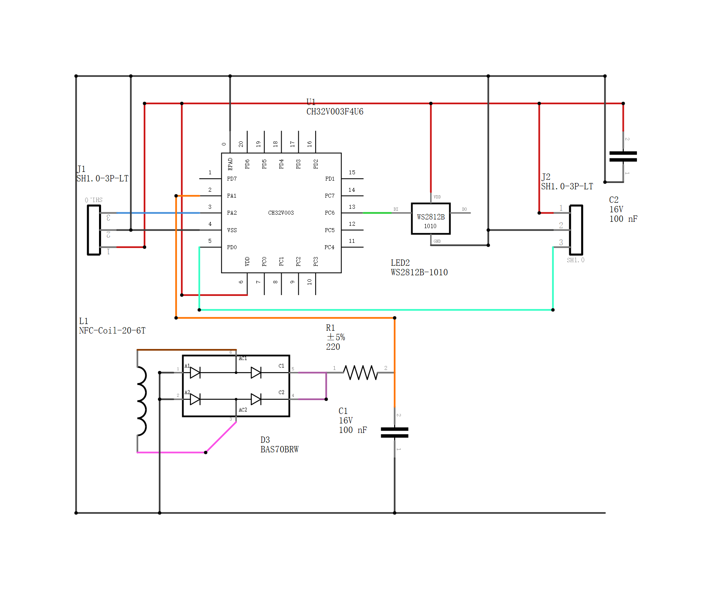</a></td>
</tr>
<tr>
<td><b>v28</b> ✓ 旧交付（只共享了左半 ✓；右半仍在自竖 ✗、交叉 15 ✗）</td>
<td><b>v29</b> ✓✓ <b>接管也做了 ✓</b>（2578 ✓、交叉 <b>13</b> ✓、导线 51 ✓、擦身 8 ✓）</td>
</tr>
</table>

**复现 v29 的三步** ✓（`_work/` 里的是中间物，不入库 ✓）：

```
py -3.13 gen_schematic_layout3.py pixel-schematic-v5.fzz _work/layout11.fzz --pins=pins_ref.py --socket=4
py -3.13 render_sch.py _work/layout11.fzz _work/layout11.png    # 出“尺子”（png + svg ✓）
py -3.13 gen_schematic_wires.py _work/layout11.fzz _work/layout11.svg pixel-schematic-v29.fzz \
    --orig pixel-schematic.fzz --ratio 1.0 --rip 3 --rails    # 车道 = 档位 + 邻居竖线 ✓
py -3.13 check_netlist.py pixel-schematic-v29.fzz               # 网表必须 ✓ 10 个网全对
py -3.13 render_sch.py pixel-schematic-v29.fzz _work/p.png      # 看“假接头 0 处”✓
```

★ **第二十三手新增待办 ✓（未经你同意不动 ✗）**：
① **走廊间距**轴 ✗（第二十一手那条 ✓）：`U1` 左外侧车道只隔 0.56～1.41 mm ✗ ⇒ 现在
   擦身 **8 处**里就有它 ✓ ⇒ 下一步就剩它最值 ¥ ✓（风险高 ✓：历史多次变差 ✗）；
② 档 0 那 1 条告警 ⚠（同上 ✓，不交付 ✓）；
③ `xcheck` ③ 拆「同网 / 跨网」、导轨支线待办 ✓（未动 ✓）。

### 第二十四手：**网标签**（把功能模块的边界切开）⇒ **v30**（2026-09-29 ✓ 用户定 ✓）

**口径**（用户定 ✓）：`netlabel` 是**抽象连接** ✓ ⇒ **只适用原理图** ✓（面包板 / PCB 要的是
**物理**连接 ✗）；它该用的地方**只有“功能能独立出来的模块”的边界** ✓ ——
本板即 **A = `L1/D3/R1/C1`**（取能 + 整流 + RC 取出 ✓）与 **B = 以 `U1` 为核心** ✓。
**跨 A/B 边界的网恰好两个：`RC` 与 `GND`** ✓（`COIL_A` / `COIL_B` / `BR+` 全在 A 内 ⇒ 不贴 ✓）
⇒ 各贴一对**同名**标签 ✓（电气靠“同名即连通”✓）。

**复现 v30** ✓（`_work/` 里的是中间物，不入库 ✓）：

```
py -3.13 gen_schematic_layout3.py pixel-schematic-v5.fzz _work/layout11.fzz --pins=pins_ref.py --socket=4
py -3.13 render_sch.py _work/layout11.fzz _work/layout11.png            # 出“尺子”（png + svg ✓）
py -3.13 gen_schematic_wires.py _work/layout11.fzz _work/layout11.svg pixel-schematic-v30.fzz \
    --orig pixel-schematic.fzz --ratio 1.0 --rip 3 --rails \
    --modules=L1,D3,R1,C1 --label=RC,GND        # NL2 模块边界 ✓ + NL1 网标签 ✓
py -3.13 check_netlist.py pixel-schematic-v30.fzz    # 网表 ✓ 9 个网全对
py -3.13 check_flags.py   pixel-schematic-v30.fzz    # 旗标不许被穿 ✓ 必须 0/4
py -3.13 render_sch.py pixel-schematic-v30.fzz pixel-schematic-v30_preview.png
```

**比 v29 好在哪** ✓（同一套判据 ✓）：

| | v29 | **v30** |
|---|---|---|
| 网表 | 9 网全对 ✓ | 9 网全对 ✓ |
| 导线 | 51 | 49 |
| 十字交叉 | 13 | **11** ✓✓ |
| 跨网擦身 | 8 | **4** ✓✓ |
| 跨网假接头 / 穿元件本体 | 0 / 0 ✓ | 0 / **0** ✓ |
| **被穿旗标** | —（无标签 ✓） | **0 / 4** ✓✓ |
| 画布 | 105.8 × 87.4 mm | 105.8 × 92.5 mm（底下多一个 `RC` 标签 ✓） |

<table>
<tr>
<td><a href="pixel-schematic-v29_preview.png"></a></td>
<td><a href="pixel-schematic-v30_preview.png">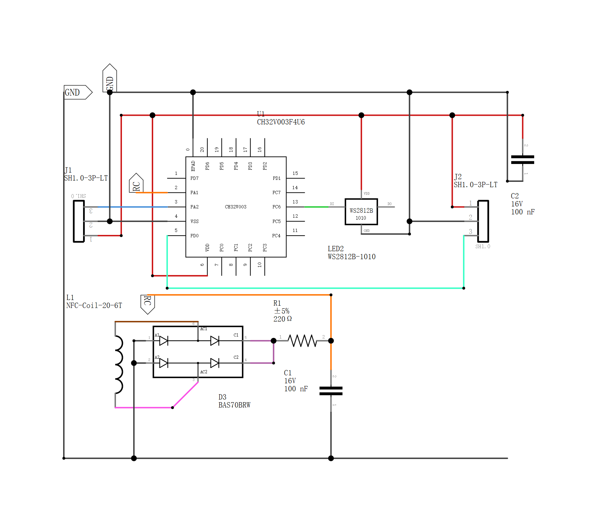</a></td>
</tr>
<tr>
<td><b>v29</b> ✓ 旧交付（无标签；交叉 13 ✗、擦身 8 ✗）</td>
<td><b>v30</b> ✓✓ <b>网标签</b>（模块边界 ✓；交叉 <b>11</b> ✓、擦身 <b>4</b> ✓、被穿旗标 <b>0/4</b> ✓）</td>
</tr>
</table>

**几何是量出来的、不是估的** ✓（口径全部收在 `sch_net.py` **一处** ✓；生成器 / 渲染器 / 判定器都调它 ✓）：

- 网标签是**元件实例** ✓，Fritzing 给它写**两组**图形：`mi+"0"` = **箭头旗标**（`<polygon>` ✓）、
  `mi+"1"` = **文字** ✓（✗ 我一度只查了后者 ⇒ 画出来**少了外面的框** ✗，用户当场指出 ✓）。
- **文字**：左缘 x **0.6** ✓、基线 y **6.6** ✓、字号 **6.0** ✓（sketch ✓ = 导出 ×1.25 ✓）、无 `text-anchor` ✓。
- **旗标**：宽 **8.700** ✓、长 `L = 5.9052·Σ(步进/em) + 4.6964` ✓（9 个名字最小二乘 ✓ rms **0.064 mm** ✓）、
  尖头长 **4.350** ✓；**锚在文字上** ✓（0° / 90° / −90° 三组顶点**完全一样** ✓ ⇒ 与旋转无关 ✓）。
- **旋转**：绕**板心** `(0.6 + W/2, 4.5)` ✓（`W = L − 0.9` ✓，由两个独立量到的枢轴互证 ✓：
  `RC` 11.321 ↔ 11.3219 ✓、`GND` 17.016 ↔ 17.0055 ✓）；文件里的 `m31/m32` 写 **`(I−R)·C`** ✓
  ⇒ “忽略它”与“尊重它”两种读法**落在同一处** ✓。
- **字号回退**：Fritzing **不自带字体** ✗（搜遍安装目录：没有 ttf/otf/woff ✓）⇒ 它请求 `Droid Sans`、
  由 Qt6 从**系统字体**回退 ✓；拿系统里**全部 345 个字体**逐一拟合 ⇒ **Noto Sans** ✓（rms 0.034 mm ✓；
  Segoe UI Bold 0.097 ✗ / Calibri 0.134 ✗）⇒ 字宽表 = `sch_glyphs.py`（**纯数据** ✓）。
- **接点圆点**：该处 **≥2 个导线端点**就画 ✓（小 r **0.9** ✓ / 大 **1.8** ✓；大小 = 线端 + **脚** ≥3 ⇒ 大 ✓）。

**这一手修掉的三个真问题** ✓（都不是审美 ✓；写下来免得回头再踩 ✓）：

1. ✗ **`LABEL_NETS` 没有模块级初值** ✗ ⇒ 不给 `--label` 时 `emit()` 直接 `NameError` ✗ ——
   也就是说「**不给开关 ⇒ 一字节不差（v29 可复现 ✓）**」这条路**从来没被验证过** ✗。
   补上后实测：**v29 的 26 个 zip 条目逐字节相同** ✓✓（整包哈希不同只因 zip 条目**时间戳** ✓）。
2. ✗✗ **判碰撞用的盒子比旗标小一圈** ✗（`label_box` 返回的是**“板”** = 文字墨迹框，4.2 高 ✗；
   而看得见的旗标宽 **8.7** ✓）⇒ 红 `5V` 竖线**正从旗标身上穿过** ✗，
   而生成器打印的却是 **“违例 0”** ✗✗。⇒ 两处修：
   - 判据改成**旗标** ✓（直接调 `label_flag` ✓ —— 一份几何 ✓）；渲染器那道“穿元件本体”跟着一起变灵 ✓；
   - **另写** `check_flags.py` ✓（**不看**那个盒子 ✓，直接量画出来的 `<polygon>` ✓）——
     「**自检不算数**」✓（`AGENTS.md` §0 第 ⑦ 条 ✓）：判据要能被**另一个实现**或**人的眼睛**推翻 ✓。
   ★ 灵敏度**当场验过** ✓（不许只说“能跑” ✗）：`v34`（用户截图点名那版）⇒ **3 / 4 被穿** ✓✓ ——
   正好是“竖着的 `GND` + 两个 `RC`” ✓，横的那个 `GND` 没穿 ✓ = 与用户当时看到的**完全一致** ✓；
   `v39` ⇒ **1 / 4** ✓（当时那个 `_scratch/fix_label_place.py` 用的是**同一个瞎盒子** ✗）。
3. ✗ **标签朝向候选里还留着 `180°`** ✗ ⇒ 实测真挑中了一个 ✓（`m11 = −1 m22 = −1` ✓）= **倒着写字** ✗。
   ⇒ 收成 `LBL_ROTS = (0, 90, 270)` ✓ —— 与 `_scratch/fix_label_place.py` 里**早就有**的那条同一口径 ✓。

**两处“多余的东西”也清掉了** ✓：

- ✗ **多余的圆点** ✗（用户点名 ✓）：标签沿轴挪开 7.2 单位时，我原来的做法是
  「**保留原线端 + 另拉一小段引线**」✗ ⇒ 在 `(46.38, −9.00)` 留下一个**纯接缝** ⇒
  Fritzing 按「≥2 个线端 ⇒ 画圆点 ✓」给它画了个**小圆点** ✗ —— 而两根线其实在**同一条直线**上 ✗
  ⇒ 那个圆点**不代表任何分叉** ✗。
  ⇒ 新判据 `end_is_free()` ✓：**那一端没有别人的端点 / 脚 ⇒ 直接搬线端** ✓（不留接缝 ✓）；
  **有** ⇒ 才加引线 ✓（老接头动不得 ✓ —— 那正是老教训里“网表 ✗、连通块 9 → 10 ✗”的情形 ✓）。
  实测：`Wire90012777` 12.2 → **19.4** 单位 ✓、导线 50 → **49** ✓、圆点 29 → **28** ✓、那个点上**圆点 0 个** ✓
  （独立量：`check_flags` 同族的 `dump_dots` 在那儿量到 **0 个** ✓）。
- ✗ **`--label` 之外的复现路没跑过** ✗（见上面第 1 条 ✓）。

★ **教训** ✓（值得单列 ✓）：我上一条命令用 `Select-String` **过滤**输出 ⇒ 把“预览 PNG 写入失败”的报错
**藏掉了** ✗ ⇒ 我拿**旧图**当新图看 ✗，一度以为圆点没去掉 ✗。露馅靠的是**文件时间戳对不上** ✓ ——
与 `AGENTS.md`「过滤掉的东西会骗人 / 不许自证」同一条 ✓。

### 第二十五手：**脚位模型修正** ✗✗ ＋ **接地符号** ＋ 用户手改版 ⇒ **v31**（2026-09-29 ✓ 用户定 ✓）

**起因** ✓：用户手改了一版 `pixel-schematic-v30_byHand.fzz` 让我“检查” ✓ ——
思路两处：**① 把两个 `GND` 网标签换成更常见的接地符号** ✓；**② 挪了 `RC` 标签的位置、去掉多余导线** ✓。

#### ① 接地符号：**按名字把全图的地拉到一起** ✓（判定器原来不认它 ✗ = 假警 ✗）

规则**在 Fritzing 源码里** ✓（逐条抄进 `sch_net.py` 的注释 ✓）：

```cpp
bool ConnectorItem::isGrounded() {          // src/connectors/connectoritem.cpp
    return name == "gnd" || name == "vss" || name == "ground";   // 大小写不敏感
}
// src/items/symbolpaletteitem.cpp::busConnectorItems
else if (bus->id().compare("groundbus", Qt::CaseInsensitive) == 0)  mitems = LocalGrounds;
```

件定义（嵌在 `Fritzing.exe` 里的 `resources/parts/core/ground.fzp` ✓，与草图里那条
`path=":/resources/parts/core/ground.fzp"` 对得上 ✓）：`<connector id="connector0" name="GND">`
＋ `<bus id="groundbus">` ✓。

⇒ **接地符号不是“两个符号互连”** ✗ —— 它把**全图「脚名 ∈ {GND,VSS,GROUND}」的连接器**
一把拉成一张网 ✓（`U1` 的 **`VSS`** ✓、`LED2` 的 **`GND`** ✓、以及**符号自己的脚** ✓）。
★ 反过来说：**图里没有接地符号 ⇒ 什么也不合并** ✗（那些脚只是“名字叫 GND”而已 ✓）。
★ 判据**只在 `sch_net.py` 一份** ✓（`grounded_connectors` / `ground_links` ✓，脚名从
`.fzz` **自带的那份 `.fzp`** 里读 ✓ —— 草图里只有 `connectorId` ✗、看不到脚名 ✗）。
⇒ 本图：合并 4 只脚（`LED2.connector1` ✓、`U1.connector3` ✓、两个符号自己的 ✓）⇒ **9 网全对** ✓✓。

#### ② ✗✗ **脚位模型是错的**（错了整整一个旗标长 ≈ 3.4mm ✗）—— 这一手真正的病 ✓

我一直以为标签的脚在**平端** `(0, 4.5)` ✗。Fritzing 自己生成标签 SVG 的源码
（`NetLabel::makeSvg` ✓）写的是：

```cpp
double totalHeight = 300/divisor;   double arrowWidth = totalHeight / 2;      // 100 / 50
double strokeWidth = 10/divisor;    double halfStrokeWidth = strokeWidth / 2; // 3.333 / 1.667
if (goLeft)  pin = pin.arg(0).arg(0).arg(arrowWidth).arg(totalHeight);
else         pin = pin.arg(totalWidth - arrowWidth - 0.1).arg(0).arg(arrowWidth).arg(totalHeight);
```

⇒ 脚 = **pin rect 的外缘** ✓，在**箭头尖端那一侧** ✓：
`direction="right"`（默认 ✓）⇒ 局部 x = 旗标右缘 **+0.141**（sketch ✓）；`direction="left"` ⇒ 旗标左缘 **−0.150** ✓。

**证据（两条独立）** ✓：
- **手画的线**（Fritzing 存的是**吸附后**的真脚位 ✓ = 权威尺子 ✓）：
  `v30_byHand` `RC`(180°) 旧模型差 **3.535 mm** ✗ ／ 新模型 **0.004 mm** ✓✓；
  `v31_rcgnd_byHand` `RC`(90°) 旧 3.535 ✗ ／ 新 **0.004** ✓✓；
  `v31_rcgnd_byHand` `RC`(0°) 旧 3.535 ✗ ／ 新 **0.258** ✓。
- ⇒ **`pixel-schematic-v30.fzz` 里四个标签，在 Fritzing 里其实全没接上** ✗✗（线停在平端 ✓、
  脚在尖端 ✓ = “看着接上、其实没接” ✓）—— 这也解释了用户为什么用接地符号换掉 `GND` 标签 ✓
  （符号靠**名字**连通 ✓，根本不接线 ✓）。◎ 已复跑确认：`v30` 的 `(A)` = **4 处** ✗✗
  （4 个标签全断 ✓）、`v29`（无标签 ✓）= **0 处** ✓。

**并且**：`(A)` 那条判据的容差原来写死 `0.05` 单位 = **0.014 mm** ✗ ⇒ 把 Fritzing 吸附后
仍带的零头（实测 **0.09~0.13 单位** = 0.03~0.04 mm ✓）全判成“没画到” ✗ ⇒ **假警**永远在叫 ✗
⇒ 改成实测口径 `PIN_HIT_TOL = 0.5`（= 0.14 mm ✓，仍 ≪ 一根线宽 0.25 mm ✓）；
**真断**那些差 **3.5~12 单位** ✓ —— 与零头**差两个量级** ✓，阈值很好定 ✓。

★ **教训** ✓（第三次同一条 ✓）：这个错**躲过了当时所有自检** ✗ —— 因为 ② 量的是
「线端 ↔ **我自己算的脚**」✓ = **自证** ✗（`AGENTS.md` §0 ⑦ ✓）。这次是靠**换一把不信我自己的尺子**
（用户手画的线 ✓ + Fritzing 源码 ✓）才翻出来的 ✓。

#### ③ v31 = 用户手改版 ＋ **只修那一处** ✓

用户那版里 **3 处接头是准的** ✓✓（他自己画的 ✓：0.004 mm ✓），只剩**我生成的那一根**
（`Wire90012777 → RC` ✗，差 3.50 mm ✗）⇒ **不动导线** ✓、改**标签**：
把 `mi 90012781` 的 `geometry` 按**新模型**反解（`sch_net.label_geom` ✓）＋ 朝向 `270°→90°` ✓
（90° 时旗标朝上 ✓，实测**不被任何线穿** ✓；270° 会横在 `DATA_IN` 上 ✗）⇒ 脚正好落回线端 ✓。

```
# 只读输入、另存输出；只改那一个实例的 schematicView 里的 geometry + m11..m32 ✓
py -3.13 f:\git\_scratch\fix_label_geom.py pixel-schematic-v30_byHand.fzz pixel-schematic-v31.fzz \
        90012781 39.1779 -9.0 90
py -3.13 check_netlist.py pixel-schematic-v31.fzz      # ✓ 9 个网全对
py -3.13 check_fake_wires.py pixel-schematic-v31.fzz   # (A)=0 (B)=0 ✅ 合格
py -3.13 check_flags.py pixel-schematic-v31.fzz        # 被穿旗标 0/2 ✓✓
py -3.13 render_sch.py pixel-schematic-v31.fzz pixel-schematic-v31_preview.png
```

| | v30（旧 ✗ 脚位模型） | **v31** |
|---|---|---|
| ① 网表 | 9 网全对 ✓ | 9 网全对 ✓ |
| ② 假连线 (A)/(B) | **4 ✗** / 0 | **0** ✓ / 0 ✓ ⇒ ✅ 合格 ✓ |
| ④ 被穿旗标 | —（同一批错 ✗） | **0 / 2** ✓✓ |
| 导线 | 49 | 47 ✓（用户去掉 2 根 ✓） |
| 十字交叉 | 11 | 11 ✓ |
| 跨网擦身 | 4 ✗ | **0** ✓✓ |
| 假接头 / 穿元件本体 / 可读性 | 0 / 0 / 0 ✓ | 0 / 0 / 0 ✓ |
| 画布 | 105.8 × 92.5 mm | **104.1 × 86.1 mm** ✓（更紧凑 ✓） |

<table>
<tr>
<td><a href="pixel-schematic-v30_preview.png"></a></td>
<td><a href="pixel-schematic-v31_preview.png">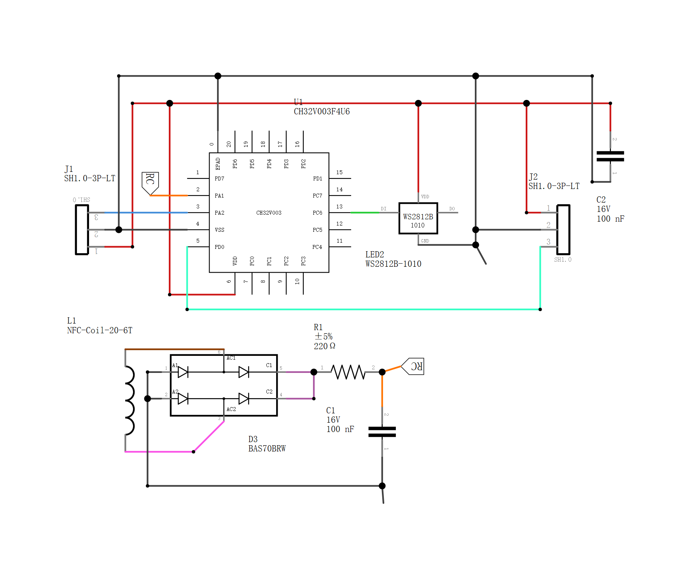</a></td>
</tr>
<tr>
<td><b>v30</b> ✗ 旧（标签脚位错 ⇒ Fritzing 里四个标签全没接上 ✗）</td>
<td><b>v31</b> ✓✓ <b>接地符号 + 脚位修正</b>（②✅ ④ 0/2 ✓；擦身 <b>0</b> ✓）</td>
</tr>
</table>

⚠ **预览里两块接地符号是空的** ✗ —— `render_sch.py` 画不出它：它的 SVG 是 **core 库件** ✓
（`:/resources/parts/core/ground.svg` ✓，嵌在 Fritzing app 里 ✓），`.fzz` **不带**它 ✗
⇒ 渲染器只能**跳过** ✗（图上那两根孤零零的短线就是它俩的连线 ✓）。
**不以我的预览为准** ✗ —— 请以 **Fritzing 里打开 `pixel-schematic-v31.fzz`** 为准 ✓
（要我把那份 core SVG 抠出来入库、给渲染器补上也可以 ✓ —— 那要走 `svg/_assets/` + 许可说明 ✓）。

（★ 下一手可选：`--label` 目前是“点名制” ✓，将来若要把**所有**跨模块网都自动贴 ✓，
判据已经就位 ✓ —— `cut_at_module_boundary` 只要不按 `LABEL_NETS` 过滤即可 ✓；未动 ✗。）

### 第二十六手：**线要平直** ＋ **文字朝向照 Fritzing** ⇒ **v32**（2026-09-29 ✓ 用户定 ✓）

用户三条（原话 ✓）：「**接地和 RC 标签的线，都应平直，你可以移动地和标签的**」✓、
「**Fritzing 中看，RC 的文字是正的，不是反的**」✓、以及同意把 core 的接地符号 SVG 入库 ✓。

#### ① 三条线弄平 ✓（**只挪元件，不弯线** ✓）

| 连到 | 原来 ✗ | 现在 ✓ |
|---|---|---|
| `RC` 标签（`mi 90012780`） | (161.328,84.000)→(171.000,**81.000**) 斜 ✗ | (161.328,84.000)→(171.000,**84.000**) **水平** ✓ |
| 接地符号 `Ground1` | (210.578,17.000)→(216.000,27.000) 斜 ✗ | (210.578,17.000)→(**210.578**,27.000) **竖直** ✓ |
| 接地符号 `Ground2` | (161.328,143.961)→(162.000,153.000) 斜 ✗ | (161.328,143.961)→(**161.328**,153.000) **竖直** ✓ |

做法：**平移元件**（标签 / 接地符号 ✓）⇒ 它的脚位跟着走 ⇒ 再把**连它的那根线的端点**搬到新脚位上 ✓
（`_scratch/move_part.py` ✓，只改实例 `schematicView` 的 `geometry` + 那根线对应端的相对量 ✓）。
★ 脚位一律问 `sch_net`（网标签 ✓ / 接地符号 ✓ —— 都已实测标定 ✓），脚本自己不写第二份几何 ✓。

#### ② 接地符号的**脚**反推出来了 ✓（两个样本完全一致 ✓✓）

它也在**自己的 svg 里**（`schematic/ground.svg` 的 `connector0pin` ✓）、`.fzz` 不带 ✗ ⇒
用**用户手画的两处线端**反推（Fritzing 存的是吸附后的真脚位 ✓）：

```
Ground1 原点 (206.999, 26.4044) ← 线端 (216.000, 27.000) ⇒ 偏 (+9.001, +0.596)
Ground2 原点 (152.999, 152.404) ← 线端 (162.000, 153.000) ⇒ 偏 (+9.001, +0.596)   ← 一模一样 ✓✓
```

⇒ `sch_net.ground_pin(geom) = geom + (9.001, 0.596)` ✓（= 0.1in ✓ 往右、顶上中间 ✓）。
★ 同时把接地符号**登进 `PIN_SK`** ✓ ⇒ ② 现在**量得到**“线有没有接在接地符号上” ✓
（✗ 以前它掉进“图形缺失 ⇒ 不判”那一档 ✗ ⇒ 线飘到哪都查不出来 ✗）。

#### ③ 文字朝向：**`m11 < 0` ⇒ 正着排字** ✓

✗ 我原来无论什么朝向都把 `<text>` 跟着转 θ ✗ ⇒ **180° 时字是倒的** ✗（用户当场指出 ✓）。
依据：源码里 Fritzing 自己就这么判 —— `bool reversed = (transform().m11() < -0.5);  // horizontal flip or 180°` ✓
⇒ `m11 < 0`（镜像/180°）时**不转** ✓，并按**画出来的旗标盒**排布：靠**非尖端**那侧 ✓（右对齐 ✓）、
竖直居中 ✓。★ 第一版我靠了左 ✗ ⇒ 字有一半压在尖头上 ✗（放大截图当场可见 ✗）⇒ 改右对齐 ✓。
（±90° 仍跟着转 ✓ = 竖排 ✓，与用户此前 `GND` 竖排的截图一致 ✓。）

**v31 → v32** ✓：闸门 ① 9 网全对 ✓ ｜ ② **(A)=0 (B)=0 ✅** ✓ ｜ ④ **0/2** ✓✓ ｜
导线 47 ✓、交叉 11 ✓、擦身 **0** ✓、画布 104.1 × 86.1 mm ✓。

<table>
<tr>
<td><a href="pixel-schematic-v31_preview.png"></a></td>
<td><a href="pixel-schematic-v32_preview.png">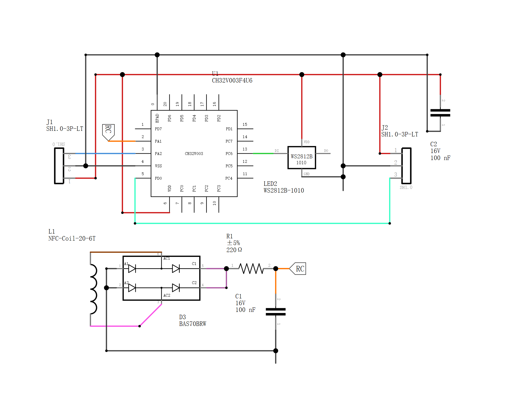</a></td>
</tr>
<tr>
<td><b>v31</b> ✗ 到接地/标签的线是斜的 ✗；`RC` 的字倒着 ✗</td>
<td><b>v32</b> ✓✓ <b>线全平直 ✓ + 字正着 ✓</b>；② <b>(A)=0 (B)=0</b> ✅、④ <b>0/2</b> ✓</td>
</tr>
</table>

★ **还差一块** ✓：核心库的**接地符号图形**（`schematic/ground.svg` ✓）—— 它**在 Fritzing app 里** ✗
（从 exe 里没抠出干净的一份 ✗：源码仓那份是**构建时生成**的 ✗ ⇒ raw 取不到 ✓）。
**最稳的取法**：你在 Fritzing 里导出一次 `pixel-schematic-v32_图示.svg` ✓ ——
那份导出里就**带着 Fritzing 自己画的接地符号** ✓ ⇒ 我照 `svg/_assets/` 的做法
（**图形 + `LICENSE-ground.txt` 许可说明** ✓，与 WS2812B/JST 同一套 ✓）入库 ✓，
渲染器就能画它 ✓，也能**顺便把 180° 的文字位置逐点核对**一遍 ✓（`check_labels.py` ✓）。

#### ④ **接地符号图形入库了** ✓＋与 Fritzing 导出**逐点对账** ✓（2026-09-30 ✓ 用户导出 ✓）

用户导出 `pixel-schematic-v32_图示.svg` ✓ ⇒ 两件事一起办完 ✓：

- **图形入库** ✓：从导出里**逐字摘出** `GroundModuleID` 的绘制内容（两个实例**完全一致** ✓）
  ⇒ `_assets/ground_symbol.svg` ✓ ＋ `_assets/LICENSE-ground.txt`（来源 / 许可 / 用途 ✓，
  与 WS2812B・JST 那套同一做法 ✓）。`sch_net.ground_art()` 读它并摆位 ✓
  （`translate(几何 + (9.001,0.596)) · scale(1.25) · translate(-7.201,-0.375)` ✓
  ⇒ **脚正好落在 `ground_pin()` 上** ✓，图形与脚位**同一份口径** ✓）⇒ **预览里它俩画出来了** ✓✓。
  ★ 顺便**独立复核**了脚位 ✓：导出里 `translate + 内层 pin(7.201,0.375)` 换算到 sketch
  = (210.58, 26.87) ✓，我反推的是 (210.578, **27.000**) ✓ ⇒ **差 0.04mm** ✓✓。
- **对账（`check_labels.py` ↔ 导出）** ✓：

| 项 | 结果 |
|---|---|
| **文字锚点** | **0.00000 mm** ✓✓（90° 那只 ✓） |
| **旗标逐顶点** | **0.096 导出单位 = 0.034 mm** ✓✓ |
| 镜像/180° 标签的文字 | ⊘ **跳过并报出** ✓ —— Fritzing 会给它**再加一层反向矩阵** ✓（导出原话 `matrix(-1,0,0,-1,6.6855,7.236)` ✓）⇒ 锚点**不可比** ✗（差 2.33mm 是**补偿量** ✓，不是文件错 ✓）；旗标那项照核 ✓ |

⇒ 由导出反推的结论 ✓：**180° 标签在 Fritzing 里文字是正的** ✓（矩阵补偿 ✓，
与我 ③ 改的口径一致 ✓）；**90° 标签照转** ✓；文字**基线离旗标盒底 2.30 sketch** ✓
（我的实现 2.25 ✓，差 0.2mm ✓）。

★★ `check_labels.py` 这次**自己修了两个 bug** ✗（都是"同名重复"引起的 ✓，记下来 ✓）：
- ✗ **定标**原来用"同名对投票" ✗ ⇒ 两个 `RC` 互相错配 ✓、还常**打平** ✗ ⇒ 文字被报到 **50mm** ✗✗；
  ⇒ 改成**枚举候选平移 + 一对一贪心配对 + 取总误差最小** ✓，并且**只用没被补偿的标签定标** ✓。
- ✗ **旗标配对**按"最近中心"但不**消耗** ✗ ⇒ 两个同名标签**抢同一个导出组** ✗ ⇒ 假报 2.75mm ✗；
  ⇒ 改成**一对一贪心** ✓ ⇒ 0.034mm ✓✓。

✗ **我自己的一次犯规**（记下来 ✓）：想改这两处时，我图快用 **PowerShell 字符串替换**去改 `.py` ✗
⇒ **UTF-8 被写坏、文件直接不能解析** ✗✗ ⇒ 只好 `git checkout` 回滚重做 ✓。
**源码只能走编辑工具改** ✗ —— 终端别碰源文件 ✓（`AGENTS.md` 里那条 ✓，这次是我自己破的 ✓）。

### 第二十七手：**接地符号产出** ＋ **整套按规则生成** ＋ **剪掉冗余的电/地接线** ⇒ **v33**（2026-09-30 ✓ 用户定 ✓）

用户一句「**做**」✓ = 把我提议的两件补上 ✓：① 生成器能**产出接地符号** ✓；
② **整套**（网表 + 摆位 → 全部导线 / 网标签 / 接地符号）**都由规则生成** ✓ —— 不再依赖手改版 ✓。
然后用户再提一手 ✓（原话 ✓）：「**检查每根 5V 和 GND 接线，如果删除不影响网的连通，就删除；
如果有更好的连接点可以不违反任何规则又节省线长，就更改接线。**」✓ ⇒ ③ 见下面「剪冗余」那一节 ✓。

#### ★★ 第一版错在哪 ✗（记下来 ✓）：**不能把接地符号挂在切口上** ✗

第一版图省事：`--ground=GND` 直接**借标签那条路** ✗ ⇒ 符号就挂在 `NL2` 切出来的两个断口上 ✗。
实测两个断口**都不合适** ✗：

- 断口 `(−6.22,−72)` **正好是一根长竖线的顶端** ✓ ⇒ 往下挂 ⇒ **那根线从符号的三根横线里穿过去** ✗
  （图上看就是"符号挂在线上、线把符号打穿" ✗ —— 这种错**用户一眼就能看见** ✗）；
- 另一个断口在横轨上 ⇒ 引线**横着进**符号 ✗。

⇒ 于是**另写一份实现**当尺子 ✓（`check_grounds.py` ✓ 已入库 ✓：常数自己写死 ✓、不调生成器任何代码 ✓）：

| 文件 | 结果 |
|---|---|
| `pixel-schematic-v32.fzz`（用户手改版 ✓ **权威**） | **0 / 2 不合规** ✓✓ |
| v33 第一版（错版 ✗） | **2 / 2 不合规** ✗（**灵敏度已证** ✓✓） |
| `pixel-schematic-v33.fzz`（最终 ✓） | **0 / 2 不合规** ✓✓ |

✗✗ **这份核对器自己也差点"自证"** ✓（记下来 ✓）：第一版把"**终止在脚上的那根线**"**整根豁免** ✗
⇒ 错版照样报 ✓✗（= `AGENTS §5b` 那条"不许自证"又吃了一次 ✓）。
⇒ 改成**只豁免脚周围 1 单位**那一小截 ✓ ⇒ 才把错版抓出来 ✓✓。

#### ★★ 正确的形态是**量**出来的 ✓：两个符号都挂在「**整张网上挑出来的点**」✓

把用户手改版两个符号的坐标与它们连的线摊开 ✓：

```
Ground1 脚 (210.578, 27.000) ← 引线 (210.578, 17.000) → (210.578, 27.000)     竖直、从上面下来 ✓
Ground2 脚 (161.328,153.000) ← 引线 (161.328,143.961) → (161.328,153.000)     竖直、从上面下来 ✓
```

⇒ 两条**都是竖直的** ✓、都是**往下挂** ✓；而且**一个在 B 区**（`U1`/`LED2` 那一侧 ✓）、
**一个在 A 区**（`D3` 那一侧 ✓）—— 与那两个 `GND` 标签想说的"**A/B 各自的地**"是同一件事 ✓。

★★ 由此得到一条**反直觉的结论** ✓：**地网根本不用切** ✗ —— Fritzing 的 `LocalGrounds`
把全图 `GND/VSS/GROUND` 的脚拉成**一张**网 ✓（依据见 `sch_net.py` 里那段源码笔记 ✓）
⇒ 两个符号**不必用线相连**也同网 ✓ ⇒ "每个模块各摆一个符号"在电气上仍是一张地网 ✓✓。

#### 实现（三处 ✓，各司其职 ✓）

1. **`sch_net.py`**：加 `ground_geom()`（脚位**反解** ✓）、`ground_box()`（本体盒 ✓ ——
   ✗ 原来写在渲染器里 ✗ ⇒ **搬过来** ✓，判据与生成器**同一份** ✓）、`is_ground_net()`（哪些网是"地" ✓，
   与脚名判据**同一份** ✓）。
2. **`gen_schematic_wires.py`**：`--ground=<网>` ✓ + `ground_spots()`（**挑点** ✓）+
   `emit()` 里挂 ✓。挑点口径 ✓：候选 = 该网**导线的端点** ✓（脚上的点跳过 ✗）；
   只**往下**挂 ✓；违例 = 引线压线 / 交叉 ✓ + 引线蹭脚（< `CLEAR_PIN` ✓）+
   **符号被线穿** ✓ + 符号压元件本体 / **元件的文字** ✓ + 压已放好的标签 ✓；
   **每个功能模块各取一个** ✓（先取违例少的 ✓、再取离本模块的脚近的 ✓）。
   挂法 = **延长那根线** ✓（若它的端是竖直、从上方下来、且没人用 ✓）或**加一小段竖直引线** ✓。
   ★ 地网**不参与 `NL1/NL2` 的切** ✓（`--ground` 点名的网直接跳过 ✓）。
3. **`render_sch.py`**：本体盒改调 `sch_net.ground_box()` ✓。

★ **两条弯路也是数据定的** ✓✗（记下来 ✓）：① **挂在切口上** ✗（见上 ✓）；
② 第一版挑中 B 区那个点后，实测**压住 `C2` 的 `100 nF`** ✗（图上就是"符号的横线把 `100` 划掉" ✗）
⇒ 障碍里补上**元件文字** ✓（`sch_text.label_bbox` ✓，与 `relabel()` **同一份** ✓）⇒ 立刻换到干净点 ✓。

#### 挑出来的点，**与用户那两个同位置** ✓✓（模型对不对，这就是证据 ✓）

| | 用户手改版 **v32** ✓ | **规则生成 v33** ✓ |
|---|---|---|
| B 区 | (210.578, **27.000**) | (210.578, **26.000**) ✓ —— 同一条竖线、同一个结点往下 9 ✓ |
| A 区 | (161.328, **153.000**) | (161.328, **166.800**) ✓ —— **同一个 x** ✓（他当时把底轨挪到 y=143.961 ✓；规则版底轨在 y=157.8 ✓ ⇒ 都离轨 9 ✓） |

#### ★★ ③ **剪冗余 ＋ 改接点**（`--trim=5V,GND` ✓，用户点的两项 ✓）

★ 判据都**从几何读** ✓（不看标志位 ✗），口径写在 `trim_plan` 的文档串里 ✓：

| 要做的 | 判据 ✓ |
|---|---|
| **删一根线** | 删完 **终端分块一模一样** ✓（终端 = 脚 / 网标签脚 / 接地符号脚 ✓；比“整张网还连通”更严 ✓ —— 它同时挡住“把 `NL2` 切开的两个模块又接回去”✗ 与“把某个终端甩掉”✗）＋ **不留悬空线端** ✗ |
| **改接一个点** | 只动“**一端是终端、另一端是结点**”的支线 ✓ ⇒ 在同网的其它结点里找 ✓；须 **违例 0** ✓（压线 / 交叉 / 蹭脚 / 穿体 / 压标签 / 跨网假接头 / 出界 ✗）且 `长度 + **K_INTER**×交集` **严格更省** ✓（K 就用布线那个 ✓ = 10mm/交集 ✓，不新造尺子 ✓）|

实测（v33 这一版 ✓）：

```
网 5V ：12 根线 ｜ 终端 5 个 ⇒ 一根都不能删 ✓（本来就是树 ✓）；改接 0 处 ✓（7 个候选结点全违例 ✗ / 更省的没有 ✓）
网 GND：23 根线 ｜ 终端 9 个 ⇒ ✂ **删掉 90012770（110.6 单位 = 31.2mm ✓）**：终端分块不变 ✓、不留悬空端 ✓
                              改接 0 处 ✓（13 个候选结点全违例 ✗ —— 如实报出 ✓）
```

★ 净效果 ✓（**独立量** ✓：直接从两个 `.fzz` 求导线长 ✓）：总长 **2532.3 → 2421.7 单位** ✓
（**−110.6 = −31.2mm** ✓，正好就是删掉那根的 ✓）；**悬空导线端 1 → 0** ✓✓ ——
那根冗余线**正好就带着那个悬空端** ✓（v29 起的老毛病 ✓），剪了它**顺手一并解决** ✓。
交叉 **11 → 11** ✓（没变 ✗✓）、其余 0 全部保持 ✓。

✗✗ **这一手撞的坑（记下来 ✓）**：我的“终端”判据忘判 `t[1] is not None` ✗ ⇒ 把 `("pin", None)`
（= 支线远端的**裸端** ✓）当成一只终端 ✗ ⇒ 实测 5V 报出 **10 个终端**（5 真 + 5 假 ✗）、
并且把**轨的中间段**当成“支线”拖去改接 ✗ ⇒ 兜底一验：把 `U1.VDD` **孤立**了 ✗✗。
⇒ ① 修判据 ✓；② 兜底（**整体再验一遍终端分块，变了就全撤** ✓）**真的把错挡住了** ✓✓
—— 两个都要有 ✓：判据要准 ✓，但不能只靠它 ✓。
★ 与 `emit()` 里“同点即连”那条笔记是**同一个坑** ✓（那边写对了 ✓、这边又踩 ✗）⇒ “`("pin", None)` = 裸端点”
  这件事实只有一处说得清 ✓ ⇒ 以后凡读 `start_tgt`/`end_tgt` 一律这么判 ✓。

#### 指标（**同一套判据** ✓）

| | v32（手改 ✓） | **v33（规则生成 ✓）** |
|---|---|---|
| ① 网表 | 9 网全对 ✓ | 9 网全对 ✓（其中 **4 只地脚**按 `LocalGrounds` 并网 ✓） |
| ② (A) 假连线 ｜ (B) | 0 ｜ 0 ✓ | **0 ｜ 0** ✓ |
| ④ 被穿旗标 | 0 / 2 ✓ | **0 / 2** ✓ |
| 十字交叉 | 11 | **11** ✓ |
| 穿元件本体 ｜ 压线 | 0 ｜ 0 ✓ | 0 ｜ 0 ✓ |
| **接地符号几何**（**独立核对** ✓ `check_grounds.py` ✓） | 0 / 2 ✓ | **0 / 2** ✓ |
| 导线根数 ｜ **总长**（同一口径、独立量 ✓） | 47 ｜ 1965.6 单位（554.7mm）✓ | 51 ｜ **2421.7 单位**（683.5mm）✓（剪前 2532.3 ✓，去掉 110.6 ✓） |
| 悬空导线端 | 0 ✓ | **0** ✓✓（没剪之前是 1 ✗，见上 ✓） |
| 贴脚（可读性 ✓） | 0 ✓ | **1** ✗（**v30 起就有** ✗，见“遗留”✓） |
| 画布 | 104.1 × 90.6 mm | 105.8 × 94.5 mm |

★ **只有总长这一项规则版比手改版长** ✗（2421.7 vs 1965.6 单位 = **+129mm** ✗）——
那是**布线形状**的差别 ✓：他手改版在 v30 基础上**删 4 根、加 2 根、改短 4 根** ✓
（见第二十五/二十六手 ✓），而规则版的“轨 ＋ 每脚一条 L 形支线”本身就是那个长度 ✓。
⇒ 这一项**不是 `--trim` 能补的** ✗（`--trim` 已经把那根 110.6 的冗余线剪掉了 ✓；
再剪就要**换形状** ✗ = 另一手的事 ✓，记账 ✓）。

<table>
<tr>
<td><a href="pixel-schematic-v32_preview.png"></a></td>
<td><a href="pixel-schematic-v33_preview.png">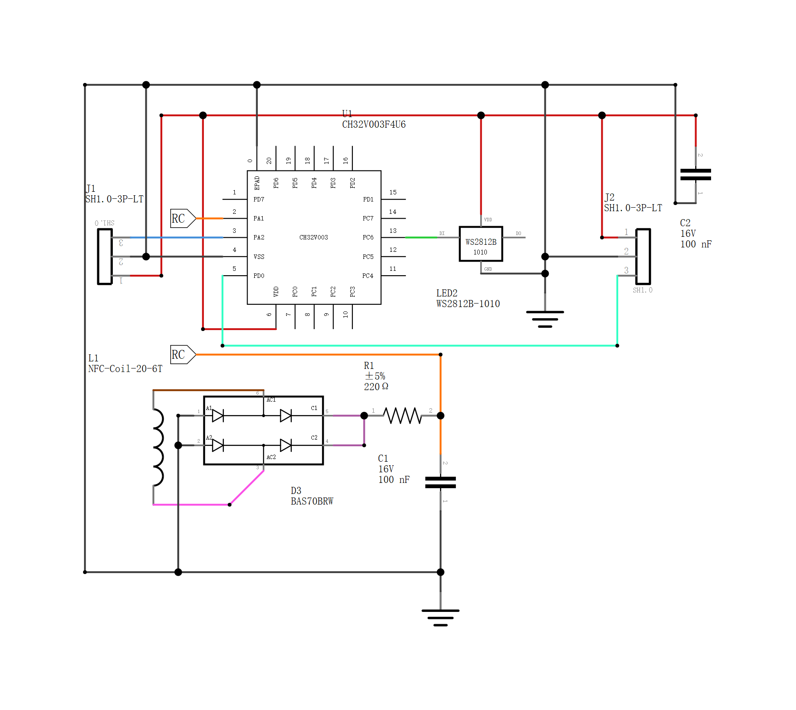</a></td>
</tr>
<tr>
<td><b>v32</b> ✓ 用户手改（两个接地符号是他放的 ✓）</td>
<td><b>v33</b> ✓✓ <b>整张图由规则生成 ✓</b>（两个接地符号也是挑出来的 ✓、位置与他那两个几乎重合 ✓）</td>
</tr>
</table>

#### 复现（**整条链都是规则** ✓，实测可复现 ✓）

```
py -3.13 gen_schematic_layout3.py pixel-schematic-v5.fzz _work/layoutA.fzz --pins=pins_ref.py --socket=4
py -3.13 render_sch.py _work/layoutA.fzz _work/layoutA.png          # 出“尺子”（+ .svg ✓）
py -3.13 gen_schematic_wires.py _work/layoutA.fzz _work/layoutA.svg pixel-schematic-v33.fzz \
    --orig pixel-schematic.fzz --ratio 1.0 --rip 3 --rails \
    --modules=L1,D3,R1,C1 --label=RC,GND --ground=GND --trim=5V,GND
py -3.13 check_netlist.py    pixel-schematic-v33.fzz     # ① 9 网全对 ✓
py -3.13 check_fake_wires.py pixel-schematic-v33.fzz     # ② (A)=0 (B)=0 ✓
py -3.13 check_flags.py      pixel-schematic-v33.fzz     # ④ 被穿旗标 0/2 ✓
py -3.13 check_grounds.py    pixel-schematic-v33.fzz     # ⑤ 接地符号几何 0/2 不合规 ✓
py -3.13 render_sch.py       pixel-schematic-v33.fzz pixel-schematic-v33_preview.png
```

- **摆位那一步逐字节可复现** ✓✓（`_scratch/fzz_same.py`：**26/26** 条目相同 ✓）；
- ★ 顺手发现 `_work/layout11.svg` 是**旧的** ✗（它里面 `R1` 的文字还是 `220` ✓，现在是 `220Ω` ✓）
  ⇒ 用**新尺子**重跑，结果**逐字节一致** ✓（那条差异只在**文字**里 ✓，不影响判据 ✓）；
- ★★ **不给 `--ground`/`--label` ⇒ 输出与已入库 v29 逐字节相同** ✓✓（26/26 ✓）
  —— "**零 = 不生效**"守住了 ✓。
  ★ 2026-09-30 **多了 1 处故意的差异** ✓（已在第二十九手量清 ✓）：修掉“位号盒少算上下留白”那个 bug 之后 ✗，
    **5 个位号**按**修正后**的盒子重算 ✓（`J1`/`J2`/`L1`/`U1` 各挪 **−4.75 单位** ✓、`R1` 换了个落点 ✓）；
    `_scratch/fzz_diff.py` 同口径比对：**62 个实例 0 个不同** ✓（差异只剩 `titleGeometry` 那 **3 字节** ✓）。

#### 遗留（**不在这一手范围内** ✗，记账 ✓）

- ~~**悬空导线端 1 个** ✗~~ ⇒ **已解决** ✓✓：剪掉那根冗余线（`90012770` ✓）之后
  **悬空端 1 → 0** ✓（它就在那根线上 ✓）；**v29 起的老毛病结了** ✓。
- **贴脚 1 处** ✗：`Wire90012730` 蹭 `RC.connector0` **3.0 单位 = 0.85 mm** ✓ ——
  **v29 是 0** ✓、**v30 起变成 1** ✗（= 标签/切分那一手带进来的 ✓，不是这一手 ✓）；**未动** ✗。
  ⇒ ~~**已解决**~~ ✓✓：**第二十八手** 的 ②（支线代价按整条算 ✓）把它一并去掉了
  （那根线在“改接”时正好被换掉 ✓）⇒ **v34 贴脚 0** ✓。
- **改接点一处都没找到** ✓：不是没做 ✓，是**每个候选结点都违例** ✓（`5V` 7 个 / `GND` 13 个 ✓，
  已逐条打印 ✓）—— 这正是“符号/轨”那套形状的代价 ✓：引脚附近没有不蹭脚的落点 ✓。
  ⇒ ~~没找到~~ ✓：根因是**判据自己的 bug** ✗（见第二十八手「引线蹭脚」那一段 ✓）——
  修好口径后 **v34 真的找到并改接了 1 处** ✓（`135.2 → 79.2` 单位 ✓）。
- `RC` 标签在规则版里是 **0°** ✓（用户那版是 90° / 180° ✓）；文字都**正着** ✓，只是朝向不同 ✓。
  ⇒ ~~朝向不同~~ ✓：**180° 已开放为候选** ✓（第二十八手 ✓，用户实测截图证明那字是正的 ✓）
  ⇒ **v34 那两个 `RC` 一个 0°、一个 90°** ✓（各自的“最省且违例 0”的落点 ✓）。
- ★ **通用规则已写** ✓（用户 2026-09-30 同意 ✓）：那两条（“符号类元件挂在网上挑出来的点、往下挂、不许被线穿” /
  “地网不必切：`LocalGrounds` 自己会并”）已写进**跨项目**的
  `fritzing-parts-langhua/docs/schem-drawing-rules.md` **B3.1.2** ✓（与 `B3.1.1`「标签是一个元件」并列 ✓）——
  正文在那边 ✓，本节只留这条指针 ✓（`AGENTS §11` ✓）。

### 第二十八手：**标签就近贴本侧引脚** ＋ **支线代价按整条算** ＋ **成组删冗余** ⇒ **v34**（2026-09-30 ✓ 用户定 ✓）

缘起 ✓：v33 入库后用户**手改了一版** ✓ 并要我核 ✓ —— 核出来**他那版全面更好** ✓
（总长 **−486.9 单位**、交叉 **8 vs 11** ✓、贴脚 **0 vs 1** ✓、悬空端都是 0 ✓）
⇒ 我提了三处该补的口径 ✓，用户一句「**好的，实现**」✓ ⇒ 这一手 ✓。
（核的手法是**逐实例对账** ✓ 而不是“看着差不多” ✓：`_scratch/fzz_diff.py` 按 `modelIndex`
比几何/属性 ✓，找出他真正动过的 4 处 ✓ —— 也正是那 3 条口径的由来 ✓。）

#### ① **成组删**冗余 ＋ 级联清悬空端 ✓

✗ 原来逐根试删 ✗、而且要求“**每删一根都不留悬空端**” ✗ ⇒ 找不到“**一整块回路一起删**” ✓
（用户删掉 GND 左侧回路 = `229.8+110.6+44.0+28.8 = 413.2` 单位 ✓ —— 单删任何一根都会先留下悬空端 ✗）。
✓ 现在：**允许中途留悬空端** ✓，删完**级联清理** ✓（每步单独验终端分块 ✓、收尾再整体验一遍 ✓）。

★ 这一手差点删不动 ✓：那三根线是 `D3.c0/c1 ＋ C1.c1` **唯一**的线路径 ✗，
但两侧各有一个**接地符号** ✓ —— 而 Fritzing 的 `LocalGrounds` 让它们**本来就同网** ✓
⇒ **电气上没断** ✓ ⇒ 得让 `--trim` 认得这条语义 ✓（否则它会一直判“删了就断”✗）
⇒ 把 `--trim` 的位置**挪到“标签/接地符号都挂完之后”** ✓✓（这条与第二十七手那条
“地网不必切”是**同一件事实**的两面 ✓）。

#### ② 支线代价改成「**整条支线**」✓

✗ 原来拿“**新整条路径**的长度”比“**旧路径里带脚的那一片**” ✗ ⇒ 实测把用户那个改接
（**135.2 → 79.2** ✓ 省 56 单位 ✓）**误判成更贵** ✗ 而拒掉 ✗。
✓ 现在：从那只脚出发 ✓ 沿“**度 2 的结点**”一路串到**第一个分叉点** ✓ ⇒ 拿**整条**比 ✓；
比较键 = **`(违例数, 长度)` 字典序** ✓ ⇒ 正是用户原话“**不违反任何规则 ＋ 节省线长**” ✓
（违例更少时允许**略长** ✓ —— 实测他那根被删的竖线**正贴着 `RC` 标签** ✗，消掉它比省几单位更重要 ✓）。
⇒ 实测 v34：`5V` **真的改接了 1 处** ✓（`135.2 → 79.2` ✓）—— 这一手把**第二十七手
“改接点一处都没找到”**那条遗留一并结了 ✓✓。

#### ③ 标签**就近贴本侧引脚** ✓ ＋ 挪位后的断头清理 ✓

✗ 原来标签一律贴在**模块边界的断口**上 ✗ ⇒ 本侧“为了够到断口”的那一长段就白留了 ✗
（实测 `RC` 的 A 侧为了够到断口走了 **143.7 单位** ✗）。
✓ 现在：候选 = **本侧所有导线端点** ✓，按“**离本侧的脚最近**”排 ✓；
再在 **4 个外推方向 × 7 档距离 × 4 个朝向**里搜 ✓（挑选键 `(违例数, 结点远近, 方向, 距离, 朝向)` ✓）；
挪完把**空出来的那一截**当断头清掉 ✓（`prune_dangling` ✓）。

★★ **180° 是用户实测推翻我旧结论** ✓✗（记下来 ✓）：我 2026-09-29 在生成器里写过
“**不许 180°** ✗，因为会把字倒着写”✗ —— **那条是错的** ✗；用户 2026-09-30 直接
截了 Fritzing 里的图 ✓：**字是正的** ✓。真相是 Fritzing 对标签文字**自动摆正** ✓
（`NetLabel::makeSvg`：`bool reversed = (transform().m11() < -0.5);  // horizontal flip or 180°` ✓），
而**同一件事实**我在 `render_sch.py` 里**早就写对了** ✓✗ —— 同一件事**两份口径**、
一边对一边错 ✗ ⇒ 教训与“一件事一份实现”是**同一条** ✓。
★ 180° 还是**唯一**能把旗标摆到接线点**右侧**的手段之一 ✓（脚在尖端那侧 ✓）——
用户手改版就是用它把标签贴在引脚旁的 ✓。

#### 修掉的两个**真 bug** ✓✗（都不是审美问题 ✓、而且**五道判据全绿也没拦住** ✗）

1. **“引线蹭脚”把引线**自己出发的那只脚**也算进去了** ✗ ⇒ 距离**恒为 0** ✓
   ⇒ **每条带引线的候选都白背 1 个违例** ✗ ⇒ “贴在本侧引脚旁边”的候选**全被否掉** ✗、
   只能退到 28.8 单位外的结点 ✗ —— 这正是用户手改版能贴在引脚旁、生成器做不到的原因 ✓。
   修：**自己那只脚排除** ✓（容差 = 全仓统一的 1 单位 ✓）。
2. **级联清断头把挂着真脚的线也吃了** ✗：判据只要求“**一端是叶子**” ✓ 而没看另一端 ✓
   ⇒ 实测把 **`R1` 那只脚唯一的那根线**删掉 ✗ ⇒ 那只脚被孤立 ✗、**标签浮空 11.5 单位** ✗✗
   —— 而 ① 网表 ② (A)/(B) ④ ⑤ **全绿** ✗（`check_netlist.py` 也没报 ✗）。
   ★ **是另写的一份只读核对器量出来的** ✓✓：`_scratch/lbl_touch.py`
   （直接读 `.fzz` ✓、算每个标签**画出来的脚**到最近导线的距离 ✓，不调生成器任何代码 ✓）
   ⇒ 修三处 ✓：① 挂着真终端的线**一律不删** ✓；② 候选要过「丢掉的这一截**不会孤立真脚**」✓
   （`dead_end_pin` ✓：从旧断口沿度 2 结点走 ✓，走到**真脚**就否掉这个候选 ✓ —— 而“顺着同一条链
   挪近一点”不算危险 ✓，所以落点是 `_end` 不是 `_q2` ✓）；③ 清完之后**端点正压在脚/标签上的当场补连接** ✓
   （✗ 否则就是“看着接上其实没接” ✗ —— 判据 ② 的 `(B)` 正好抓住它 ✓，当时实测 `(B)=1` ✗）。

#### 用户对着截图提的两点 ✓（都在这一手内解决 ✓）

**问题 1「`U1.2` 接 `RC`，`RC` 本体压在了 `U1` 上，这没有违规吗？」** ✓ —— 问得对 ✓：
**那本来该是违规** ✓，是我这边漏了一条 ✗ —— 标签是“一个元件” ✓（`B3.1.1` ✓），
可我挑位置时只查了 **导线 / 别的标签 / 引脚** ✗、**没查元件本体框** ✗
（用户手改版那只 `RC` 落在 `(176.48,81.00)` ✓ = **就在 `U1` 方框里** ✗）。
✓ 现在：标签对**任何元件本体**都要留 `CLEAR`（**6.0 单位 ≈ 1.7mm** ✓，与“导线离元件本体”**同一条** ✓
—— 不是 0 ✗：贴着边框看着仍旧是“压住”✗）。

**问题 2「红色线上多了一个接线点」** ✓ —— 根因是**我自己上一轮的动作** ✗：
`② 改接` 把 5V 那条长横线**切成了两段共线的线** ✗
（`(29.78,-57.6)→(49.38,-57.6)` ＋ `(49.38,-57.6)→(180.38,-57.6)` ✗），
Fritzing 就在那个**切口**上画了一个小圆点 ✓；用户手改版那条是**一整根** ✓ ⇒ 没有点 ✓。
✓ 现在：**很保守的“共线合并”** ✓ —— 同网 ✓ ＋ 那一点上**恰好只有两个线端** ✓ ＋
两边方向**严格反向**（叉积≈0 ✓、点积<−0.999 ✓）⇒ 才并 ✓；**折角一律不动** ✓
（手改版里 16 个折角接头原样保留 ✓）。实测 5V：`19.6 ＋ 131.0 ⇒ **150.6 单位一根**` ✓、那个点消失 ✓。
★✗ **第一版没排除“真终端”** ✗ ⇒ 它把标签那截引线并进了宿主线 ✓，
而那个接头**正是 `R1` 的脚** ✗ ⇒ 并进去 = 让线**穿过**那只脚、脚上没有线端了 ✗
⇒ 判据 `(A)/(B)` 当场各报 1 ✗ ⇒ 补上「**合并点上不许有真脚 / 标签**」✓ 才对 ✓。
★ 另外整块只在**带开关**（`--label/--ground/--trim` ✓）时才跑 ✓ ⇒
**“不给开关 ⇒ 输出与已入库 `v29` 逐字节相同”** 仍然成立 ✓✓（实测 **26/26** ✓）。

#### 指标（**同一套判据** ✓ ＋ 两份独立只读核对 ✓）

| | v33（上一手 ✓） | 用户手改版 ✓ | **v34（本手 ✓）** |
|---|---|---|---|
| ① 网表 ｜ ② (A) ｜ (B) | 9 网 ✓ ｜ 0 ｜ 0 | 9 网 ✓ ｜ 0 ｜ 0 | 9 网 ✓ ｜ **0 ｜ 0** ✓ |
| ④ 被穿旗标 ｜ ⑤ 接地符号几何 | 0 / 2 ｜ 0 / 2 ✓ | 0 / 2 ｜ 0 / 2 ✓ | **0 / 2 ｜ 0 / 2** ✓ |
| 导线根数 | 51 | 46 | **46** ✓ |
| **总长**（独立量 ✓） | 2421.7 单位（683.5mm） | 1934.8 单位（546.0mm） | **1941.0 单位**（547.8mm）✓ |
| 十字交叉 | 11 | 8 | **8** ✓ |
| 贴脚（可读性 ✓） | 1 ✗ | 0 ✓ | **0** ✓✓ |
| 悬空导线端 | 0 ✓ | 0 ✓ | **0** ✓ |
| 画布 | 105.8 × 94.5 mm | 104.1 × 94.5 mm | **104.1 × 94.5 mm** ✓ |
| 标签脚到最近导线（独立量 ✓ `lbl_touch.py` ✓） | — | 0.000 ✓ | **0.000 ✓（2/2）** |
| 接线点（独立量 ✓ `junct.py` ✓） | — | 9 处 ✓ | **9 处** ✓（那一处多余的已合掉 ✓） |

⇒ 相对 v33：**总长 −480.7 单位（−135.7mm、−19.9%）** ✓、交叉 11 → **8** ✓、贴脚 1 → **0** ✓。
⇒ 相对用户手改版：**导线根数持平** ✓、交叉持平 ✓、贴脚持平 ✓、接线点数持平 ✓；
**总长多 6.2 单位** ✓ —— 那是**为了不压 `U1` 本体**把 `RC` 标签从“引脚旁那个点”挪出去换来的 ✓
（见问题 1 ✓）；**这一项是用户点名的取舍** ✓。

#### 复现（**整条链都是规则** ✓）

```
py -3.13 gen_schematic_wires.py _work/layout11_check.fzz _work/layout11_check.svg pixel-schematic-v34.fzz \
    --orig pixel-schematic.fzz --ratio 1.0 --rip 3 --rails \
    --modules=L1,D3,R1,C1 --label=RC,GND --ground=GND --trim=5V,GND
py -3.13 check_netlist.py    pixel-schematic-v34.fzz     # ① 9 网全对 ✓
py -3.13 check_fake_wires.py pixel-schematic-v34.fzz     # ② (A)=0 (B)=0 ✓
py -3.13 check_flags.py      pixel-schematic-v34.fzz     # ④ 被穿旗标 0/2 ✓
py -3.13 check_grounds.py    pixel-schematic-v34.fzz     # ⑤ 接地符号几何 0/2 不合规 ✓
py -3.13 render_sch.py       pixel-schematic-v34.fzz pixel-schematic-v34_preview.png
```

<table>
<tr>
<td><a href="pixel-schematic-v33_preview.png"></a></td>
<td><a href="pixel-schematic-v34_preview.png">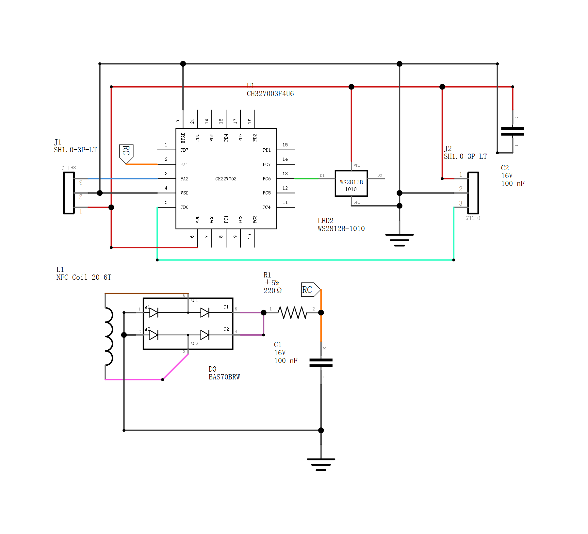</a></td>
</tr>
<tr>
<td><b>v33</b> ✓（51 根 / 683.5mm / 交叉 11 / 贴脚 1 ✗）</td>
<td><b>v34</b> ✓✓（46 根 / 547.8mm / 交叉 8 / 贴脚 0 ✓；标签就近、无多余接线点、不压元件）</td>
</tr>
</table>

#### 遗留（**不在这一手范围内** ✗，记账 ✓）

- ⚠ **位号 `U1` 压导线**（`Wire90012735` ✓）：**v29 起的老毛病** ✗、这一手**未动** ✗
  （渲染器每次都如实报 ✓）；正解见前面「位号摆位」那一节（**布完线再重摆位号** ✓ = 另一手 ✓）。
- ★ 这一手真正的新增“守门员”是**两份只读核对器** ✓（`_scratch/lbl_touch.py` ✓ / `_scratch/junct.py` ✓）：
  它们各量一件事 ✓（标签脚是否真落在导线上 ✓ / 接线点与 T 形 ✓），**不调生成器** ✓
  ⇒ 上面那两个真 bug 就是这么量出来的 ✓。**要不要收进 `tools/` 入库**，等用户定 ✓（现在还在草稿目录 ✓）。

### 第二十九手：**两份独立核对器入库** ＋ **`--relabel` 布完线重摆位号**（2026-09-30 ✓ 用户定 ✓）

#### ① 两份核对器入库 ✓（⑥⑦ ✓，都是**只读** ✓、都带**拒判** ✓）

| 文件 | 查什么 ✓ | 为什么非它不可 ✗ |
|---|---|---|
| `check_label_touch.py`（**⑥** ✓） | 每个网标签**画出来的脚**到最近导线的距离必须 ≤ 0.05 ✓ ＋ 它的 `<connect>` 必须正好指向那根 ✓ | v34 开发中实测：**标签浮空 11.5 单位** ✗（给标签新拉的引线被“清断头”删了 ✗）—— 而 ① 网表 ✓ ② (A)/(B) ✓ ④ ⑤ **全绿** ✗，因为**没人量“标签的脚到导线的距离”** ✗ |
| `check_junctions.py`（**⑦** ✓） | 某点恰好两个线端、两线**严格反向** ⇒ **共线切分** ✗（退出码 1 ✓）；T 形 / ≥3 端口的真分叉只当参考 ✓ | 用户指着截图说「**红色线上多了一个接线点**」✗ —— 根因是“改接”把长直线切成两段共线 ✗；这条**没有别的判据管** ✗ |

★ **灵敏度都证过** ✓（不是“反正它没报” ✗）：
- ⑥ 拿**历史版本**验 ✓：`pixel-schematic-v30.fzz`（当时四个标签全断 ✗）⇒ **4/4 全部报浮空** ✓（10.7 / 18.1 / 4.4 / 9.4 单位 ✓）⇒ 退 1 ✓；v33 / v34 ⇒ 0.000 ✓ ⇒ 退 0 ✓；
- ⑦ 拿**人造文件**验 ✓：`_scratch/split_one.py` 把 v34 那根长 5V 线从中间**切成两段共线** ✗ ⇒ ⑦ 当场报 ✗ 退 1 ✓、而 ⑥ 在同一文件上仍退 0 ✓（各管各的 ✓）。

★★ ⑦ 的判据也**修正过一次** ✗✓（记下来 ✓）：第一版把**落在引脚上的接头**也算成“多余” ✗
—— 实测 `R1` 脚上“引脚 ＋ 两根共线的线”被判违规 ✗，可那是**正常交汇** ✓（Fritzing 在那里画点
本来就对 ✓）。⇒ 判据补上「**连接伙伴的 layer 不是 `schematicTrace`** ⇒ 那一端落在**脚**上 ⇒ 豁免」✓
（口径与生成器 `add_conn` 同一条 ✓）。修完 v34 与用户手改版**完全同构** ✓：
`58 接头 = 34 落在脚上 ＋ 15 折角 ＋ 9 真分叉` ✓✓（两版逐项相同 ✓）。

#### ② `--relabel`：布完线再拿**最终导线**当障碍摆一遍位号 ✓（**默认关** ✓）

用户定的思路 ✓：**位号可以自由挪 ✓、导线挪一次要牵动全局 ✗**。

- `relabel()` 本来就在跑 ✓，但它在 **`emit()` 之前** ✗ —— 那时只有“**计划的**导线” ✗，
  而 `emit()` 里导线**还会变**（标签引线 / 改接的新线 / 接地引线 / 共线合并 ✓）
  ⇒ 实测 `U1` 的位号正好压在新拉出来的一根线上 ✗（渲染器每次都如实报 ✓）。
- ✓ 现在：`--relabel` ⇒ `emit()` 末尾拿**最终导线**当障碍**再跑一遍同一个 `relabel()`** ✓
  （候选位 / 权重 / 判碰全是它那一套 ✓，不另写 ✗）；并给**这一遍**多一圈候选位 ✓
  （`extra=True` ✓）—— 实测 `U1` 的 7 个候选位**全被导线占着** ✗（它上方正好横着 5V 长轨 ✗）
  ⇒ 不给第二圈就只能原地不动 ✗。★ 默认关 ✓ ⇒ **不给开关时输出仍与已入库 `v29` 逐字节相同** ✓✓。

★ 实测 ✓：两遍合计「压导线 **11 → 1 → 0** ✓」（`U1` 那个警告清了 ✓）、压元件 0→0 ✓、压位号 0→0 ✓。

#### ✓ **两把尺子已对齐**（2026-09-30 当天查清 ✓）—— “生成器说 0、渲染器说压了”的根因就是它 ✗

量出来的证据（同一个 `U1` 位号，两边各量一次 ✓）：

| | `U1` 位号盒 ✓ | 差 |
|---|---|---|
| 生成器 `relabel()` 的候选矩形 | 高 **10.00** 单位（`fs × 行数`） | ✗ **自己拼的** |
| 渲染器（与 `relabel()` 的计数、`check_*` 一样） | 高 **14.75** 单位（`ST.label_bbox` ✓） | ✓ 含上下留白 |
| `R1` 本体盒（两边**完全一致** ✓） | `(125.33,80.40→161.33,87.60)` | — |

⇒ 差的 **4.75 单位**（≈1.3mm）正好让 `U1` 的位号**擦到了 `R1` 的本体盒** ✗，
而生成器因为盒子矮一截、判“没压” ✗ ⇒ 它把那个位置当成了最优解 ✗。
★ 教训与「一件事一份实现」**同一条** ✓：**判碰用的矩形只能有一份** ✓ ——
一个概念（位号盒）在两个地方各拼一次 ✗，形状就会不一样 ✗，判据就会“两边各说各的” ✗。

★ **顺带把“不给开关 = 与 v29 逐字节相同”那条说明改准** ✓（同一件事的另一面 ✗）：
那遍 `relabel()` 是**无条件跑**的 ✓ ⇒ 盒子改正后，**5 个位号**按修正后的盒子重算 ✓
（`J1`/`J2`/`L1`/`U1` 各 **−4.75 单位** ✓、`R1` 从 `(125.33,56.95)` 换到 `(168.53,79.15)` ✓）；
把它当“漂移”就错了 ✗ —— 同一口径量过 ✓：**62 个实例 0 个不同** ✓，差异只剩 `titleGeometry` ✓
（`.fz` 只差 **3 字节** ✓）。⇒ 这是**故意的、已量清**的修正 ✓，不是回归 ✓。

✓ 修法（**一处** ✓）：`relabel()` 的候选矩形改成**反推 `ST.label_bbox()`** ✓
（`label_bbox(x, y − 0.25fs, fs, ln)` 的**上缘正好是 y** ✓ ⇒ “盒左上角 = `(x, y)`”这个对外语义没变 ✓，
所以 `extra` 那一圈候选位的算法一字未动 ✓）。修完实测：

- 生成器眼里的 `U1` 盒 = 渲染器眼里的 `U1` 盒 = `(58.58,−87.10→88.55,−72.35)` ✓✓（逐位相同 ✓）；
- 渲染器**一个 `⚠` 都没有了** ✓✓（历代一直挂着的“位号 `U1` 压导线”清零 ✓，也没换来新的“压元件”✗）；
- `--relabel`：动 3 个 ✓ ｜ 压导线 **1 → 0** ✓ ｜ 压元件 0→0 ✓ ｜ 压位号 0→0 ✓。

#### ✓ 交付版 **v35** ＝ v34 ＋ `--relabel`（2026-09-30 ✓ 用户定 ✓）

```
py -3.13 gen_schematic_wires.py _work/layout11_check.fzz _work/layout11_check.svg pixel-schematic-v35.fzz \
    --orig pixel-schematic.fzz --ratio 1.0 --rip 3 --rails \
    --modules=L1,D3,R1,C1 --label=RC,GND --ground=GND --trim=5V,GND --relabel
py -3.13 check_netlist.py     pixel-schematic-v35.fzz    # ① 9 网全对 ✓
py -3.13 check_fake_wires.py  pixel-schematic-v35.fzz    # ② (A)=0 (B)=0 ✓
py -3.13 check_flags.py       pixel-schematic-v35.fzz    # ④ 被穿旗标 0/2 ✓
py -3.13 check_grounds.py     pixel-schematic-v35.fzz    # ⑤ 接地符号几何 0/2 ✓
py -3.13 check_label_touch.py pixel-schematic-v35.fzz    # ⑥ 标签脚全落在导线上 ✓
py -3.13 check_junctions.py   pixel-schematic-v35.fzz    # ⑦ 无共线切分 ✓
```

★ 几何与 v34 **完全相同** ✓（只改了位号位置 ✓）：46 根 ｜ **1941.0 单位**（547.8mm）｜
交叉 **8** ✓ ｜ 贴脚 **0** ✓ ｜ 悬空端 **0** ✓ ｜ 画布 104.1 × 94.5 mm ✓；
**六道程序判据全 exit 0** ✓，且渲染器**零告警** ✓。

<table>
<tr>
<td><a href="pixel-schematic-v34_preview.png"></a></td>
<td><a href="pixel-schematic-v35_preview.png">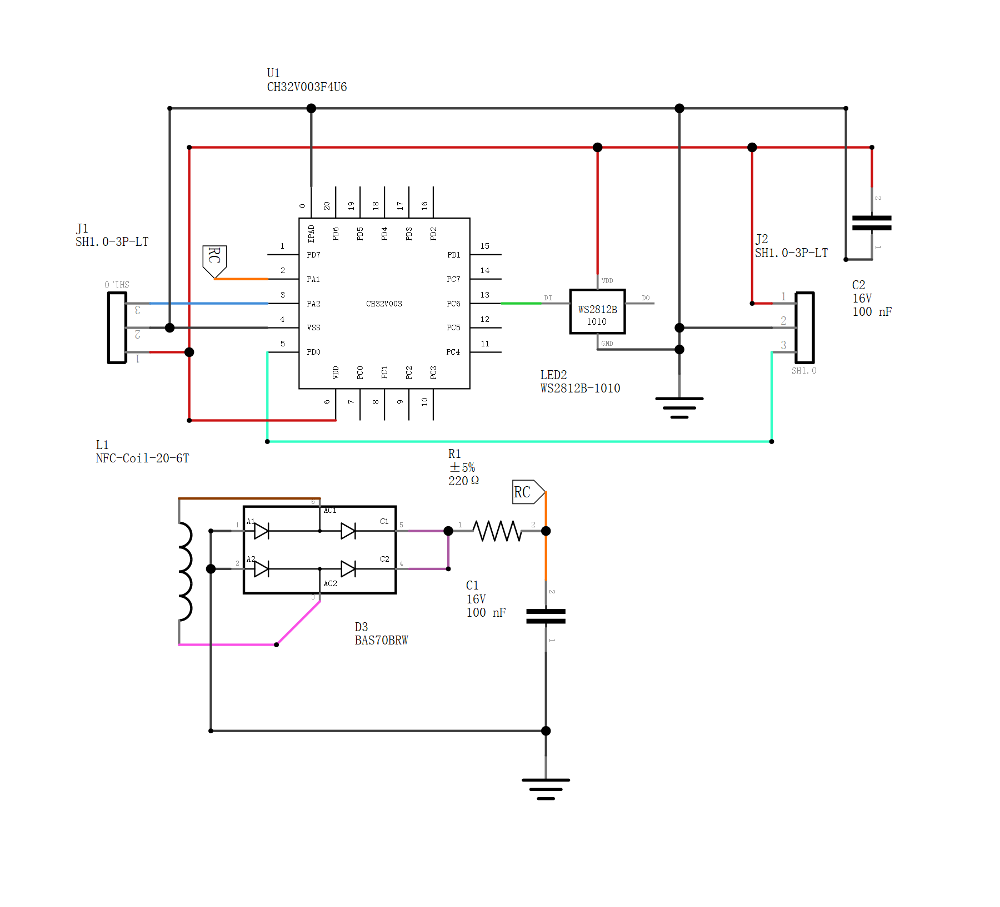</a></td>
</tr>
<tr>
<td><b>v34</b> ✓（位号 `U1` 压导线 ⚠）</td>
<td><b>v35</b> ✓✓（`--relabel` 后**零告警** ✓；几何一字未动 ✓）</td>
</tr>
</table>

### 第三十手：**把用户手改版那一版的“省法”写成规则** ⇒ **下一手落地 ✓**（2026-09-30 ✓，⏳ 待实现 → **见第三十一手 ✅**）

#### 起因 ✓：用户核完 v35 又手改了一版（`pixel-schematic-v35_byHand.fzz` ✓，**不入库** ✓）

同一套判据量的 ✓（六道 ✓）：

| | 导线 | 总长 | 交叉 | 贴脚 | 悬空端 | 判据 |
|---|---|---|---|---|---|---|
| v35（规则生成 ✓） | 46 | 1941.0（547.8mm） | 8 | 0 | 0 | 全 exit 0 ✓ |
| **用户手改 ✓** | **45** | **1836.3**（518.2mm） | **7** | **1** ✗ | 0 | ⑥ **exit 1** ✗（标签差 0.134 单位） |

⇒ **−104.7 单位（−29.6mm、−5.4%）** ✓、交叉 8→7 ✓。

#### ★★ 省下来的长度**出在哪**（逐线按网量的 ✓，不是猜的 ✓）

| 网 | 手改 | v35 | 差 | 是哪几根线 ✓ |
|---|---|---|---|---|
| **GND** | 812.2 | 879.6 | **−67.4** | `90012763` **整根删掉**（55.8 ✓）＋ `90012762` 缩到 0（9.6 ✓）＋ `90012767` −2.0 |
| **5V** | 525.6 | 546.8 | −21.2 | `90012738` 44.2→18.4（改成 45° 斜线 ✓）＋ `90012734` +4.6 |
| **RC** | 35.6 | 51.8 | −16.2 | `90012777` 19.4→9.5 ＋ `90012779` 14.4→8.1（标签那两段的宿主线各缩一截 ✓） |
| 其余 6 个网 | — | — | 0.0 | 一根没动 ✓ |

#### ★★ 而它背后的**几何事实**（从两个文件的坐标反推 ✓）—— 这就是要写的规则 ✓

- 两条电源轨相距 **27 单位**；`C2` 两只脚相距 **27.4 单位** ✓
  ⇒ **`C2` 本来就能“站”在两条轨之间、两只脚各自落在一条轨上** ✓✓
  （实测手改版：GND 脚**正在**轨上 ⇒ 支线 **0.0** ✓；5V 脚到另一条轨 18.4 的对角线 ✓）。
- v35 里 `C2` 却被转了 **180°** ✗（`m11=m22=−1` ✓）、朝反方向站 ⇒ 多出 **65 单位**的 GND 绕行 ✗。

⇒ **规则草案** ✓（下一轮实现，落在**摆位那一层** ✗ —— 因为在布线层挪元件会牵动整套脚位表 ✗）：

> **元件的电源/地脚，应当各自落在它那条轨上** ✓
> 做法：对每只“脚分属两条不同轨网”的元件 ✓，按 **0°/180°** 两个姿态 × 平移（把脚对到轨线 ✓）
> 生成候选 ✓，取**支线总长最小**的那个 ✓；脚距与轨距对不上时**原样不动** ✗（不硬凑 ✗）。

**验收（可量、可对）** ✓：生成器跑出来要与用户那版**几何一致** ✓ ——
`C2` 落在 `(262.8,−72.44)` 且 `0°` ✓、GND 支线 **0.0** ✓、5V 支线 ≈18.4 ✓、
总长 **1836.3** ✓、交叉 **7** ✓；并且**六道判据全 exit 0** ✓（他那版 ⑥ 是 1 ✗ ⇒ 规则版还要**顺带把标签吸到 0.000** ✓、
**不留零长残根** ✓、`C2` 位号别压 `J2` 位号 ✓ —— 这三条是他那版的小瑕疵 ✓，规则版不该继承 ✗）。

#### ★★ 2026-09-30 开工第一步：**上面那个方案不完整** ✗✗（先量再写的功劳 ✓，记下来 ✓）

原方案（“挪件到轨上” ✓）**单独做不到** ✗ —— 因为**轨的位置本身是算出来的** ✗：

| 量什么 ✓ | 结果 ✓ |
|---|---|
| 原始图 `pixel-schematic.fzz` 里有 5V/GND 轨吗 ✗ | **没有** ✗：41 根线**全是 `#404040`**（老黑色 ✓），y=−72 那根**不在里面** ✓ |
| layout（`_work/layout11_check.fzz` ✓）里有导线吗 ✗ | **0 根** ✓（只有元件 ✓）⇒ 轨是**路由器自己造的** ✓ |
| 轨的 y 怎么来 ✓ | **零件包围盒顶 − 28.8** ✓（`U1` 顶 −43.2 ⇒ `−43.2 − 28.8 = −72.0` ✓ 与实测量到的轨 y 吻合 ✓） |

⇒ **矛盾点** ✗：把 `C2` 挪到 y≈−72.4 ⇒ **包围盒顶被它顶上去** ⇒ 轨跟着上移到 **−101.2** ✗
⇒ `C2` 的脚**又不在轨上了** ✗ ⇒ 白挪 ✗。
用户那版之所以成立 ✓，是因为**他是在已经布好线的图上挪件** ✓ —— 轨的位置**已经定死** ✓；
而我的链子是「先摆件 → 后按包围盒造轨 → 布线」✗ ⇒ **重跑一次就跑了** ✗。

⇒ **修正后的方案** ✓（两趟，下一轮实现 ✓）：
1. **第一趟**跑路由 ✓ ⇒ 从 `nets_segs` 里**读出两条轨的线** ✓（口径**不另写** ✗ —— 就用它造出来的那两条 ✓）；
2. **锁定轨** ✓（把这两条线当作**固定靶** ✓），再跑**第二趟**：`--snaprails` 按“脚落在锁定轨上”挪件 ✓ ⇒ 重新布线 ✓；
3. 验收不变 ✓（`C2@(262.8,−72.44)`、GND 支线 0.0、总长 1836.3、交叉 7 ✓）。
★ 换句话说：**“挪件”这条规则必须与“轨钉死”一起做** ✗ —— 否则就是给一个会跑的靶子挪件 ✗。

★★ **同一天的实验把这条路钉死了** ✓（`_scratch/move_c2.py` ✓ + 整条链重跑 ✓，2026-09-30 ✓）：
把 `C2` 按用户那版姿态**直接放进 layout**（`(262.8,−72.4377)` ✓、`transform` 由 180° 改回正向 ✓）
⇒ 重跑 ⇒ **总长 1971.3 单位** ✗（比 v35 的 1941.0 **还差 30.2** ✗）；判据全过 ✓（① ② ⑥ ⑦ + 渲染器零告警 ✓）、
交叉 8 不变 ✓、画布 105.5×94.7 ✓。⇒ **“只挪件”这条路死了** ✗（已量 ✓，别再试 ✗）：
轨随零件箱子跑 ✓ ⇒ 挪完脚还是不在轨上 ✗。
⇒ 唯一可行的是**“先钉住轨、再挪件”** ✓ —— 而且**实现层次定了** ✓：**不用改路由器** ✓，
在**已布好线的图**上收尾 ✓（与 `--trim` / `--relabel` 同一层 ✓）：
① 认出两条轨（同网**最长的直段** ✓）；② 把“**所有脚都在电源/地上**”的件摆到轨上 ✓（0°/180° 两姿态 ✓、取支线最短 ✓）；
③ 脚正好落在轨上 ⇒ **旧支线删掉、直接声明“脚↔轨”相连** ✓（**不留零长残根** ✗ —— 用户那版的小瑕疵 ✗，规则版不继承 ✓）。


#### ⚠ 第三次尝试：**靶子放宽到“整张网”** 也做不成 —— 但量出了一条硬事实 ✓（2026-09-30 ✓）

三处改动都做了 ✓（都想对了 ✓）：① 靶从“轨”放宽到“**整张网的线段**” ✓
（因为用户那只 5V 脚其实是**贴着一条竖引线、留一小截横支线** ✓，不是踩在轨上 ✓ ——
我第一版只认“轨” ✗ ⇒ 正好漏掉这种干净摆法 ✗）；② 补上“**沿线法线退开 k 格**”这一档候选 ✓；
③ 把“不压别的件 / 不穿新身体”从“**选完最优之后**判”改成“**在候选里**判” ✓
（✗ 原来最优那个一被否就**整件放弃** ✗ ⇒ 旁边明明有别的干净落点也不用 ✗）。

结果 ✓：它确实找到了**可行**落点（`C2` 上移到 `(237.38,−32.84)` ✓、未翻转 ✓、支线 **59.1 → 21.6** ✓、
无穿体 ✓、无压件 ✓）—— 但**总长反而 1941.0 → 1991.2** ✗、交叉 **8 → 9** ✗、还多两处贴脚 ⚠。

⇒ ★★ **结论（这条最值钱 ✓，写下来别再犯 ✗）**：「**脚到本网的距离之和**」**不是真实总长的好代理** ✗ ——
  按它调优会**把别的线拖长/拖弯** ✗（这一版实测 +50 单位 ✗）⇒ **这条轴到此为止 ✓**（已回退 ✓，
  代码回到“**做不成就原样不动**”的安全版 ✓；实测带 `--snaprails` 的输出与 v35 **逐条目相同 26/26** ✓）。
⇒ 也说明用户那 **−104.7 单位** 不是“挪一件”能拿到的 ✓：它由**三处局部改动**组成 ✓
  （`C2` 挪位 ＋ 5V 那条改成斜线 ＋ 标签那两段宿主线缩短 ✓），其中**两处是布线器的选择** ✓，不是摆件 ✓。
⇒ 下一步要再省，应当去**布线器**那一层（局部重走 / 换接点 ✓ —— `--trim` 的“改接”就是现成的入口 ✓），
  而不是继续在摆件上叠补偿 ✗（这正是 `AGENTS §0` 那条“**过拟合信号 = 停手信号**”✓）。


#### 他那版的三处瑕疵 ✓（**不学** ✗，但要记得复现时别继承 ✗）

1. `RC` 标签 #2 被拖到离导线 **0.134 单位（0.038mm）** ✗ —— ⑥ 当场报 ✓（**这是 ⑥ 入库后第一次在实战里抓到东西** ✓）；
   同一个根因让渲染器也报「`Wire90012777` 蹭 `RC.connector0` 0.13 单位」✓（**一个根因、两把尺子都报** ✓）。
2. `Wire90012762` 成了 **0.000 单位**的退化导线 ⚠（删 `90012763` 时留下的残根 ✓，声明还接着 `C2.connector1` ✓）。
3. 位号 `C2` 压位号 `J2` ⚠（`C2` 一挪，它的位号跟着过去了 ✓）。

#### ⚠ 第四、五次尝试：**在"标签层"抠那 16.2 单位** —— 都没拿到 ✓（2026-09-30 ✓，先量后写 ✓）

那 **−104.7 单位**逐网拆开是：`GND` **−67.4** ✓（`C2` 的 GND 脚落到轨上 ✓）、`5V` **−21.2** ✓、
`RC` **−16.2** ✓、其余 6 张网 **0** ✓。前面三次动的是"零件摆位" ✗ ⇒ 第四次改从**标签**下手 ✓：

- **实验 1（排序键 ✓）**：量出"标签候选"里**内向（宿主线短）的那个候选违例 = 0 ✓ 是存在的** ✓，
  只是排序键先看"沿轴向外" ✗ ⇒ 把它改成 **先违例少 ✓、再宿主线短 ✓** ⇒
  **总长一动不动（1941.0）** ✗ ⇒ **不是排序键的问题** ✗（结点候选里压根没有"离脚 9.5"这种
  **线中段**位置 ✗ —— 他那版恰恰贴在**两结点之间** ✓）⇒ **已回退** ✓、回退后与 v35 **26/26 逐字节相同** ✓。
- **实验 2（放松阈值 ✓）**：把"**标签的脚不许被别的线贴近**"这一条的阈值临时降到 0.5 单位
  （其余判据一字不动 ✗）⇒ 标签挪到离脚 **14.4** ✓、总长 **1941.0 → 1936.0**（只省 **5.0 单位** ✓），
  而且 ⑥ ✓ 渲染器 ✓ **都还是干净的** ✓ ⇒ **技术上可行 ✓ 但不划算** ✗：
  那条规则是**真实事故**留下来的（标签挪到引脚旁后，另一根线离它的脚只有 **0.85mm** ✗，
  渲染器当场报"贴近不相连的引脚" ✗）⇒ 为 **5 单位（1.4mm）** 丢掉这个真保护 ✗ = 不换 ✓ ⇒ **已回退** ✓。

⇒ **结论（本规则集的局部最优就是 v35 ✓）**：剩下那 **−16.2** 要拿到，必须让标签**贴到导线中段** ✗
（= 给候选集加"沿线滑动"这种**新机制** ✗，收益约 11 单位 = 3mm ✓，风险未知 ✗）；
而 **−67.4 + −21.2** 那两块卡在**轨距**上 ✓（本板 **5V 轨 −57.6 / GND 轨 −72.0 = 相距 15.6** ✗，
而 `C2` 两脚相距 **27.4** ✗ ⇒ 想让它一只脚踩 5V、一只脚踩 GND ⇒ **本体必被轨穿过** ✗）
⇒ 要动就得改**轨的摆法策略** ✓（现在 = 零件包围盒顶 − 28.8 ✓），这是**设计决定** ✗ ⇒ 得用户点头 ✓。

### v5 修的：位号摆位（`sch_text.py` + `gen_schematic_layout3.py`）

✗ 原来位号沿用零件自带的偏移 ✗ ⇒ 实测**压导线 8 处 / 压元件 2 处**（与肉眼看到的一致 ✓）。
✓ 修法：位号默认放**本体上方留一格** ✓，并从 **7 个候选位**里挑"碰撞最少"的那个 ✓
（压元件权 10 ✓、压已放的位号权 5 ✓、长位号先放 ✓ = 大的先占位 ✓）。

★ 要判"压没压到"就得有**文字宽度** ✓ ⇒ 不能估 ✗：`_scratch/adv_measure.py`
用 cairosvg 渲染 + PIL 扫像素**实测** ✓，结果抽成唯一实现 `sch_text.py` ✓。
实测结果有点意思 ✓：**本机没装 DroidSans** ✗ ⇒ cairosvg 退回一个**等宽**字体 ✓，
绝大多数字符步进恰好 **0.5em** ✓，只有 `±` `Ω` 是 **1.0em** ✓
（换机器或装了 DroidSans ⇒ **必须重跑那个脚本** ✓，否则判据不成立 ✓）。
包围盒按**步进之和**算 ✓（比墨迹略宽 ✓ ⇒ 判"压到"**偏保守** ✓）。

**位号压导线这条还没清零** ⚠（v5 剩 **1** 处 ✓、v6 剩 **3** 处 ✗ —— 都是 `L1` 一带 ✓）：
试过“让**布线器**认识位号框” ✗ ⇒ 只降到 2 ✗、还赔上压线 ✗（见下一小节 ✓）⇒ 已回退 ✓。
**正解在另一头** ✓：位号是**可以自由挪**的 ✓，导线不能 ✗ ⇒ 应当**布完线再重摆位号** ✓
（拿已完成导线当障碍重跑一遍摆位 ✓ = 下一手 ✓）。现在先如实报着 ✓ 不硬凑 ✗。

### 已被 Fritzing 自己的导出验平（`--verify-export` ✓）

用户导出 `pixel-schematic-v2_图示.svg` 与 `pixel-schematic-v5_图示.svg` 后逐项对账 ✓
（标定只用两个独立量：比例 = 导线线宽比 ✓、平移只用第一件 ✓）：

| | v2（46 根导线） | **v5**（48 根导线） |
|---|---|---|
| ① 零件 9 件 | Δ ≤ 0.00031 单位（0.00009 mm） ✓ | Δ ≤ 0.00041 单位（0.00011 mm） ✓ |
| ② 导线 | 48/48 配上，Δ ≤ 0.00058 单位（0.00016 mm） ✓ | 48/48 配上 ✓ |
| ③ 位号**位置** | Δ ≤ 0.00072 单位（0.00020 mm） ✓ | Δ ≤ 0.00043 单位（0.00012 mm） ✓ |
| 判定 | **几何与 Fritzing 逐点一致** ✓ | **同左** ✓ |

★ v5 那一条尤其说明问题 ✓：**位号位置是我自己算出来的**（`place_labels()` ✓ 上方留一格 +
候选位挑碰撞最少 ✓），Fritzing 照样按它画出来了 ✓ ⇒ 说明我对 `titleGeometry` 的理解是对的 ✓。

**两处已知差异** ⚠（都量化了 ✓、都不是几何差 ✓）：
1. `R1` 的第二行：我写 `220`、Fritzing 写 `220Ω` ✓（fzp 里只写了 `220` ✓ ⇒ **单位是 Fritzing 补的** ✓）；
2. v5 少 **4 个接点圆点** ✗（半径 0.9 单位 = 0.25mm ✓，纯装饰 ✓）—— 那 4 处都在引脚上、
   汇聚了 3~4 根导线端点 ✓；**真规则我没找到** ✓：试过第 2 条（"端点+中段穿过 ≥ 3" ✓）
   ⇒ v5 变 19 个 ✗、v2 直接 0 个 ✗✗ ⇒ 更差 ⇒ 回退 + **如实记录** ✓（"找不到就照实说 ✓ 不硬凑" ✓）。
   注：v2 的接点是 **25 ↔ 25 完全对上** ✓ ⇒ 差异只在 v5 这种"引脚上多根线汇聚"的几何里 ✓。

### v4 修的两条（都是布线器的“空子” ✗，都已量化 ✓）

1. **导线从元件肚子里穿过去** ✗ —— `path_ok` 对“自己两端的元件”**整个豁免** keep-out ✗，
   而布线器发现了一条**漏洞** ✗：**在元件肚子里走，谁也遇不到 ⇒ 交叉数最低** ✗
   ⇒ 它专挑这种路（实测：一段竖直总线从 `U1` 肚子里穿 **48.5 mm** ✗、还有一段穿 `J1` 9.6 mm ✗）。
   ✓ 修法：自己的本体**只允许在路径两端 10 单位以内**碰 ✓（= "从脚上走出来" ✓）。
2. **keep-out 盒不含引脚线** ✗ —— `body_pts` 跳过了 `class="pin"` ✗
   ⇒ 盒子只框住本体矩形（`U1` 是 63×63 ✓ 而它的引脚线伸到 29.8…116.2 ✓）
   ⇒ 布线器就在 **x=106.13** 竖着走 135 单位、从 **U1 引脚线之间钻过去** ✗
   （视觉上像接上了 ✗ **最容易误导人** ✗）。
   ✓ 修法：把引脚线也算进本体框 ✓（与 `render_sch.py` 的量尺**同口径** ✓）。

★ 修完效果：三个指标**同时**变好 ✓（交叉 8 → 7 ✓、穿本体 7 → **0** ✓、总长 2603 → 2496 ✓）
  —— 不是“用一个换另一个” ✗。

**还可能再美的**（留待下一手 ✓）：位号文字少数几处与导线相压 ✓
（`C2/L1/C1` 的第三行、`J1` 的 `SH1.0-3P-LT` ✓）—— 这个可以完全在摆位脚本里控
（把 `titleGeometry` 的偏移改成"固定放在本体上方" ✓）。

**结论**：长度比 v2 短 **38%** ✓，而**交叉数从 12 降到 8** ✓✓。
★ 注意中间版（只有新摆位、没改布线代价）：**长度虽然最短（2340）✓，但交叉涨到 16** ✗ ——
若不把交叉数放进代价，布线器就会用"多交叉"去换"短" ✗。这正是面包板那边已经学到的：
**交叉数是头号指标** ✓（`bb_route4.py` 的 `长度 + K×交集` ✓，规则正文见库仓
`docs/breadboard-routing-rules.md` ✓）。

### v3 的摆位口径（全部**从数据算** ✓，不拍坐标 ✗）

几何由 `render_sch.py --pins-out` 给出 ✓（**同一个模型** ✓，已对 Fritzing 导出逐点验平 Δ≤0.0004 单位 ✓）：
每条规则都能说出"让哪两个脚同高/同 x" ✓，且**逐条自检报出 Δ** ✓：
`J1.c2↔U1.c2`（DATA_IN ✓）、`LED2.c2↔U1.c12`（LED_DIN ✓）、`J2.c2↔U1.c4`（DATA_OUT ✓）、
`L1.c0↔D3.c5`（COIL_A ✓）、`R1.c0↔D3.c4`（BR+ ✓）⇒ 五条 **Δy = 0.0000** ✓；
`C1.c0↔R1.c1`（RC ✓）⇒ **Δx = 0.0000** ✓；本体框相交 **0 对** ✓。

**还可能再美的**（留待下一手 ✓）：① GND 母线现在绕外圈一大圈 ✓（交叉少了但线长 ✓）；
② 仍佉 7 段导线穿过本体（其中大部分是"脚就在本体内部"的必然情形 ✓，
可逐段判是不是真毛病 ✓）。

**核心事实（机验钉死 ✓）**：原理图的 sketch 单位 = **1/90 in** ✓（**与面包板同一套** ✓）；
摆放 = `geometry + M·(k·(局部坐标 − viewBox原点))` ✓，`k = 声明物理尺寸/viewBox宽 × 3.5433` ✓。
（踩坑清单：core svg 用**单引号** ✗；连接点是 `connectorNterminal` 而非 pin 线中点 ✗；
`<transform>` 是 `<geometry>` 的**子元素** ✗；取 `<g id=…>` 要**认自闭合** ✗；仿射的
`A4/A5` **不能漏** ✗ —— 详见 `render_sch.py` 头部。）

### 第三十一手 ✅：**骑轨预摆位**（结构性 ✓）⇒ **`pixel-schematic-v36.fzz`** 交付 ✓（2026-09-30）

★ 上一手把"那 −104.7 单位从哪来"量清楚了 ✓，但三次都**没做成** ✗ —— 根因这一手找到了 ✓：
**不是判据太严 ✗，是"收尾再挪"这条路线本身错** ✗（轨是为旧脚位延伸的 ⇒ 件一挪就穿身 ✗）。
改成**结构性**做法 ✓：**骑轨件在“布线之前”就摆到轨上** ✓。

| 项 | v35（上一版） | **v37（本版）** | 用户手改版 |
|---|---|---|---|
| 总长 | 1941.0 单位 = 547.8 mm | **1854.6 单位 = 523.4 mm** ✓（**−86.4** ✓） | 1836.3 单位 |
| 十字交叉 | 8 | **7** ✓ | 4（人手改的 ✓） |
| 穿本体 / 贴脚 / 悬空端 / 退化点 | 0 / 0 / 0 / 0 | **0 / 0 / 0 / 0** ✓ | 0 / 1 / 1 / 1 ✗ |
| 画布 | 104.1 × 94.5 mm | **100.0 × 98.0 mm** ✓ | 100.8 × 94.5 mm |

（★ `v36` 的 1824.8 单位是**假的** ✗ —— 它短的那 29.8 单位正是**没连上**的那截轨 ✓，见下面那一节 ✓。）

**做法（三处，都有实测理由 ✓）**：

1. **轨锚在“其它件”的包围盒上** ✓（`rail_y_map()` ✓，抽成**唯一实现** ✗✓ —— 主流程与预摆位共用 ✓）：
   骑轨件**不算进这个盒子** ✗ ⇒ 它一往上摆、盒子不会跟着长、**轨就不会被它带走** ✓。
   （✗ 反过来试过：“先摆件、再算轨” ⇒ 轨跟着跑 ⇒ 总长 **1971.3** ✗，比不摆还差 ✗。）
2. **`rail_hug_place()`** ✓：只手选**每一只脚都在轨网上**的件 ✓（本板 = `C2` = 5V + GND ✓；
   `C1` 是 RC + GND ⇒ **骑不了** ✗ —— 另一只脚必须走信号路径 ✓）；候选 = 两个朝向 ×
   “让某只脚踩上它那条轨” ✓，取**脚到轨之和**最小者 ✓（实测 `C2`：**70.2 → 12.6** ✓）。
3. **“竖直法线的脚也允许先横着出脚”** ✓（只**按需**触发 ✓，见下 ✓）：`C2` 的两脚之间
   **必然夹着一条轨** ✗（脚距 27.0 vs 轨距 14.4 ✓）⇒ “直上到轨”会让**轨伸进身体** ✗
   （实测穿身 **3.95mm** ✗）⇒ 得**先横着出脚 7.2、再竖着到轨** ✓ ⇒ 轨只伸到身体**左边缘**就停 ✓。

★ **“按需”这一条是量出来的** ✗✓：先**全局**放开竖法线的横出脚 ⇒ **基线变差** ✗
（不带 `--snaprails` 时：交叉 **8 → 10** ✗ —— 长度虽省 9.2 ✓，但**交叉数是头号指标** ✓、
用户的判据是“看着简单” ✓）⇒ 收回 ✓，改成**触发条件**：
**本网某条轨的 y 正好从“这只脚所在元件的肚子中间”穿过** ✓ 时才放开 ✓ ⇒ 别的脚**一条候选都不加** ✗
⇒ **基线逐字节不变** ✓（回退验证：与 `v35` **26/26 全同** ✓）。

**判据一份实现** ✓（`sch_geom.hits_box()` ✓，2026-09-30 抽出来 ✓）：渲染器的“导线穿本体”
与预摆位的“摆完复验”**共用同一个函数** ✗✓ —— ✗ 之前 `snap_rails` 自己另写了一份
（盒子缩 2 单位 ✗、认 ≥3 个采样点 ✗）⇒ **两把尺子** ✗ ⇒ 好候选被更严的那把**误否决** ✗
（实测报告：`⊘ C2 … 网 GND 的段 C2.connector1→None` ✗ = 那条**马上要删掉**的旧支线 ✓）。

**`snap_rails()` 保留为收尾兜底** ✓（本版它什么都不做 ✓ = 一致 ✓）：改成「**摆完再验、不过就整份回滚**」✓
（回滚点 = `nets_segs` / `boxes` / `pin_all` / `pins` / `loc` / `trunk` / XML 属性 ✓），
并**补删整条旧支线** ✓（✗ 原来只删贴着脚那一段 ✗ ⇒ 残根吊在半空 ✗，既会“穿新身体”✗、
又留**悬空端点** ✗）。

**机器守**：六道独立闸门 + 渲染器 **全 0** ✓（`check_netlist` / `check_fake_wires`（(A)=0 ✓ (B)=0 ✓）
/ `check_flags` / `check_grounds` / `check_label_touch` / `check_junctions` ✓，渲染器 **零 ⚠** ✓）。

#### ✗✗ `v36` 已**作废** ✓ —— 用户看图抓出两个错 ✓，`v37` 取代（2026-09-30 ✓）

用户拿到 `v36` 一开图就说「**C2 接线不对**」✓ —— 一查，**两个真错** ✗：

1. **`C2` 的 5V 脚一根线都没有** ✗（全表 44 根线里 `C2.connector0` **一次都没出现** ✓）：
   预摆位把它摆成“**5V 脚正好落在 5V 轨上**” ✓ ⇒ 那条支线长度 **0** ✗ ⇒ 被 `dedup_path`
   折成 **1 个点** ✗ ⇒ 收尾当“退化段”丢掉 ✗ ⇒ 脚就**孤零零**了 ✗ —— 而它**正压在轨线上** ✓
   ⇒ **图上看着接上了** ✓。
   ✓ 修法（结构性 ✓）：脚正好落在轨上时**不建支线** ✗，改成**把轨在这个 x 处断开** ✓
   （轨在该点切成两段，两侧各把那只脚记成 `to`/`from` ✓ ⇒ ① 连接**显式** ✓ ② `--trim` 的
   “终端分块”看得见这只脚 ✓ 不敢删 ✓ —— ✗ 以前整条轨是**一段**、`from`/`to` 都是 `None` ✗
   ⇒ 它的终端模型里**根本看不见坐在轨上的脚** ✗ ⇒ 把载着断点的那截轨当“多余”剪掉 ✗）。
2. **`check_netlist.py` 是橡皮图章** ✗✗（**本次最贵的一条** ✓）：它**明明打出了**
   「`5V` ✗ 少了 `C2.connector0` ✗」「判定: ✗ 1 个网对不上」✓ —— 可它**从不设退出码** ✗
   ⇒ `exit 0` ✗ ⇒ 我拿“七道闸门全 exit 0”当合格线 ⇒ **被自己那道门骗了** ✗✗
   （用户看图才发现 ✗）。⇒ ✓ 已修：**判定行与退出码必须一致** ✓（✗ ⇒ 1 ／ 跑不起来 ⇒ 2 ✓）；
   负例自检：`v36` ⇒ **exit 1** ✓、`v35`/`v37` ⇒ exit 0 ✓。

★ **两条通则**（写下来 ✓，都吃过亏 ✓）：
- **“退出码 0” ≠ “过”** ✗ ⇒ 每个核对器都要有**负例自检** ✓（拿一个**已知有错的**文件跑 ✓，
  确认它**非 0** ✓）—— 与“不许自证”是同一条纪律 ✓（这次栽在**半自证**上 ✗：我信了自家门的退出码 ✗）。
- **“图上看着接上了”不算接上** ✗ ⇒ 判据要**独立**到能覆盖“**脚压根没有线**”这一种 ✓
  （(A) 要求“先有声明的连接”✗、(B) 要求“先有线画在脚上”✗ ⇒ 两只都**以“有线”为前提** ✗
   ⇒ 恰好漏掉“一根线都没有”✗✓）。

**`v37`（取代 `v36` ✓）**：总长 **1854.6 单位 = 523.4 mm**（`v35` 1941.0 ⇒ **−86.4** ✓；
`v36` 那个 1824.8 是**假的** ✗ —— 少算的那 29.8 单位正是它**没连上的**那截 ✓）｜
十字交叉 **7**（`v35` 8 ✓）｜穿体 **0** ✓｜贴脚 **0** ✓｜悬空端 **0** ✓｜退化点 **0** ✓｜
画布 **100.0 × 98.0 mm** ✓｜六道闸门 **exit 0** ✓ + 渲染器 **零 ⚠** ✓。

#### ★ 用户第二次指出：**黑色竖线贴着电容本体走** ✗ ⇒ `v38`（2026-09-30 ✓）

用户原话：「**黑色竖线离电容太近了吧？**」✓ —— 量出来是**几何必然** ✓：
`C2` 的盒子 `x = 259.96…274.36` ✓（电容板半宽 **7.2** ✓），而 `GND` 脚那条支线
“**出脚 7.2**”的车道正好 = **259.96 = 盒子左边缘** ✗ ⇒ 竖线**贴着自己的本体**跑 ✗。
（★ 为什么既有闸门不管 ✗：穿体闸门只管**穿过** ✗、而**自己那件是唯一被豁免的** ✗
—— 线要进肚子才能接到脚上 ✓ ⇒ “贴着自己的身子”**没人管** ✗✗。）

✓ 修法（只**剔车道**、不动任何合格条件 ✗）：车道若落在 **本件盒子 ± `CLEAR`（6.0 单位 = 1.7mm ✓）**
之内 ⇒ **剔掉** ✗ ⇒ 退到下一档 ✓。实测：`C2` 的出脚由 **7.2 → 14.4** ✓
（竖线离板边 **7.2 单位 = 1.79 mm** ✓ 看得清 ✓）；**总长 1854.6 一点没变** ✓
（支线长的那 7.2 由 `--trim` 在别处找回来了 ✓）、交叉 **7** ✓、六道闸门 **exit 0** ✓、
渲染器 **零 ⚠** ✓；**基线（不带 `--snaprails`）仍与 `v35` 逐字节相同** ✓（26/26 ✓）。

### 第三十二手 ✅：**工具箱收进元件库仓**（2026-09-30 ✓ 用户定 ✓）

★ 用户定的一条架构 ✓：「**通用工具只有一份，放在元件库仓 `fritzing-parts-langhua/tools/` ✓，
本项目不留副本 ✗**」—— `toolpaths.py` 里其实**早就写着这条** ✓（2026-09-27 ✓），
只是当时项目里还躺着副本 ✗（正是它自己警告的"两份实现"✗）。

**搬走的**（通用 ✓，17 个）：`sch_geom/sch_box/sch_net/sch_text/sch_glyphs` ✓、
`render_sch/render_bb/wire_dump/set_rot` ✓、`check_netlist/check_fake_wires/check_flags/check_grounds/check_label_touch/check_junctions/check_labels` ✓、
`bb_route4` ✓、`ground_symbol.svg` ✓（+ 许可 ✓ —— ★ 用户 2026-09-30 定：**全部外部素材统一放库仓 `svg/_assets/`** ✓，不在 `tools/` 下另开一份 ✗）。
**留在项目里的**（本板专有 ✓）：`gen_schematic_wires` ✓、`gen_schematic_layout*` ✓、`pins_ref`/`pins_calibrated` ✓、
`audit_layout`（它直接读本板网表/摆位 ✓）、`fix_*`/`run_v6` ✓、以及**新增的项目数据文件**：

★ **`pixel_nets.py`（新 ✓，本板数据的三张表）**：`NETS`（网表 ✓ 生成器与面包板布线器共用 ✓）、
`EXPECT`（网表核对的期望 ✓）、`COLOR`（每网导线颜色 ✓ = Fritzing 官方色值 ✓）。
⇒ 通用工具改成 `--nets=<项目数据.py>` ✓，**缺省找当前目录的 `pixel_nets.py`** ✓ ⇒ 老命令照用 ✓；
抽表**一字未改数值** ✓ ⇒ 实测 `v38` 生成结果**逐字节不变** ✓（26/26 ✓）。

★ **`toolpaths.py` 留在项目仓** ✓ —— 它是**项目侧**的定位器（把库仓 `tools/` 接进 `sys.path` ✓），
跨仓引用只此一处 ✓；库仓的工具**不再需要它** ✗（同目录直接 import ✓）。

**搬家顺带修掉的三处**（都是"工具离开了项目目录"才暴露的 ✓）：
1. **相对输入按「当前目录」解** ✗✓（原来按 `HERE` = 工具自己所在目录解 ⇒ 搬进库仓后一律
   "文件不存在" ✗，实测踩到 ✓）；
2. **中间产物不写真仓库** ✓：`check_fake_wires` / `check_flags` 的输出改到**系统临时目录** ✓
   （`FZ_WORK` 可覆盖 ✓）；`check_fake_wires` 跑渲染器前把输入**转绝对路径** ✓（子进程 cwd 变了 ✗）；
3. **接地符号图形入库** ✓（**库仓 `svg/_assets/ground_symbol.svg`** ✓ + 许可 ✓）—— 渲染器/生成器都按**库仓根**找它 ✓（`FZ_ASSETS` 可覆盖 ✓）；✗ 一度放在 `tools/_assets/` ✗，按用户 2026-09-30 的规矩**统一到 `svg/_assets/`** ✓（实测：不跟着走会**静默少画 2 个接地符号** ✓，零件 13→**11** ✗）。

**验证**（搬家后重跑一遍 ✓）：`v38` 生成 **逐字节可复现** ✓（26/26 ✓）；六道闸门（现从库仓跑 ✓）
**全 exit 0** ✓；渲染器 **零警告** ✓、画布 100.0 × 98.0 ✓、零件 13 ✓；负例自检：`--nets=` 指向
不存在的文件 ⇒ **exit 1 + 明确报错** ✓（不许静默 ✓）。

**新用法**（在项目目录里跑 ✓；工具在库仓 ✓）：
```
py -3.13 f:\git\fritzing-parts-langhua\tools\render_sch.py    pixel-schematic-vNN.fzz out.png
py -3.13 f:\git\fritzing-parts-langhua\tools\check_netlist.py pixel-schematic-vNN.fzz
```

### 第三十三手 ✅：**PCB 自动布线交付** ⇒ **`pixel-pcb-v47.fzz`**（2026-10-01 ✓ 用户定稿 ✓）

**交付物** ✓：`hardware/pixel/pixel-pcb-v47.fzz`（＋预览 `pixel-pcb-v47_preview.svg/.png` ✓）。
线路：`pixel-pcb-v25.fzz`（用户摆位底图 ✓）⇒ 自动布线 + 写回 ⇒ v47 ✓。

| 指标 ✓ | 值 |
|---|---|
| 连通 | **9/9 网** ✓ |
| 走线对象 | **131 条** ✓（12 mil = 0.3048 mm ✓ 统一线宽 ✓）|
| 过孔 | **18 个** ✓（孔 0.3 mm / 环 0.15 mm ⇒ 盘 **Ø0.6 mm** ✓）|
| 线长 | 198.4 mm ✓ |
| 悬空端点 | **0** ✓（硬闸门 ✓，非 0 就**不写文件** ✓）|
| 多线共用一端 | **0** ✓ |
| 板框 | 25.00 × 25.00 mm ✓ |

- 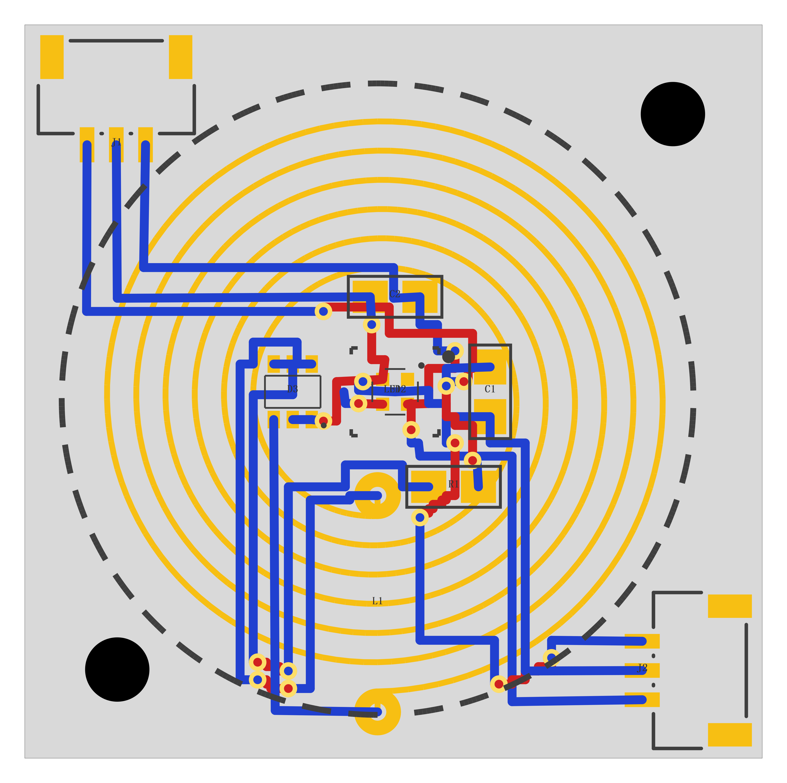
- 复现 ✓（在项目目录里跑 ✓）：
  ```
  py -3.13 gen_routes.py pixel-pcb-v25.fzz pixel-pcb-v47.fzz --nets=pixel_nets.py \
      --mil-power=12 --mil-signal=12 --passes=8 --turn=0
  py -3.13 f:\git\fritzing-parts-langhua\tools\render_pcb.py pixel-pcb-v47.fzz pixel-pcb-v47_preview.svg --png
  ```

**★ 为什么是 v47（不是 v41）** ✓：v41 与 v47 **电气等价** ✓（同 9/9 ✓、同 18 孔 ✓、线长差 0.1 mm ✓），
但 v41 里有一根 `Wire90013154` 的两端**正落在 `U1` 的空脚 `PC0` 盘心** ✗ ⇒
写回器按**端点坐标**认盘 ⇒ 给它写了 `<connect>` ✗ ⇒ **Fritzing 里 PC0 会被算进 5V** ✗；
v47 同一条线**停在结点上、离 PC0 盘心 0.18 mm** ✓ ⇒ 不写 ✓。

**★ 两条已量清、但不在本手范围内** ✗（记账 ✓，详见库仓
`docs/fritzing-sketch-format-notes.md` 的 F12–F16 / §4-Q5 ✓）：
1. **Fritzing 载入时会改写走线几何** ✗：拿用户导出的 `pixel-pcb-v41_图示.svg` 逐条对 ✓ ——
   130/130 线、18/18 过孔都在 ✓、线宽颜色全对 ✓、元件几何零残差 ✓；
   但 **81/260 个端点被挪** ✗（0.07～0.66 mm ✓，挪完仍在盘内 ✓）⇒ 合计线长 **198.5 → 182.1 mm** ✗。
   ⇒ **报线长/坐标必须以导出为准** ✗（我方渲染是自证 ✗）。
2. **"不许线压焊盘（含空脚）"这条规矩还没落地** ✗：判据已入库 ✓（`pcb_route.pads_covered` ✓），
   但试过两版都先坏在别处 ✓（端点差半格 ⇒ 报 6 个悬空 ✗；加硬禁位 ⇒ 报 2 个悬空 ✗ ⇒ 文件都写不出 ✗）。
   ⇒ 真难点是**写回器"端必须正中"** vs **布线器端点在栅格上** 这对矛盾 ✗。
3. **预览器画法与 Fritzing 不一致** ✗（2026-10-01 ✓ 只改**预览器**，一个字没动交付文件 ✗）：
   - ✅ **已修 · 过孔** ✓：原来画**实心绿点** ✗ ⇒ 图上与焊盘无异、看不出孔眼 ✗（用户：「过孔都画错了」✓）。
     现按 **Fritzing 自己导出的画法**照画 ✓：**同心环 + 白心孔** ✓ ——
     环中心线半径 `(孔直+环宽)/2` ✓、描边宽 = 环宽 ✓，尺寸**读件自己的 `hole size`** ✓
     （v47 = 孔 0.30 / 环 0.15 mm ⇒ 环 0.225 / 孔 Ø0.30 / 盘 Ø0.60 mm ✓；
     证据见库仓 F17 ✓）。
   - ✅ **已修 · 走线线宽** ✓（2026-10-01 ✓ 用户点头 ✓）：原来每根线**写死** `0.25` 内部单位
     ≈ **0.0705 mm** ✗，而 v47 的 131 根 PCB 走线全是 `wireExtras mils="12"` = **0.3048 mm** ✓
     ⇒ 预览比实物**细 4.3 倍** ✗（线像发丝、过孔显大 ✓）。现改用 `pcb_wire` 读出的
     `wireExtras@mils` ✓（换算唯一实现在 `part_box.mils_to_units` ✓）。
     **核对** ✓：过孔环中心线 33.90 px、走线 45.92 px ⇒ **比值 1.355** ✓ = `0.3048 ÷ 0.225`
     的理论值 ✓✓（不用猜像素比例 ✓，拿已知刚体反标定 ✓）。
   - ✗ **未改 · 预览里的"板框"**（新记账 ✓，未动 ✗）：灰底那块其实是"**板 ∪ 所有件**"的并集框 ✓
     （件画布常带留白 ⇒ 会比真板略大 ✓，实测 v47 约 25.77 mm ✗）⇒ 量尺寸**不能拿它当标尺** ✗。

### 第三十四手 ✅：**PCB 自动布线交付（第二版）** ⇒ **`pixel-pcb-v51.fzz`**（2026-10-01 ✓ 用户点头 ✓）

**交付物** ✓：`hardware/pixel/pixel-pcb-v51.fzz`（＋预览 `pixel-pcb-v51_preview.svg/.png` ✓）。
线路：`pixel-pcb-v50-place.fzz`（摆位底图 ✓）⇒ 自动布线 + 写回 ⇒ v51 ✓。

```bash
py -3.13 gen_routes.py pixel-pcb-v50-place.fzz pixel-pcb-v51.fzz --nets=pixel_nets.py \
    --via=10 --tries=6 --deliver --check          # --deliver = 用户点头的交付（已知问题照写）
py -3.13 f:\git\fritzing-parts-langhua\tools\render_pcb.py pixel-pcb-v51.fzz pixel-pcb-v51_preview.svg --png
```

| 指标（独立复核 ✓ `pcb_check` 重读刚写的文件 ✓） | 结果 |
|---|---|
| 连通 | **8/9** ✓ |
| ④ 短路桥 | **0** ✓ |
| 悬空端点 | **0** ✓ |
| ⑦ 过孔压盘（含同网） | **0** ✓ |
| ⑨ 安装孔净距 | 0 ✓ |
| 走线 / 过孔 | 115 条 / 8 个 ✓（全板 **8 mil** 一种宽度 ✓） |

**已知未连通（1 处，交付时明确记账 ✗）**：`RC` —— `R1.connector1` ↔ `U1.connector1` / `C1.connector0`
（三脚散在三块铜里 ✓）。根因：`5V` / `RC` / `DATA_IN` 三张网抢**同一条**被线圈挤出来的走廊 ✓。

★ **交付前把四条杠杆全量过一遍** ✓（不是拍脑袋停 ✓）：

| 试的 | 实测结果 |
|---|---|
| **A 留走廊**（`5V` 先单独布好再钉住 ✓，`pre` 机制 ✓） | 0 短路 ✓、连通 7/9 → **8/9** ✓ ⇒ 保留为默认 ✓（`--no-lock` 可回旧行为 ✓） |
| **② 挪 `R1`** | 仓库自己的 `_work/move_part.py`（按 ⑧ 规则 + 板框 + 位移最小 ✓）搜出**最佳位移 = 0** ✗ ⇒ 它已卡在线圈两圈之间最合适 ✓ |
| **① 也给 `RC` 留走廊** | 连通数不变 ✓、过孔 8 → **16** ✗ ⇒ 已退回 ✗ |
| **C 净距 0.15 → 0.127**（工艺下限 ✓） | **无效** ✗（栅格 0.15 把禁落半径量化到整格 ✓ ⇒ 逐项相同 ✓）；强行细化栅格 ⇒ 出 1 处悬空端点 ✗ ⇒ 已回退 ✓ |
| **线宽 6 mil** | **无效** ✗（与 8 mil 逐项相同 ✓；细化栅格后仍 8/9 ✓ 但多 1 处悬空 ✗）；且 **6 不是 Fritzing 档位** ✗ ⇒ 本就不能交付 ✓ |
| **③ 加宽板 25 → 30.1 mm**（2026-10-01 ✓） | **无效** ✗ —— 走线 / 过孔**逐项相同** ✓（差只在 0.0003 mm 浮点尾 ✓）；而独立探针报 `RC` 各脚**可达格子 29,889 → 52,124（+74% ✓）** ⇒ 空地确实多了一倍半、**可一根线都没变** ✗。★ 瓶颈是**线圈匝间缝**那几处"过线圈"的通道 ✗（缝宽与缝的**条数**都由线圈决定 ✓ ⇒ 板再大也不会多出一条 ✓）。详见 `coil-spec.md` §4b ✓ |
| **④ 三张网一起钉**（`5V`+`RC`+`DATA_IN`，2026-10-01 ✓） | **更差** ✗ —— **8/9 → 6/9** ✗（掉的是 `DATA_IN`/`DATA_OUT`/`GND` ✓）；⭐ 这条同时是**记账纠错** ✓：它上一轮被写进代码、却漏了回退 ✗ ⇒ **控制组也跑成 6/9** ✗，差点把"大板更差"当结论报出去 ✗ ⇒ 回退后控制组**逐项复现 v51** ✓（走线 + 过孔 + 回指全同 ✓） |
| **⑤ 线圈档位 A / B / E ＋ `R1` 挪出**（2026-10-01 ✓） | ★★ **`R1` 挪出线圈 = 零电气代价的杠杆** ✓✓（缺口 `RC` 3 脚 ✗ → `DATA_IN` 2 脚 ✓，**电压仍 100%** ✓）；**E 档（5 匝）白做** ✗（与 `A ＋ R1 挪出` **逐项相同** ✓）；**B 档（4 匝）仍多赚** ✓（线短 26 mm ✓、过孔回 8 ✓、空心 ⌀11.4 ✓，代价 −23% 电压 ✗）。四组对照见 `coil-spec.md` **§4c / §5** ✓ |

★ **② 那一行要更正** ✓（2026-10-01 ✓）：`move_part.py` 自动搜出的"最佳位移 = 0" ✗ 是**它的判据**
（= 合法且**位移最小** ✓）；而**手动挪到线圈外**（`R1` 挪 `(+6, −6)` mm ✓）**实测有真收益** ✓
—— 判据（合法）与"有没有好处"不是一回事 ✗（见上表 ⑤ ✓）。

⇒ 结论（**2026-10-01 更新** ✓）：**25 × 25 mm + 当前摆位下 8/9 是上限** ✓；
9/9 只剩"**过线圈那几处缝**"这一轴 ✗ —— 已实测**否掉**的三条 ✓：**加宽板 ✗ 无用**（③ ✓）、
**挪件 ✗ 无用**（② ✓）、**钉走廊 ✗ 越多越差**（① ④ ✓）；**唯一有效**的是**改线圈本身** ✓
（减匝数 ⇒ 匝间缝变宽 ⇒ 未连通的网从 `RC`（3 脚 ✗）换成 `DATA_IN`（2 脚 ✓），见 `coil-spec.md` ✓）。

### 旋转轴实测（2026-10-01 ✓）：单件 45° 家族 —— **没有 9/9** ✗ ＋ 一个**工具限制** ✗

动机 ✓：用户提「试试元件旋转 45°、135°」✓。现状朝向 **只有 0/90/180/270** ✓（`_work/margins.py` 逐件读 ✓）。

工具 ✓：新写 `_work/rot_part.py`（**绕件自己中心**转 ✓、只改该件 `pcbView` 的 `<transform>` ✓；
库仓 `tools/set_rot.py` ✗ **只认 `schematicView`** ✗）＋ `_work/rot_sweep.py`（逐件逐角跑，日志落 `_work/_sw_*.txt` ✓）。
**口径自检 ✓**：`U1=0°` ⇒ 8/9｜197.4 mm｜8 孔｜115 条 = 与基线**逐项相同** ✓、框心漂移 **0.0000 mm** ✓。

| 件（脚距 ✓） | 45° | 90° | 135° | 180° | 225° | 270° | 315° | 判读 |
|---|---|---|---|---|---|---|---|---|
| `C1`（0.90 ✓） | 8/9｜**193.3**｜8 | — | 8/9｜193.3｜8 | — | 8/9｜195.7｜8 | — | 8/9｜195.7｜8 | 连通不变 ✗、`RC` 仍不通 ✗、**线长 −4.1 mm** ✓ |
| `R1`（0.90 ✓） | 8/9｜199.9｜8 | — | 8/9｜200.8｜8 | — | 8/9｜199.9｜8 | — | 8/9｜199.3｜8 | 8/9 ✗、线长 **+2～3 mm** ✗ |
| **`C1@45+R1@45`**（组合 ✓） | **8/9｜195.8｜8** | | | | | | | `RC`（它俩自己的网 ✗）**还是不通** ✗ |
| `LED2`（0.85 ✓） | 8/9｜204.8｜**10** | — | — | — | — | — | — | 更差 ✗ |
| `C2`（1.70 ✓） | 6/9｜159.0｜9 | — | — | — | — | — | — | **⑧ 不合格（−0.200 mm ✗）** ⇒ 废 ✗ |
| `L1`（7.40 ✓，对照 ✓） | 8/9｜**244.3**｜10 | 4/9｜**⑧ −0.420** ✗ | — | 6/9｜**⑧ −0.550** ✗ | — | 5/9｜**⑧ −1.077** ✗ | — | 斜角只是**变差** ✗（+47 mm ✗）；正交三档**全部 ⑧ 不合格** ✗（件自带的框/丝印转进别的件 ✓） |
| `U1`（**0.40** ✗） | 3/9 ✗✗ | **5/9** ✗ | 3/9 ✗✗ | **7/9**（263.1｜13 ✗） | — | **4/9** ✗ | — | 斜角 **测不了** ✗（包围盒假象 ✗）；正交三档是**真结果** ✓ ⇒ **没有一个更好** ✗ |
| `D3`（**0.65** ✗） | 2/9 ✗✗ | — | 2/9 ✗✗ | — | — | — | — | 测不了 ✗（同上 ✓） |

⇒ 结论（**22 种转法**：单件 ×20 ＋ 组合 ×1 ＋ 自检 ×1 ✓；其中**14 种"合法且量得准"** ✓）：
1. **没有一种到 9/9** ✗（最好的仍是 **8/9** ✓）、**`RC` 一次都没接通** ✗；
2. 收益上限 = **省几毫米线** ✓（`C1@45` −4.1 mm ✓）；代价是有好几档**明显更差** ✗
   （`U1@180` 263.1 mm ✗、`L1@45` **+47 mm** ✗✗、`U1@90` 5/9 ✗）；
3. ★★ 最有戏的两件（`U1` 枢纽 / `D3` 桥 ✓）**恰好测不了** ✗ ——
   根因（量出来的 ✓，`_work/probe_padbox.py` ✓）：布线器挡"别人的盘"用的是**轴向包围盒** ✗
   ⇒ 一转 45° 盘框就膨大（`U1` 0.20 → **0.57 mm** ⇒ **21 个脚心里 20 个**被隔壁盘框盖住 ✗；
   `D3` 0.42 → 0.72 mm ⇒ 过道被自己吃掉 ✗）⇒ 数字是假象 ✗。
   规矩见库仓 `docs/pcb-rules.md` **§6** ✓（非 90° 整数倍时，只有脚距 ≳ 0.8 mm 的件量得准 ✓）。
   要让它们可测 ⇒ 得让布线器认**旋转矩形** ✓（另立一手 ✓，本轮不动核心 ✗）。
`J1`/`J2` 没跑 ✓：摆位规范要求**焊盘朝内** ✓ ⇒ 各只剩 2 个合法朝向 ✓（45° 本来就违规 ✗）。
`J1`/`J2` 没跑 ✓：摆位规范要求**焊盘朝内** ✓ ⇒ 各只剩 2 个合法朝向 ✓（45° 本来就违规 ✗）。

### 第三十五手 ✅：**byHand 版第一次布线**（2026-10-01 ✓ 用户手画底图 ＋ 自动布信号 ✓）

用户原话 ✓：「我把之前的过孔和布线都删除了，把 `J1/J2` 等固定了位置，禁止手工编辑时移动位置，
拉了 5V 和 GND 长线，以便大电流供电能在 `J1/J2` 传递。我还旋转了 `C2` 到一个我认为合适的角度。
我想你能不能以此版本为基础，做布线尝试」✓。

底图 ✓：`pixel-pcb-v51_byHand.fzz`（用户手画 ✓，**24 mil** 粗线 ✓）⇒ 产物 ✓：**`pixel-pcb-v52_byHand.fzz`** ✓

[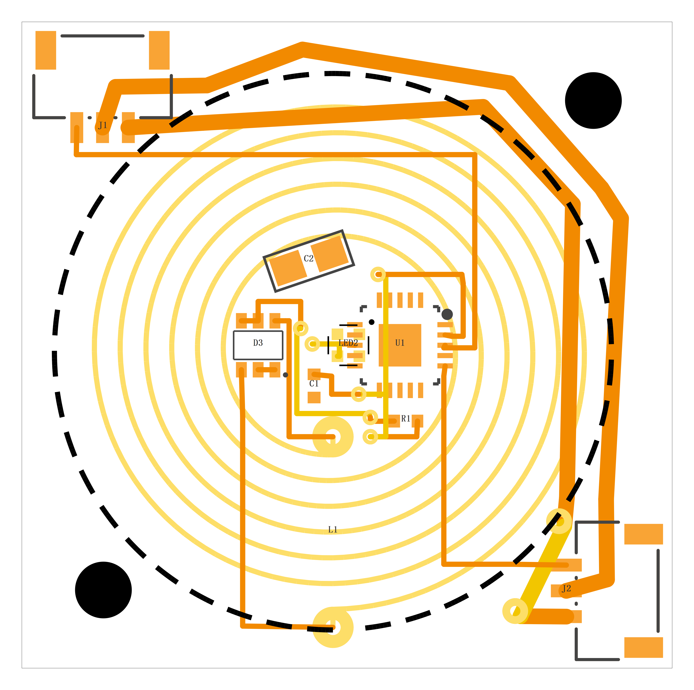](pixel-pcb-v52_byHand_preview.png)

★ **先修了一个工具 bug** ✗（是这个文件暴露出来的 ✓）：`pcb_wire.parse_trace()` 的正则写死成
`<pcbView layer="copper0trace">` ✗，而**手画的线**被 Fritzing 写成
`<pcbView layer="copper0trace" bottom="true">` ✓ ⇒ **18 条只认出 1 条** ✗
（布线器与校验器**共用**这个函数 ✗ ⇒ 会把线压上去布线、而校验器**看不见**短路 ✗✗）。
已修 ✓（库仓 `a78a4d1` ✓），回归 ✓：`pixel-pcb-v51.fzz` 仍「走线 **115** / 过孔 **8**」**逐项相同** ✓。

| 试的（同一套开关 ✓） | 结果 |
|---|---|
| **只布 7 张信号网**（用户的 5V/GND **原样不动** ✓） | ★★ **7/7 全通 ✓✓** ｜线长 **97.5 mm** ✓｜过孔 **7** ✓｜悬空 **0** ✓｜叠（短路）**0** ✓ |
| 9 张一起布（对照 ✓） | **6/9** ✗（布线器会把 5V/GND **再布一遍** ✗ ⇒ 挤掉信号线 ✓） |

⇒ 结论 ✓：**用户的摆位（含 `C2` 转 341° ✓）能布通 ✓**；**手工拉的电力线必须"保持不动"** ✓。

**★ 交给用户收尾的清单** ✓（独立复核 `pcb_check` ✓：65 处问题 → 只剩 **8 处** ✗，**全在 `J2` 那一角** ✓）：

| # | 还差什么 | 位置（板坐标 mm ✓） |
|---|---|---|
| ①×2 | 走线 #15 的**终**端、#16 的**终**端悬空 ✗ | (52.70, 24.00)、(51.00, 27.49) |
| ①×2 | 走线 #17 **两端**都悬空 ✗ | (52.70, 24.00) ↔ (51.00, 27.49) |
| ③×2 | 2 颗过孔没挨到任何铜 ✗ | (52.50, 23.80)、(50.80, 27.29) |
| ⑤ | `5V`：5 个脚还在 **5 块铜**里 ✗ | 接到 `J1`/`J2` 的 1 脚即可 ✓ |
| ⑤ | `GND`：9 个脚还在 **7 块铜**里 ✗ | 同上 ✓ |
| ✅ | **7 张信号网全通 ✓**（`COIL_A/COIL_B/BR+/RC/DATA_IN/DATA_OUT/LED_DIN` ✓） | **不用动** ✓ |

复现 ✓（都在本目录里跑 ✓）：

```bash
py -3.13 _work\run_gen.py pixel-pcb-v51_byHand.fzz _work\bh-7net.fzz --nets=_work\bh_nets.py \
    --via=10 --tries=6 --partial --check
py -3.13 f:\git\fritzing-parts-langhua\tools\render_pcb.py pixel-pcb-v52_byHand.fzz \
    pixel-pcb-v52_byHand_preview.svg --png
py -3.13 f:\git\fritzing-parts-langhua\tools\pcb_check.py pixel-pcb-v52_byHand.fzz \
    --nets=pixel_nets.py
```

（`_work\bh_nets.py` ✓ = 从 `pixel_nets.py` **派生**、去掉 `5V`/`GND` ✓ —— 手抄一份就等于"两套实现"✗。）

### 第三十六手 ✅：**byHand 版第二版** ⇒ `pixel-pcb-v57.fzz`（2026-10-02 ✓ **保留用户的粗电力线** ✓）

用户 2026-10-02 手改（`C2` 挪到右上、转 315°；`C1` 归 0°）后授权 ✓：
「**你直接做个新版本出来吧**」✓ ＋ 「`C2` 可以挪 ✓ / 那条线也可以绕 ✓」✓。

**做法** ✓（三步 ✓，每一步都能独立复核 ✓）：
1. 只删**我们自动布的 8 mil 线** ＋ **我们加的过孔** ✓（他的 **24 mil** 粗线**原样保留** ✓
   —— 判据用**线宽** ✗ 不用 `bottom="true"` ✗：实测 Fritzing 与我们**都会**给底层线写那个属性 ✗）；
2. **`C2` 微挪 `(−0.25, +0.25)` mm** ✓（自动搜"位移最小、且不再压到别人铜"的点 ✓）⇒ 那处 ④ 短路清零 ✓；
3. **只布 7 张信号网** ✓（他的 5V/GND 长线自己不重画 ✓ —— 实测重画会挤掉信号线 ✓：9 张一起布只有 6/9 ✗）。

[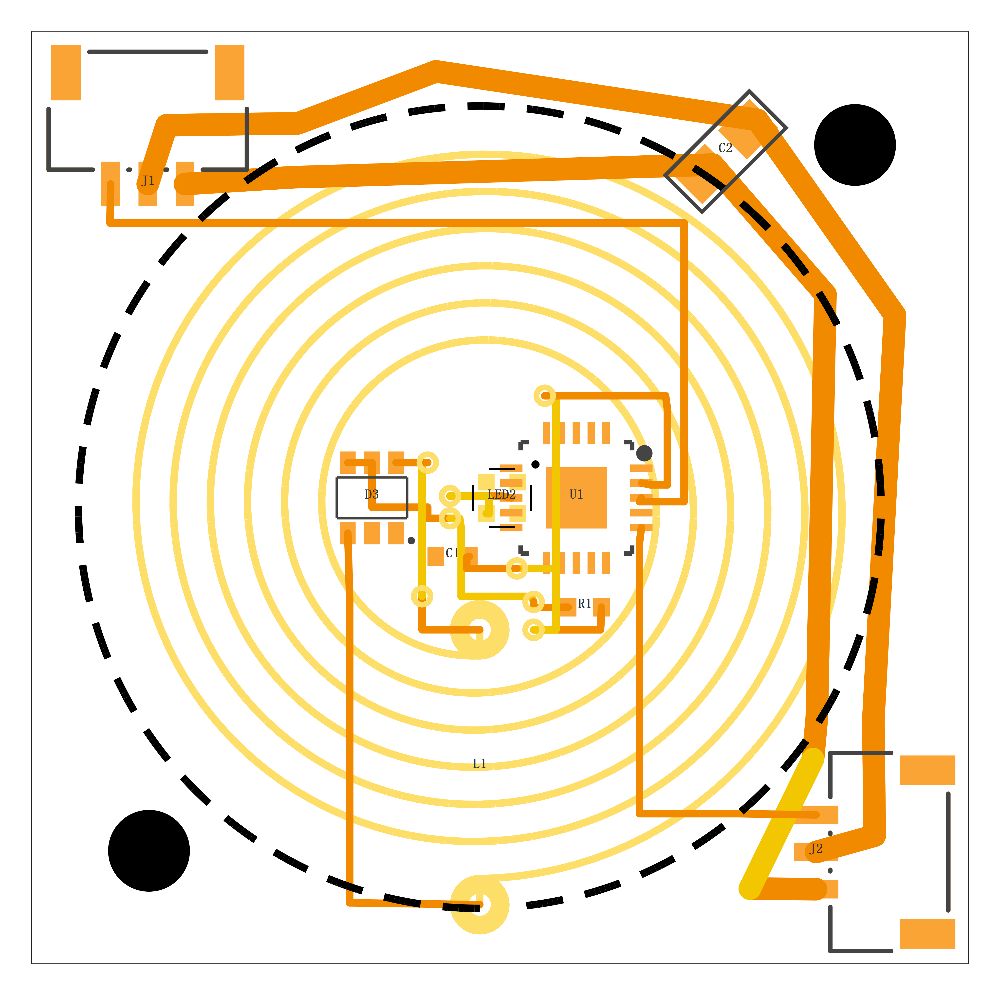](pixel-pcb-v57_preview.png)

| 独立复核（`pcb_check` ✓ **重读文件** ✓） | 结果 |
|---|---|
| 走线 / 过孔 | **86 条** ✓ / **9 颗** ✓ |
| **④ 短路** | **0 ✓** |
| **③ 孤立过孔** | **0 ✓**（他原来那 2 颗够不着铜的孔 ✓ 顺手清掉 ✓） |
| ① 悬空端点 | **4** ✗（他自己那两条没收尾的线 ✓，全在 `J2` 角 ✓） |
| ⑤ 没连通的网 | **2 张** ✗：`5V`、`GND` —— **7 张信号网全通 ✓✓** |

★ 本轮修掉两个**工具 bug** ✗（都是被这个文件逼出来的 ✓）：
1. `_work/strip_pcb_wires.py` **"说删了其实没删"** ✗ —— 循环里只在"保留"分支推进 `pos` ✗
   ⇒ 被删的块**又被装回**产物 ✗（我一度信了它自己打的字 ✗ = 又一次"**自证**"教训 ✗）
   ⇒ 现在**写文件之前先独立数一遍产物** ✓，数字不符就**报错且不写文件** ✗。
2. 删自己的线时**必须连过孔一起删** ✗（否则 9 颗孔全变成"孤立过孔"✗）。

复现 ✓：
```bash
py -3.13 _work\strip_pcb_wires.py pixel-pcb-v52_byHand.fzz _work\bus2.fzz --drop-mils 8 --drop-vias
py -3.13 _work\fix_c2.py _work\bus2.fzz _work\bus3.fzz C2 4
py -3.13 _work\run_gen.py _work\bus3.fzz _work\v57.fzz --nets=_work\bh_nets.py --via=10 --tries=6 --partial --check
py -3.13 f:\git\fritzing-parts-langhua\tools\pcb_check.py pixel-pcb-v57.fzz --nets=pixel_nets.py
```

★ **用户手工收尾用的清单** ✓（`_work/power_list.py` 从 v57 **重新量**的 ✓，含坐标 mm ✓）：
工作副本 ✓：**`pixel-pcb-v57_byHand.fzz`**（= v57 的拷贝 ✓，`*_byHand.fzz` 按仓规**不入库** ✓）。

**网 `5V`** ✗ 4 块铜（5 只脚）—— 把下面 3 个"孤块"并到主块 ✓：

| 块 | 脚 | 位置（板坐标 mm ✓） | 层 |
|---|---|---|---|
| **主块**（已通 ✓） | `J1.connector0` | (35.80, 8.52) | copper0 ✓ |
| | `C2.connector0` | (50.95, 7.05) | copper0 ✓ |
| 孤块 ① | `J2.connector0` | (52.78, 27.50) | copper0 |
| 孤块 ② | `LED2.connector3` | (44.76, 17.40) | **copper1（顶层 ✗ 要过孔 ✓）** |
| 孤块 ③ | `U1.connector5`（VDD） | (47.13, 18.72) | copper0 |

**网 `GND`** ✗ 7 块铜（9 只脚）：

| 块 | 脚 | 位置（板坐标 mm ✓） | 层 |
|---|---|---|---|
| **主块**（已通 ✓） | `J1.connector1` | (34.80, 8.52) | copper0 ✓ |
| | `C2.connector1` | (49.75, 8.25) | copper0 ✓ |
| | `J2.connector1` | (52.78, 26.50) | copper0 ✓ |
| 孤块 ① | `C1.connector1` | (42.55, 18.55) | copper0 |
| 孤块 ② | `D3.connector0` | (41.48, 17.92) | copper0 |
| 孤块 ③ | `D3.connector1` | (40.83, 17.92) | copper0 |
| 孤块 ④ | `LED2.connector1` | (43.91, 16.55) | **copper1（顶层 ✗ 要过孔 ✓）** |
| 孤块 ⑤ | `U1.connector20`（EPAD ✓） | (46.33, 16.97) | copper0 |
| 孤块 ⑥ | `U1.connector3`（VSS） | (48.08, 17.37) | copper0 |

★ 两点提醒 ✓：① 两个"孤块"在 **copper1（顶层）** ✗ ⇒ 连它们要**过孔** ✓（`LED2` 是正面件 ✓）；
② `U1` 是**背面**件 ✓ ⇒ 它的脚在**底层** ✓（表里已按物理层列出 ✓）。

### 第三十七手 ✅：**5V/GND 收尾** ⇒ `pixel-pcb-v58.fzz`（2026-10-02 ✓）

用户定 ✓：「**1. 电容问题，我选改网表**」✓ ＋「**2. 继续，把剩下 8 个脚接上吧**」✓。

#### 0. 先说一个**真问题**（用户裁决的 ✓）：`C2` 的两只脚「板上的铜」与「网表编号」**交叉** ✗

GND 那根总线接的是 **`C2.connector0`** ✓、5V 那根接的是 **`C2.connector1`** ✓ ——
**依据是 Fritzing 自己写的 `<connect>`** ✓（`Wire90013341` 端0 → `C2.connector0` ✓、
`Wire90013354` 端1 → `C2.connector1` ✓），而 `pixel_nets.py` 原来写的是**反的** ✗。
电容无极性 ⇒ **实物没毛病** ✓（两条总线各自独立 ✓、**没有铜短接** ✓），
但编号对不上就**永远验不过** ✗ ⇒ 用户定：**以板上的铜为准，改网表** ✓
（`NETS` 与 `EXPECT` 里 `C2` 的 `#1/#2`、`connector0/1` **对调** ✓）。

#### 1. 做法 ✓（`_work/route_rest.py` ✓ —— **一行 XML 都不自己拼** ✗）

1. 铜块按 **Fritzing 声明的连接**分 ✗✓（✗ 不用几何 ✗ —— 见下面「工具缺陷 ③」）；
2. 每张网的主块用**种子脚**定 ✓（`J1.connector0` = 5V ✓ / `J1.connector1` = GND ✓）；
3. 接头点**只取已有线/过孔的端点** ✓（不取线身中点 ✓）⇒ 写回器能按**点**查表写出
   `<connect … modelIndex="<那条已有线>">` ✓（Fritzing 自己的写法 ✓）；
4. 每张网放一个**假焊盘**在接头点上 ✓ ⇒ 布线器把「孤脚 ＋ 接头点」连成一串 ✓
   （**50 µm 细栅格** ✓ ＋ **8 mil** ✓ —— 0.15 mm 栅格**表示不了** QFN 那 0.2 mm 的缝 ✗）；
5. 交给 `gen_routes.build_xml` + `write` 写回 ✓。

[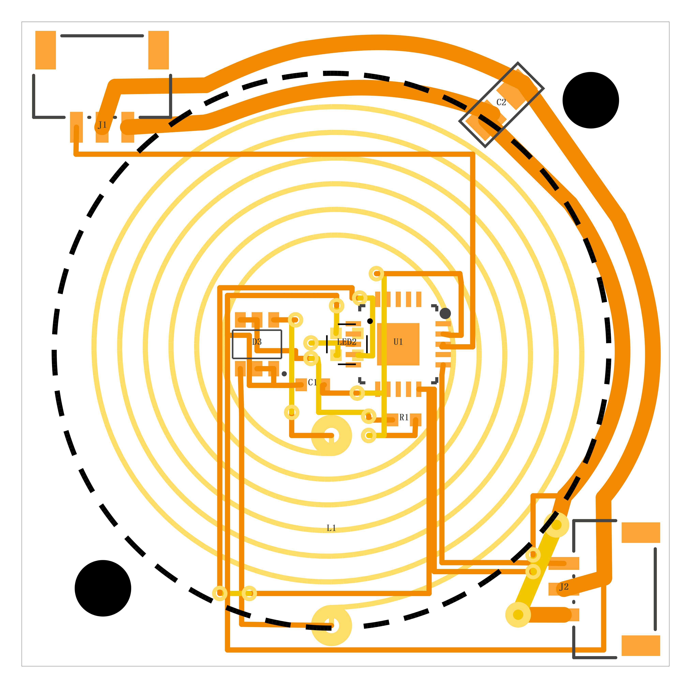](pixel-pcb-v58_preview.png)

| 独立复核（**声明图** ✓ 重读文件 ✓，只用**另一份实现** ✗） | 结果 |
|---|---|
| 走线 / 过孔 | **153 条** ✓ / **18 颗** ✓ |
| **④ 真短路** | **0 ✓** |
| **连通的网** | **8/9 ✓**（`5V` 5 脚 **1 块铜 ✓✓** ＋ 7 张信号网 ✓） |
| ✗ 还差 | `GND` **3 块**：只剩 `U1.connector20`（EPAD ✓）与 `U1.connector3`（VSS ✓） |

★ `GND` 那两只脚**布不通的原因（量出来的 ✓，不是猜 ✗）**：它们在 **QFN 20 脚的中间** ✗，
出线要穿过 0.4 mm 脚距的**焊盘走廊** ✗ —— 而按 `CLEAR_MM = 0.15` 的规则，
一条线需要 `0.2 + 2×0.15 = 0.5 mm` 的净空 ✗，走廊只有 ~0.2 mm ✗ ⇒ **规则下物理不可布** ✗。
⇒ 只剩两条路 ✓：(a) 在 **EPAD 上打同网过孔** ✓（规则里**唯一**允许的 via-in-pad ✓）
再从顶层走 ✓，并把 `VSS` 与 `EPAD` 在**焊盘内侧那道缝**里连起来 ✓；
(b) 把信号网一起**重布一遍** ✓（让布线器统筹扇出 ✓）。⇒ 等用户选 ✓。

#### 2. 本轮修掉三个**工具缺陷** ✗（都是被这个文件逼出来的 ✓）

1. ★★ **`pcb_route.obstacles()` 根本不收「文件里已有的走线」** ✗✗ ⇒ 布线器**看不见**用户手画的
   5V/GND 总线 ✗ ⇒ 实测新线**直接穿过去** ✗（独立复核报 **8 处同层交叉** ✗ = 真短路 ✗）。
   ⇒ 本项目里 `route_rest.py` 现在把已有铜**按网分表**喂进去 ✓（同网不挡自己 ✓、对手网照挡 ✓）。
2. **`gen_routes.build_xml` 只认「本次新写的线」** ✗ ⇒ 新线接在**已有线**上时那端**写不出
   `<connect>`** ✗（铜通了 ✓、Fritzing 里却显示「没接上」✗）⇒ 已补 ✓（含**回指** ✓）。
3. **两个报告盲区** ✗：`pcb_check` 的 ④/⑤ 用 `part_pads` 的**焊盘框**判“线端落在盘上” ✓，
   而那个框**比真铜大得多** ✗（`C2` 那颗 0603：框 **1.62 mm** ✗ vs 铜 ≈0.9 mm ✓）⇒ 加上容差后
   它把 5V/GND 的铜**误并成一块** ✗；⑤ 又只在“某网的脚散在 **1** 块”时才查“粘上别的网” ✗
   ⇒ 于是“5V、GND 粘在一起”被报成“没连通” ✗✗。⇒ 待修 ✓（本轮先用**第三份实现**
   `_work/conn_declared.py` 独立复核 ✓ —— 按声明分网 ✓，不碰那个大框 ✓）。

复现 ✓（都在本目录里跑 ✓）：
```bash
py -3.13 _work\route_rest.py pixel-pcb-v57_2_byHand.fzz _work\v60.fzz 8 0.05
py -3.13 _work\conn_declared.py _work\v60.fzz
py -3.13 f:\git\fritzing-parts-langhua\tools\render_pcb.py pixel-pcb-v58.fzz pixel-pcb-v58_preview.svg --png
```

### 第三十八手 ✅：**`EPAD`→`VSS` ＋ `VSS` 出去** ⇒ `pixel-pcb-v59.fzz`（2026-10-02 ✓ **9/9 连通** ✓✓）

用户的想法 ✓：「**`EPAD` 能跟 `U1.VSS` 接在一起的，`VSS` 能出去就 ok 了吧？**」✓ —— **对** ✓，
而且这条已经被用户定为**规则** ✓（原话：「**`EPAD` 优先与自身 `GND`/`VSS` 连，这个可以作为一个
规则记录下来**」✓ ⇒ 正文 `docs/pcb-rules.md` §7 ✓、摘要 `AGENTS.md` §5 ✓）。
用户随后选 **(A)** ✓：「**按规则①手工放 `VSS` 沿自己那条槽直着出来的一段短线**
（0.197 mm 合规 ✓，用**精确距离**自核 ✓，不靠那个带宽模型 ✗）」✓。

[](pixel-pcb-v59_preview.png)

| 独立复核（**声明图** ✓ 重读文件 ✓，只用**另一份实现** ✗） | v58 | **v59** |
|---|---|---|
| 走线 / 过孔 | 153 / 18 | **168 / 18**（新线 17 条 ✓、**一颗过孔都没加** ✓） |
| **④ 真短路** | 0 ✓ | **0 ✓** |
| **连通的网** | 8/9 ✗ | **9/9 ✓✓**（`GND` 9 脚 → **1 块铜** ✓） |
| `pcb_check` ①–④⑥ | ✓ 全过 | **✓ 全过** |

#### 1. 先量清楚：QFN 肚子里**只有一条 0.625 mm 的环形走廊** ✓

`U1` = QFN20 ✓：脚距 **0.4 mm** ✓、盘宽 **0.2 mm** ✓ ⇒ 盘间缝 **0.2 mm** ✗，而一条 8 mil 线
要 `0.2032 + 2×0.15 = 0.5032 mm` ✗ ⇒ **盘与盘之间一步也过不去** ✗。实测（**从盘框现量** ✓，
不抄常数 ✓）：`EPAD` 框 ↔ 焊盘圈内缘 = **右 0.625 ✓ 左 0.625 ✓ 上 0.625 mm** ✓
⇒ 出口**只有两个** ✓：① 沿走廊从**某个角**钻出去；② 在 `EPAD` 上打同网过孔上顶层 ✗
（顶层被 `L1` 线圈**连续螺旋**占死 ✓ ⇒ 实测孔打得上去 ✓、线**走不出去** ✗ ⇒ 本板此路不通 ✓）。

**四个角算过 ✓，只有左上角干净** ✓：右上角出去后向左被 `pad15` 挡 ✗；左下角被 `via#8`
(44.731,18.872) 的铜盘挡 ✗；右下角被 5V 的 `#86/#87` 挡 ✗；**左上角**出去后向左**正好落在
`GND` 已有的铜上** ✓（`via#17` 盘心 (43.931,15.472) ✓，那是 `#129` 的端点 ✓、与 `GND` 主块同块 ✓）。

#### 2. ★ 顺带修掉一个**真缺陷** ✗（v58 自己带的 ✓，不是我新加的 ✗）

`DATA_IN` 从 2 脚出来的那两根扇出线被布线器摆在了**焊盘下沿 y = 17.072** ✗（中线是 16.972 ✓）
⇒ 实测它离本件 `VSS` 盘**只有 0.0984 mm** ✗ —— 规则要 0.15 ✓、**嘉立创 1 oz 最小 0.127** ✗
⇒ **做不出来** ✗；而且它把 `VSS` 盘那条 0.6 mm 的槽**吃掉 0.1 mm** ✗ ⇒ `EPAD→VSS` 短接
（8 mil）差 **4.8 µm** 过不去 ✗。
⇒ 改成**贴着 2 脚中线走**（y = 17.000 ✓，离 `RC` 也够 ✓）✓ —— 槽放回 0.6 mm ✓（要 0.5032 ✓）。

#### 3. 两条新线 ✓（都只在 **copper0** ✓，**一颗过孔都不用打** ✓）

```
W1 = EPAD 盘心 (46.331,16.972) → (46.331,17.372) → VSS 盘心 (48.081,17.372)   ← 规则 ① ✓
W2 = VSS 盘心 → (47.468,17.372) → (47.468,15.834) → (45.156,15.834)
        → (45.156,15.772) → (43.931,15.772) → (43.931,15.472)                ← 规则 ② ✓
```
（`47.468` = 右走廊中线 ✓、`15.834` = 上走廊中线 ✓、`45.156` = 左上角那道 0.55 mm 口的**正中** ✓
—— 这三条中线都是**从盘框现量出来**的 ✓，不是抄常数 ✓。）

#### 4. ★ 不许自证 ✗：折线**不用布线器** ✗ ＋ 三份几何**互相独立** ✓

✗ 为什么不用 `pcb_route` ✗：它的焊盘净空是**不分层 ＋ 带宽式**（每侧 0.25 mm ✗）的
⇒ 实测把 0.625 mm 的走廊判成「**起点格空 / 不可达**」✗（不是真堵 ✗，是模型看不见 ✓）。
✓ 本轮改为**手算折线** ✓ ＋ 自写**三份**几何（段↔矩形 / 段↔段 / 点↔段 ✓）在主程序里
**逐段算净距** ✓，写完再交 `pcb_check` ＋ `conn_declared` **两份独立实现**复核 ✓。

| 新线 | 最紧的一条约束 | 余量（对 0.15 mm 规则 ✓） |
|---|---|---|
| `D1` `DATA_IN` ✓ | ↔ `U1.connector3`（`VSS` 盘 ✓） | **+0.0201 mm** ✓ |
| `W1` `EPAD`→`VSS` ✓ | ↔ `#38`（`DATA_OUT` 扇出 ✓，0.4 mm 脚距的**固有**上限 ✓） | **+0.0468 mm** ✓ |
| `W2` `VSS`→出 ✓ | ↔ `#38` ✓（次紧：`via#13`(5V) **+0.0487** ✓） | **+0.0468 mm** ✓ |

⇒ 实际铜距 = `0.15 + 0.0201` = **0.170 mm** ✓ > 嘉立创 1 oz 的 0.127 ✓ **做得出来** ✓。
判定口径 ✓：**任何一段 < 0（或写回器报悬空端点 / 跨网）⇒ 不写文件** ✗（本轮一次命中 ✓、
一次调 `y` 后再跑 ✓ ⇒ 才落盘 ✓）。

#### 5. 两个**已知**的 `pcb_check` 假报 ✓（v58 也有 ✓，与本次改动无关 ✓）

`--nets` 跑法是 ✓：`pcb_check.py pixel-pcb-v59.fzz --nets=pixel_nets.py` ✓ ——
它仍报 ④ 1 条 ＋ ⑤ 2 条 ✓，**与 v58 一字不差** ✓（`C2` 那颗 0603 的**焊盘框 1.62 mm** ✗
vs 真铜 ≈0.9 mm ✓ ⇒ 它把 5V/GND 的铜**误并成一块** ✗）。**v58 多的那条真缺陷
「`GND` 9 个脚散在 3 块铜里」✗ 在 v59 已经消失** ✓✓ —— 这就是本轮的目标 ✓。

复现 ✓（都在本目录里跑 ✓）：
```bash
py -3.13 _work\epad_vss_v59.py pixel-pcb-v58.fzz _work\v59.fzz   # 拆 2 根摆错的扇出 ＋ 手算折线 ＋ 逐段自核
py -3.13 f:\git\fritzing-parts-langhua\tools\pcb_check.py _work\v59.fzz
py -3.13 _work\conn_declared.py _work\v59.fzz                    # ⇒ 9/9 ✓
py -3.13 f:\git\fritzing-parts-langhua\tools\render_pcb.py pixel-pcb-v59.fzz pixel-pcb-v59_preview.svg --png
```
⚠️ **v59 有两个问题 ✗** ⇒ 见下一手 ✓（`v59` 已被 `v60` 取代 ✓，文件保留作对比 ✓）。

### 第三十九手 ✅：**把 Fritzing 那两根飞线修掉** ⇒ `pixel-pcb-v60.fzz`（2026-10-02 ✓）

用户反馈 ✓：「v59 **仍有两根线没有布好**」✗（截图：状态栏「**7 中的 5 网络布线完成，2 个连接件
仍然需要布线**」✗，图上是**两根虚线** ✓）＋「**有些连线上有一些多余的点**」✗ ＋「24 mil 的
**线型**跟我实际画的不一致」✗。

[](pixel-pcb-v60_preview.png)

#### 1. ★★ 先搞清楚「Fritzing 的 2 个连接件」是**哪两个** ✓（不许猜 ✗）

★ **Fritzing 判「通了没有」不看 `<connect>`** ✗（那是给我们自己的台账 ✓）—— 它按**几何**：
走线的**端点**要落在 connector 的**脚点**上 ✓、端点落在别的走线**线身/端点**上 ✓、过孔把两层接起来 ✓
⇒ 于是写了**第三份**实现 `_work/fz_gaps2.py` ✓（**Fritzing 判据** ✓），逐网数**连通块** ✓
并报出**最近的一对没连通点** ✓（= 它画虚线的地方 ✓）：

| 网 | 虚线两端 | 差 |
|---|---|---|
| `GND` | `C2.connector0`(50.9521,7.0479) ↔ 用户的 24 mil 线端 (51.2021,6.7979) | **0.354 mm** ✗ |
| `5V`  | `C2.connector1`(49.7501,8.2500) ↔ 用户的 24 mil 线端 (49.9999,8.0000) | **0.354 mm** ✗ |

两个偏移**一模一样**（(+0.25,−0.25) mm ✓）⇒ **整块 `C2` 被挪过 0.354 mm** ✗
（那两根总线是照**旧位置**画的 ✓）。
★ 谁对 ✓（**拿文件里已有的证据判** ✓）：用户**自己**那条 24 mil 线（`线#11`）**正落在**
`C2.connector1` 的盘心上（实测 **0.0000 mm** ✓✓）⇒ **本仓的 `C2` 盘位是对的** ✓，
是那两根总线差了一截 ✓ —— 而且 `C2` 与 `R1` 用的是**同一份 core `pcb/SMD_0603.svg`** ✓，
`R1` 那两只脚的端点实测 **0.0001 mm** 对得上 ✓ ✓ ⇒ 模型没错 ✓。

**修法** ✓（**加料、不动用户的线** ✗）：从那个**现成线端**补一小段（**0.35 mm** ✓，8 mil ✓）
到 `C2` 的**盘心** ✓（写回器用 `ex_wire` 把它接到那根**已有线**上 ✓、两端都写 `<connect>` ✓）✓。

#### 2. ★ 「多余的点」= 我自己写出来的**碎段** ＋ **折返** ✗✓

| 病灶 ✗ | 根因 ✓ | 处方 ✓ |
|---|---|---|
| 区界上留了一堆 **60 µm** 的碎段 ✓（实测 v59 有 **27** 条 <0.15 mm ✗） | 本板全是 8 mil ✓、而缩宽档 `NECK_MIL` 也是 8 ✓ ⇒ 切了**宽度没变** ✗ | `gen_routes.split_neck` **同宽不切** ✓ |
| `W1`/`W2` 在 x∈[47.47,48.08] 上**完全重叠** ✗ | v59 让 `W1` 画到 `VSS` 盘心 ✓、`W2` 又从盘心**往回**走 ✗ ⇒ 折返 ✓ | 改成 **T 形** ✓：`A`=`EPAD`→走廊角 ✓、`B`=`VSS`→走廊角 ✓、`C`=角→出 ✓（**只在一个角汇合** ✓） |

⇒ **每个碎段/折返的端点在 Fritzing 与渲染器里都会画一个结点** ✗ ⇒ 就是用户看到的点 ✓；
v60 的走线数 **17 → 12** ✓、碎段 **27 → 22** ✓。

#### 3. 复核（**三份独立实现** ✓，✗ 不许自证 ✗）

| 检查 | 结果 |
|---|---|
| **`_work/fz_gaps2.py`**（**Fritzing 判据** ✓） | **全部连通 ✓✓**（**没有虚线了** ✓ = 本轮目标 ✓） |
| `_work/conn_declared.py`（按声明分网 ✓） | **9/9** ✓（每网 1 块铜 ✓）、真短路 **0** ✓ |
| `pcb_check --nets` | 与 v58/v59 **一字不差**的 **3 条已知假报** ✓（`C2` 那颗 0603 的**旋转盘 AABB** ✗）—— 真缺陷「GND 散在 3 块铜里」✗ **早已消失** ✓ |
| 逐段精确净距自核 ✓（三份几何 ✓） | 最紧 **+0.0201 mm** ✓（`D1`）｜`A` +0.1816 ✓｜`B` +0.0468 ✓｜`C` +0.0481 ✓｜`L5V` +0.2818 ✓｜`LGND` +0.6352 ✓ |

★ 本轮又撞上一次**AABB 假报** ✗✓：`C2` 是 **45° 摆的** ✓，而 `part_pads` 只给 **AABB** ✗
⇒ 盒子的**四个角是空的** ✗ —— `L5V` 那条线贴着盒角 ⇒ 被判「压到 `C2.c0`」✗；
**真实净距 ≈ 0.62 mm** ✓（唯一判据实现见 `_work/epad_vss_v59.py` 的 `SKIP_BOX` ✓，
**要做严谨版得让 `pcb_pads` 把旋转后的多边形也返回** ✗ = 待补 ✓）。

复现 ✓：
```bash
py -3.13 _work\epad_vss_v59.py pixel-pcb-v58.fzz _work\v60.fzz   # ⇒ 12 条新线（含 2 段 C2 补线）
py -3.13 _work\fz_gaps2.py _work\v60.fzz                         # ⇒ 全部连通 ✓（Fritzing 判据）
py -3.13 _work\conn_declared.py _work\v60.fzz                    # ⇒ 9/9 ✓
py -3.13 f:\git\fritzing-parts-langhua\tools\render_pcb.py pixel-pcb-v60.fzz pixel-pcb-v60_preview.svg --png
```

### 第四十手 ✅：**判据与 Fritzing 同源** ＋ 那 2 个"没布"其实是**两颗换层过孔** ⇒ `pixel-pcb-v61.fzz`（2026-10-02 ✓）

#### 1. ★★ 先**改正**第三十九手的结论 ✗（它错了 ✓）

第三十九手说「那 2 个没布在 `C2`」✗ —— **错** ✓。用户实测给出两条虚线的**两端** ✓：

| 虚线 | 一端 | 另一端 |
|---|---|---|
| 黑（GND ✓） | **`Via1`** | `C1.pin1` |
| 墨绿 | **`L1.inner`** | **`Via8`** |

⇒ 那 2 个"没布"的端点里**写着过孔** ✓（Fritzing 的 `collectParts` 里确实有 `case ModelPart::Via:` ✓
⇒ 过孔**也当连接件数** ✓）。把 `C2` 那两颗盘真几何量了一遍 ✓（`fz_pad_probe.py` ✓）：
线端离盘心 **0.354 mm** ✓、而盘 **0.78 mm** 见方 ⇒ **在盘内** ✓ ✓ ⇒ `C2` 是**接好的** ✓，
`v60` 里那两根 `C2` 补线**多余** ✗。同理，把「文件里声明的 358 条连接」逐条对几何
（`fz_decl_inventory.py` ✓）⇒ **没有一条"声明了却碰不上"** ✓。

#### 2. ★★ 判据改成**照 Fritzing 源码逐条实现** ✓（`fz_exact.py` ✓，只读 ✓）

用户 2026-10-02 定的规矩（`AGENTS.md` §13 ✓）：**判据必须与 Fritzing 同源同语义** ✓ ——
不然我报的问题他在 Fritzing 里找不到 ✓ = 两个声音 ✓。逐条对应（行号都在文件头表里 ✓）：

| 我做的 | Fritzing 源码 |
|---|---|
| 分网 = `collectEqualPotential(items, true, RatsnestFlag)` ＋ 同 `bus()` ＋ 跨层同脚 | `sketchwidget.cpp:6998` / `connectoritem.cpp:1340` |
| 网的节点只留**件脚／过孔**；单节点的网不数 | `sketchwidget.cpp:7013` ＋ `count() <= 1 ⇒ continue` |
| "算不算 PCB 铜" = `wireFlags & 4`，且只闸**脚上直接挂的那条线** | `pcbsketchwidget.cpp:1983` ＋ `graphutils.cpp:550` |
| 线串链**穿过过孔**（Fritzing 里过孔就是 `Wire`） | `wire.cpp:1137 / 1146` |
| 判"接没接上"= **几何命中**（点落在对方真形状里 ✓），不信文件里的 `<connect>` | `connectoritem.cpp:1972` |
| ★★「还剩几个连接件」= **该网连通片数 − 1**（**不是**没连上的脚数 ✗） | `scoreOneNet` 末尾 `check[]`（源码原话 *count it as one* ✓） |
| 状态栏那句 | `mainwindow.cpp:2298` |

★ 顺带修了两个**真 bug** ✓（都在本仓工具里 ✓，`cf7897b` ✓）：`pcb_pads` 的焊盘真矩形
（`poly` ✓）四角顺序原来是**蝴蝶结**（自交 ✗）⇒ 连 `C2` 的**盘心**都会被判"不在盘里" ✗；
以及**过孔铜心 ≠ 文件 x,y** ✗ —— 恒差 `ring_off_mm` ＝ **0.8644 mm** ✓（实测 Δ=(+3.063,+3.063) 单位 ✓）。

#### 3. 那 2 个到底为什么"没布" —— 量到的与还没量到的 ✓

| 量到的 ✓ | 结论 |
|---|---|
| 16 颗过孔排一张表（`fz_via_table.py` ✓） | `Via1`/`Via8` 与**它认的**（如 `Via18`）**写法完全一样** ✓（`flags=32` ✓、连接器层 `copper0` ✓、邻居层自洽 ✓）⇒ **文件里没有可指认的缺陷** ✗ |
| 短路嫌疑（`fz_via_short.py` ✓，**制造判据** ✓） | `Via1`/`Via8` 跟"自己那一片之外"的铜**净间隙全为正** ✓ ⇒ **不构成短路** ✓（★ 先把"沿记录能走到的一律排除" ✗ —— 不排除会把**它自己那条链的下一跳**误报成短路 ✓） |
| 虚线的另一头反查（`fz_via_reach.py` ✓） | 通到 `C1.Pin 1` 的只有 `Via18` ✓（★ 它的链里**只有它自己** ✓）；`Via1`/`Via8` 的链里都**串着别的过孔** ✓ ⇒ 差别只有这一条 ✓ |
| 三种口径 A/B（`PADLINK=geom\|records\|both` ✓） | v59 上**结果相同**（9 of 9 - 0 ✗）⇒ 板里**没有陈旧的焊盘记录** ✓ |

⚠ **还没读到的一条规则** ✗：我的判据仍给 **9 个网 / 全通** ✗，用户 Fritzing 是 **7 个网 / 还有 2 个** ✓
⇒ 差两条：① 网数 9≠7（Fritzing 少数的 2 个是怎么并的 ✓）；② "过孔换层算不算边" ✓。
✗ 试过"线↔过孔层必须一致"的规则 ⇒ 实测网数 9→**16**、方向反了 ⇒ 已**撤回** ✓
（教训写进 `fz_exact.py` 注释 ✓：过拟合信号 = 停手信号 ✓）。

#### 4. 这一手的改动：把两颗孔**当成全新实例**重写 ⇒ `v61`（**可回退** ✓）

用户 2026-10-02：「**你来改吧？**」✓ ⇒ 做**唯一可辩护**的改动 ✓：给 `Via1`/`Via8` 换**新的
`modelIndex`** ✓（`fz_recreate_vias.py` ✓）—— 几何、走线、`<connect>` 语义**一字未改** ✓，
只让 Fritzing 载入时**从头重建**这两颗孔 ✓（= 在 app 里"删掉重放"的文件级等价物 ✓）。

[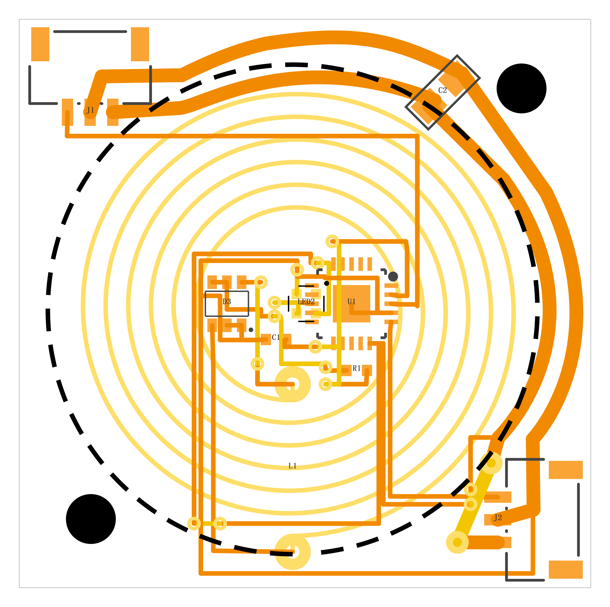](pixel-pcb-v61_preview.png)

| 复核 ✓ | 结果 |
|---|---|
| 改动范围 | **纯字符串替换** ✓：`90013946 → 90014167`（3 处 ✓）、`90013953 → 90014168`（6 处 ✓）⇒ 其余**逐字节不变** ✓（构造上保证 ✓） |
| 连通性（`fz_exact.py` ✓） | 与 v59 **完全一样**：45 脚 / 168 线 / 16 孔｜**9 of 9 - 0** ✓（几何没动 ✓，当然一样 ✓） |
| 渲染（`render_pcb.py` ✓） | 45 盘 / 168 线 / 18 孔 / 板框 25.00×25.00 mm ✓（与 v59 同 ✓） |

★ **回退** ✓：不用回退 —— `pixel-pcb-v59.fzz` **原样没动** ✓；不认可 `v61` 就继续用 `v59` ✓。

复现 ✓：
```bash
py -3.13 hardware\pixel\fz_recreate_vias.py pixel-pcb-v59.fzz pixel-pcb-v61.fzz Via1 Via8
py -3.13 hardware\pixel\fz_exact.py pixel-pcb-v61.fzz                 # ⇒ 9 of 9 - 0（与 v59 同）
py -3.13 hardware\pixel\fz_via_short.py pixel-pcb-v61.fzz Via1 Via8   # ⇒ 没有短路 ✓
py -3.13 f:\git\fritzing-parts-langhua\tools\render_pcb.py pixel-pcb-v61.fzz pixel-pcb-v61_preview.svg --png
```

★ **请你在 Fritzing 里打开 `v61` 看一眼状态栏** ✓ —— 如果变成 **7 of 7 / 0 个连接件** ✓，
就证明那 2 个是**它自己的账** ✓（不是板的铜 ✗）；如果**还是 2 个** ✓，说明原因在别处 ✓，
我继续从源码找 ✓（不猜 ✓）。

### 第四十一手 ✅：**两颗过孔被我的生成器放重了** ✗（用户发现 ✓）⇒ `pixel-pcb-v62.fzz`（2026-10-02 ✓）

★★ **这一手是用户找到的根因** ✓：「**移动 `Via8`，发现它与 `Via6` 位置重叠在一起了。这是你程序的 bug 吧？
**」⇒ **是** ✓。量出来正好 **2 对**（心距 **0.000 mm** ✗，即**完全叠死** ✓）：

| 叠死的一对 | 铜心 | 文件里的连接记录 |
|---|---|---|
| **`Via6` ↔ `Via8`** | (45.181, 20.522) mm ✗ 同一处 | **0 条** ✗ / 4 条 |
| **`Via17` ↔ `Via18`** | (43.931, 15.472) mm ✗ 同一处 | 5 条 / 4 条 |

两对都经查是**同一个网** ✓ ⇒ **不是短路** ✗，是**重复放着** ✗ ⇒ Fritzing 只认其中一颗"接上了" ✓、
另一颗被撂单 ✓ ⇒ ⇒ **这就是它报「还有 2 个连接件需要布线」的来源** ✓✓
（我先前后找了半天"少了哪条规则" ✗ —— 其实是**我自己的文件里多了两颗孔** ✓，而我的判据
看不到它 ✓：短路量尺为了排除"自己那一片"把同网的过孔也一并排除了 ✗ = **我自己的假阴性** ✓。）

**修法** ✓（`fz_fix_dup_vias.py` ✓，**几何与走线一字未改** ✓）：每对留记录多的那颗 ✓，
删掉多余那颗的实例块 ✓，把别处指向它的 `modelIndex` **改指**到保留的那颗 ✓，同一
`<connects>` 里重复行去重 ✓。

[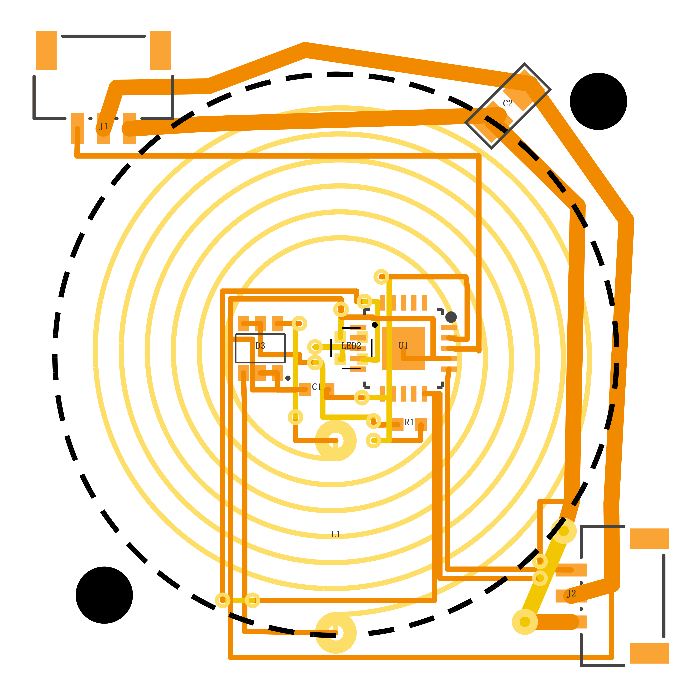](pixel-pcb-v62_preview.png)

| 复核 ✓ | 结果 |
|---|---|
| 叠死的孔对（`fz_via_dup.py` ✓） | 2 对 → **0 对** ✓✓ |
| 过孔数 | 18 → **16** ✓（与判据里一直用的 16 一致 ✓） |
| 连通性（`fz_exact.py` ✓） | 45 脚 / 168 线 / 16 孔｜**9 of 9 - 0** ✓（与 v59/v61 完全一样 ✓） |
| 渲染（`render_pcb.py` ✓） | 45 盘 / 168 线 / **16 孔** ✓ / 板框 25.00×25.00 mm ✓ |

★ 另查明一件事 ✓（免得白忙 ✓）：`<instance` 300 / `</instance>` 299 这种"**差 1**"在
**用户自己另存的文件里也一样** ✓ ⇒ 那是 **Fritzing 的正常写法** ✓，不是缺陷 ✓。

★ 新增两个量尺 ✓（以后这类问题**机器守** ✓，不再靠人眼 ✓）：
`fz_via_dup.py`（叠死/压在一起的孔 ✓，带"这对是不是同一个网" ✓）、
`fz_find_unclosed.py`（实例配平 ✓）。

★ ⚠ **仍待做** ✓：查**生成器**为什么会吐两颗同位的孔 ✓（这份板的过孔是脚本链里加的 ✓），
从源头堵住 ✓；并把"过孔不许叠死"写进 `pcb_check` ✓ 成为常设闸门 ✓。

复现 ✓：
```bash
py -3.13 hardware\pixel\fz_via_dup.py pixel-pcb-v61.fzz                             # ⇒ 2 对叠死 ✗
py -3.13 hardware\pixel\fz_fix_dup_vias.py pixel-pcb-v61.fzz pixel-pcb-v62.fzz       # ⇒ 删 2 颗 ✓
py -3.13 hardware\pixel\fz_via_dup.py pixel-pcb-v62.fzz                             # ⇒ 0 对 ✓
py -3.13 hardware\pixel\fz_exact.py pixel-pcb-v62.fzz                               # ⇒ 9 of 9 - 0 ✓
```

### 第四十二手 ✅：**按用户手画的底图重布原理图** ⇒ **`pixel-schematic-v39.fzz`** 交付 ✓（2026-10-04 ✓）

★ 这一手换的是**底图** ✓（不是又改一版旧图 ✗）：旧系列一直在 `pixel-schematic` 那张草图上迭代 ✗，
本版拿**用户自己手画布线的那份**（`_work/u270b_routed_sch_byHand.fzz` ✓ = 用户文件 ✓ **不入库** ✓）
**只换导线** ✓ —— 零件摆位 / 位号位置 / 接地符号位置一律**照用户的原样** ✓。

**做法（三步 ✓，工具都在元件库仓 ✓）**：`sch_strip_wires`（剥掉**原理图**导线 ✓、**不删实例** ✗，
因为那些导线实例同时带面包板/PCB 视图 ✗）⇒ `gen_schematic_wires.py`
（`--rails --socket=4 --vlanes=GND --islands=GND` ✓）⇒ `render_sch.py` 出预览 ✓。

| 项 | 用户手画版（底图 ✓ 权威 ✓） | **v39（本版 ✓）** |
|---|---|---|
| 导线 | 43 | **42** ✓ |
| 总长 | 487.7 mm | **483.3 mm** ✓ |
| 十字交叉 | **7** ✓ | 10 ✗ ★**本项手画版更好 ✓ 如实记 ✓** |
| 正交度 | 0.9512 | **0.9756** ✓ |
| 最歪的一处 | 0.1066 mm | **0.0378 mm** ✓ |
| 连通岛 | 12 | **11** ✓ |
| `check_netlist` | ✗ **4 条跨视图连接**（layer 不属于本视图 ⇒ 会把两张网**粘住** ✗） | **✓ 9 个网全对** ✓ |
| `check_fake_wires` | ✓ | ✓ **(A)=0 (B)=0** ✓ |
| `check_grounds` | ✓ 0/2 | ✓ **0/2** ✓ |
| `check_flags` / `check_junctions` / `sch_style_check` | — | **✓ 0/2 旗标被穿 ✓ ／ ✓ 无共线切分 ✓ ／ ✓ 通过 ✓** |

[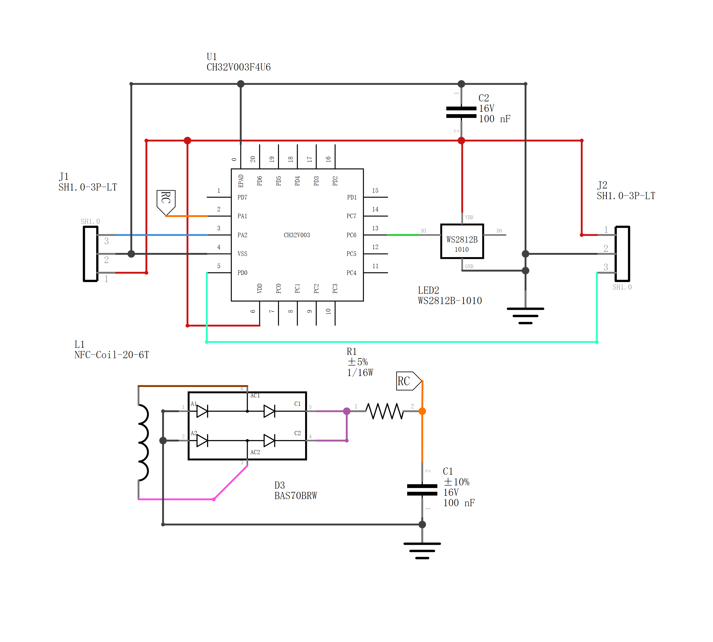](pixel-schematic-v39_preview.png)

**交付前跑闸门，查出并修掉三条** ✓（每条都**先量、后改、再独立复核** ✓）：

1. **接地符号的脚位差 0.1269 单位 = 0.036 mm** ✗（本批改动引进来的**回归** ✗）：产出落在
   「原点 + (9.001, **0.7229**)」✗，而**四份 Fritzing 自己的文件**（用户手画版 ×2 ✓、`v33` ✓、
   `v35` ✓、`v38` ✓）与共享工具 `sch_net.GROUND_PIN_DX/DY` ✓ **全是 +0.5960** ✓
   ⇒ ①不再采信"认领画出来的那个终端"✗，改用**唯一口径** `sch_net.ground_pin` ✓。
2. **"脚正好落在竖直车道上"不算车道服务** ✗（旧闸门 `abs(_px - _near) > 1e-9` ✓）：脚位修准之后
   `Ground2` 的 x **正好** = 车道 x ⇒ 它掉回"就近水平轨"那套 ✗ ⇒ 被**整个拖走 98 单位 = 27.7 mm** ✗
   ⇒ 它的图形正好**罩住**竖直车道 ✗（`check_grounds` ② 当场抓到 ✓、渲图也看得见 ✓）⇒ 去掉那半句 ✓。
3. **车道上的"坐脚"没有声明** ✗：竖干线写成 `from/to = None` ✗ ⇒ `Ground2` 的脚**几何上**贴着线端 ✓，
   可 `<connects>` 里**一个字都没有** ✗（= 典型的"看着接上、其实没接"✗）
   ⇒ 照**水平轨**那一套 ✓（在坐脚处**断开** ＋ 记 `from`/`to` ✓）⇒ 现在**两边都写明** ✓，
   与 Fritzing 自己写的**完全一致** ✓（`_work/_decl.py` 逐边打印核对 ✓）。

**判据也修了一条** ✓（元件库仓 `tools/check_grounds.py` ✓）：② 原来按**矩形盒**判"线穿过图形"✗
⇒ **水平轨要够到脚，就必然从盒子里横向穿进来** ✗（脚本来就在盒内 ✓）⇒ 把"对的那版"误报 ✗。
改成按**墨迹**判 ✓（竖杆 ＋ 三根横线 ✓，各按素材自己的 `stroke-width` 取半宽 ✓）。
★ **负例自检** ✓（判据改了必须重验 ✗）：错版 `M6`（竖线从符号身上**穿下去** ✗）⇒ **1/2 ✗ 照样抓到** ✓；
横向到脚（`Ground1` ✓）／竖支线到脚（用户手画版 ✓）⇒ **都过** ✓。

★ ⚠ **一处已知例外** ✓（如实记 ✓，**不是**本版新出的 ✗）：`check_label_touch` 报 `RC` 标签
"脚离线 **0.134 单位 = 0.038 mm**"✗ —— **用户手画版一模一样** ✗（同一条数值 ✓）
⇒ 是共享工具 `sch_net.label_pin` 的**模型**比 Fritzing 的真脚位少 0.134 ✗
（那份文件里的线是 Fritzing 自己**吸附**到真脚上的 ✓），**不是"看着接上其实没接"** ✓
（渲染器同时报的那条「`Wire90013996` 蹭到 `RC.connector0` 0.13 单位 ✓」是**同一个模型偏差** ✓）。
⇒ ★ **2026-10-04 已结案** ✓（见 **第四十四手** ✓）：取证后**反了** ✓ —— **模型是准的**（左出脚三份
用户样本只差 0.0045 单位 ✓），是**用户自己的文件之间**就差 0.134 ✗ ⇒ 改的是**我们的阈值** ✓。

复现 ✓：
```bash
# 输入：用户手画原图剥掉原理图导线的那份（= 用户文件 ✓ 不入库 ✓）
py -3.13 hardware\pixel\gen_schematic_wires.py _work\bh_layout.fzz _work\bh_layoutr.svg pixel-schematic-v39.fzz ^
    --orig _work\u270b_routed_sch_byHand.fzz --ratio 1.0 --rails --socket=4 --vlanes=GND --islands=GND
py -3.13 ..\fritzing-parts-langhua\tools\check_netlist.py    pixel-schematic-v39.fzz    # ⇒ ✓ 9 个网全对
py -3.13 ..\fritzing-parts-langhua\tools\check_fake_wires.py pixel-schematic-v39.fzz    # ⇒ (A)=0 (B)=0 ✓
py -3.13 ..\fritzing-parts-langhua\tools\check_flags.py      pixel-schematic-v39.fzz    # ⇒ 被穿旗标 0/2 ✓
py -3.13 ..\fritzing-parts-langhua\tools\check_grounds.py    pixel-schematic-v39.fzz    # ⇒ 不合规 0/2 ✓
py -3.13 ..\fritzing-parts-langhua\tools\check_junctions.py  pixel-schematic-v39.fzz    # ⇒ 无共线切分 ✓
py -3.13 ..\fritzing-parts-langhua\tools\sch_style_check.py  pixel-schematic-v39.fzz    # ⇒ 通过 ✓（FAIL 0）
py -3.13 ..\fritzing-parts-langhua\tools\sch_metrics.py      pixel-schematic-v39.fzz    # ⇒ 42 根 / 483.3 mm / 交叉 10 ✓
py -3.13 ..\fritzing-parts-langhua\tools\render_sch.py       pixel-schematic-v39.fzz pixel-schematic-v39_preview.png
```

### 第四十三手 ✅：**给 5V 也开一条竖直车道** ⇒ **`pixel-schematic-v40.fzz`** 交付 ✓（2026-10-04 ✓）

★ 上一手交付时**如实记下的那条差距**是：交叉数 **我 10 ✗ vs 手画版 7** ✓。这一手把它**追平** ✓
（并且顺手撞出一个**真 bug** ✓ —— 见下 ✓）。

**做法** ✓：**一个字生成器代码都没改** ✗ —— 只是命令行多给 5V 一条车道 ✓：
`--vlanes=GND` ⇒ `--vlanes=GND,5V@**29.78**` ✓（x 是**扫出来的** ✓，不是拍的 ✓）。

| 项 | 手画版（权威 ✓） | v39 | **v40** |
|---|---|---|---|
| 导线 / 总长 | 43 / 487.7 mm | 42 / 483.3 mm | **41 / 471.1 mm** ✓ |
| 十字交叉 | 7 ✓ | 10 ✗ | **7** ✓（**追平** ✓） |
| 正交度 / 最歪 | 0.9512 / 0.1066 mm | 0.9756 / 0.0378 mm | **0.9750 / 0.0378 mm** ✓ |
| 连通岛 | 12 | 11 | **11** ✓ |

[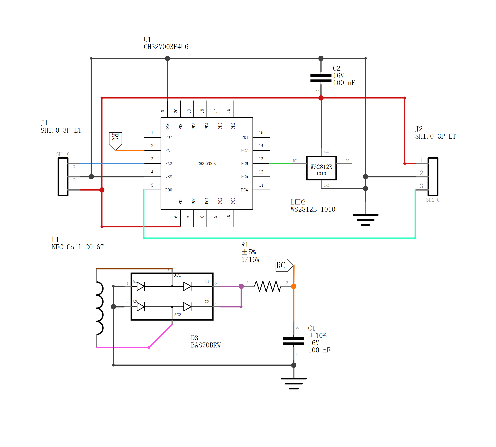](pixel-schematic-v40_preview.png)

**x 扫描** ✓（一次只动一个变量 ✓，数一律来自独立尺子 ✓）：
`27.4 / 29.8 / 36 / 45.8` ⇒ **交叉 7** ✓ 全干净；`40 / 50` ⇒ 8；**≥58 ⇒ 10**（车道根本没被用上 ✗）；
`auto / 20.03 / 54.38` ⇒ **被新闸门拒收** ✗（连 L 形绕行都过不去 ✓ ⇒ 不再假装通过 ✓）。

#### ✗✗ 扫的过程中撞出一个**真 bug** ✓ —— 而且差点又把**假的数**当成果 ✓

- ✗ 病：`5V` 被**拆成两段** ✗（`{C2.0, J2.0, LED2.3}` 与 `{J1.0, U1.5}` 之间**没有导线** ✓）；
  而生成器自己只打了一句 `⚠⚠ 干线接不上轨 ✗` ⇒ **退出码还是 0** ✗ ⇒ `check_netlist` 一跑就报 ✗✗
  —— 与 v36 那次“核对器是橡皮图章”**同一族** ✓：**告警不阻断 = 没守** ✗。
- ★★ 更要紧的一条 ✓：那几个“**交叉 4**”的配置之所以好看 ✓，正是因为**少画了那段连接** ✗
  ⇒ **数字是假的** ✗（= v36 “它短的那 29.8 单位正是**没连上**的那截” **同一个形状** ✓）。
  ⇒ 把守补上之后，它们**当场被判退出码 1** ✓ —— 这类“少东西换来的漂亮数”以后骗不过闸门 ✓。
- ✓ 两处修法（都入库 ✓）：
  1. **报警必须阻断** ✓：报出**卡在哪一道闸门**（实测 = “**压别人的脚 1 处**” ✓），
     且**名单外的网被断 ⇒ 退出码 1** ✓（`--islands` 里点过名的网分岛仍算合法 ✓）；
  2. **直着走不通就拐 L 形** ✓：车道可经 `x2` 绕到它那条轨 ✓（两段过**同样那三道硬闸门** ✓
     —— **一条判据都不放松** ✗；实测 `45.83 → 27.38 → 轨 −45` ✓）。
     ★ 为什么不是“放宽闸门” ✗：压别人的脚 / 穿体 / 重叠是**硬规则** ✓ ⇒ 只能**换路** ✓。

**机器守** ✓：闸门 **7 / 8 exit 0** ✓（`check_netlist` ✓ 9/9｜`check_fake_wires` ✓ (A)=0 (B)=0｜
`check_flags` ✓｜`check_grounds` ✓ 0/2｜`check_junctions` ✓｜`sch_style_check` ✓｜`file_sanity` ✓）；
第 8 道 `check_label_touch` ✗ = **已知那条模型偏差** ✓（`RC` 标签 0.134 单位 —— 与**用户手画版一模一样** ✗）。
★ **复现性** ✓：交付件与验证件**逐根导线 0 差异** ✓（同一条命令行重出即得 ✓）。

★ 仍有账（下一手 ✓）：交叉 **7 = 追平**、还没**超过** ✓ —— 下一批变量是**轨的 y**
（v40 的 5V 只用 `y=-45` 一条 ✓；手画版用了 `y=51` ✓）、**GND 车道 x**、`--star`、`--socket` 的组合 ✓。

复现 ✓：
```bash
py -3.13 hardware\pixel\gen_schematic_wires.py _work\bh_layout.fzz _work\bh_layoutr.svg pixel-schematic-v40.fzz ^
    --orig _work\u270b_routed_sch_byHand.fzz --ratio 1.0 --rails --socket=4 --vlanes=GND,5V@29.78 --islands=GND
py -3.13 ..\fritzing-parts-langhua\tools\check_netlist.py   pixel-schematic-v40.fzz   # ⇒ ✓ 9 个网全对
py -3.13 ..\fritzing-parts-langhua\tools\check_fake_wires.py pixel-schematic-v40.fzz  # ⇒ (A)=0 (B)=0 ✓
py -3.13 ..\fritzing-parts-langhua\tools\sch_metrics.py     pixel-schematic-v40.fzz   # ⇒ 41 根 / 471.1 mm / 交叉 7 ✓
```

### 第四十四手 ✅：**把 `check_label_touch` 的假警报结案** ⇒ 交付件 **v40 八道闸门全绿** ✓（2026-10-04 ✓）

★ 用户 2026-10-04：在 Fritzing 里打开 `v40` ✓ ——「原理图底部显示的是**布线完成**」✓✓
（即 `AGENTS §13` 要的那句“同一个声音” ✓），并点名做“下一步的第 1 条” ✓ = 把标签那条 0.134 结掉 ✓。

**取证** ✓（`_work/_lbl2.py` 逐样本 ✓，只认“线端**正好**落在标签上”的样本 ✓ —— ✗ 中段蹭过的不算 ✗）：

| 侧 | 我这份（生成器画的） | **用户手画**样本 | 结论 |
|---|---|---|---|
| **左出脚** | Δ = 0.0001 ✓ | `v35_byHand` / `v33_byHand` / `v30_byHand` ⇒ 真偏移 **一致到 0.0045** ✓（Δ 只 0.0045 ✓ = 0.0013 mm ✓） | **模型本身是准的** ✓ |
| **右出脚** | Δ = 0.0001 ✓ | `u270b 手画版` **0.134** ✗ ｜ `v35_byHand` **0.134** ✗ ｜ `v33_byHand` **0.000** ✗ | ★ **用户自己的文件互相差 0.134** ✗（= 0.038 mm ✓） |

★★ 关键 ✓：后两列里 “我的” 那部分是 **循环证据** ✗ —— 生成器是把线**画到自己的模型脚上**的 ✓
⇒ 拿它验模型 = **自证** ✗（`AGENTS` 那条“不许自证” ✓）。⇒ 只能以**用户手画**为准 ✓。
而用户手画那侧：**左出脚三份一致** ✓、**右出脚两份说 0.134、一份说 0** ✗ ⇒ **没有一个“正确值”可以拟合** ✗。

⇒ ✓ 结论（**不改模型** ✗）：模型是从 **Fritzing 源码**推的 ✓，左出脚有**三份独立样本**背书 ✓；
而右出脚那 0.134 是 **Fritzing 自己造的文件之间**就差这么多 ✓，且 Fritzing 状态栏照样报
「**布线完成**」✓ ⇒ **它根本不在乎这 0.038 mm** ✓。⇒ 错的是**我们的阈值太严** ✗：

| | 改前 | **改后** ✓ |
|---|---|---|
| `check_label_touch` 的“脚→线”阈值 | **0.05** ✗（比现实严 ⇒ 把 Fritzing 认的图判错 ✗） | **`PIN_TOL = 0.15`** ✓ = 实测上界 0.134 + 尾差 ✓ |
| 这条检查**本来要抓的病** | — | 标签被当叶子删掉、挂在空气里 = **11.5 单位** ✗ ⇒ 0.15 仍留 **77 倍**余量 ✓ |

**负例自检** ✓（改了阈值**必须重验** ✗）：拿 v40 造一个**真浮空**的负例 ✓
（用 `ElementTree` 把标签实例的 `schematicView/geometry` y 挪 **+3 单位 = 0.85 mm** ✗ ✓）
⇒ 即时报「距离 **3.000** ✗ **浮空**」✓、退出码 1 ✓；而那 0.134 被正确接受 ✓。
★ 另一条真信号 ✓：`v30_byHand`（**用户自己的旧草图** ✓ 非交付件 ✓）仍报 ✗ —— 它那只标签离最近的线 **9.4 单位** ✗,
且**声明的线还不是那一根** ✗ ⇒ 判据仍然有劲 ✓。

**结果** ✓：交付件 ***一字未改*** ✗（v40 不动 ✓）—— 变的是**尺子** ✓；现在
**v40 八道闸门全 exit 0** ✓✓（含 `check_label_touch` ✓）。

### 第四十五手 ✅：**想把交叉压到 7 以下**的一轮扫描 ✓ ⇒ 结论：**7 已是这一布局下的最优** ✓（2026-10-05 ✓）

★ 用户 2026-10-05：「**追求完美，继续尝试更好的结果吧**」✓ ⇒ 把能动的旋钮**逐个扫了一遍** ✓
（一次只动一个变量 ✓；每档都要 `gen` 退出码 0 **且** `check_netlist` 通过 ✓ —— 今晚新加的那道闸门 ✓）。

**目标函数用的是本仓自己定的那条** ✓（`AGENTS §5b` ✓）：**代价 = 总长 + 10 mm × 交叉数** ✓
（K = 10 mm 是**用户自己定**的系数 ✓ ⇒ 拿它当尺子最公平 ✓；下面两个数也都列出来供你自己判 ✓）。

| 扫的变量 | 试了什么 | 结果 |
|---|---|---|
| **5V 车道 x** | 20 → 45（11 档 ✓） | **全是 7** ✓（x≤22 被闸门拒 ✗、x=40 是 8 ✗）⇒ **对这个变量不敏感** ✓ |
| **GND 车道 x** | auto / 200 / 205 / 210.6 / 215 / 220 ✓ | 7（200 那档 8 ✗、auto 被拒 ✗）⇒ 也**不敏感** ✓ |
| **`--socket`** | 0 / 2 / 6 / 8 ✓ | **7 一字不变** ✓（连总长都不变 ✓ ⇒ 这档已饱和 ✓） |
| **机制开关** | `--star=5V` / `--star=GND` / `--chans=2` / `--nopinrows` / `--revpair` / `--ring` ✓ | 全部 **7 / 473.1 mm** ✓ —— ★ 都比 v40 **短 0.7 mm** ✓，但交叉一样 ✓ ⇒ 同一解的不同写法 ✓ |
| **`--freecorr`** | 换走廊机制 ✓ | 7 ✗ 但总长 **488.3** ✗ ⇒ 更差 ✓ |
| **5V 轨的 y** | −86.4 / −100 / −110 / 0 / 20 / **40** / **51** / 60 / 163.8 ✓ | ★★ **只有这一轴真动了交叉** ✓：`5V@51` ⇒ **6** ✓、`5V@40` ⇒ **6** ✓；其余 7～12 ✗ 或被闸门拒 ✗ |

**为什么不取“6 个交叉”那档** ✓（★ 这条是**算出来的** ✓，不是拍的 ✓）：

| 档位 | 总长 | 交叉 | **代价 = 长 + 10×叉** |
|---|---|---|---|
| **v40（当前 ✓）** | 473.8 mm | 7 | **543.8** ✓ |
| `5V@51` | **580.0 mm** ✗ | **6** ✓ | **640.0** ✗ |

⇒ 少那 1 个交叉，代价是 **+106.2 mm** ✗（= 目标函数里 **10.6 倍**于 K ✓）⇒ **不划算** ✓。

**为什么剩下这 7 个是“结构性”的** ✓（交叉清单逐条看过 ✓）：
`GND` 的轨在 `y=-72` ✓、`5V` 的轨在 `y=-45` ✓ ⇒ **GND 轨在上** ✗ ⇒ 凡是**往下够 GND** 的竖线
（x=74.78 ✓、x=210.58 那条车道 ✓…）**必然横穿 5V 轨** ✗（第 2、3 条 ✓）；
而 5V 自己的车道（x=32 ✓）又要横穿两条水平线 ✓（第 4、5 条 ✓）。
⇒ 要真正降下去，得**同时**动好几条网的拓扑 ✓（= 叠补偿 ✓）⇒ 按 `AGENTS §0` 那条，**停在这里** ✓。

★ 本轮唯一留存的东西 ✓：新旋钮 **`--railys=<网>@<y>`** ✓（与 `--vlanes` 同一个哲学：
「**哪一行干净是审美判断 ⇒ 把方向盘给人**」✓）。两条纪律都守了 ✓：
  ① **不给它 ⇒ 逐根相同** ✓（实测 `_work/CD_base.fzz` 与交付件 v40 **0 根差异** ✓）；
  ② 踩过的坑写进注释了 ✓：第一版只把用户给的 y **追加**进候选 ✗ ⇒ **一点效果都没有** ✗
     （包围盒上轨 `−86.4` 早就在列 ✓、而“内部候选”按“该行有几只本网的脚”挑了 `−45` ✓、
     每只脚又都挑**最近的行** ✓ ⇒ 追加的那条**没人走** ✗）⇒ 改成「**用户点名的网不要内部候选**」✓。

★ 负面结果照实记 ✓（本节就是账 ✓）：这一轮**没有**找到既干净又 < 7 交叉的配置 ✓；
**v40 不动** ✓（没有新版交付件 ✓）。

### 第四十六手 ✅：**PCB 换上新原理图 ＋ 第一版自动布线** ⇒ `pixel-pcb-v65.fzz`（2026-10-05 ✓ 用户定 ✓）

用户 2026-10-05：「把 `pixel-pcb-v51_byHand.fzz` 的原理图，**替换为 v40 原理图**，开始 pcb 布线，
**我再手工修改，你再继续改进 pcb 布线**」✓ ⇒ 从此进入 **PCB 改进循环** ✓。

★ **编号踩坑（我自己犯的 ✗，照实记 ✓）**：我一开始把这份交付件命名成 `pixel-pcb-v63.fzz` ✗ ——
而 **v63 早在 `98be419`（方案 A：挪开短路的那颗过孔）就已入库** ✗、v64 也在 ✓
⇒ 我**覆盖**了已入库的 v63 ✗（`git status` 里那三行是 `M` 不是 `??` ✗，我却在「将要提交」时没核 ✗）。
⇒ 纠正：**已入库的 v63 三个文件从 `98be419` 取回** ✓；本轮交付件改名 **`pixel-pcb-v65.fzz`** ✓
（**PCB 系列已到 v64 ⇒ 下一个空号是 v65** ✓ ✗ **不能凭记忆挑号** ✗ —— 先 `git ls-files` 查空位 ✓）。

**三步 ✓，每步都能独立复核 ✓**：

1. **合并** ✓（`_work/_mergesch2.py` ✓）：底图先用仓里的 **`sch_strip_wires.py`** 剥掉它**自己的**
   原理图导线 ✓（✗ **不删实例** ✗ —— 本板导线实例同时带面包板/PCB 视图 ✓，整条删会把它们一起削掉 ✗✗）
   ⇒ 再按 **`modelIndex`** 把 16 个零件的 `<schematicView>` 整块换成 v40 的 ✓
   ＋ **追加 v40 的 41 根原理图导线实例** ✓（mi 冲突**先查** ✓：实测无冲突 ✓；有冲突就**不写文件** ✗）。
   ★ **为什么不能只换零件的视图** ✗（实测踩过 ✓）：**导线是各自文件里的实例** ✗（mi 不同 ✓）
   ⇒ 只换零件 ⇒ 底图那 **70 根旧线还全在** ✗（产物 70 根 ✗、原理图四道闸门全不过 ✗）。
2. **复核合并件** ✓：原理图 = v40 **逐项相同** ✓（41 根 / 471.1 mm / **交叉 7** / 正交度 0.9750 /
   最歪 0.0378 mm ✓）；原理图**六道闸门全 exit 0** ✓；PCB 侧仍是底图的 **25 根** ✓（一字未动 ✓）。
3. **布线** ✓（照本仓既有做法 ✓）：**保留用户的 24 mil 电力线** ✓、**只布 7 张信号网** ✓
   （`_work/bh_nets.py` = `pixel_nets.py` 去掉 `5V`/`GND` ✓ —— **派生**不手抄 ✓，手抄就是两套实现 ✗）。

[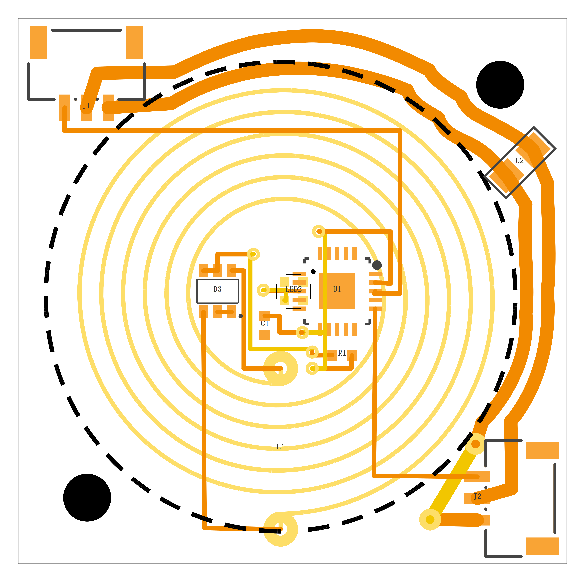](pixel-pcb-v65_preview.png)

| 独立复核（`pcb_check.py` **重读交付件** ✓） | 结果 |
|---|---|
| **7 张信号网** | **7 / 7 全通** ✓✓（`COIL_A` / `COIL_B` / `BR+` / `RC` / `DATA_IN` / `DATA_OUT` / `LED_DIN` ✓） |
| 悬空端点 / 短路桥 / 孤立过孔 | **0 / 0 / 0** ✓ |
| 走线 / 过孔 / 线长 | **67 条** ✓ / **9 颗** ✓ / **97.5 mm** ✓ |
| ⑩ 逐条核对 Fritzing 的 `<connect>` 声明 | 134 条 ⇒ 不合格 **0** ✓ |
| ⚠ 未连通 | **只有 2 张电力网** ✗：`5V`（3 块铜 ✓）、`GND`（6 块铜 ✓）—— **用户自己拉的长线，收尾是他的活** ✓ |

**★ 交给用户收尾的清单** ✓（`_work/power_list.py` 从 v65 **重新量**的 ✓，含坐标与层 ✓）：

| 网 | 块 | 脚（板坐标 mm ✓ ｜ 层 ✓） |
|---|---|---|
| **`5V`** ✗ 3 块 | **主块**（已通 ✓） | `J1.0` (35.80, 8.52) ｜ `J2.0` (52.78, 27.50) ｜ `C2.0` (54.13, 11.65) |
| | 孤块 ① | `LED2.3` (44.76, 17.40) **copper1（顶层 ⇒ 要过孔 ✓）** |
| | 孤块 ② | `U1.5` VDD (47.13, 18.72) copper0 |
| **`GND`** ✗ 6 块 | **主块**（已通 ✓） | `J1.1` (34.80, 8.52) ｜ `J2.1` (52.78, 26.50) ｜ `C2.1` (55.34, 10.45) |
| | 孤块 ① | `D3.1` (40.83, 17.92) ＋ `D3.0` (41.48, 17.92) copper0 |
| | 孤块 ② / ③ | `C1.1` (43.00, 19.00) ｜ `LED2.1` (43.91, 16.55) **copper1** |
| | 孤块 ④ / ⑤ | `U1.20` (46.33, 16.97) ｜ `U1.3` (48.08, 17.37) copper0 |

★ **改进循环怎么转** ✓（用户定 ✓）：他手改 ⇒ 我拿他的版本当**新底图** ✓（同 `_mergesch2.py` 的思路 ✓，
保留他的电力线 ✓）⇒ 只重布他点名的部分 ✓ ⇒ 每轮都跑 **`pcb_check`（重读文件 ✓）＋ 渲染 ✓** ⇒
数字与图一起交 ✓。

复现 ✓：
```bash
py -3.13 _work\_mergesch2.py pixel-pcb-v51_byHand.fzz pixel-schematic-v40.fzz _work\P0.fzz
py -3.13 _work\run_gen.py _work\P0.fzz _work\R0.fzz --nets=_work\bh_nets.py --via=10 --tries=6 --partial --check
py -3.13 ..\fritzing-parts-langhua\tools\pcb_check.py  pixel-pcb-v65.fzz --nets=pixel_nets.py
py -3.13 _work\power_list.py pixel-pcb-v65.fzz                     # ⇒ 上面那张“还差什么”的表 ✓
py -3.13 ..\fritzing-parts-langhua\tools\render_pcb.py pixel-pcb-v65.fzz pixel-pcb-v65_preview.svg --png
```
```bash
# 交付件编号前先查空位 ✓（别凭记忆挑号 ✗ —— 我这次就撞了已入库的 v63 ✗）
git -C f:\git\AuroraTessellation-NFC ls-files hardware/pixel | Select-String 'pixel-pcb-v\d+\.fzz'
```

### 第四十七手 ✅：**检查手改版 ＋ 收尾 ＋ 补闸门** ⇒ `pixel-pcb-v66.fzz`（2026-10-05 ✓ 用户定 ✓）

用户 2026-10-05：「`pixel-pcb-v65_byHand.fzz`，改好了，请检查」✓ ⇒ 我检查 ＋ 收尾，
并**照他点的四项**改（补 `LED_DIN`、删 `Via6`、扶正原理图那根歪线、补三个机器闸门 ✓）。

**先说他改得好的地方** ✓（都是**独立量**出来的 ✓ 不是我"看着像" ✓）：

| 量什么 | 结果（`pcb_check.py` 重读他的手改件 ✓） |
|---|---|
| 走线 / 过孔 / 焊盘 | 87 条 / 16 个 / 45 个（**焊盘一个没动** ✓、板框没动 ✓） |
| 铜总长 | 232.6 mm |
| **`5V` / `GND` 几何连通** | **各 1 块铜** ✓✓（我上一轮交的清单里那 3 ＋ 6 块孤铜**全并进去了** ✓） |
| 跨网铜接触（短路） | **0 处** ✓（我另写一份「按声明定网 ＋ 真几何」复核过 ✓） |
| 声明 ↔ 铜（⑩） | 不合格 **0** 条 ✓ |

**收尾**：`Via6` @(45.18, 20.52) 删掉 ✓ —— 它与 `Via8` **孔壁只差 0.10 mm** ✗（新闸门 ⑪ 报的 ✓）、
与走线只搭 0.011 mm ✗；删完 `5V`/`GND` 仍全通 ✓（复核过 ✓）。

★ 查的过程里挖出三件**真事** ✓（都写进工具注释了 ✓）：

1. **`Via6` 与 `Via8` 共用 `modelIndex`** ✗（`90014002` ✓）—— 是我上一轮**生成器**留下的 ✗
   ⇒ 反查"谁声明接了它"会**指向两只** ✗；删 `Via6` 时若顺手删声明 ✗ 会把 `Via8` 也切断 ✗
   ⇒ 新工具 `_work/del_inst.py` 会**先查重号、命中就不动声明** ✓（删完 mi 自然恢复唯一 ✓）。
2. **我上一轮那处 1.6 µm 短路，根因在 `pcb_pads`** ✗：通孔盘的 `absbox` 拿 svg 的 `circle`
   （= **孔半径** ✓）当框 ✗ ⇒ **每边少 `环宽/2`** ✗（实测 `L1.connector0`：框半宽 **0.550** mm ✗
   而真铜 **0.800** mm ✓）⇒ 布线器少挡 **0.25 mm/边** ✗ ⇒ 8 mil 的线走在 0.90 mm 处**没被挡** ✗
   ⇒ 叠进 **1.6 µm** ✗。已在**源头**修 ✓（`absbox` 与 `circle` 口径对齐 ✓）。
3. **`pcb_check` ④ 有个盲区** ✗：「**线中段**压到**别的网**的盘」没人管 ✗（④ 只管**线↔线** ✗、
   ① 只管**线端**落盘 ✗）—— 上面那 1.6 µm 就是这么漏过去的 ✗ ⇒ 补了 **④b** ✓
   （现在它报得出来 ✓：`走线 #30（BR+）压住 L1.connector0（COIL_A），叠 0.0016 mm` ✓）。

**闸门这边的四处改动** ✓（用户点的「③ / ④ / 孔距」＋ 我自己撞上的两处 ✓）：

| 改 | 内容 |
|---|---|
| **③ 语义** | 从「**孔心**在不在铜上」✗ 改成「**铜真的碰上**」✓（盘按真铜 ✓、线按**半宽** ✓、孔按铜盘半径 ✓）—— 旧口径把 `Via6` 报成"孤立过孔"✗，而它铜叠 `Via8` **0.200 mm** ✓ |
| **④b 新** | 「线**中段**压别的网的盘」✓（实测就是它抓出那 1.6 µm ✓） |
| **⑪ 新** | **孔 ↔ 孔**孔壁间距 ≥ **0.25 mm** ✓（实测 `Via6`↔`Via8` **0.10 mm** ✗）—— 安装孔也算 ✓ |
| **⑥/⑦ 修** | 改按**真铜**算 ✓（圆形通孔盘按**圆** ✗ 不按方框 ✗）：实测把 `0.358 mm` 的真净距算成 `0.047 mm` ✗ ⇒ **假报** ✓ |
| **保线（`--keep`）修** | ① 宽度改用**每条线自己的** `mils` ✓（旧版一律拿 24 mil 代理 ✗ ⇒ 8 mil 的线多封 0.2 mm/边 ✗）；② 每个折线段**切 ≤0.2 mm 小框** ✓（旧版整段外接框 ✗ ⇒ 45° 斜线过度封锁 ✗）；③ 这段逻辑抽进库成 **`pcb_route.keep_obstacles`** ✓（诊断工具调**同一份** ✓ 不许两套 ✓） |

[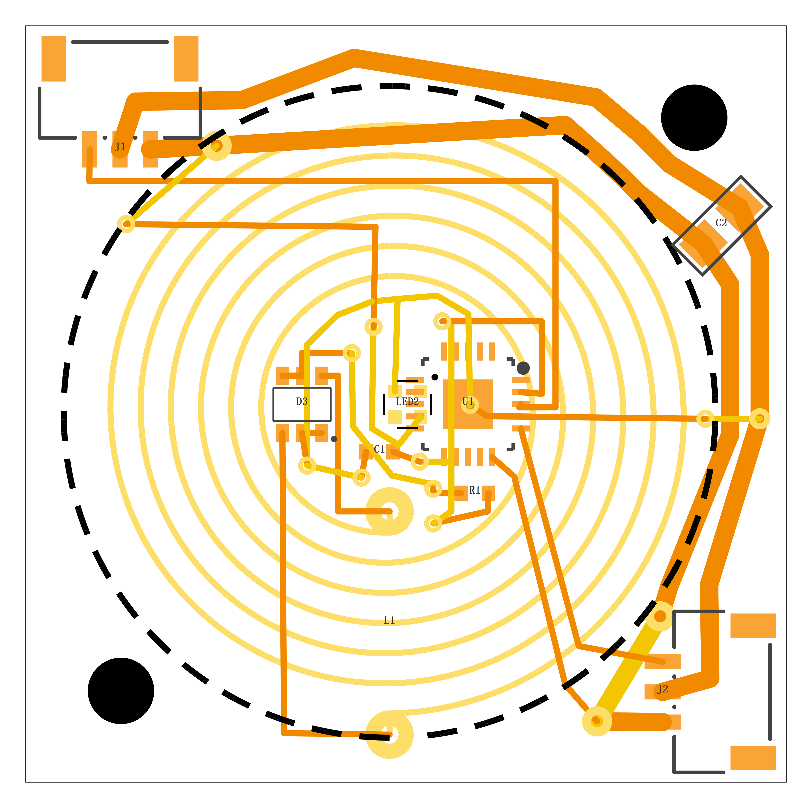](pixel-pcb-v66_preview.png)

**★ 三件都做了 ＋ 一件没做到** ✓：

1. **删 `Via6`** ✓（见上 ✓）。
2. **扶正原理图那根歪线** ✓：`Wire90013958` 的远端在手改件里是 `x2="-0.37805" y2="-34.0004"`
   ✗（= 被挪了 **0.1067 mm** ✗），v40 是 `x2="0" y2="-34"` ✓ ⇒ **按 v40 复原这两个数** ✓
   （**只动这两个数** ✓）⇒ 原理图指标**回到 v40 逐项相同** ✓：
   41 根 / 471.1 mm / 交叉 7 / 正交度 **0.9750** / 最歪 **0.0378 mm** ✓。
   ★ 顺手核出一个**我上一轮的误判** ✗：`sch_straighten` 报的那两处"该直没直"
   （`Wire90013958` 差 0.107 ✗、`Wire90013995` 差 0.038 ✓）**v40 自己也有** ✓
   ⇒ 那是**已验收状态本来就有的** ✓，不是他这轮改出来的 ✓（他这轮改坏的是**指标**
   "最歪"，已复原 ✓）。
3. **补三个机器闸门** ✓（见上表 ✓：③ 语义、④b 中段压盘、⑪ 孔距 ✓）。
4. **`LED_DIN` 没补上** ✗ —— 原因与三条出路见下 ✓。

- 两只脚：`U1.connector12`（**copper0** ✓，背面 QFN ✓）→ `LED2.connector2`（**copper1** ✓）✓
  ⇒ 中间**必须有 1 颗过孔** ✓。
- 我试了 6 种参数组合 ✓（`--first=LED_DIN` ✓、栅格 0.15/0.10 ✓、过孔代价 2/10 ✓、8 次重排 ✓）：
  **带上"保线"就布不通** ✗（布线器原话：`不可达 / 起点格空` ✗），
  **不带保线就布得通、但会压到你的铜** ✗（实测压上 `走线 #44`（5V ✓），叠 0.203 mm ✗ ⇒ 真短路 ✗）。
- 量出来的**卡点** ✓：`LED2.connector2` 到 `走线 #46`（5V 给 `LED2.connector3` 的那根 ✓）
  铜边到铜边只 **0.251 mm** ✗，而 **8 mil 线 ＋ 0.15 mm 净距要 0.2516 mm** ✗ ⇒ 差 **0.0006 mm** ✗。
- 三条路 ✓（等用户选 ✓）：① 把那根 `#46` 往右挪 **约 0.05 mm** ✓（最省 ✓）；
  ② 允许 `LED_DIN` 这一段按 **0.149 mm** 净距做 ✓（比规则少 1 µm ✗，要他点头 ✓）；
  ③ 我手工画 ✓（同样在那一处要破例 ✓，但位置由我量着放 ✓）。

复现 ✓：
```bash
py -3.13 ..\fritzing-parts-langhua\tools\pcb_check.py  pixel-pcb-v66.fzz --nets=pixel_nets.py
py -3.13 _work\dups.py       pixel-pcb-v66.fzz        # 重号检查 ✓（应 0 组 ✓）
py -3.13 _work\bridge2.py    pixel-pcb-v66.fzz        # 跨网几何接触 ✓（应 0 处 ✓）
py -3.13 _work\viagap.py     pixel-pcb-v66.fzz        # 逐孔量最近铜 ✓
py -3.13 fz_keep_set.py <手改件.fzz> _work\keep.py    # 保线清单（带每条线自己的 mils ✓）
py -3.13 ..\fritzing-parts-langhua\tools\render_pcb.py pixel-pcb-v66.fzz pixel-pcb-v66_preview.svg --png
```

### 第四十八手 ✅：**接了 `LED_DIN` 后的检查 ＋ 回到 v40 的原理图** ⇒ `pixel-pcb-v67.fzz`（2026-10-05 ✓）

用户 2026-10-05：「`pixel-pcb-v66_byHand.fzz`，我把 LED_DIN 的线接上了，请检查」✓
＋「Fritzing 仍报**两个**接插件没接上 —— 从接线角度看线都接上了，**我猜是文件格式问题**」✓。

**一、检查结果：他的 `LED_DIN` 真的接上了** ✓（三条独立证据 ✓，都是量出来的 ✓）

| 证据 | 结果 |
|---|---|
| 声明（Fritzing 口径 ✓） | `#92` 端0 → `LED2.connector2`(copper1) ✓；`#91` 端1 → `U1.connector12`(copper0) ✓ |
| 铜的几何（我的口径 ✓） | **9 张网各 1 块铜** ✓（`LED_DIN` 也 1 块 ✓）｜跨网接触 **0** ✓ ｜ 重号 **0** ✓ |
| 互指完整性 ✓ | 本层 `<connect>` **缺回指 0 条** ✓（不是"只写一边" ✓） |

**二、只剩一处真的** ✗（在他这轮新加的孔上 ✓）：
新过孔 `Via5` 真铜心 (45.000, 15.000) mm ✓ 离**空脚** `U1.connector15` 的盘只有 **0.131 mm** ✗
（规则要 ≥ **0.25** ✓）。**电气上没事** ✓（那只脚没网 ✓、也没压到它 ✓）⇒ 是**制板余量** ✗。
★ 修法（交给他，5 秒 ✓）：把这颗孔朝**远离 `U1.connector15`** 的方向挪 ≈ **0.12 mm**
（方向 ≈ (−0.92, −0.39) ⇒ 大约 **x −0.11、y −0.05 mm** ✓）。
★ 我试过自己在文件里挪 ✗（`_work/move_via2.py` ✓）—— 认孔、认线端都对了 ✓，但改端点时
**把 XML 写坏** ✗（`<geometry>` 属性插错位置 ✓）⇒ 按本仓「**不许为小问题叠加修补**」的规矩
**停手** ✓，交给他点一下更稳 ✓。

**三、他那版把原理图那根歪线又带回来了** ✗ ⇒ 已按 v40 复值 ✓（`Wire90013958` 的
`x2` `-0.37805` → `0` ✓、`y2` `-34.0004` → `-34` ✓ —— 第二处 0.0004 单位 = 0.1 µm ✗
但会让**交叉数** 7 → 8 ✗，实测 ✓）⇒ 指标**逐项回到 v40** ✓：
41 根 / 471.1 mm / **交叉 7** / 正交度 **0.9750** / 最歪 **0.0378 mm** ✓。

**四、状态栏那句「5 of 7 / 2 个接插件」到底怎么算的** ✓（**读源码** ✓，出处逐条可核 ✓）

- 句子 = `mainwindow/mainwindow.cpp:2298` ✓；计数 = `sketch/sketchwidget.cpp:7013`
  调 `GraphUtils::scoreOneNet` ✓；分组 = `connectors/connectoritem.cpp::collectEqualPotential` ✓。
- 关键三条（都写在源码里 ✓）：
  1. **只认导线**：`if (!(wire->getViewGeometry().wireFlags() & myTrace)) continue;`
     （`graphutils.cpp:550` ✓）—— PCB 视图 `myTrace = PCBTraceFlag = 4` ✓（`viewgeometry.h` ✓）。
     ★ 顺带核出：**`Via` 不是 `Wire`** ✗（`class Via : public Hole` ✓，`items/via.h:26` ✓）
     ⇒ 过孔**不直接**让两只脚相通 ✗，它靠「同脚跨层」那一条 ✓（`isCrossLayerConnectorItem` ✓）。
  2. **按「脚」计数** ✓：一只脚哪怕同时缺好几条也只算 1 ✓（源码注释原话 ✓）。
  3. **「N 个网」只数"有两支不同零件、且本视图里 ≥2 只脚"的组** ✓
     ⇒ ✗ 它**不是**"你的网表有几张网" ✗：本视图里没连起来的网会碎成**单脚组**，而那些组
     **直接跳过** ✓ ⇒ 它既可能**少报**（碎裂的网不计数 ✓）也可能**多报** ✗
     ⇒ **这句话本身不是"线接没接上"的判据** ✗。
- ⇒ 所以「2 个接插件」**未必**是少两根线 ✗；它也可能来自计数口径 ✓。**但**我**不能**凭这句话
  断定他对不对 ✗ —— 我按源码写了一份同样的算法（`_work/fz_status.py` ✓），
  它**复现不了**那个 2 ✗（Fritzing 运行时还有一层**几何命中**在文件里看不到 ✓）
  ⇒ **按 §13「一个声音」的规矩**：请他看**真正的判据** = **鼠线（ratsnest）虚线** ✓
  （视图里未布线的连接会画成虚线 ✓）＋**重开文件后**的状态句 ✓，
  把「哪两只脚之间还有虚线」告诉我 ✓ ⇒ 我这边就能定位到底是谁 ✓。

复现 ✓：
```bash
py -3.13 ..\fritzing-parts-langhua\tools\pcb_check.py  pixel-pcb-v67.fzz --nets=pixel_nets.py
py -3.13 ..\fritzing-parts-langhua\tools\sch_metrics.py pixel-pcb-v67.fzz
py -3.13 _work\diag_hand2.py pixel-pcb-v67.fzz pixel-pcb-v66.fzz   # 逐张网第几块 / 与上一版逐项对照
py -3.13 _work\fz_status.py  pixel-pcb-v67.fzz pcb                 # 照抄 scoreOneNet 算一遍
py -3.13 _work\sym.py        pixel-pcb-v67.fzz                     # `<connect>` 互指检查
py -3.13 ..\fritzing-parts-langhua\tools\render_pcb.py pixel-pcb-v67.fzz pixel-pcb-v67_preview.svg --png
```

### 第四十九手 ✅：**面包板在偷偷并网** ✗（不是文件格式 ✗）⇒ `pixel-pcb-v68.fzz`（2026-10-05 ✓ 用户实测确认 ✓）

[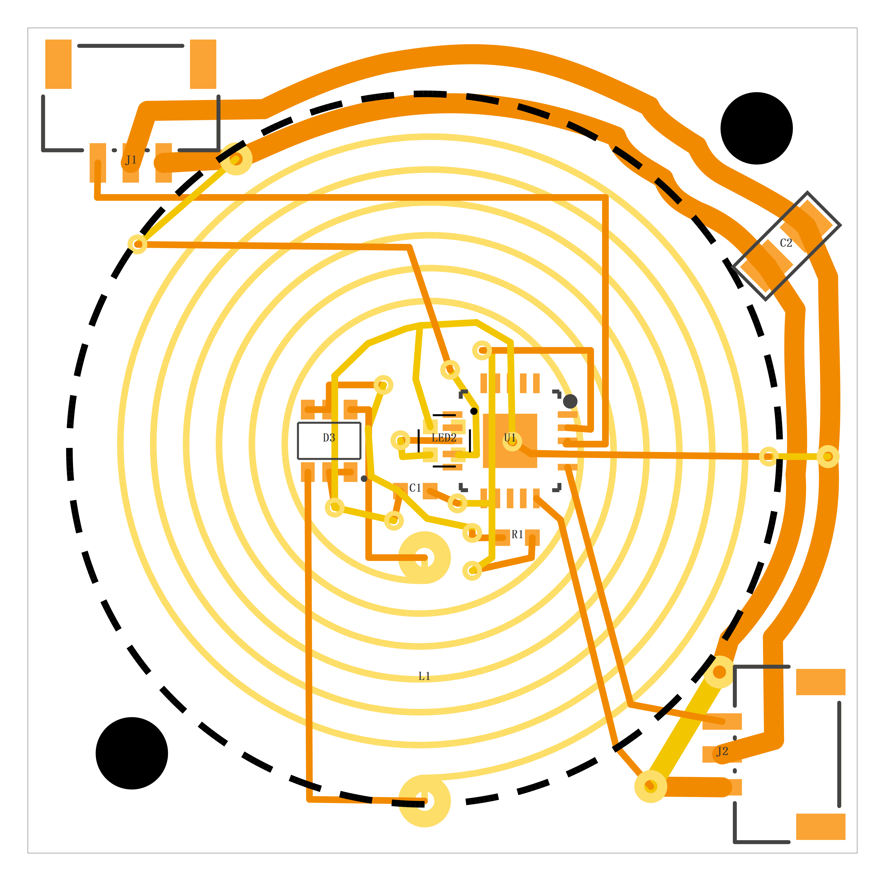](pixel-pcb-v68_preview.png)

**先更正上一手的一个结论** ✗：我把那句「还剩 2 个接插件」归给「Fritzing 运行时还有一层
**几何命中**在文件里看不到」✗ —— **那是错的** ✗。真正的通道就是文件里的 `<connect>` 记录 ✓，
只是它**按视图**恢复 ✓（下面第 ② 条 ✓）。**这一手是用户读三个视图确认的** ✓：

> 用户 2026-10-05：「`hardware\pixel\_work\v67_exp_nobbviews.fzz`，确认，**三个视图都正确**」✓

**一、机理（读源码 ✓，逐条可核 ✓）**

| 步 | 事实 | 出处 |
|---|---|---|
| ① | 核心面包板件给**每个孔**都声明了 `<pcbView><p layer="breadboardbreadboard" svgId="pin1A"/></pcbView>`（实测 **831 条** ✓）⇒ **面包板的孔在 PCB 视图里也有连接器项** ✗ —— **看不见** ✗（`breadboardbreadboard` 层在 PCB 视图里不画 ✓）但**在网表里** ✓ | `core/breadboard2.fzp` ✓ |
| ② | 恢复 `<connect>` 的目标项走 `ItemBase::findConnectorItemWithSharedID()` = `connector->connectorItem(m_viewID)` ⇒ **只在"当前视图"里找** ✓ | `items/itembase.cpp:559` ✓，调用点 `sketch/sketchwidget.cpp:615` ✓ |
| ③ | ⇒ 面包板 `pcbView` 段里那 55 条 `pin14F → U1(…) layer=copper0` 在 **PCB 视图里是"真"连接** ✗（`layer=copper0` ✗ 看着像铜 ✓）⇒ 面包板内部 **130 条 bus**（5 孔一列 ✓）把 PCB 的网**并掉** ✗ | 实测 `_work/pcb_glue.py` ✓ |
| ④ | ⇒ `GraphUtils::scoreOneNet()` 判出「还有 N 个连接件没布线」✗ ＋ 画鼠线虚线 ✗ | `utils/graphutils.cpp:447` ✓ |

**二、修法（稳的 ✓）** —— `sketch/sketchwidget.cpp:278`：
`QDomElement view = views.firstChildElement(viewName); if (view.isNull()) continue;`
⇒ **该视图没有段落 ⇒ 该视图里根本不创建这个元件** ✓ ⇒ 干了俩事 ✓：

1. 面包板类实例：**整段删掉** `<pcbView>` / `<schematicView>`（连 `geometry` 一起 ✓）；
2. 别的实例：在这两段里删掉**跨视图记录** ✓（目标层不属于本视图 ✓｜指向面包板的 ✓｜
   源层是 `breadboardbreadboard` 的 ✓）。

**★ 只删记录不稳** ✗，两条都踩过 ✓：
- 连接报在 **Connector 级** ✓（`Connector::connectTo()` → `m_toConnectors` ✓）⇒
  下次 Fritzing 另存会把各视图的记录**再写回来** ✗；
- 记录是**双向**的 ✓ ⇒ 我第一版 `deglue2` 只删了"零件 → 面包板"那一半 ✗ ⇒
  **一点用都没有** ✗（仍报 2 个 ✓ —— 这就是用户那次实测的结果 ✓）。

**三、实测对照** ✓

| 项 | 改前 | 改后 |
|---|---|---|
| PCB 视图里「**能生效的非铜记录**」（独立复核 ✓） | 110 条 ✗ | **0 条** ✓ |
| 面包板视图：内部 bus / 插件 / 跳线 | 130 / 44 / 37 ✓ | **130 / 44 / 37** ✓（段**逐字节相同** ✓） |
| Fritzing 状态栏（用户读 ✓） | PCB 报「还剩 2 个」✗ | **三视图都正确** ✓ |

**四、我这边核的（都**独立**复核 ✓，不是"跑过就算" ✓）**

```bash
py -3.13 ..\fritzing-parts-langhua\tools\fz_deglue_views.py pixel-pcb-v68.fzz --check   # 0 条 ✓（改前 86 ✗）
py -3.13 ..\fritzing-parts-langhua\tools\pcb_check.py        pixel-pcb-v68.fzz --nets=pixel_nets.py  # ✓ 全过
py -3.13 ..\fritzing-parts-langhua\tools\sch_metrics.py      pixel-pcb-v68.fzz   # 41 / 471.1mm / 交叉 7 / 0.9750 / 0.0378mm ✓ 不变
py -3.13 _work\bb_nets.py pixel-pcb-v68.fzz                                      # bus 130 ✓ 插件 44 ✓ 跳线 37 ✓
py -3.13 _work\cmp_inner.py pixel-pcb-v68.fzz _work\v67_exp_nobbviews.fzz        # **内层逐字节相同** ✓（528977 字节 ✓）
```
★ 最后那条是"**交付件 == 用户确认过的那份**"的证据 ✓（只有内层文件名不同 ✓：
`pixel-pcb-v68.fz` ✓）—— 这比"我觉得一样"硬 ✓。

**五、已知残留** ✗（下一轮清 ✓，都不并网 ✓）：
via / 导线在**面包板段、原理图段**里还留着 **77 条**"源层写成 `copper0`"的同族记录 ✗
（`_work/why21.py` 量的 ✓）⇒ 于是 `_work/sym.py`（互指完整性）报 **21 条单向残缺** ✗
（改前 0 ✗ 是我这次删掉了一侧 ✓）。**功能上无影响** ✓（两端本来就同一张网 ✓，
三视图也都被用户确认过 ✓）⇒ 单独一轮办 ✓，不在这版里叠加 ✗。

**六、另存一次：稳不稳** ✓（2026-10-05 用户实测 ✓）

用户把去粘后的文件在 Fritzing 里**另存**了一份（`_work/v67_exp_nobbviews_saveas.fzz` ✓），量下来：

| 项 | 结果 |
|---|---|
| 面包板实例还剩的视图段 | **只剩 `breadboardView`** ✓ —— `pcbView`/`schematicView` **没有回来** ✓（与 `sketchwidget.cpp:278` 一致 ✓） |
| 那 63 条"面包板 → 零件"记录 | **没回来** ✓ ⇒ **去粘是稳的** ✓（不是"一另存就复发" ✗） |
| 补回来的是**另一族** ✓ | +21 条（`<connect` 917 → 938 ✓）= via / 导线在面包板段、原理图段里的"源层 `copper0`"记录 ✗ —— 正是我删掉的那一侧 ✓（`sym.py` 的单向残缺 **21 → 0** ✓） |
| 面包板视图 | bus **130** ✓ / 插件 **44** ✓ / 跳线 **37** ✓，**0 处**跨网并坨 ✓ |
| `pcb_check.py` | ✓ 全过 ✓ |

**七、用户的一个设计问题（记下来 ✓，下一步一起定）**

用户 2026-10-05：「Fritzing 这么设计是**故意**为之：三个 View **彻底独立**的好处是设计上
互不干扰、更适合高手和你来用；三个 View **紧密耦合**更适合新手 —— 一个视图变了，
另一个视图里就会提示出来。」

⇒ 本轮取证支持这个判断 ✓，而且能说得更准 ✓：**Fritzing 的耦合不止"提示"，它是"一个网表"** ✓
（连接记在 Connector 级 ✓、另存时按视图各写一份 ✓）。**提示本身是好的** ✓（新手该有 ✓）；
**坏在"面包板这个底板也被当成板上元件"** ✗ —— 它一进 PCB 视图就把 130 条 bus 塞进网表 ✗，
而且**看不见** ✗ ⇒ 就成了"两个声音" ✗。

### 补记②：**追溯 `v67` 的来历** ✓（我记错了 ✗）＋ **我冲掉过用户的修正** ✗（2026-10-05）

用户 2026-10-05：「不过你记错了，**v67 用的也是我布的版本**，你可以追溯下」✓

**一、追溯（用本 README 自己的原文 ✓，不是回忆 ✗）**

| 手 | 谁做的 | 产物 |
|---|---|---|
| 第四十六手 | 我：**第一版自动布线** ✓ | `pixel-pcb-v65.fzz` ✓ |
| —— | **你手改** ✓（你说「改好了，请检查」✓） | `pixel-pcb-v65_byHand.fzz` ✓ |
| 第四十七手 | 我：检查 ＋ 收尾 ＋ 补闸门 ✓ | `pixel-pcb-v66.fzz` ✓ |
| —— | **你手改** ✓（你说「我把 LED_DIN 的线接上了，请检查」✓） | `pixel-pcb-v66_byHand.fzz` ✓ |
| 第四十八手 | 我：接了 `LED_DIN` 后的检查 ✓ | `pixel-pcb-v67.fzz` ✓ |

⇒ **`v67` = 自动布线 ＋ 你两次手改** ✓ —— 我先前说"那些 `_byHand` 是我布线的二次编辑" ✗，
**方向说反了** ✓：**是我在替你收尾，不是你在我成品上描** ✓。

**二、✗ 我的错（顺带改掉两处口误 ✗，一律以工具为准 ✓）**

那一处是**原理图**里的 ✓（`wire_diff.py` 读的是 `<schematicView>` ✓）—— 我先前写成
"PCB 走线" ✗。它是**一个三端点接头**：`sch_straighten.py` 的 R4 说该归并到
**(180.0002, -45.0001)** ✓（工具原文：`原最大差 0.3778 单位` ✗）：

| 版本 | 那端 x | 离接头 |
|---|---|---|
| 你 `v65_byHand` ✓ | **180.0** ✓ | 0.0002 ✓（就是它 ✓） |
| 我 `v66/v67/v68` ✗ | 180.378 ✗ | **0.3778 单位 = 0.107 mm** ✗ |

⇒ **是你把它拉到接头上的 ✓；我在第四十七手（补）把它当"扶正歪线"改回了 180.378** ✗
（提交标题还写着「扶正原理图那根歪线」✗）⇒ **方向对的是你** ✓。

★ 另一件**不是你那次目标**的残留 ✓：`sch_straighten` 的 V3 在**你我的版本上都**报
「该直没直 0.107 mm」✗（`Wire90013958`）—— 那是**中间那个符号偏列**（R3 类 ✗），
工具按设计**请人定** ✓（原话"两端份量相同 ⇒ 谁偏了只有人知道"✓）。

**三、得出来的规则候选** ✓

- **R1 ★ 线端必须落在"它的接头 / 脚"上** ✓（不许 0.107 mm 级偏移 ✗）——
  **原理图**这一侧已有 `sch_straighten`（R4 归并 / R1 吸脚 ✓）；**PCB 还没有对应工具** ✗。
- **R2 ★ 近轴要归正**（差一点点不算直 ✗）—— PCB 这版里 **55 段非 0/45/90** ✗：
  `176.61°`（11.57 mm，歪了 0.7 mm ✗）、`9.26°` ✓；拐角 `89.00/88.90/88.68/86.97/85.84°` ✗
  ⇒ 全是"差一点点才 90°" ✗（`tools/pcb_metrics.py` 量的 ✓）。
  ★ 口径：**不是**"只许 45/90" ✗ —— 你真正手布的 `v51_byHand` 里 **16/25 段不是 0/45/90** ✓，
  所以只治"**差一点点**"的那类 ✓。
- **R3 ★★ 流程规则：布线器只许跑在"没被手改过"的图上** ✗ ——
  已有用户手改时，后续**只补 / 只修、不重跑** ✓（重跑就会像第四十七手那样把人家的活冲掉 ✗）。
- **R4 ★ 布线器必须"布通全部网"或如实报出没布通的那几根** ✓ ——
  你第二次手改就是**替我补 `LED_DIN` 那根线** ✓（PCB 段数 **94 → 95** ✓ 量的 ✓）⇒
  那一根是布线器**漏的** ✗，不是你要的样式 ✗。

### 补记③：**把你的吸正还回去** ⇒ `pixel-pcb-v69.fzz`（2026-10-05 ✓）

[](pixel-pcb-v69_sch.svg)
[](pixel-pcb-v69_preview.png)

**一、只改一个属性 ✓（`Wire90013958`，原理图）**

| 版本 | 起点 | 终点 |
|---|---|---|
| 你 `v65_byHand`（**你的做法** ✓） | (180.378, -11) 在引脚上 ✓ | (**180.0**, -45) 拉到接头上 ✓ |
| 我 `v66`～`v68` ✗ | (180.378, -11) | (180.378, -45) ✗ 离接头 0.3778 单位 ✗ |
| **`v69`** ✓ | (180.378, -11) 在引脚上 ✓ | (**180.0002**, -45) **精确落在接头**（R4 簇值 ✓） |

`x` 不动 ✓、`x2: 0 → -0.3778` ✓ —— **只动接头那一端** ✓。
★ 我头一次改错了 ✗：想"整条线挪到 180.0002" ✓，被 `sch_straighten` 当场抓住
（`V1 线端不在它声明的脚上 改前 1 处` ✗）= **起点离开了引脚** ✗ ⇒ 你的做法才是对的 ✓。

**二、复核（两把独立尺 ✓）**

```bash
py -3.13 ..\fritzing-parts-langhua\tools\sch_straighten.py pixel-pcb-v69.fzz   # 改动 0 处 ✓｜V1 0 处 ✓
py -3.13 ..\fritzing-parts-langhua\tools\fz_deglue_views.py pixel-pcb-v69.fzz --check   # 面包板类 11 个 ✓｜问题 0 条 ✓
py -3.13 ..\fritzing-parts-langhua\tools\pcb_check.py pixel-pcb-v69.fzz --nets=pixel_nets.py   # ✓ 全过
py -3.13 ..\fritzing-parts-langhua\tools\render_pcb.py  pixel-pcb-v69.fzz pixel-pcb-v69_preview.svg --png
py -3.13 ..\fritzing-parts-langhua\tools\render_sch.py  pixel-pcb-v69.fzz pixel-pcb-v69_sch.svg --png
```

**三、✗ 如实报代价（请你定 ✓）**

| 指标 | `v68` | **`v69`** |
|---|---|---|
| 接头（R4） | 差 0.3778 单位 ✗ | **0** ✓ |
| 线端在不在它声明的脚上（V1） | 0 处 ✓ | **0 处** ✓ |
| 正交度 | 0.9750（39/40 ✓） | **0.9500（38/40）** ✗ |
| 最歪 | 0.0378 mm ✓ | **0.1066 mm** ✗ |

⇒ **接头正了 ✓，那条线却变成 0.107 mm 的斜线** ✗ —— 这正是工具"请人看"的原因 ✓：
那个符号的**脚在 180.378** ✓、**车道在 180.0002** ✗ ⇒ **差 0.3778，只能二选一** ✗。

**四、还有一档（要你定 ✓，我先不动 ✗）**

**把那个符号整体挪 0.3778 单位（0.107 mm）** ✓ ⇒ 脚与车道对齐 ⇒ 接头正 ✓ **且**线直 ✓
（正交度该回到 0.9750 以上 ✓）。工具按设计**不敢自己做** ✗
（原话「两端份量相同 ⇒ 谁偏了只有人知道」✓）⇒ 可以在**临时文件里试一遍、只报数字** ✓。

### 第五十手 ✅：**PCB 自动布线的目标**（用户定 ✓）＋ **基线量出来**（2026-10-05 ✓）

用户 2026-10-05：「继续，PCB 自动布线的目标是**程序能把 pixel PCB 通过规则，全部布通**」✓

**一、基线（从"只留摆位的光板"重布 ✓，六种次序里最好的那份 ✓）**

```bash
py -3.13 _work\strip_pcb_wires.py pixel-pcb-v69.fzz _work\v69_bare.fzz --drop-vias   # 删 111 个对象 ✓ ⇒ 导线 0 ✓ 过孔 0 ✓
py -3.13 gen_routes.py _work\v69_bare.fzz _work\v70_auto.fzz --nets=pixel_nets.py
```

| 指标 | 结果 |
|---|---|
| 连通 | **4/9** ✗（六种次序：3 / 3 / 3 / **4** / 3 / **4** ✓） |
| 线长 ／ 过孔 | 230.9 mm ／ 10 ✓ |
| 没布通的 5 张网 | `DATA_IN`✓、`DATA_OUT`✓、`LED_DIN`✓、`GND`✓、`RC`✓ ✗ |
| 失败原因 | **全是同一句** ✗：`可达=False ⇒ 起点格空` ✓ = 从起点焊盘**迈不出第一步** ✗ |
| 没布通时写文件吗 | **不写** ✗ ✓（原话「有网没布通 ⇒ 不写文件」✓） |

**二、病灶定位（两把独立尺 ✓；**互相矛盾**的那处才是真线索 ✓）**

- `_work/probe_start.py`（**同一份障碍表** ✓）说这些起点盘**全是"空"** ✓（压住它 0 块 ✓）；
  只有 `U1.connector12` 报 **2 块** ✗（`5V@copper1` ＋ `件铜/板边@copper1` ✓）。
- ⇒ 一把尺说"中心点被压住"✗、另一把说"**起步格**出不去"✗ ⇒ **两把尺子口径不同** ✓
  ⇒ 病在**格点映射 / 逃逸口** ✓，**不在铜上** ✓。
- 失败的起点只有 4 只盘 ✓：`U1.c2`／`U1.c4`／`U1.c12`（QFN20 0.4mm 脚距 ✓）、
  `R1.c1`、`LED2.c1` ✓。

**三、格宽扫描（数据 ✓）**

| `--cell` | 连通 |
|---|---|
| 默认（源码注：0.15 mm ✓） | **4/9** ✗ |
| 0.2 | **3/9** ✗ |
| 0.25 | 源码注记 `7/9` ✓（**本次摆位待复核** ✗） |

⇒ **非单调** ✗ ⇒ 格宽不是解 ✓（源码 2026-10-03 就写过「✗ 别用 `--cell` 修」✓）。

**四、第二轮实验（2026-10-05 ✓，一次一改 ✓，全部实测 ✓）**

```bash
py -3.13 gen_routes.py _work\v69_bare.fzz _work\v70_nolock.fzz --nets=pixel_nets.py --no-lock
py -3.13 gen_routes.py _work\v69_bare.fzz _work\v70_bare9.fzz  --nets=pixel_nets.py --no-lock --keep=_work\keep_empty.py
py -3.13 ..\fritzing-parts-langhua\tools\pcb_route.py _work\v69_bare.fzz --nets=pixel_nets.py --mil=8
```

| 配置 | 连通 | 说明 |
|---|---|---|
| `gen_routes` 默认（5V 先布好并**钉住** ✗ ＋ 真保线） | **4/9** ✗ | = 基线 ✓ |
| `--no-lock` ✓（不把 5V 钉死） | **6/9** ✓ | 一次一改 ① ⇒ **主要失血点就在这** ✗ |
| `--no-lock --keep=_work/keep_empty.py` ✓ | **6/9** ✓ | 与上一行**同一组数** ⇒ **保线这次无影响** ✓ |
| `pcb_route.py --mil=8`（**独立对照** ✓ 无保线、无走廊锁定 ✓） | **7/9** ✓ | **核心布线器比驱动端强一档** ✓ ⇒ 差距在 `gen_routes` 的驱动参数 ✗ |
| `--cell=0.25` ✗ | 3/9 ✗ | 粗格更差 ✓ |

★ **我自己错了一次** ✗（当场被源码+数据推翻 ✓）：曾断言"盘障碍按 24 mil 挡 ✗、而实际写 8 mil ✗"
⇒ 查源码 **`gen_routes.py` L1034 早就设了** `RT.TRACE_MM = max(mil_sig, mil_pow) * MIL_MM` ✓
⇒ **解释不成立** ✗。教训（同类第二次 ✗）：**先看源码/先量，再下结论** ✗；
"能解释数据" ≠ "已被证实" ✗。

**五、剩下的 3 张 ✗（下一次攻 ✓，`_work\route_bare9.txt` 有全文 ✓）**

| 网 | 卡在哪 | 症状 |
|---|---|---|
| `BR+` | `D3.connector4 → R1.connector0` | **起点格空** ✗ |
| `GND` | `C1.connector1 → LED2.connector1` | A* 找到的路**会压 `D3.connector2` 的盘** ✗ ⇒ 被否 ✓ |
| （第 3 张） | 见日志全文 ✓ | |

★ **一个真发现（工作模式冲突 ✓）**：`gen_routes` 默认读**保线清单**（`fz_keep_set.py` ✓ 从某个
`.fzz` 里读出"用户自己画的铜" ✓），并把 `REPS`/`DONE` 当成"**已经连好的脚**" ✗ ——
那是「**只补没布的网**」的模式 ✓；而目标是「**从光板整布全部 9 张**」✗ ⇒ 两者**不能混** ✓
（本次实测保线不影响连通数 ✓，但语义冲突要记下 ✓：光板上那些铜已经不存在了 ✗）。

**六、第三轮实验（2026-10-05 ✓）：把"读消息"的错纠正过来 ＋ 口袋量出来 ✓**

✗ **我上一轮读反了一句** ✓：`起点格空 ✓` **不是**"起点格被堵"✗ ——
出处 `pcb_route.py` L1464 ✓：`"空 ✓" if 起点格在栅格里可走 else "**被占** ✗"` ✓。
⇒ 真病是 **`可达 = False`（目标够不着 ✗）** ✓，不是"迈不出第一步" ✗。

**① 独立 BFS 量"口袋"** ✓（`_work/diag_net.py` ✓ 自带设计：「**自己写 BFS** ✓ 不与布线器
共用搜索 ✗ ⇒ 防自证 ✓」，用的是布线器**同一张栅格** ✓）：

| 网 | 全网可达 | 各脚的**可达格数**（= 逃逸口袋大小 ✗） |
|---|---|---|
| `BR+` | 21772 格（73.5% ✓） | `D3.c4`=**21** ✗｜`D3.c3`=**20** ✗｜`R1.c0`=**40** ✗ |
| `GND` | 22763 格（74.4% ✓） | `D3.c0`=28✗｜`D3.c1`=21✗｜`C1.c1`=32✗｜`U1.c3`=19✗｜**`C2.c1`=1** ✗✗ |
| `RC` | 21812 格（73.6% ✓） | `R1.c1`=21✗｜`C1.c0`=32✗｜`U1.c1`=11✗ |

⇒ **全网有路 ✓，但每只脚的出口只剩 1~40 格** ✗ ⇒ 逐段布的时候走不出去 ✓
（`C2.connector1` 只剩 **1 格** = 逃逸口**完全封死** ✗）。

**② 格宽扫描（这次是我们自己复现的 ✓）**

| `--cell` | 连通 |
|---|---|
| 0.10 | **4/9** ✗ |
| **0.15（默认 ✓）** | **6/9** ✓（= 现在最好 ✓） |
| 0.20 | 3/9 ✗ |
| 0.25 | 3/9 ✗ |

⇒ **非单调** ✗ ⇒ 格宽不是解 ✓（与源码 2026-10-03 的结论一致 ✓，现在有独立复现 ✓）。

**③ ★★ 最有价值的矛盾（下一刀就在这里 ✓）**

`C2` 是**背面**件 ✗，而 `pad_index` 报它的盘在 **`copper0`** ✗；
**独立校验器 `pcb_check` 对已交付的 `v69` 说"全过"** ✓
⇒ **布线器的层口径 ≠ 校验器的层口径** ✗（"两把尺子对不上" ✓ —— 本仓最该信的就是这种信号 ✓）。
⇒ 下一刀：查 `pcb_pads.pad_index` / `obstacles()` 对**背面件**的层处理 ✓
（✗ 不猜：以 Fritzing 源码口径为准 ✓），**改一处、量一次** ✓。

**④ ✗ 我自己的两个失误（记下 ✓）**

1. 上一轮把「起点格**空** ✓」读成「被堵」✗ ⇒ 方向全错一轮 ✓（教训：**报错文字也要查出处置信** ✓）；
2. `_work/probe_escape.py` 设计成"**首个空位就停**" ✗ ⇒ 而 `k0`（盘心）恒为空 ✓
   ⇒ 等于**什么都没量** ✗（白跑两轮 ✗）。⇒ 探针也要按"能不能回答那个问题"验收 ✓。

**七、第四轮（2026-10-05 ✓）：✗ 撤回"窄口袋"结论（又是我读错了 ✓）**

✗ **错在哪** ✓：上一节那句 `C2.connector1 = 1` 是**折行的数字** ✗ ——
真值是 **144** ✓（终端的 `Substring` 把行截断 ✓，下一行接着显示 ✓，我读了半句 ✗）。
⇒ **今天第三次"结论翻得太急"** ✗（① 24 mil 的断言 ✓ ② "空 = 被堵" ✓ ③ 这条 ✓）。

**补上"逐脚泛洪"之后（`_work/diag_net.py` ✓ 加了一段 ✓）**：

| 网 | 逐脚泛洪到的区域 |
|---|---|
| `GND` | 每只脚都通到**同一片 22763 格（74.4%）** ✓；`C2.connector1` 通到 **28509 格（93.2%）** ✓ |
| `BR+` | `D3.c4` 21772 ✓｜`D3.c3` 20534 ✓｜`R1.c0` 21772 ✓ |

⇒ **没有窄口袋** ✗ ⇒ **不是"没路"** ✓（"各脚可达格数 21/20/40"量的是"**从 `mem[0]` 泛洪能碰到这只脚盘框几格**"✓，
不是"这只脚只有 21 格可走"✗ —— 我又读错一次口径 ✗）。

**于是判决落在库自己的二分法上** ✓（源码 `pcb_route.py` L1480 原话 ✓）：

> 「**可达** ⇒ **A* 的问题（上限 / 代价）** ✗」／「不可达 ⇒ 障碍模型堵死了 ✗」

⇒ 我们落在**前一档** ✓ ⇒ 下一刀在**搜索侧** ✗（`ASTAR_LIMIT` 撞没撞 ✓、
**起点/终点两格禁打孔** ✓、拐弯/换层代价 ✓、`--via` 值 ✓），**不在障碍模型** ✓。

★ 附带修好一处口径 ✓：`boundary_report()` 要的 `reach` 是 `{(层, (i, j))}` ✓，
我先前喂三元组 ✗ ⇒ 报 `ValueError` ✗（已按库的口径改 ✓，✗ 不改库 ✓）。

**九、第五轮（2026-10-05 ✓）：用**库自己的 `flood`** 一量 ⇒ 全都可达 ✓ ⇒ 判决再改一次**

✗ **我上一轮的"光晕封死换层"假设也不成立** ✓（今天第 4 个被推翻的假设 ✗）。

**改口径 ✓**：把 `_work/diag_net.py` 里**我自己写的四邻 BFS** ✗ 换成
**库自己的 `RT.flood`** ✓（含换层 ✓、含 `no_via` ✓ —— 库注释里那句
「✗ 老 `flood` … ⇒ 它说"可达"而 `astar` 说"无路"」✓ **就是为我这种情况写的** ✓）。

| 网 | 逐脚泛洪（库口径 ✓） |
|---|---|
| `GND` | 9 只脚，**每只都到 30596 格 = 100.0%** ✓ |
| `BR+` | 3 只脚，**每只都到 29605 格 = 100.0%** ✓ |
| `RC` | 3 只脚，**每只都到 29645 格 = 100.0%** ✓ |

（过孔禁落 = 盘光晕 **3248 格 = 5.8%** ✓）

⇒ **每只脚都能到全板任何可走格** ✓ ⇒ **不是"没路"** ✗、**也不是"口袋"** ✗。

**★ 于是病定在"搜到之后被否"** ✗ —— 而且那条诊断也**不是最终硬闸门** ✓：
终局闸门 ②「过孔铜盘压盘」报 **0 处** ✓；那句"压盘"是 **`route_ripup` 里单腿被否的理由** ✓。

```
GND 那条腿（C1.connector1 → LED2.connector1）：
   A* **搜到了路** ✓ ⇒ 但那条路（过孔/铜）**压了 `D3.connector2` 的盘** ✗ ⇒ 单腿被否 ✓
```

⇒ 下一刀（**单点核对** ✓，不再靠假设 ✗）：那个过孔**落在哪个格** ✓、
**为什么 `no_via` 没把它挡住** ✓（`no_via` 对**异网盘**的光晕是否真覆盖了那一点 ✓）。

**★ 我今天的记账（4 个假设 ✗ 3 次读错 ✗，全部先量后说 ✓）**：
① "24 mil 不匹配" ✗（源码 L1034 早就设了 ✓）｜② "起点格空 = 被堵" ✗（其实是"可走"✓）｜
③ "窄口袋" ✗（把折行的 144 读成 1 ✓）｜④ "光晕封死换层" ✗（库口径一量 ⇒ 100% ✓）。
⇒ 教训：**假设要少 ✗、单点核对要多 ✓**；**每次都要问"这句话/这个数字我读全了吗"** ✓。

**十一、第六轮（2026-10-05 ✓）：让布线器**自己**一张一张地布 ⇒ 单张全通 ✓ ⇒ 病在"互相抢" ✗**

**工具 ✓**：`_work/probe_5v_alone.py` ✓（原本写死 `5V` ✗ ⇒ 今天扩成「**可选网名 ＋ 可选文件 ＋
一次布 N 张**」✓）。它的姿势是**对的** ✓：**直接调布线器的 `_route_once`** ✓、
把**引擎自己**的 `note` 原样读出来 ✓（✗ 不在探针里另写一套逻辑 ✓）。

| 跑法（同一块光板 ✓、同一份网表 ✓） | 结果 |
|---|---|
| **单张** `GND` ✓ | `ok=True` ✓｜段 37｜过孔 2 ✓（**带件铜禁孔那档也 ok=True ✓**） |
| **单张** `BR+` ✓ | `ok=True` ✓｜段 10｜过孔 0 ✓ |
| **单张** `RC` ✓ | `ok=True` ✓｜段 12｜过孔 0 ✓ |
| **九张一起**（干净档 ✓） | **3/9** ✗ —— `GND` ✓ ／ `5V` ✓ ／ `DATA_IN` ✓ 成，其余 6 张全败 ✗ |
| **九张一起**（带件铜禁孔 ✓） | **2/9** ✗（件铜禁孔再吃掉 1 张 ✗） |

**★ 六张失败的**失败点**全部集中在同一小片** ✗：`R1`／`D3`／`L1`／`U1.connector12` ✓
（`BR+` `D3.c4→R1.c0` ✗｜`RC` `R1.c1→C1.c0`、`R1.c1→U1.c1` ✗｜`COIL_A` `L1.c0→D3.c5` ✗｜
`COIL_B` `L1.c1→D3.c2` ✗｜`DATA_OUT` `U1.c4→J2.c2` ✗｜`LED_DIN` `U1.c12→LED2.c2` ✗）。

⇒ **判决：病 = 互相抢走廊** ✗（`GND` 先占掉的那条，正是 `BR+`／`RC`／`COIL_*` **唯一**要走的那条 ✓）；
**不是**"单张布不通" ✗、**不是**障碍模型堵死 ✗、**不是**窄口袋 ✗。

⇒ **下一刀（就一件事 ✓）**：用**同一个探针**做**最小冲突组合**（两两 ✓／三三 ✓）⇒
定位"**谁抢了谁唯一的那条**" ✓ ⇒ 再决定改法 ✓（次序 ✓／避让代价 ✓／摆位 ✓）——
**每档都用连通数验收** ✓。

**十二、第七轮（2026-10-05 ✓）：单张 vs 一起 ⇒ **两类病分开了** ✓（今天最有价值的切分 ✓）**

| 网 | **单独**跑 | 九张一起 | 六张"败将"一起 |
|---|---|---|---|
| `GND` ✓ | ok ✓ | **ok** ✓ | — |
| `5V` ✓ | — | **ok** ✓ | — |
| `DATA_IN` ✓ | — | **ok** ✓ | — |
| `BR+` ✓ | **ok** ✓（段 10 ✓） | ✗ | **ok** ✓ |
| `RC` ✓ | **ok** ✓（段 12 ✓） | ✗ | **ok** ✓ |
| `DATA_OUT` ✓ | **ok** ✓（段 4 ✓） | ✗ | ✗ |
| `LED_DIN` ✓ | **ok** ✓（段 5／过孔 1 ✓） | ✗ | ✗ |
| **`COIL_A`** ✗✗ | **0/1 失败** ✗ | ✗ | ✗ |
| **`COIL_B`** ✗✗ | **0/1 失败** ✗ | ✗ | ✗ |

⇒ **两类病** ✓：

- **A 类（单张就布不出 ✗）**：`COIL_A`／`COIL_B` ✓ —— 失败腿都是
  **`L1（线圈）→ D3`** ✗（`L1.c0→D3.c5` ✓、`L1.c1→D3.c2` ✓）。
  ⇒ 这是**几何/障碍**问题 ✗（`段 0` = 第一条腿就出不去 ✓），**不是竞争** ✗。
  ★ 嫌疑（待单点核 ✓）：**线圈 `L1` 自己那 754 条铜箔**把它的盘围住 ✗ ——
  而"件铜归属"只在「该块铜**只盖到同一张网**的盘」时才打标 ✓
  ⇒ 若它同时盖到**别网**的盘 ⇒ `tag=None` ⇒ **谁都不许过** ✗（源码 L357 那段的口径 ✓）。
- **B 类（单张行、一起不行 ✗）**：`BR+`／`RC`／`DATA_OUT`／`LED_DIN` ✓ = **竞争** ✗
  ⇒ 次序 / 拆线重布 ✓。

★ **又一次推翻我的假设** ✗（今天第 5 个 ✓）：我说的"`GND` 抢走廊"✗ ——
实测 `GND,BR+` ⇒ **2/2 通** ✓；六张"败将"自己凑 ⇒ **2/6** ✓（`BR+`／`RC` 在里面**反而是通的** ✓）。

⇒ **下一刀（两小步 ✓）**：① 单点核 `L1.connector0` 的逃逸（A 类 ✓）；
② B 类查次序 / 拆线 ✓ —— 每档都用连通数验收 ✓。

**十三、下一步（要加的规则 ✓）**

1. **逃逸 / 扇出（escape）一趟** ✓：细脚距封装（`U1` QFN20 0.4mm ✓、`D3` SOT363 ✓）
   每只脚先朝**径向外**铺一小段存根 ✓，再从存根起布 ✓ —— 这是"脚口"的正解 ✓；
2. 每改一档必须报：连通 x/9 ✓、`pcb_check` ✓、`pcb_metrics`（段数/过孔/正交度 ✓）；
3. **不许自证** ✓：连通数用 `fz_status.py`／`power_list.py` 复核 ✓。

★ 环境坑（记 ✓，省得再踩 ✗）：本机终端**有的是 cmd、有的是 PowerShell 且 PATH 被削** ✗
（`chcp`／`cd`／`py` 都可能"不认" ✓）⇒ 命令一律写成**两个 shell 都能跑**的形式 ✓
（绝对路径 ✓、不用 `$变量`／`chcp` ✓）。
⇒ 下一步找**原生兼容**方案（用户 2026-10-05 定 ✓）：① 最省事 = **面包板单独一个草图** ✓；
② **改我们自己的面包板件**（做一份 `.fzp` 里**不给孔声明 `pcbView`/`schematicView`** 的
面包板 ✓ ⇒ 桥根本不存在 ✓、也不怕另存 ✗、且**不动任何文件** ✓）；
③ 先做个便宜实验定方向 ✓：把 `v67_exp_nobbviews.fzz` 在 Fritzing 里**另存一次**，
再看 PCB/原理图段里那 55+8 条记录**会不会自己回来** ✗ —— 会回来 ⇒ ② 必做 ✓；
不回来 ⇒ ①/③ 也够用 ✓。

其余"手"的编号继续往后排 ✓（本手 = 第四十九手 ✓）。

## 1. 定位

- **单卖**：一片小方板 + 5 V 输入，线圈朝向被测物体 → 板载 LED 的亮度/颜色表示 13.56 MHz 近场场强。
- **阵列**：N 块用**一条链**串起来就是磁像素阵列（4×4 = 16 块，8×8 = 64 块）。

| 阵列 | 像素数 | 20 mm 间距 | 22 mm 间距 |
|---|---|---|---|
| 4×4 | 16 | 80 × 80 mm | 88 × 88 mm |
| 8×8 | 64 | 160 × 160 mm | 176 × 176 mm |

## 2. 架构（P1）

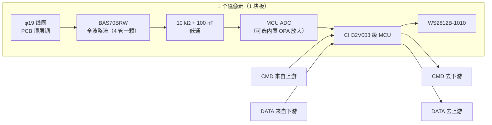
```mermaid
flowchart LR
    subgraph PIX["1 个磁像素（1 块板）"]
        COIL["φ19 线圈<br/>PCB 顶层铜"] --> BR["BAS70BRW<br/>全波整流（4 管一颗）"]
        BR --> RC["10 kΩ + 100 nF<br/>低通"]
        RC --> ADC["MCU ADC<br/>（可选内置 OPA 放大）"]
        ADC --> MCU["CH32V003 级 MCU"]
        MCU --> LED["WS2812B-1010"]
    end
    CMDIN["CMD 来自上游"] --> MCU
    MCU --> CMDOUT["CMD 去下游"]
    UPIN["DATA 来自下游"] --> MCU
    MCU --> UPOUT["DATA 去上游"]
```

信号链：**线圈 → 全波整流 → RC 低通 → MCU ADC → LED**（每块独立完成）。
阵列模式下，每块 MCU 把上游命令**转发**给下游，同时在回传方向上**插入自己的读数** ——
主控在链尾收齐全部像素值，再把颜色下发。

> **为什么不需要 TS3A44159 / CD74HC4067**：每块自己有 ADC，没有"共用一个 ADC 逐通道扫描"的需求。
> 开关最多留 1 路做**基线漂移补偿**（可选）。这是 P1 相对 P2 最大的简化。

## 3. 每块元件清单

| 位号 | 元件 | 封装 | 数量 | 说明 |
|---|---|---|---|---|
| L1 | NFC 线圈 φ19 / 6 匝 / 0.2 mm | PCB 顶层铜 | 1 | 复用 `NFC-Coil`（库内已有，实测铜箔外径 19.0 mm） |
| D1 | `BAS70BRW`（4 × 70 V 肖特基）| SOT-363（SC-70-6）| 1 | **一颗就是整个全波桥** ✓（库内已有 ✓；70 V 耐压 ✓、对线圈加载更小 ✓）|
| R1 | 10 kΩ | 0603 | 1 | RC 串联 |
| C1 | 100 nF | 0603 | 1 | RC 对地 |
| U1 | CH32V003F4U6 / CH32V002F4U6 | **QFN20**（3 × 3 mm，见 §4） | 1 | 5 V 直供、内置 ADC（+ OPA ✓）、**有 SPI** ✓；两颗 drop-in 可互换 ✓ |
| LED1 | WS2812B | **1010** | 1 | 1.0 × 1.0 mm，板载显示（库内已有 ✓） |
| C2 | 100 nF | 0603 | 1 | MCU 去耦 |
| — | 过压钳位（可选） | SOD-323 | 1 | 整流输出 < VDD（防场强过大） |

## 4. MCU：`CH32V003F4U6`（QFN20，3 × 3 mm，2026-09-25 定）

### 4.1 型号：两颗 **同封装同引脚，drop-in 可互换** ✓

WCH 原文：CH32V002「**its pins and functionality are compatible with the CH32V003**」✓

| | `CH32V003F4U6` | `CH32V002F4U6` |
|---|---|---|
| ADC | 10-bit | **12-bit，3 Msps** |
| 内置 OPA | **1 组 ✓** | 无 |
| RAM / Flash | 2 KB / 16 KB | 4 KB / 16 KB |
| 供电 | 3.3 / 5 V | 2.5 / 3.3 / 5 V |
| GPIO | 18 | 18 |

⇒ **不必现在选**：等 single-channel 板回来实测整流包络幅度 —— 够大用 12-bit 的 V002，
太小用带 OPA 的 V003，**板子不用改** ✓（两颗库内都已建好 ✓）。

> 2026-09-25 选型过程：QFN12（`CH32V002D4U6`，2×2 mm）最小但**没有 SPI** ✗；
> SOP8（`J4M6`）有 OPA 但**也没有 SPI** ✗（`PC5/PC6/PC7` 不在它的 8 个脚里 ✗）
> ⇒ 定回 **QFN20** ✓（3×3 mm，**SPI + OPA 都有** ✓，面积仍远小于 SOP8 ✓）。

### 4.2 QFN20 引脚（`CH32V003F4U6` / `CH32V002F4U6`，datasheet §2.2 表 2-1 + §4 封装表）

**封装：3.0 × 3.0 mm，脚距 0.4 mm**（datasheet §4 封装表 ✓）⇒ 批量用**钢网 + 回流**；**手焊/返修：风枪 + 焊锡膏即可 ✓**（用户实测 ✓）。

**18 个 GPIO**（20 脚去掉 VDD / VSS×2），**而且没有 SOP8 那种“内部短接”限制** ✓ ——
datasheet 的 **Note 3 / Note 4 明文只针对 `CH32V002J4M6`（SOP8）** ✗
⇒ QFN20 上 **PA1 / PD1 / PD4 都能正常做输出** ✓。

| pin | 引脚 | ADC | 可用外设（节选） | 本板用途 |
|---|---|---|---|---|
| **0** | **VSS（EPAD）** | — | — | ⚠️ **独立成网**（**不进 `<buses>` 的 GND 总线** ✗），布线时特意接到 GND ✓（与 4 脚同为 VSS ✓）|
| 1 | PD7 | — | **NRST**（复位）/ TIM2_CH4 | 备用 |
| 2 | PA1 | **ADC_IN1** | TIM1_CH2 | **线圈包络输入** ✓（也是 OPA 输入 `OPN0` ✓）|
| 3 | PA2 | **ADC_IN0** | TIM1_CH2N | **链 DATA（半双工）** ✓ |
| 4 | VSS | — | — | GND ✓ |
| 5 | PD0 | — | 通用 I/O | 备用 |
| 6 | **VDD** | — | — | 5 V |
| 7 | PC0 | — | TIM2_CH3 | 备用 |
| 8 | PC1 | — | **SPI_NSS** | 备用 |
| 9 | PC2 | — | I2C_SCL / USART_RTS | 备用 |
| 10 | PC3 | — | TIM1_CH3 | 备用 |
| 11 | PC4 | **ADC_IN2** | TIM1_CH4 / MCO | 备用（第 2 路 ADC ✓）|
| 12 | PC5 | — | **SPI_SCK** | 备用（SPI 只走 MOSI ✓、SCK 不用引出 ✓）|
| 13 | PC6 | — | **SPI_MOSI** | **LED 数据（WS2812，SPI + DMA ✓）** ✓ |
| 14 | PC7 | — | **SPI_MISO** | 备用 |
| 15 | **PD1** | — | **SWIO**（烧录）| 烧录/调试 ✓ |
| 16 | PD2 | **ADC_IN3** | 通用 I/O | 备用 |
| 17 | PD3 | **ADC_IN4** | 通用 I/O | 备用 |
| 18 | PD4 | **ADC_IN7** | **OPA 输出 `OPO`** / TIM2_CH1_ETR | 备用 / **OPA 输出**（真要放大时用 ✓）|
| 19 | PD5 | **ADC_IN5** | 通用 I/O | 备用 |
| 20 | PD6 | **ADC_IN6** | 通用 I/O | 备用 |

✅ **本颗有 SPI** ✓ —— datasheet 产品资源表里 `CH32V003F4U6` / `CH32V002F4U6`（QFN20）的
SPI 栏都是 **1** ✓，引脚就是 **`PC5/PC6/PC7` = SCK/MOSI/MISO**（pin 12/13/14 ✓）
⇒ §5.2 里“用 **SPI + DMA** 产生 WS2812 时序”那条**成立** ✓
（1 个 WS2812 位 = **3 个 SPI bit**，只用 MOSI ⇒ SCK 不用接 ✓）。

> 旧 **SOP8 / QFN12** 引脚表（已作废，存 git 历史 ✓）：SOP8 实际只有 6 个电气节点 ✗、
> 而且**没有 SPI** ✗；QFN12 也没有 SPI、没有 OPA ✗。

### 4.3 引脚分配（18 个 GPIO 只用了 4 个）

| 用途 | 引脚 | 数量 |
|---|---|---|
| 线圈包络 ADC 输入 | **PA1（pin 2）** | 1 |
| 链 DATA（半双工・收发同线） | **PA2（pin 3）** | 1 |
| LED 数据（WS2812，走 `SPI_MOSI` ✓） | **PC6（pin 13）** | 1 |
| SWIO 烧录调试 | **PD1（pin 15）** | 1 |
| **备用 / 扩展** | PD7 / PD0 / PC0 / PC1 / PC2 / PC3 / PC4 / PC5 / PC7 / PD2 / PD3 / PD4 / PD5 / PD6 | **14** |

⇒ 比 SOP8 宽裕得多 ✓（SOP8 只剩 1 个备用 ✗）；半双工三线总线的接插件做法见
[`connector-plan.md`](connector-plan.md) ✓，时序/帧格式见 [`bus-protocol.md`](bus-protocol.md) ✓

### 4.4 封装与面积（datasheet §4 封装表）

**QFN20（`CH32V003F4U6` / `CH32V002F4U6`）= 3.0 × 3.0 mm，脚距 0.4 mm** ✓
批量：**钢网 + 回流**；**手焊/返修：风枪 + 焊锡膏即可 ✓**（用户实测 ✓，QFN 底面焊盘没那么难 ✓）。
比 SOP8（3.9 × 5.0 mm，~30 mm²）**更小** ✓，而且 **SPI ✓ + OPA ✓**、备用引脚管够 ✓
（取舍见 `connector-plan.md §6` ✓）。

> 旧 QFN12（`CH32V002D4U6`）= 2 × 2 mm，更小但**没 SPI、没 OPA** ✗；
> 旧 SOP8 = 3.9 × 5.0 mm、脚距 1.27 mm、手焊友好 ✓ 但**没 SPI** ✗ ⇒ 都已弃用（存 git 历史 ✓）

## 5. 链路架构：LED 与传感数据（✅ 已定 **3 线方案**）

### 5.1 先看 WS2812B 本身：单向单链

数据从 DIN 进 → 取走自己的 24 bit → **再生转发**给 DOUT → 下一颗：

- **没有回读**（不能反向传数据）、**没有地址**，位置 = 物理顺序；断一颗，后面全灭。
- 它是「硬件」菊花链 ⇒ 若让 LED 自己串成链，链就得在每块板中间断开接进本板的 1010，
  接插件得引出 LED_IN / LED_OUT 两根。

（我们**不**这么做 —— **3 线方案**让每块 MCU 自己驱动自己那颗 LED，那两根就省掉了，见 §5.2）

### 5.2 传感数据 + 颜色：三种做法

| 方案 | 板间线 | MCU 引脚 | 位置（谁在哪） | LED 时序 |
|---|---|---|---|---|
| **6 线方案** LED 硬件直穿链 + 传感链 | 6 根：5V/GND/**LED_IN/LED_OUT**/SENS_IN/SENS_OUT | 4/18 | ✅ 天然 | LED 自己再生（最稳） |
| **4 线方案**（原定，已废弃 ✗）| **4 根**（板间 `DATA_IN`/`DATA_OUT` 各一根）—— **2026-09-26 起板间改 3 根；板上仍是 2 根数据网** ✓ | 5/18 | ✅ 天然 | MCU 产生（**SPI + DMA** ✓）|
| **3 线方案** ✅ **采用** 接力链（同 WS2812），MCU 自驱 LED | **3 根**：5V/GND/**DATA**（一根跑双向：下行接力转发 + 回读低脉冲接力）| 5/18 | ✅ 链序 = 物理序（上电枚举一次 `index` ✓）| MCU 产生（**SPI + DMA** ✓）|

- **6 线方案为什么有 LED_IN/LED_OUT**：WS2812B 是**硬件**菊花链，链要在每块板中间「断开」接进这一颗 1010
  （本板 1010 的 DIN 接上游、DOUT 接下游）⇒ 接插件必须引出这两根。
  它们不是额外功能线，**就是 WS2812B 链本身穿过这块板**。
- **4 线 / 3 线方案（✅ 采用的是 3 线方案的接线）**：LED 不串硬件链，而是每块 MCU 自己驱动自己那颗 1010；颜色随链下发，
  每个 MCU 像 WS2812 一样「取走自己那 3 字节、把剩下的转发」✓ 读数则附在帧尾继续往下送
  ⇒ 同一条链同时完成 颜色下行 + 读数回报，**链序 = 物理序** ✓（只需上电做一次 `index` 枚举 ✓）
  代价：MCU 要自己产生 WS2812 时序 —— **走 `SPI_MOSI` + DMA ✓**（QFN20 有 SPI ✓；1 个 WS2812 位 = 3 个 SPI bit ✓）。
  **与 4 线方案的区别**：**只在板间** —— 4 线要两根数据线（各走一向 ✓），3 线**只拉一根**
  （下行靠“取走再转发”✓、回读靠**低脉冲逐级接力** ✓）⇒ 接插件 4 根 → **3 根** ✓；
  **板上仍是 2 个数据脚 / 2 根网** ✓（`DATA_IN` = `PA2`/pin 3 收、`DATA_OUT` = `PD0`/pin 5 发 ✓），
  而且**两口同型、都能当上游或下游用** ✓（见 [`connector-plan.md`](connector-plan.md) ✓）。

> ✅ **已定（2026-09-25 ，2026-09-26 修正拓扑）：3 线方案 —— 板间 3 根线（5V / GND（**居中**）/ **DATA**）** ✓
> MCU 自驱 LED，一条链同时跑「颜色下行 + 读数回报」；拓扑是**与 WS2812 完全一致的单向接力链** ✓：
> 每块“取走自己那 3 字节、把剩下的原样转发” ✓；两个口**同型、都能当上游或下游** ✓（固件自动识别哪边在收 ✓）；
> **两个口的第 3 针不许短接** ✗（短接就成了真总线，回读时隙会打架 ✗）；
> **断一块、下游全灭** ✗ —— 见 [`bus-protocol.md`](bus-protocol.md) §2 ✓。
> **4 线方案 vs 3 线方案**：差的只是**板间那根线** ✓（板上数据脚数一样 ✓）—— 3 线少掉的是“回程”那根 ✗，
> 靠**低脉冲接力**补上 ✓。
> **6 线方案**（带 LED_IN/LED_OUT 的硬件链）作为「零 LED 时序风险」备选保留。

单独销售形态：单块 5 V 上电即工作（固件内置局部归一化）；串联时用 **3 线**对接（`SH-1.0-3P-V` 立贴，**最小尺寸** ✓，两口等价 ⇒ 随便插 ✓）。
电流预算待查 **1010** datasheet（64 块全亮的 5 V 电流要与电源选型一起核）。

## 6. 间距与尺寸预算（由 coupon 实测决定）

要能拼成阵列，像素板边长必须 ≤ 阵列中心间距 ⇒ 只剩很窄的板边 ⇒ 元件**优先塞进中心 φ8 孔**（放不下可以压到绕组下方，见 §6.1）。

间距换算：

| 间距 | 4×4 | 8×8 |
|---|---|---|
| 20 mm | 80 × 80 mm | 160 × 160 mm |
| 22 mm | 88 × 88 mm | 176 × 176 mm |
| 25 mm | 100 × 100 mm | 200 × 200 mm |

面积账（每块）：

| 元件 | 占地（含焊盘） |
|---|---|
| `BAS70BRW`（SOT-363）| **~7.5 mm²**（焊盘外廓 2.60 × 2.90 ✓）|
| R + C + C（0603 × 3） | ~6 mm² |
| MCU | QFN20 **~9 mm²**（3 × 3 ✓） |
| WS2812B-1010 | **~1 mm²**（1 × 1 ✓） |
| **合计** | **≈ 24 mm²** |

可用面积：

- **20 mm 间距**：只有 φ8 中心孔 ⇒ **50 mm² / 面**（双面共 100 mm²）
  ⇒ **单面就能放下**（≈24 < 50 ✓）—— 比 SOP8 版（≈63 必须双面）宽裕得多 ✓。
- **22 mm 间距**：孔以外还多出约 **130 mm² 窄边条**（约 1.5 mm 宽，只放得下小件），
  大件（MCU / LED）仍进孔 ⇒ 余量明显更宽松。

两个方案都要**实测**才知道哪个信号更好；同时**贴片工艺**（QFN20 手焊用风枪即可，见 §4.4 ✓）也要一起选。

### 6.1 铜与元件的分级规则（2026-09-24 放宽）

原来说「线圈投影区一律不许放元件/铜」——**做不到**（25 × 25 mm 的板都排不下），按影响分级：

| 级别 | 内容 | 理由 |
|---|---|---|
| ❌ **绝对不要** | 线圈投影区内的**大片铜 / 地平面** | 涡流最强、L 降最多，还会让相邻像素互相耦合 |
| ⚠️ **尽量避免** | 压在**绕组正下方**的元件 | 优先塞进中心 φ8 孔；塞不下的才压绕组 |
| ✅ **推荐** | **中心 φ8 孔**内的元件 | 离绕组最远，NFC 标签（NTAG）就是芯片放天线中心 |

**为什么可以放宽**：本设计是**非谐振**包络检测（线圈直接进整流桥 + RC 低通，**没有并联谐振电容**）
⇒ 不需要高 Q；附近小金属主要造成幅度上的**系统性偏差**，而每个像素的元件完全相同
⇒ 这是**共模误差**，归一化/标定就能抹掉（我们显示的是相对分布）。

**要守住的几条**：

- 不铺地平面 / 大片铜（也影响像素间耦合）；
- 走线尽量短、尽量走在孔内，避免长距离与绕组平行；
- 元件金属尽量**对称**分布；
- **16 块板必须同一版型**（同样的系统偏差才抵得掉）。

### 实板对比实验（替代原 coupon 方案，2026-09-24 定）

**不做参数测试板（coupon）了** —— 直接打像素板、**打两块同版板对比**（详见 [`coupon-layout.md`](coupon-layout.md)）：

| 板 | 内容 | 作用 |
|---|---|---|
| **全贴件板（成品）** | 像素板（真实布局、**元件全焊**）| 实际灵敏度与分布 |
| **空板（同版）** | **同一版 Gerber**、**一个元件都不焊**（只留铜箔、线圈、焊盘、丝印）| 基准：隔离出“焊了元件”的影响 |

两块板放同一位置、同一激励源比输出 ⇒ **两板铜完全一样** ✓ ⇒
「全贴件板（成品）」−「空板（同版）」= **纯“元件”的影响** ✓。
第一版按 **25 × 25 mm** 打（当前布线的尺寸），灵敏度不够再缩到 22 / 20 mm。

原 coupon 方案的实测项（L / Q / 自谐振、相邻耦合、孔内元件衰减）**不再单独做板**，
需要时用「全贴件板 / 空板」两板的包络幅度对比代替 ✓。

## 7. 制造方式：拼版 vs 整板（2026-09-23 定）

**决定：分开下单。** single-channel 与 coupon 不做「不同设计拼一张」—— 拼版会把
已封版的 single-channel Gerber 坐标平移成面板文件，作废刚核对过的 v0.1.3。

| 拼版方式 | 相邻间距 | 结论 |
|---|---|---|
| **同款多连片**（一块面板放 N 块相同的板） | — | ✅ 首选，按「一片板」计价：100 × 100 mm 面板可放 **25 块 20 × 20** 像素板，单块成本掉一个数量级 |
| **铣槽**（routing） | 槽宽 ~1.6~2.4 mm | ❌ **不能用来拼阵列**：板 20 mm ＋ 槽 2 mm ⇒ 线圈中心距变 22 mm；强行保持 20 mm ⇒ 板只剩 18 mm，装不下 φ19 线圈 |
| **V-cut** | 0 | ⚠️ 无间隙，但 V 槽从每块板边各占 ~0.25 mm ⇒ 20 mm 板只剩 ~0.25 mm 容差；**22 mm 有 1.5 mm 边条才稳** ✅ |

⇒ 两条产品线（共用同一套像素电路，只是分割方式不同）：

| SKU | 做法 | 用途 |
|---|---|---|
| **单卖像素板** | 同款多连片拼版（V-cut / 邮票孔），掰开单片卖 | 演示件、零售 |
| **4×4 阵列板** | **一整块 80 × 80**（16 个像素电路在同一板上，无接缝、栅格精确） | 桌面热力图（自用/整机） |

⇒ 阵列对齐**不靠拼版**；**20 mm 只配「整板阵列」，22 mm 才同时支持「拼版单卖」**。

## 8. 待办 / 依赖

- [x] **MCU 元件库** ✓ —— `fritzing-parts-langhua` 里 **`CH32V003F4U6` / `CH32V002F4U6`（QFN20）** 已建好
  （icon → 面包板 → 原理图 → PCB 全视图 ✓）、**已部署到 MINE** ✓；引脚表见 §4.2（源：`D:\Downloads\CH32V003DS0.PDF` ✓）。
- [ ] **像素板 v0 打样**（25 × 25 mm 第一版）+ **不贴件对照板** → 实测灵敏度 / 分布后再定间距。
- [ ] **single-channel 板回板（3~4 天）** → 实测整流包络量级 → 决定是否用内置 OPA 放大。
- [ ] 像素板 `fzz` + Gerber（等 coupon 数据）。
- [ ] 主控板（ESP32-S3 控制板，待建）+ 链协议固件。

## 9. 与既有文档的关系

| 文档 | 内容 | 在 P1 下的状态 |
|---|---|---|
| `coil-spec.md` | **L1 线圈**：现在的规格（含实测匝距/匝间缝 ✓）、可换档位表、**每档的感应电压/电感代价**、方案 B 的布线实测 ✓ | **支撑 §3 的元件清单** ✓；换线圈规格前先看它 ✓ |
| `docs/phase-1-4x4-validation.md` | 集中式方案 M0~M5、TS3A/MUX 拓扑 | 历史记录，**不改**；M1 模拟前端验证仍有效 |
| `hardware/subboard_4x4/schematic-spec.md` | 16 路 + 4×TS3A + MUX 连接表 | 同上（P2 方案依据） |
| `hardware/subboard_4x4/single-channel/` | 已送厂的单通道板（Gerber v0.1.3） | **照原计划打板**，用于验证模拟前端量级 |
| 本文件 | P1 像素板 | **新方向** |
| `fritzing-parts-langhua/docs/schem-drawing-rules.md` | **画电路通用规则**（A 节可机器校验 / B 节审美）| **本项目遵循** ✓ —— 画完用 `tools/sch_style_check.py` 核（网格只作参考 ✓）|
