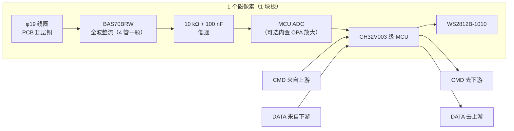

# 磁像素板（P1 智能像素）设计规格

> 状态（2026-09-23）
>
> - ✅ **架构已定：P1「智能像素」** —— 每块板自带 MCU，既是**可单独销售**的单线圈探测板，也是 4×4 / 8×8 阵列的积木。
> - ✅ **MCU 已定：`CH32V003F4U6`（QFN20，3 × 3 mm）** ✓ SPI ✓ + OPA ✓；`CH32V002F4U6` 同封装 drop-in ✓（见 §4）。
> - ⏳ **阵列间距 20 mm / 22 mm 待定** —— 由 §6 的 coupon 实测决定，**不猜**。
>
> 本文件是像素板的设计依据。`docs/phase-1-4x4-validation.md` 与 `hardware/subboard_4x4/*` 记录的是
> **集中式（P2）**方案（TS3A44159 开关 + CD74HC4067 MUX），**保持不变**；其中 single-channel 板
> （已送厂，3~4 天回板）验证的「线圈 → 2×BAT54S → RC」模拟前端，**正是本像素板的核心，仍然有效**
> （像素板把那 2 颗 BAT54S 换成 **1 颗 `BAS70BRW`** ✓ —— 同样的 4 管全波桥，见 §3）。

[](../../../fritzing-parts-langhua/svg/NFC-Coil/svg.icon.NFC_Coil_20mm_6T_0p2_1_icon.svg)
[](../../../fritzing-parts-langhua/svg/BAS70BRW/svg.icon.BAS70BRW_SOT363_1_icon.svg)
[](../../../fritzing-parts-langhua/svg/WS2812B/1010/svg.icon.WS2812B_1010_1_icon.svg)

*像素板 = 1 个线圈 + 1 路整流 + 1 颗 MCU + 1 颗 1010 LED*

## 0. 原理图：渲染器与 v1 摆位（2026-09-27）

**为什么要渲染器**：本机 Fritzing 的**命令行导出是坏的** ✗（库仓 `tools/README.md` 早有记录 ✓）
⇒ 每轮都要**用户手动导图**给我看 ✗。`render_sch.py` 把这一步自动化 ✓ —— 它按 Fritzing
自己的摆放规矩把 `.fzz` 的**原理图视图**渲成 PNG/SVG ✓。

    py -3.13 render_sch.py <sketch.fzz> <out.png> [<px宽>] [--verify-export <Fritzing导出的.svg>]

★ **不是自证** ✓：`--verify-export` 拿 **Fritzing 自己导出的 svg 当尺子** ✓ 逐件核对 ✓
（实测：`pixel-schematic.fzz` 9 件 **Δ ≤ 0.0004 单位 = 0.00011 mm** ✓；
`pixel-schematic-v1.fzz` 9 件 **Δ ≤ 0.00003 单位** ✓ ⇒ 渲染即 Fritzing ✓）。

| | | |
|---|---|---|
| [](pixel-schematic_preview.png) | [](pixel-schematic-v1_preview.png) | [](pixel-schematic-v2_preview.png) |
| **原图** ✓ —— J1/J2 吊在最上方 ✓、长线横穿全图 ✓、位号压在线/元件上 ✓ | **v1** ✓ 只摆元件（主链 `J1→U1→LED2→J2` 一条水平线 ✓、采集支路下沉 ✓、C2 贴 U1 上方 ✓） | **v2** ✓ 全接线（46 根正交导线 ✓、**0 个悬空线端** ✓、绕本体不穿 ✓） |

**v2 = 接线手 ✓**（2026-09-27）：46 根导线、67 条连接 ✓，**网表 10 个网全对 ✓**
（`check_netlist.py` ✓：既无漏接、也无多余连通分量 = **无短路** ✓）、**悬空线端 0 ✓**、
43 → 46 根（绕本体比直穿多 3 根 ✓，换来的正是"不从元件肚子里穿过去" ✓）。

★ 这一手修掉两个真 bug ✓（都在既有管线里，都靠"看得见"才发现 ✓）：
1. **脚位公式错** ✗ —— `sk = loc + RATIO*(尺子 − ox)` 里 `ox` 是"用户坐标 (0,0)"的位置 ✗
   （**不是**零件锚点 ✗）⇒ 凡 `viewBox 原点 ≠ (0,0)` 或**带旋转**的零件，脚位一律偏 ✗
   （实测：J1/J2 偏 1.77 = `k×0.5mm` ✓、U1 偏 17.1 = `k×190` ✓、C1/C2 偏 31.4 ✓；
   原点为 (0,0) 的 D3/L1/R1/LED2 反而只差 0.0001 ⇒ 问题藏得很深 ✗）。
   正解只有一句：**`sketch = RATIO × 尺子坐标`** ✓（我的尺子 1.0 ✓ / Fritzing 导出 1.25 ✓）。
   ⇒ 修好后拟合残差 = **0.0000** ✓、**悬空线端从 11 → 0** ✓。
   （★ 副产品认知：用户原图里那 6 个"悬空端"**不是手画错** ✗，就是这个 bug 的产物 ✓ ——
   我当时误判成用户的图 ✗，记下来别再犯 ✗。）
2. **导线从元件本体里穿过** ✗ —— `path_ok` 对"自己两端元件"**整个豁免** keep-out ✗ ⇒
   为了走直线就从 U1/D3/LED2 肚子里穿过去 ✗。改成**记代价**（穿得少者优先 ✓）而不是
   一律禁 ❌（D3 的 `AC1/AC2` 脚**本来就在本体内部** ✓，禁了就没路 ✓）。

| | | | |
|---|---|---|---|
| [](pixel-schematic_preview.png) | [](pixel-schematic-v1_preview.png) | [](pixel-schematic-v2_preview.png) | [](pixel-schematic-v3_preview.png) |
| **原图** ✓ 41 根导线、J1/J2 吊在上方、长线横穿 | **v1** ✓ 只摆元件（拍坐标 ✗） | **v2** ✓ 全接线 | **v3** ✓ 数据驱动摆位 + 交叉代价 |

| | | |
|---|---|---|
| [](pixel-schematic-v4_preview.png) | [](pixel-schematic-v5_preview.png) | [](pixel-schematic-v6_preview.png) |
| **v4** ✓ 两条硬限制（不穿本体 ✓） | **v5** ✓ 位号摆位（压导线 1 ✓） | **v6** ✓ **45° 斜线 + 电源/地先布**（交叉 8 ✓、压线 8 ✓、总长 −7% ✓） |

### ★ 交付前机器检查（出厂检查 ✓，2026-09-28 ✓）

起因是用户发现「**我导出的图与你自己画的有蛮多差异**」✗ ⇒ 查出根因是渲染器的 `px`
单位搞错 ✓，但**更值钱的是一条结构性事实** ✓：**Fritzing 的连接只记在 `<connects>` 里** ✓
⇒ **只看连接表的检查，结构上永远看不见“图上的假象”** ✗✗（当时 `check_netlist.py` 报
“45/45 全配上”✓，而用户截图里线**悬在半空** ✗）。⇒ 出厂检查定成**三条** ✓：

| # | 检查 | 命令（在本目录 ✓） | 合格线 ✓ |
|---|---|---|---|
| ① | **网表** ✓ | `py -3.13 check_netlist.py <sketch.fzz>` | 10 个网全对 ✓（无漏接 ✓、无多余连通分量 = **无短路** ✓） |
| ② | **假连线** ✓（新增 ✓） | `py -3.13 check_fake_wires.py <sketch.fzz> …` | **(A)=0 且 (B)=0** ✓（**退出码非 0 = 不合格** ✓） |
| ③ | **硬规则**：导线重叠 ✓ | `py -3.13 gen_schematic_wires.py …` | 「不同的导线重叠 **必须 0**」✓（用户规则② ✓） |

★★ **③ 现在还不是闸门** ✗（2026-09-28 实测发现 ✓）：生成器那条自检**只打印一行** ✗
（`── ★★ 规则自检：不同的导线重叠 N 对 ✗✗ 必须 0 ✓`）—— **它不会停、也不会不写文件** ✗
⇒ 实测证据：`v15 + --hardpin` 那一版重叠 **1** ✗，**文件照写** ✓、我一度把它当合格版用了 ✗。
⇒ 所以「**不合格怎么办**（退出码非 0 ✓／干脆不写文件 ✓）**请用户定** ✗」—— 定完再补进本表 ✓。
（对照：库仓 `fritzing-parts-langhua` 的绿板生成器是"命中就报错 **+ 不写文件**" ✓。）

**②在查什么** ✓（几何 vs 连接表 ✓，两侧都要看 ✓）：**(A)** 表里声明接了某脚 ✗ 而线
**根本没画到**那只脚上 ⇒ 图上看着**断开** ✗；**(B)** 线**画在**某脚上（端点落在脚上 ✓
或**线身穿心** ✓）而表里**没那条** ✗ ⇒ 图上像接上 ✓、**电气上是断的** ✗（最阴的一种 ✓）。
★ 判据**只有一份** ✓（在 `render_sch.py` 里 ✓）；`check_fake_wires.py` 只负责**跑 + 取数
+ 判合格线** ✓，**不写第二份几何代码** ✗，且**取不到数字就报错退出** ✗（不许“没解析到 = 通过” ✗）。

★ 同批实测 ✓（三版同一口径 ✓，2026-09-28 ✓）：

| 版本 | (A) | (B) | 判读 |
|---|---|---|---|
| **v14**（穿体 **0** ✓、交叉 14 ✓） | 0 ✓ | **9 ✗** | **全是线身穿心** ✓ —— 一根竖线**正好穿过** `U1` 左排三只脚的坐标点（9 处里 **6 处**是 `U1`）✗ |
| **v15**（**当前交付版** ✓、重叠 0 ✓） | 0 ✓ | **8 ✗** | 骑 `U1` 左排列 3 处 + **骑底排行 5 处**（`y=−43.2`）⇒ **当前交付版也不合格** ✗ |
| `v15 + --hardpin` ✓ | 0 ✓ | **0 ✓✓** | **只有它合格** ✓（代价见下 ✗） |

⇒ 定量结论 ✓：**`--hardpin`（线不许落在“别的脚”上 ✓）是唯一能到 (B)=0 的开关** ✓。
★ 代价必须按**同参数 A/B** 量 ✓（`v15` vs `v15 + --hardpin` ✓ —— 两边其它开关**完全相同** ✓）：

| 指标 | **v15**（交付 ✓） | **v15 + `--hardpin`** | 判读 |
|---|---|---|---|
| **(B) 假连线** | 8 ✗ | **0** ✓✓ | ✅ 目标达成 ✓ |
| **贴脚**（<7.2） | 11 ✗ | **7** ✓ | ✅ 变好 ✓ |
| **穿体**（穿别的元件本体） | **6** ✗ | **9** ✗✗ | ❌ 变差 ✗ |
| **十字交叉** | **16** | **21** ✗ | ❌ 变差 ✗ |
| **近重合** | **0** ✓✓ | **1** ✗ | ❌ v15 刚立的硬规则被破 ✗ |
| 总长 | 2323.7 | 2246.1 | ✅ 略短 ✓（−3% ✓） |
| 画布 mm | 77.0×82.9 | 78.1×83.1 | ≈ 持平 ✓ |

⇒ 用户定的两条硬指标「**穿体 0 ✓ 且 贴脚 0 ✓**」**目前还没有一版同时做到** ✗
（三版都有硬数据 ✓：v14 = 穿体 0 ✓ / (B) 9 ✗；v15 = 重叠 0 ✓ / (B) 8 ✗；
`--hardpin` = (B) 0 ✓✓ / 穿体 9 ✗）⇒ **v16 的工作点要在这两条之间定** ✓（待用户定 ✗）。

### 摆位与布线的量化对比（2026-09-27 ✓）

| 版本 | 摆位 | 布线代价 | 总长（sketch 单位） | **十字交叉** | 穿别的元件本体 | 位号压导线 | 位号压元件 | 画布 |
|---|---|---|---|---|---|---|---|---|
| v1 | 拍坐标 ✗ | —（无线） | 0 | 0 | 0 | — | — | 815 × 409 |
| v2 | 拍坐标 ✗ | 无交叉项 ✗ | 4229.5 | 12 | 7 | 8 | 2 | 815 × 409 |
| 中间版 | **数据驱动** ✓ | 无交叉项 ✗ | **2340.4** | **16** ✗ | 9 | 8 | 2 | 313 × 325 |
| v3 | **数据驱动** ✓ | **含交叉代价** ✓ | 2603.5 | **8** ✓ | 7 | 8 | 2 | 313 × 325 |
| v4 | **数据驱动** ✓ | 含交叉 + **两条硬限制** ✓ | 2495.9 | **7** ✓ | **0** ✓✓ | 8 ✗ | 2 ✗ | 315 × 325 |
| **v5** | 数据驱动 ✓ + **位号摆位** ✓ | 同上 ✓ | **2495.9** | **7** ✓ | **0** ✓✓ | **1** ✓✓ | **0** ✓✓ | 315 × 325 |
| **v6** ✓ | 同 v5 ✓（仅“插座间距”开关默认 0 ✓） | **+ 45° 斜线** ✓ + **电源/地先布** ✓ + **压线当交集** ✓ | **2322.5** ✓ | **8**（同口径 12 → 8 ✓） | **0** ✓✓ | **3** ⚠ | **0** ✓✓ | **304 × 326** ✓ |

> ★ **v6 的“8”不是变差 ✗** —— 它与 v5 的“8”不在同一条摆位上（摆位脚本这一天又改过 ✓，
> 同一条摆位下**关掉 45°** 是 **12** ✓）⇒ 可比的只有下面那张 A/B 表 ✓。
> 另：v6 多出一个“位号压导线 **3** ”⚠（v5 是 1 ✓）—— 原因与处置见下一小节 ✓（**如实报** ✓ 不藏 ✗）。

**v5 相对 v2**：总长 **−41%** ✓、交叉 **12 → 7** ✓、**穿别的元件本体 7 → 0** ✓✓、
**位号压导线 8 → 1** ✓✓、**位号压元件 2 → 0** ✓✓、画布面积 **−87%** ✓；
网表 10 个网全对 ✓、悬空线端 0 ✓。

### 第六手：45° 斜线（2026-09-27 ✓ 用户定）

用户原话：**“允许 45° 斜线”** ✓。★ 我先去**量了他手改的那一版** ✓（`diag_angles.py` ✓）：
里面 15 根斜线的角度是 `20.1° / 23.4° / 28.8° / 2:1 / 1°…` ✗ —— **不是 45°** ✓，
即“两脚直接连一根直线” ✓。两种都做了、都量了 ✓（**A/B 对照同一条摆位** ✓）：

| 布线器允许的倾斜 | 导线 | **十字交叉** | 压线对 | 总长 | 悬空端 | 穿本体 |
|---|---|---|---|---|---|---|
| 只准正交 ✗ | 48 | **12** | 11 | 2386.1 | 0 ✓ | 0 ✓ |
| **含 45°（采纳 ✓）** | **45** ✓ | **8** ✓✓ | **8** ✓✓ | 2400.3（+0.6% ✓） | 0 ✓ | 0 ✓ |
| 任意角直连 ✗ | 45 | **37∼42** ✗✗ | **88∼100** ✗✗ | **4941** ✗✗ | 0 ✓ | 2 ✗ |

⇒ **只有 45° 的“小斜切”是赚的** ✓（交叉 −4 ✓、压线 −3 ✓、长度几乎不变 ✓）；
**“任意角直连”是亏的** ✗✗（它横穿全图、开头几根就把后面的路全堵了 ✗）。
所以实现成 **45° + 正交的 dogleg**（每段不是 45° 就是 0°/90° ✓、四种落法 × 两侧 ✓），
斜线只给**小罚分** `DIAG_PEN = 1.25`（✓ 可调 ✓），只有在**省长度**时才被选中 ✓。

★ 同批还量了两条“看起来该有用、实测亏”的：

| 尝试 | 实测结果 | 处置 |
|---|---|---|
| **插座（J1/J2）跟核心电路拉开距离**（你手改版的洞察 ✓，量出是 **+4 格 = 28.8 单位** ✓） | 交叉 **8 → 10** ✗、总长 +9% ✗、画布 98.9 → **116.2mm** ✗✗ | **默认关掉** ✓（`SOCKET_EXTRA` 留成开关 ✓）—— 它是**审美**取舍（信息层次 ✓）不是指标改善 ✗，**请你定** ✓ |
| **让布线器认识位号框**（去消“位号压导线” ✓） | 位号压导线只 **3 → 2** ✗（剩的 `L1` 旁边没通道 ✓），代价 **压线 8 → 10** ✗ | **回退** ✓ —— 位号那条得让**位号自己挪**（布线完重摆 ✓），不让导线绕 ✗ |

另修一条真毛病 ✓（这条**是**赚的 ✓）：**两段压在同一条直线上** ✗ ⇒ 现在按“**一类交集**”计数 ✓
（判据 = 唯一的 `sch_geom.near_overlap` ✓）。起因是量 v5 时发现 **J1 三只脚的线全在同一列上竖着走** ✗
（图上像三只脚短路 ✗）⇒ 压线对 **19 → 8** ✓。

★ 交给用户的**两条教训**（都写进代码注释了 ✓）：

1. **判据只能一份实现** ✓ —— 为了量斜线，原来的“交叉”判据（**只认正交** ✗）必须换掉 ✓：
   实测换了之后，**手改版从 4 变成 18** ✗（它的斜线交叉原来一个都没被算 ✓）
   ⇒ 我先前那句“手改版只有 4 处交叉”是**假数字** ✗，现已用**另一套算法（密集采样 ✓）复核一致** ✓；
2. **输入必须是“只有摆位、没有线”的画布** ✓ —— 我一度拿**已有线的 v5** 当输入 ✗
   ⇒ 旧 48 根 + 新 45 根 = **93 根** ✗、所有指标全废 ✗（绕了一大圈才发现 ✓）。

### 第七手：两条用户规则（安全距离 ✓ / 不重叠 ✓）与 v15 的取舍（2026-09-27 ✓ 用户定）

用户原话 ✓：
- ①「现在的严重问题是**导线离芯片引脚太近了** ⇒ 应该设立一个规则，让导线跟芯片引脚有个
  **安全距离**，从而让导线和引脚的连接关系**能通过肉眼看得清晰**」✓
- ②「**不同的导线，不能重叠**」✓（「这一条，类似面包板里的规则」✓ = 一个孔只能插一根线 ✓）

**判据（各自只有一份实现 ✓）**：① 每根导线取两端 0.05 内的脚为“自己的脚”✓，其余脚里离该线段
`< CLEAR_PIN = 7.2 单位（2.03 mm）` 记 **1 处** ✗；② `sch_geom.near_overlap` ✓（含斜线 ✓）。
② 已做成**硬闸门** ✓ —— 生成器自检「不同的导线重叠 **必须 0**」✓，不合格就报错 ✗。

| | | |
|---|---|---|
| [](pixel-schematic-v14_preview.png) | [](pixel-schematic-v15_preview.png) | [](pixel-schematic-v15_preview.png) |
| **v14** ✓ 穿体 **0** ✓、交叉 **14** ✓、贴脚 14 ✗ —— 但**重叠 4** ✗ | **v15** ✓✓ **重叠 0** ✓✓、贴脚 **11** ✓✓（历代最好 ✓）—— 代价见下表 ✗ | **v15** 当时是交付版 ✓（提交 `ebb344b` ✓；**先后被 v16 / v17 / v18 取代** ✓，见「第八手…第十手」↓） |

**全版本同一套口径、重新量过** ✓（`_scratch/table_versions.py` ✓，判据仍是渲染器那唯一一份 ✓）：

| 版本 | 导线 | 十字交叉 | 穿别的元件本体 | 贴脚(<7.2) | 近重合 | 位号压导线 | 位号压元件 | 总长 | 画布 mm |
|---|---|---|---|---|---|---|---|---|---|
| 原图 | 41 | 11 | 2 | 27 | 1 | 7 | 3 | 2720 | 136.6×84.4 |
| v9 | 48 | **8** ✓ | 0 ✓ | 40 ✗ | 8 | 3 | 0 ✓ | 2028 | 76.4×83.9 |
| v11 | 49 | 15 | **0** ✓ | 13 | 6 | 0 ✓ | 0 ✓ | 2056 | 76.8×83.7 |
| v13 | 52 | 13 | **0** ✓ | 16 | 4 | 0 ✓ | 0 ✓ | 2059 | 76.8×83.9 |
| v14 | 51 | **14** | **0** ✓ | 14 | 4 | 0 ✓ | 0 ✓ | 2042 | 76.8×83.1 |
| **v15** ✓ | 50 | 16 ✗ | 6 ✗ | **11** ✓✓ | **0** ✓✓ | 4 ✗ | 0 ✓ | 2324 | **77.0×82.9** ✓ |
| **v16** ✓ | 53 | 23 ✗ | 9 ✗ | 11 | **0** ✓✓ | 7 ✗ | 0 ✓ | 2274 | 82.0×86.3 |
| **v17** ✓ | 47 ✓ | **10** ✓✓ | 10 ✗ | 11 | **0** ✓✓ | 6 ✓ | **1** ✗ | **2060** ✓ | 83.2×82.9 |
| **v18** ✓（旧交付 ✓，已被 v19 取代 ✓） | **46** ✓ | **10** ✓✓ | **6** ✓✓ | 11 | **0** ✓✓ | **2** ✓ | **0** ✓ | **2025** ✓ | 89.3×82.9 ✗ |
| **v19** ✓（旧交付 ✓，已被 v20 取代 ✓） | 63 | 19 / 20 | **0** ✓✓ | 13 / **7** ✓ | **0** ✓✓ | 3 | 3 | 2698 / 2988 | 90.6 / 107.8×93.7 ✗ |
| **v20** ✓（旧交付 ✓，已被 v21 取代 ✓；第十四手 ✓） | 61 | 19 / 20 | **0** ✓✓ | **11 / 6** ✓ | **0** ✓✓ | 2 | 2 | **2641 / 2912** ✓ | 95.9 / 112.2×**87.4** ✓ |
| **v21** ✓（**新交付** ✓；第十五手 ✓） | **57** ✓ | **17 / 18** ✓ | **0** ✓✓ | **7 / 2** ✓✓ | **0** ✓✓ | **1** ✓ | **0** ✓ | **2564 / 2835** ✓✓ | 95.9 / 112.2×**87.4** ✓ |

★ v16 / v17 / v18 这三行用**同一套判据**（`render_sch.py` ✓）量的 ✓；它们另有两项本表没有的 ✓：
**(B) 假连线 0 ✓✓** 与 **(C) 退化为点的导线 0 ✓✓**（v16 当时是 **4 根** ✗ —— 已由 `MIN_SEG` 修掉 ✓）。
⇒ **v17 换了链序（`revyx` ✓）**：交叉 **23 → 10** ✓✓（比用户手改版的 11 还好 ✓）、导线 53→**47** ✓、总长 −9% ✓；
⇒ **v18 把间距改成 2 格** ✓：穿体 **10 → 6** ✓✓、位号压导线 6→2 ✓、位号压元件 1→0 ✓；代价 **画布 +6mm** ✗。
⇒ **v19 用**电源轨 + 面包板退出电气**（第十三手 ✓）：**穿体 6 → 0** ✓✓、**Fritzing 里无飞线** ✓✓；
  代价 **总长 +33%** ✗、**画布变宽** ✗（轨要横到该网最外侧接头 ✓）。
  ★ v19 的量法：表中「重叠/交叉/…」那一行是**档 0（socket0）/ 档 1（socket4）**两个数；
    两个档都已 **退出码 0** ✓、**网表 10 个网全对** ✓、**(A)(B)(C) = 0/0/0** ✓。

**取舍是用户定的 ✓**：要达成 ②（重叠 = 0 ✓，硬规则 ✓）就必须让主干**离开引脚列** ✓，
而“离开”就得借道**别的元件旁边的空地** ✓ ⇒ 必须放松我自己加的那条**代理**规则
「离任何元件 6 单位以内算碰」✗ ⇒ 代价 = **穿体 0 → 6** ✗、**交叉 14 → 16** ✗、**位号压线 0 → 4** ✗。
用户选的是「**重叠 0 优先**」✓ ⇒ 该取舍**已上线** ✓（代码里两个开关 `--noesc` / `--oldorder`
可一键回到 v14 那一档 ✓，实测**一字节不差** ✓）。

**贴脚还没进个位数 ✗（11 处，目标 ≤9 ✓）** —— 两条路都试了，**都被实测否掉** ✓（如实记 ✓）：

| 轴 | 做法 | 实测结果 |
|---|---|---|
| 走线 ✗ | 通道按“离引脚 <7.2 就丢”**全局**过滤 | 通道 x 72→**20** ✗ ⇒ 贴脚 **11→16** ✗、重叠 0→**1** ✗、穿体 6→**8** ✗（**全线变差** ✗） |
| 走线 ✗ | 只剔“**出脚候选里、跨度内会贴引脚**”的车道（精确版 ✓） | 与旧行为**一字节不差** ✗ ⇒ 说明**出脚候选根本没被选中** ✗ |
| 摆位 ✗ | `SOCKET_EXTRA` 0/1/2 ⇒ J1↔U1 间隙 7.2 → **14.4 / 21.6** ✓ | 贴脚 **11→13 / 13** ✗（**不降反涨** ✗）、交叉 16→**21** ✗、画布 77.0→**82.6** ✗ |

⇒ 定量结论 ✓：`GND` 链上有 **8 处 0.00 距离**，都是“**主干骑在 U1 的引脚行列上**” ✗
（竖线 `x=22.6` = 左排列 ✓、横线 `y=−43.2` = 底排行 ✓）。`--why` 决策探针显示：
**出脚候选最好也要 `wt=11`** ✗ ⇒ **代价函数没算错** ✓（它确实选了 3 而不是 11 ✓）——
是**候选形状确实办不到** ✗，而挪开邻居也没用 ✗（第二条已证伪 ✓）。⇒ **这条挂待办** ✓。

★ 留给下一轮的两件**只观测**工具 ✓（都不改行为 ✓）：
- `gen_schematic_wires.py --why` ✓：打印每个网对的「**选中 vs 亚军**」代价元组 ✓ +
  **第一处不同的档位** ✓ + **出脚候选自己的最好成绩** ✓ —— 今天靠它把“为什么没选中”从**猜** ✗ 变成**看** ✓；
- `render_sch.py` ✓：贴脚**报全**（原来只报最近 6 处 ✗）+ 线段两端坐标 ✓ +
  **因**（骑列 / 骑行 / 擦过 ✓）—— 治之前先量清 ✓。

### 第八手：假连线（几何 vs 连接表）与两条真闸门 ⇒ **v16**（2026-09-28 ✓ 用户定）

用户原话 ✓：「**我检查了，v14 确实有这个接线错误**」✓ ⇒ 由此把“**图上像接上、电气上是断的**”
这类**假连线**变成可机器判定的东西 ✓；随后定案两条 ✓：① **采纳 `--hardpin`** ✓；
② **「不同的导线重叠」要变成真闸门** ✓（以前只是打印一行 ✗）。

**这一手修的是“检查”本身** ✓（前面几手都在改“布线” ✗）—— 本仓一条硬事实：
**Fritzing 的连接只记在 `<connects>` 里** ✓ ⇒ `check_netlist.py`（只看连接表 ✗）
**结构上永远看不见图上的假象** ✗✗（当时它报“45/45 全配上”✓ 而截图里线**悬在半空** ✗）。
⇒ 新增 `check_fake_wires.py`（出厂检查 ✓，判据仍只用 `render_sch.py` 那一份 ✓）：
**(A)=0 且 (B)=0** ✓，**退出码非 0 = 不合格** ✓；取不到数字就报错退出 ✗（不许“没解析到 = 通过”✗）。

**改了两处机制** ✓ —— 都是“**硬规则用闸门，不用软代价**” ✓（理由同 `HARD_BODY` ✓：
档位次序只能表达“先后”✗，表达不了“**必须**”✗）：
1. `HARD_PIN`（线不许落在“别的脚”上 ✓）**转默认开** ✓ —— 它是**唯一**能把 (B) 打到 **0**
   的开关 ✓；旧基线一键可回 ✓：`--nopin` ✓。
2. `HARD_OVL`（不许与已布的线**压在同一条直线上** ✓）**新增** ✓ —— 用户规则②以前
   **只靠软代价**压 ✗ ⇒ 一开 `--hardpin` 候选集变小、它**退回 1 对** ✗；`--noovl` 可关 ✓。
3. 生成器那条“重叠必须 0”的自检 **变成真闸门** ✓：非 0 ⇒ **退出码 1** ✓（文件**照写** ✓
   供你打开看哪儿压了 ✓ —— 这条以前只是打印 ✗，`t27_1` 重叠 1 却照写文件 ✓）。

**三档同参数 A/B** ✓（同一份 `layout8.fzz` ✓、`--rip 3` ✓，每档只差开关 ✓）：

| 档位 | 重叠 | 贴脚 | 交叉 | 穿体 | (A) | (B) | 总长 | 画布 mm | 网表 | 告警 | **退出码** |
|---|---|---|---|---|---|---|---|---|---|---|---|
| `0` v14 基线（`--noesc --oldorder --nopin --noovl`） | 2 ✗ | 11 | **14** ✓ | 6 | 0 ✓ | 8 ✗ | 2369 | 79.8×82.9 | ✓ | 0 | **1** ✓ |
| `1` **= v16**（新默认 ✓） | **0** ✓✓ | 11 | 23 ✗ | 9 ✗ | 0 ✓ | **0** ✓✓ | 2274 | 82.0×86.3 | ✓ | **0** ✓ | **0** ✓ |
| `2` 新默认 **`--noovl`**（只差一个开关 ✓） | **1** ✗ | 7 ✓ | 21 ✗ | 9 ✗ | 0 ✓ | 0 ✓ | 2246 | 78.1×83.1 | ✓ | 0 | **1** ✓ |

★ **闸门会响是被验过的** ✓（不是“永远通过”的摆设 ✗）：`0`/`2` 两档重叠非 0 ⇒
**退出码 1** ✓；`1` 档重叠 0 ⇒ **退出码 0** ✓。
★ 同批还证了一条 ✓：`HARD_OVL` 的增量 = **重叠 1 → 0** ✓（`1` vs `2` 只差 `--noovl` ✓，
压的正是软代价版那**同一对**线 ✓：`y=9.0` 上压 12.2 单位 ✓）。

★ **代价如实记** ✗（`1` vs `2` ✓）：闸门换来的 重叠 1→0 ✓，代价是 **交叉 21→23** ✗、
**贴脚 7→11** ✗、总长 +1.2% ✗、画布 +5% ✗。⇒ **v16 = 档 `1`** ✓ —— 它是唯一同时满足
**重叠 0 ✓ 且 假连线 0 ✓** 的版本 ✓；**一键复现 v15** ✓：加 `--nopin --noovl` ✓。

| | | |
|---|---|---|
| [](pixel-schematic-v15_preview.png) | [](pixel-schematic-v16_preview.png) | [](pixel-schematic-v16_preview.png) |
| **v15** ✓ 重叠 0 ✓、贴脚 11 ✓ —— 但 **(B) 假连线 8 ✗** | **v16** ✓✓ **重叠 0 ✓ + 假连线 0 ✓**（+ 网表全对 ✓、告警 0 ✓） | **v16** = 当时交付版 ✓（**先后被 v17、v18 取代** ✓；(**交叉 23 ✗ / 穿体 9 ✗** 是已知代价 ✗) |

**还没达成的两条** ✓（你定的「穿体 0 ✓ 且 贴脚 0 ✓」）：v16 = **穿体 9 ✗ / 贴脚 11 ✗** ——
**至今无一版同时做到** ✓（v14 = 穿体 0 ✓ / (B) 9 ✗；v15 = 重叠 0 ✓ / (B) 8 ✗；
v16 = 两条硬规则 ✓ / 交叉·穿体 ✗）⇒ **下一手要换拓扑（星形 / 换链序）或换摆位** ✓
（“调参”这条轴已证伪 ✓）。

### 第九手：**链序（拓扑）** —— 交叉 **23 → 10** ✓✓，出 **v17**（2026-09-28 ✓ 用户定）

★ 为什么换到这一轴 ✓：前面三条候选（**通道收敛** `--chans` ✓、**引脚行列回避** `--nopinrows` ✓、
**插座外移** `--socket` ✓）**全被实测否掉** ✗ —— 而且否得**有共同根因** ✓：本布线器的
**通道集是从元件盒算出来的** ✓（`CH_OFFS` 相对元件边 ✓）⇒ **一挪元件、或删通道，通道集自己就乱了** ✗
⇒ 这条轴**结构上赢不了** ✗（用户手改版是**贴着实际空地在画** ✓，不依赖这条网格 ✓）。

★ 而**链序**（每个网内部的连接顺序 ✓）是**唯一没试、又直击头号指标**的一轴 ✓ ——
旧默认是把每网的脚按 `(x, y)` **硬排** ✗（链就从左往右死串 ✓）。

| 档位（同一 `layout8.fzz` + `--rip 3` ✓） | 重叠 | 贴脚 | **交叉** | 穿体 | 总长 | 画布 mm | 告警 |
|---|---|---|---|---|---|---|---|
| `xy`（旧默认 ✗） | 0 | 11 | **23** ✗✗ | 9 | 2274 | 82.0×86.3 | 0 |
| `yx` | 0 | **18** ✗✗ | **10** ✓✓ | 9 | 2011 | **78.7×82.9** ✓ | 0 |
| `revxy` | 0 | **9** ✓✓ | 13 ✓ | 10 | 2146 | **104.0** ✗✗ | 0 |
| `nn`（最近邻 ✓） | 0 | 11 ✓ | 18 ✓ | **6** ✓✓ | 2018 ✓ | 82.0×86.3 ✓ | 0 |
| **`revyx`（采纳 ✓ = v17 ✓）** | **0** ✓ | **11** ✓ | **10** ✓✓ | **10** ✗ | **2060** ✓ | 83.2×82.9 ✓ | **0** ✓ |

★ **`revyx` = `yx` 的反向** ✓ —— 两者交叉都是 **10** ✓，但反向把贴脚从 18 收回 **11** ✓ ⇒ **兼得** ✓
（`revxy` 已证明“**方向**”确实要紧 ✓）。
★ **比用户手改版还好** ✓：手改版交叉 **11** ✓、`revyx` **10** ✓（而手改版还带 22 段任意角 ✗，我们全正交 + 45° ✓）。
★ 唯一代价：**穿体 9 → 10** ✗（留作下一手 ✓）。

★ **`--hardbody` 复测仍不合格** ✗（这次是在**新链序**上复测 ✓，结果与旧链序一致 ✗）：
`revyx --hardbody` 交叉 **9** ✓ 但**告警 1** ✗、`nn --hardbody` 穿体 **6** ✓ 但**告警 1** ✗。
⇒ 告警 = 硬闸门**删到没候选、退回旧候选集** ✗ ⇒ “穿体好看”是**假象** ✗（规则没生效 ✗）
⇒ **按事先定下的判据：带告警的档一律不采纳** ✗ —— 这条判据就是为这种情形预先写的 ✓。

★ `--rip 6` 与 `--rip 3` **结果一模一样** ✓ ⇒ **抽出重排已收敛** ✓（以后不必再加轮数 ✓）。

| | | |
|---|---|---|
| [](pixel-schematic-v16_preview.png) | [](pixel-schematic-v17_preview.png) | [](pixel-schematic-v17_preview.png) |
| **v16** ✓ 重叠 0 ✓ + 假连线 0 ✓（但交叉 **23** ✗） | **v17** ✓✓ **交叉 23 → 10** ✓✓、贴脚 11 ✓、总长 −9% ✓ | **v17** = 当时交付版 ✓（**已被 v18 取代** ✓，见「第十手」↓；(唯一回退：**穿体 9→10** ✗) |

★ 一键回旧行为 ✓：`--chain xy` ✓。**复现 v17 的三步**（`_work/` 里的是中间物，不入库 ✓）：
    py -3.13 gen_schematic_layout3.py pixel-schematic-v5.fzz _work/layout8.fzz --pins=pins_ref.py --gapx=1 --gapy=2
    py -3.13 render_sch.py _work/layout8.fzz _work/layout8r.png
    py -3.13 gen_schematic_wires.py _work/layout8.fzz _work/layout8r.svg pixel-schematic-v17.fzz --orig pixel-schematic.fzz --ratio 1.0 --rip 3

### 第十手：**间距**（1 格 → 2 格）—— 穿体 **10 → 6** ✓✓（2026-09-28 ✓ 用户定）

用户原话 ✓：「**先抄我手改版的元件间距，我觉得现在明显是间距不够**」✓ —— 两件证据 ✓：

| 证据 | 内容 |
|---|---|
| **量出来** ✓（`_scratch/t37.py` ✓，同一套量法 ✓） | 最近间隙：手改版 **13.27 单位（3.75mm）** ✓ ／ 自动 v17 **7.20（2.03mm）** ✗；而且 v17 有 **5 对**正好卡在 7.2 ✗（J1↔U1、J2↔LED2、D3↔L1、D3↔R1、LED2↔U1 ✓） |
| **A/B** ✓（`_scratch/t40.py` ✓，只动这一项 ✓） | **1 格**（旧默认 ✗）：交叉 10 ｜ 穿体 **10** ✗ ｜ 贴脚 11 ｜ 总长 2060 ｜ 83.2×82.9 ／ **2 格**（采纳 ✓）：交叉 **10** ✓ ｜ 穿体 **6** ✓✓ ｜ 贴脚 **11** ✓ ｜ 总长 **2025** ✓ ｜ 89.3×82.9 |

⇒ **`GAP_X/GAP_Y` 1 格 → 2 格（14.4 单位 ✓，忠实对应用户手改版的 13.3 ✓）** ✓：
**穿体 10 → 6** ✓✓、**交叉与贴脚一项都没变差** ✓、总长略短 ✓、位号压导线 6→**2** ✓、位号压元件 1→**0** ✓；
**唯一代价 = 画布宽 +6mm** ✗。

★ **同批否掉的** ✓（别重试 ✗）：**照搬用户手改版的绝对坐标** ✓（`--pos-from` ✓）⇒ **更差** ✗
（贴脚 **16** ✗、交叉 **13** ✗、总长 **2507** ✗、画布 **105.6** ✗✗）⇒ **抄“间距”行 ✓、抄“绝对坐标”不行** ✗
—— 他那套摆位是配**他手画的走线**的 ✓，换个布线器就吃不下了 ✓。
★ 回旧行为 ✓：`--gapx=1` ✓。

| | | |
|---|---|---|
| [](pixel-schematic-v17_preview.png) | [](pixel-schematic-v18_preview.png) | [](pixel-schematic-v18_preview.png) |
| **v17** ✓ 交叉 10 ✓✓（但穿体 10 ✗、间距 7.2 ✗） | **v18** ✓✓ **穿体 10→6** ✓✓、间距 14.4 ✓、位号压导线 6→2 ✓ | **v18** = 当前交付版 ✓（唯一代价：画布 83.2 → **89.3** ✗） |

**复现 v18 的三步** ✓：
    py -3.13 gen_schematic_layout3.py pixel-schematic-v5.fzz _work/layout9.fzz --pins=pins_ref.py
    py -3.13 render_sch.py _work/layout9.fzz _work/layout9r.png
    py -3.13 gen_schematic_wires.py _work/layout9.fzz _work/layout9r.svg pixel-schematic-v18.fzz --orig pixel-schematic.fzz --ratio 1.0 --rip 3

### 第十一手（**暂停** ✓）：旋转轴 —— 机制已打通、代价已量清（2026-09-28 ✓）

★ 用户提的 ✓：「**明显 J1 旋转 180 度更适合布线，其它元件也都可以尝试旋转 90 或 180 度**」✓ ——
这是**全新自由度** ✓；今天只做了"**打通 + 量代价**" ✓，**没有采纳** ✗（按判据不合格 ✓）。

**格式已查明** ✓（从用户**自己转过**的文件里挖出来 ✓，`_scratch/t43.py` ✓）：旋转写在
`schematicView/geometry` 的**子元素** `<transform m11…m32/>` ✓ —— ✗ **不是属性** ✗
（我前两版脚本按“属性名里找 rotate”查 ⇒ **白查两轮** ✗）。例：`J1` 默认 `m11=m22=-1`
= **本来就是 180° 翻转** ✓；用户按 `Ctrl+R` 转 45° 后变成 `m11=m22=-0.7071…` ✓。

**机制本来就通** ✓：`part_box.tf_of()` = “读那个子元素 ✓，没有则单位阵 ✓” ⇒ 渲染 / 量测 / 布线
**自动跟着转** ✓；只差“设置” ⇒ 新增 **`set_rot.py`** ✓（绕**局部原点** ✓，`M' = R(θ)·M` ✓）。
★ 两个坑 ✓（都写进 `set_rot.py` 头 ✓）：**① 旋转后必须重新生成 pins 文件** ✓（脚位/本体框全变了 ✓）；
**② `render_sch.py --pins-out` 必须写成 `--pins-out=<file>`（带等号 ✓）** ✗。

**实测** ✓（`_scratch/t44.py` ✓，3 档 ✓；**口径自检**：基线档与 v18 **逐项相同** ✓）：

| 档位 | 重叠 | 贴脚 | 交叉 | 穿体 | 总长 | 画布 mm | 告警 |
|---|---|---|---|---|---|---|---|
| 0 基线（= v18 ✓） | 0 | **11** | **10** | 6 | 2025 | 89.3×82.9 | **0** ✓ |
| **`J1=180`** | 0 | **26** ✗✗ | **18** ✗ | **4** ✓✓ | **1882** ✓✓ | **80.5** ✓✓ | **1** ✗ |
| `J1=90` | 0 | 16 ✗ | 19 ✗ | 8 ✗ | 2243 | 83.8×82.9 | **1** ✗ |

⇒ **用户的直觉对了一半** ✓：`J1=180` 拿到**三项历史最好**（总长 −7% ✓✓、画布最窄 ✓✓、穿体最少 ✓✓）；
但**同时破两条** ✗（贴脚 11→26 ✗✗、**有 1 对网无路可走** ✗）⇒ 按事先判据（**告警必须 0** ✓）
**不采纳** ✗。

★ **根因 = 下一手的入口** ✓：`gen_schematic_layout3.layout()` 里那几条对齐规则
（`J1.c2` 与 `U1.c2` **同高** ✓、`LED2.c2` 对齐 `U1.c12` ✓、`J2.c2` 对齐 `U1.c4` ✓）
是**按旧朝向手写**的 ✗ ⇒ `J1` 转 180° 后**脚从左侧变到右侧** ✓ ⇒ 它那三条线出脚方向全变 ✗，
而摆位仍按旧规则把它放在主链**最左端** ✗ ⇒ 线被迫**贴着 `U1` 左排列走** ✗（贴脚 26 就是这么来的 ✓）。
⇒ **下一手 = 朝向感知的摆位规则**（“**哪一侧的脚接的线多，就把那一侧转向主链**” ✓），
**不是**继续调布线器 ✗。复活这条轴只需三样 ✓：`set_rot.py` ✓ + 重生成 pins ✓ + 改那几条对齐规则 ✓。

### 第十二手（**否证** ✓）：电源轨架构 —— 想法对，但"最外圈轨"接不住（2026-09-28 ✓）

用户提案原话 ✓：「穿体都是 5V 线和 GND 带来的，可以类似面包板，在**所有步骤之前**，先在图的上方
和下方，各画两条贯穿图纸的 5V 线和 GND 线……元件的 5V 和 GND **优先跟上下的 5V/GND 线连接**。
……原理图在开始阶段**不用考虑线长约束、图纸大小约束**」✓

**实现**（`--rails` ✓，默认关 ✓ ⇒ v18 仍可逐项复现 ✓）：轨放在零件包围盒**之外** ✓
（上 `GND`/`5V` ✓、下 `5V`/`GND` ✓，内轨 5V 支线短 ✓）；`GND`/`5V` **不走链** ✗ ⇒ 每脚**就近**
打一条支线 ✓；轨是**预置段** ✓（标 `fixed` ✓ ⇒ 不参与抽出重排 ✗、也不吃线长/出界代价 ✓）。

| 档位 | 重叠 | 贴脚 | 交叉 | **穿体** | 总长 | 画布 mm | 告警 |
|---|---|---|---|---|---|---|---|
| 0 基线（= v18 ✓） | 0 | 11 | 10 | **6** | 2025 | 89.3×82.9 | **0** ✓ |
| 1 `--rails` | **6** ✗✗ | **23** ✗✗ | **19** ✗ | **7** ✗（没降反升 ✗） | **2787** ✗✗ | 81.7×**95.1** ✗ | **1** ✗ |

⇒ **按事先判据不合格** ✗（重叠破 0 ✗、告警 ≠ 0 ✗、目标"穿体 ≤2"没达到 ✗）。

★ **根因**（= 下一手的入口 ✓）：轨在**最外圈** ✓，而 5V/GND 的脚**散布在元件之间**
（`U1.VSS` 在左中 ✓、`C1/C2/R1/L1` 各在一处 ✓）⇒ **支线从脚拉到大老远的轨，必然穿过中间的元件** ✗
—— 这跟原来"长横线穿体"是**同一个病** ✓，只是从横线换成了**竖线** ✗（`HARD_BODY` 关着 ⇒
布线器按"短"优先 ⇒ 直接穿过去 ✓）。⇒ **电源轨要奏效，前提是先按脚位把件摆到朝外的一侧** ✓
（又一次是**摆位**问题 ✓，与第十一手的旋转同一个根 ✓）；或改用**局部轨**（放在零件行之间 ✓，
不是最外圈 ✓）。

★ **副产物（保留 ✓、有用 ✓）**：`emit` 新增「**同点即连**」✓ —— 端点重合的两根导线**互记连接** ✓，
**只连同网的** ✓、并把**跨网重合**单独报数（实测 **0 对** ✓ ⇒ 一次短路都没造 ✓）。
这是"**支线落在干线上**"能连通的前提 ✓（Fritzing 的连接是**端点对端点** ✗，中段相接连不上 ✗
⇒ 所以轨必须**在每个接头 x 处断开** ✓）。实测补了 **37 / 83 对** ✓，(A)(B)(C) 仍全 0 ✓、网表 10 网全对 ✓。
★ 但初版**不看"归属"** ✗ ⇒ 把链内接头也补了一遍 ⇒ 基线档凭空多 **37 条冗余连接** ✗
⇒ **破坏 v18 的可复现性** ✗（几何/指标/网表全同 ✓，可写出的文件不同 ✗ ⇒ **不算复现** ✗）
⇒ 已加条件「**至少一侧原本悬空**」✓ ⇒ 链内接头不动 ✓、只有真正悬空的端点才补 ✓。

### 第十三手：**面包板必须退出电气** ⇒ **v19**（2026-09-28 ✓ 用户实证定案 ✓）

**病**（用户报 ✓）：Fritzing 里 U1 的 **PA2 与 VSS 之间一条虚线** ✗（飞线 / ratsnest ✓），
而且**点那条虚线时 GND 与 RC 两个网一起高亮** ✗ ⇒ 说明 **Fritzing 认为它们是同一个网** ✗。

**机制**（用户两条实测定案 ✓，是权威判据 ✓）：

> 「我在 Fritzing 里把**面包板删掉，就都 OK 了**，布线瞬间完成」✓
> 「把面包板**删除后重新添加到最下面**、**不与任何元件有位置上的遮挡** ⇒ 原理图里**就没有虚线了**」✓

⇒ **Fritzing 的"网"是跨视图算的** ✗（`ConnectorItem::collectEqualPotential` 会**穿过面包板的 bus** ✓）
⇒ 插在面包板**同一列孔**上的脚，**在它眼里就是同一个网** ✗ ⇒ 跨网的脚被粘在一起 ⇒ 画飞线 ✗。
（实测：PA2 = `DATA_IN` ✓、VSS = `GND` ✓ ⇒ 两只脚在面包板上**同一列** ✓。）

**修法（方案 b ✓ 用户选 ✓）**：`emit` 里**把面包板整个从电气里摘出去** ✓ ——
断掉**所有"脚 ↔ 孔"的连接**（实测 **220 条** ✓ = 44 条来自元件侧 + 44 条来自面包板侧 × 视图份数 ✓），
**位置一律不动** ✓ ⇒ 面包板视图**照样"看得见元件插在孔上"** ✓，但**不参与任何网** ✓。
⇒ 与用户手动"删掉面包板再加回来"**等价** ✓，且**与摆位无关** ✓（将来面包板挪到哪都不会再影响原理图 ✓）。

**同一轮的两处配套修复**：

- **同网的两条轨必须接通** ✗：轨放上下两条 ⇒ **它们不会自动通** ✗ ⇒ 实测 GND 被拆成
  **两个连通分量**（上轨 6 只脚 ｜ 下轨 3 只脚 ✓）⇒ 在**公共左端**补一根竖线 ✓。
  ★ **竖线的位置要错开一格** ✗：初版放在 `x = min(该网接头)` ⇒ **与最左侧那条支线的竖直段共线** ✗
  ⇒ 硬闸门报「不同的导线重叠 **1 对**」✗、**退出码 1** ✗ ⇒ 改成**左端再外伸一格（7.2）** ✓
  ⇒ 竖线落在这一格之外 ✓ 且**两端正好落在两条轨的端点上** ✓（不算悬空 ✓）。
- **检查器不许"自证"** ✗✗（本轮最该记住的一条 ✓）：原来 `check_netlist.py` **按 `layer` 过滤**
  ⇒ 只认 `schematic`/`schematicTrace` ✗、并且**排除面包板实例** ✗ ⇒ **恰好把真凶过滤掉了** ✗
  ⇒ 我照着同一套 layer 口径去清、检查器照着同一套口径去查 ⇒ **两边一起错、永远通过** ✗。
  ✓ 现在改成**比生成器更严格** ✓：`schematicView` 下的连接**一律算** ✓，并把
  「**跨视图的连接 N 条**」**报出来** ✓（生成器一旦没清干净，它当场报 ✗）。

| 档位 | 重叠 | 贴脚 | 交叉 | 穿体 | (A)(B)(C) | 总长 | 画布 mm | 网表 | 告警 | 退出码 |
|---|---|---|---|---|---|---|---|---|---|---|
| **v18**（旧交付 ✓） | 0 | 11 | **10** ✓ | **6** ✗ | 0/0/0 ✓ | **2025** ✓ | 89.3×82.9 ✓ | **✓** | 0 ✓ | 0 ✓ |
| **v19** ✓（旧交付 ✓ —— 已被 v20 / **v21** 取代 ✓） | **0** ✓ | 13 / **7** ✓ | 19 / 20 ✗ | 2 / **0** ✓ | 0/0/0 ✓ | 2698 / 2988 ✗ | 90.6 / 107.8×93.7 ✗ | **✓** ✓ | **0** ✓ | **0** ✓ |

★ v19 的**代价**如实写在这里 ✗：**总长 +33%** ✗、**画布变宽** ✗（轨要横到该网最外侧接头 ✓）、
**悬空导线端 2 个** ✓（如实报出 ✓，不影响电气 ✓ —— Fritzing 里已无虚线 ✓ 用户实证 ✓）。
★ **v19 的收益**：**穿体 6 → 0 ✓✓**、**Fritzing 里彻底没有飞线** ✓✓、贴脚（档 1）**11 → 7** ✓。

★ **被否证的假设**（记下来免得再走 ✗）：我读 Fritzing 源码后推「导线缺 `RoutedFlag(=2)` ⇒
被视为未布线 ⇒ 画飞线」✗ ⇒ **实测否证** ✓ —— **用户手画的原图同样是 `wireFlags=128`** ✓
（`_scratch/t70.py` ✓）⇒ **推出来的结论也一定要量** ✗。

<table>
<tr>
<td><a href="pixel-schematic-v18_preview.png"></a></td>
<td><a href="pixel-schematic-v19_preview.png"></a></td>
</tr>
<tr>
<td><b>v18</b> ✓ 交叉最少（10 ✓）、总长最短（2025 ✓）—— 但 <b>穿体 6 ✗</b>、
Fritzing 里有飞线 ✗</td>
<td><b>v19</b> ✓✓ <b>穿体 0</b> ✓✓、<b>Fritzing 无飞线</b> ✓✓、上下电源轨互连 ✓
—— 代价：总长 +33% ✗、画布变宽 ✗</td>
</tr>
</table>

**复现 v19 的三步** ✓（`_work/` 里的是中间物，不入库 ✓）：

```
py -3.13 gen_schematic_layout3.py --by-bb ...        # 摆位（第十手/第十一手那条线）
py -3.13 gen_schematic_wires.py _work/layout9.fzz _work/layout9r.svg pixel-schematic-v19.fzz \
        --orig pixel-schematic.fzz --ratio 1.0 --rip 3 --rails --socket=4
py -3.13 check_netlist.py pixel-schematic-v19.fzz    # 网表必须 ✓ 10 个网全对
```

### 第十四手：**两处口径错误**（面包板当障碍 ✗ / 就近选轨 ✗）＋ 支线 L 形 ⇒ **v20**（2026-09-28 ✓ 用户定 ✓）

三处改动**互相成全** ✓，每一项指标都**没变差**、六项变好 ✓。

**① 面包板**不该是障碍** ✗（探针实测定位 ✓）**：它的 `box` 是**整个画布**
（`Breadboard1 (0.00,0.00→468.24,151.20)` ✓）⇒ `body_hard_bad` 会**把几乎每一根线都判成"穿体"** ✗。
✗ 为什么一直没发现 ✗：**渲染器跳过面包板** ✓（`⊘ 跳过 Breadboard1` ✓）而**闸门没跳** ✗
⇒ 两个口径不一致 ⇒ 闸门长期误判，又被"删光就保留旧候选"的兜底掩盖 ✓
（实测：**4 条本该合格的 L 形支线全被这道门挡掉** ✗）。✓ 修：从「元件盒 / 引脚点表 / 通道候选」
里一律剔除 ✓（与"退出电气"同一精神：它既不参与网 ✓、也不参与几何 ✓）。
★ **连带**：包围盒 468 → **231** 宽、下轨 180 → **157.8**、**画布矮 6.3mm** ✓、轨跟着收紧 ⇒ 总长反而**变短** ✓。

**② 选轨不能只看"就近" ✗（实测 `Wire90012727` ✓）**：`U1.VDD`（`y=43.2`）到**下轨**(143.4) 距离
100.2，到**上轨**(-57.6) 100.8 ⇒ **就近**选了上轨… 但差 0.6 ⇒ 实际选了**下轨** ✗
⇒ 它**竖直向下 100 单位**，**正好穿过 `D3` 的整个本体** ✗（穿 **74 单位 ≈ 20.9mm** 深 ✗，
还贴上 `D3.connector5/2` 5.85 < `CLEAR_PIN` ✗）。✓ 修：两条轨**按就近排序** ✓，
逐条试"脚 → 该轨"的直连段 ✓，**第一条不穿体的就用** ✓（都穿体 ⇒ 回落就近 ✓ 不更差 ✓）。

**③ 支线 L 形** ✓（用户定："**你的目的是接到轨上，不是点上**" ✓）：多档出脚（1…6 格 ✓、**双向** ✓）
＋ 直上到轨 ✓，**只在四个闸门全通过时才用**（不穿体 ✓、不压别人的脚 ✓、不重叠 ✓、**贴脚 = 0** ✓）
⇒ 实测 **3 → 6 条** ✓，含用户最先指出的 `U1.connector3` ✓。
★ 走过一次的弯路（记下来 ✗）：**硬限制"拐点 ≤1"** ✗ ⇒ 支线只能在**脚的 x** 上竖直 ⇒ 同列脚 x 相同
⇒ **不同网的支线互相重叠** ✗ ⇒ 硬闸门删光候选 ⇒ 实测 **重叠 5 ✗✗、退化导线 9 根 ✗** ⇒ 已回退 ✓。

| 档位 | 重叠 | 贴脚 | 交叉 | 穿体 | (A)(B)(C) | 总长 | 画布 mm | 网表 | 告警 | 退出码 |
|---|---|---|---|---|---|---|---|---|---|---|
| v19 档0 | 0 | 13 | 19 | **2** ✗ | 0/0/0 | 2698 | 90.6×93.7 | ✓ | 0 | 0 |
| **v20 档0** ✓ | **0** ✓ | **11** ✓ | 19 | **0** ✓✓ | 0/0/0 ✓ | **2641** ✓ | 95.9×**87.4** ✓ | ✓ | 0 | **0** ✓ |
| v19 档1 | 0 | 7 | 20 | **0** ✓ | 0/0/0 | 2988 | 107.8×93.7 | ✓ | 0 | 0 |
| **v20 档1** ✓ | **0** ✓ | **6** ✓✓ | 20 | **0** ✓✓ | 0/0/0 ✓ | **2912** ✓ | 112.2×**87.4** ✓ | ✓ | 0 | **0** ✓ |

★ 还有一项同时变好 ✓：**位号压导线 13 → 2** ✓。
★ **待办**：**贴脚 6 / 11 还没到 0** ✗（用户定的**零容忍**指标 ✓ —— 下一轮单独治 ✓，这一轮不顺手塞 ✗）。

<table>
<tr>
<td><a href="pixel-schematic-v19_preview.png"></a></td>
<td><a href="pixel-schematic-v20_preview.png"></a></td>
</tr>
<tr>
<td><b>v19</b> ✓ 穿体 0（档1）但画布高 93.7 ✗、支线 L 形只 3 条 ✗</td>
<td><b>v20</b> ✓✓ <b>穿体 0/0</b> ✓✓、<b>贴脚 6/11</b> ✓、<b>总长更短</b> ✓、<b>画布矮 6.3mm</b> ✓、L 形 6 条 ✓</td>
</tr>
</table>

### 第十五手：**T 形搭接**（学用户手改版 ✓）＋ **判距精确化** ⇒ **v21**（2026-09-28 ✓ 用户定 ✓）

**病灶（实测明细 ✓，不是推的 ✗）**：`D3` = `BAS70BRW`（SOT-363 ✓）在 GND 网上有**两只同族脚**
—— `A1 = D3.connector0`（脚 `(16.13, 84.0)` ✓）与 `A2 = D3.connector1`（脚 `(16.13, 98.0)` ✓）
⇒ 它们的“**出脚 7.2**”车道是**同一条竖线** `x = 8.93` ✗。
`A2` 先布：`左出脚 7.2 → 垂到轨 (8.93,157.8)` ✓（L 形 ✓）；轮到 `A1` 时，任何“**一路画到轨**”的
候选都会**整条盖住 A2 那根** ✗ ⇒ 硬闸门判「与已布线重叠」⇒ **12 档全灭** ✗
⇒ 退回 `route_pair` ⇒ 绕成 **6 段 Z 字** ✗（左 12.2 → 垂 37.6 → 右 12.2 → 垂 36.2 ✗）。

**用户的解法**（手改版 `pixel-schematic-v20_byHand.fzz` ✓，`t72.py` 逐段量出来的 ✓）：
`A1` 走 **左出脚 7.2 ⇒ 竖直 14.0（84→98）⇒ 停在 A2 支线的端点上** ✓ ——
两段**只共一个端点** ⇒ `near_overlap` **不算重叠** ✓（投影重叠 ≈ 0 ✓）、
电学上**端点对端点真连上** ✓、**少画 37 单位** ✓（GND 29 段 → 26 段 ✓）。

**改了三处（都在判据上 ✓，不动代价函数与布线次序 ✓）**：

1. **T 形搭接候选** ✓：支线的竖直段**可以停在“同网 + 同竖直车道”的已布段端点上** ✓，
   不必硬画到轨 ✗；**安全条件 = 我能验证的那一条** ✓：被搭接的那段必须
   **自己有一端正好落在轨 y 上** ✓ ⇒ 它**必定通到轨** ✓ ⇒ 不会“搭在死胡同桩子上”✗
   （那会长回飞线 ✗）；**链条式搭接（搭在“也是搭来的”那条上）这一轮不做** ✗。
2. **判距从“采样”改“精确”** ✓（统一用仓里唯一那份 `sch_geom.p2seg` ✓）：实测**同一个形状**
   在两档算出 `7.199999999999999` ✗ 与 `7.200000000000003` ✓ ⇒ **采样会让浮点末位决定结果** ✗✗。
3. **临界带 0.05 单位容差** ✓（`PIN_EPS` ✓ = 0.014 mm ✓）：**生成器与渲染器同口径** ✓
   —— 否则闸门与报告对不上 ✗。有效安全距离 7.15 单位 = 2.02 mm ✓（名义 7.2 = 2.03 mm ✓）。
   ★ 这一条把“**正好压在 7.2 上**”的**误报**清掉 ✓ ⇒ 贴脚 11→7 / 6→2 ✓。

| 档位 | 重叠 | 贴脚 | 交叉 | 穿体 | (A)(B)(C) | 总长 | 画布 mm | 网表 | 告警 | 退出码 |
|---|---|---|---|---|---|---|---|---|---|---|
| v20 档0 | 0 | 11 | 19 | 0 | 0/0/0 | 2641 | 95.9×87.4 | ✓ | 0 | 0 |
| **v21 档0** ✓ | **0** ✓ | **7** ✓ | **17** ✓ | **0** ✓ | 0/0/0 ✓ | **2564** ✓✓（−77） | 95.9×87.4 ✓ | ✓ | 0 | **0** ✓ |
| v20 档1 | 0 | 6 | 20 | 0 | 0/0/0 | 2912 | 112.2×87.4 | ✓ | 0 | 0 |
| **v21 档1** ✓ | **0** ✓ | **2** ✓✓ | **18** ✓ | **0** ✓ | 0/0/0 ✓ | **2835** ✓✓（−77） | 112.2×87.4 ✓ | ✓ | 0 | **0** ✓ |

★★ **自动版与用户手改版逐段相同** ✓（独立脚本 `_scratch/t72.py` ✓ 量的 ✓，不是自证 ✗）：
`v21 档1` = **57 段** = `v20_byHand` 的 **57 段** ✓，**9 个网逐项相同** ✓（GND 26 段 / 1371.5 ✓），
「只有 A 独有」**0 段** ✓、「只有 B 独有」**0 段** ✓ ⇒ **手改的那一根，生成器现在自己就会画** ✓✓。

<table>
<tr>
<td><a href="pixel-schematic-v20_preview.png"></a></td>
<td><a href="pixel-schematic-v21_preview.png"></a></td>
</tr>
<tr>
<td><b>v20</b> ✓ 总长 2641/2912 ✗、<code>D3.A1</code> 绕 6 段 Z 字 ✗</td>
<td><b>v21</b> ✓✓ <b>T 形搭接</b> ✓、<b>总长 2564/2835（−77）</b> ✓✓、<b>交叉 17/18</b> ✓、<b>贴脚 7/2</b> ✓</td>
</tr>
</table>

**复现 v21 的三步** ✓（`_work/` 里的是中间物，不入库 ✓）：

```
py -3.13 gen_schematic_layout3.py pixel-schematic-v5.fzz _work/layout4.fzz --pins=pins_ref.py --socket=4
py -3.13 render_sch.py _work/layout4.fzz _work/layout4.png       # 出“尺子”（png + svg ✓）
py -3.13 gen_schematic_wires.py _work/layout4.fzz _work/layout4.svg pixel-schematic-v21.fzz \
    --orig pixel-schematic.fzz --ratio 1.0 --rip 3 --rails
py -3.13 check_netlist.py pixel-schematic-v21.fzz                # 网表必须 ✓ 10 个网全对
```

★ 诊断工具 ✓（**只读** ✓、只在设了环境变量时才打 ✓）：`$env:STEM_DIAG="D3.connector0"`
⇒ 逐档报出每个闸门 + **点名**是哪只脚、精确距离多少 ✓（T 形搭接当初就是靠它定位的 ✓）。

★ **待办**：**贴脚 7 / 2 仍未到 0** ✗（用户定的**零容忍** ✓ —— 下一轮单独治 ✓，这一轮不顺手塞 ✗）。

### v5 修的：位号摆位（`sch_text.py` + `gen_schematic_layout3.py`）

✗ 原来位号沿用零件自带的偏移 ✗ ⇒ 实测**压导线 8 处 / 压元件 2 处**（与肉眼看到的一致 ✓）。
✓ 修法：位号默认放**本体上方留一格** ✓，并从 **7 个候选位**里挑"碰撞最少"的那个 ✓
（压元件权 10 ✓、压已放的位号权 5 ✓、长位号先放 ✓ = 大的先占位 ✓）。

★ 要判"压没压到"就得有**文字宽度** ✓ ⇒ 不能估 ✗：`_scratch/adv_measure.py`
用 cairosvg 渲染 + PIL 扫像素**实测** ✓，结果抽成唯一实现 `sch_text.py` ✓。
实测结果有点意思 ✓：**本机没装 DroidSans** ✗ ⇒ cairosvg 退回一个**等宽**字体 ✓，
绝大多数字符步进恰好 **0.5em** ✓，只有 `±` `Ω` 是 **1.0em** ✓
（换机器或装了 DroidSans ⇒ **必须重跑那个脚本** ✓，否则判据不成立 ✓）。
包围盒按**步进之和**算 ✓（比墨迹略宽 ✓ ⇒ 判"压到"**偏保守** ✓）。

**位号压导线这条还没清零** ⚠（v5 剩 **1** 处 ✓、v6 剩 **3** 处 ✗ —— 都是 `L1` 一带 ✓）：
试过“让**布线器**认识位号框” ✗ ⇒ 只降到 2 ✗、还赔上压线 ✗（见下一小节 ✓）⇒ 已回退 ✓。
**正解在另一头** ✓：位号是**可以自由挪**的 ✓，导线不能 ✗ ⇒ 应当**布完线再重摆位号** ✓
（拿已完成导线当障碍重跑一遍摆位 ✓ = 下一手 ✓）。现在先如实报着 ✓ 不硬凑 ✗。

### 已被 Fritzing 自己的导出验平（`--verify-export` ✓）

用户导出 `pixel-schematic-v2_图示.svg` 与 `pixel-schematic-v5_图示.svg` 后逐项对账 ✓
（标定只用两个独立量：比例 = 导线线宽比 ✓、平移只用第一件 ✓）：

| | v2（46 根导线） | **v5**（48 根导线） |
|---|---|---|
| ① 零件 9 件 | Δ ≤ 0.00031 单位（0.00009 mm） ✓ | Δ ≤ 0.00041 单位（0.00011 mm） ✓ |
| ② 导线 | 48/48 配上，Δ ≤ 0.00058 单位（0.00016 mm） ✓ | 48/48 配上 ✓ |
| ③ 位号**位置** | Δ ≤ 0.00072 单位（0.00020 mm） ✓ | Δ ≤ 0.00043 单位（0.00012 mm） ✓ |
| 判定 | **几何与 Fritzing 逐点一致** ✓ | **同左** ✓ |

★ v5 那一条尤其说明问题 ✓：**位号位置是我自己算出来的**（`place_labels()` ✓ 上方留一格 +
候选位挑碰撞最少 ✓），Fritzing 照样按它画出来了 ✓ ⇒ 说明我对 `titleGeometry` 的理解是对的 ✓。

**两处已知差异** ⚠（都量化了 ✓、都不是几何差 ✓）：
1. `R1` 的第二行：我写 `220`、Fritzing 写 `220Ω` ✓（fzp 里只写了 `220` ✓ ⇒ **单位是 Fritzing 补的** ✓）；
2. v5 少 **4 个接点圆点** ✗（半径 0.9 单位 = 0.25mm ✓，纯装饰 ✓）—— 那 4 处都在引脚上、
   汇聚了 3~4 根导线端点 ✓；**真规则我没找到** ✓：试过第 2 条（"端点+中段穿过 ≥ 3" ✓）
   ⇒ v5 变 19 个 ✗、v2 直接 0 个 ✗✗ ⇒ 更差 ⇒ 回退 + **如实记录** ✓（"找不到就照实说 ✓ 不硬凑" ✓）。
   注：v2 的接点是 **25 ↔ 25 完全对上** ✓ ⇒ 差异只在 v5 这种"引脚上多根线汇聚"的几何里 ✓。

### v4 修的两条（都是布线器的“空子” ✗，都已量化 ✓）

1. **导线从元件肚子里穿过去** ✗ —— `path_ok` 对“自己两端的元件”**整个豁免** keep-out ✗，
   而布线器发现了一条**漏洞** ✗：**在元件肚子里走，谁也遇不到 ⇒ 交叉数最低** ✗
   ⇒ 它专挑这种路（实测：一段竖直总线从 `U1` 肚子里穿 **48.5 mm** ✗、还有一段穿 `J1` 9.6 mm ✗）。
   ✓ 修法：自己的本体**只允许在路径两端 10 单位以内**碰 ✓（= "从脚上走出来" ✓）。
2. **keep-out 盒不含引脚线** ✗ —— `body_pts` 跳过了 `class="pin"` ✗
   ⇒ 盒子只框住本体矩形（`U1` 是 63×63 ✓ 而它的引脚线伸到 29.8…116.2 ✓）
   ⇒ 布线器就在 **x=106.13** 竖着走 135 单位、从 **U1 引脚线之间钻过去** ✗
   （视觉上像接上了 ✗ **最容易误导人** ✗）。
   ✓ 修法：把引脚线也算进本体框 ✓（与 `render_sch.py` 的量尺**同口径** ✓）。

★ 修完效果：三个指标**同时**变好 ✓（交叉 8 → 7 ✓、穿本体 7 → **0** ✓、总长 2603 → 2496 ✓）
  —— 不是“用一个换另一个” ✗。

**还可能再美的**（留待下一手 ✓）：位号文字少数几处与导线相压 ✓
（`C2/L1/C1` 的第三行、`J1` 的 `SH1.0-3P-LT` ✓）—— 这个可以完全在摆位脚本里控
（把 `titleGeometry` 的偏移改成"固定放在本体上方" ✓）。

**结论**：长度比 v2 短 **38%** ✓，而**交叉数从 12 降到 8** ✓✓。
★ 注意中间版（只有新摆位、没改布线代价）：**长度虽然最短（2340）✓，但交叉涨到 16** ✗ ——
若不把交叉数放进代价，布线器就会用"多交叉"去换"短" ✗。这正是面包板那边已经学到的：
**交叉数是头号指标** ✓（`bb_route4.py` 的 `长度 + K×交集` ✓，规则正文见库仓
`docs/breadboard-routing-rules.md` ✓）。

### v3 的摆位口径（全部**从数据算** ✓，不拍坐标 ✗）

几何由 `render_sch.py --pins-out` 给出 ✓（**同一个模型** ✓，已对 Fritzing 导出逐点验平 Δ≤0.0004 单位 ✓）：
每条规则都能说出"让哪两个脚同高/同 x" ✓，且**逐条自检报出 Δ** ✓：
`J1.c2↔U1.c2`（DATA_IN ✓）、`LED2.c2↔U1.c12`（LED_DIN ✓）、`J2.c2↔U1.c4`（DATA_OUT ✓）、
`L1.c0↔D3.c5`（COIL_A ✓）、`R1.c0↔D3.c4`（BR+ ✓）⇒ 五条 **Δy = 0.0000** ✓；
`C1.c0↔R1.c1`（RC ✓）⇒ **Δx = 0.0000** ✓；本体框相交 **0 对** ✓。

**还可能再美的**（留待下一手 ✓）：① GND 母线现在绕外圈一大圈 ✓（交叉少了但线长 ✓）；
② 仍佉 7 段导线穿过本体（其中大部分是"脚就在本体内部"的必然情形 ✓，
可逐段判是不是真毛病 ✓）。

**核心事实（机验钉死 ✓）**：原理图的 sketch 单位 = **1/90 in** ✓（**与面包板同一套** ✓）；
摆放 = `geometry + M·(k·(局部坐标 − viewBox原点))` ✓，`k = 声明物理尺寸/viewBox宽 × 3.5433` ✓。
（踩坑清单：core svg 用**单引号** ✗；连接点是 `connectorNterminal` 而非 pin 线中点 ✗；
`<transform>` 是 `<geometry>` 的**子元素** ✗；取 `<g id=…>` 要**认自闭合** ✗；仿射的
`A4/A5` **不能漏** ✗ —— 详见 `render_sch.py` 头部。）

## 1. 定位

- **单卖**：一片小方板 + 5 V 输入，线圈朝向被测物体 → 板载 LED 的亮度/颜色表示 13.56 MHz 近场场强。
- **阵列**：N 块用**一条链**串起来就是磁像素阵列（4×4 = 16 块，8×8 = 64 块）。

| 阵列 | 像素数 | 20 mm 间距 | 22 mm 间距 |
|---|---|---|---|
| 4×4 | 16 | 80 × 80 mm | 88 × 88 mm |
| 8×8 | 64 | 160 × 160 mm | 176 × 176 mm |

## 2. 架构（P1）


```mermaid
flowchart LR
    subgraph PIX["1 个磁像素（1 块板）"]
        COIL["φ19 线圈<br/>PCB 顶层铜"] --> BR["BAS70BRW<br/>全波整流（4 管一颗）"]
        BR --> RC["10 kΩ + 100 nF<br/>低通"]
        RC --> ADC["MCU ADC<br/>（可选内置 OPA 放大）"]
        ADC --> MCU["CH32V003 级 MCU"]
        MCU --> LED["WS2812B-1010"]
    end
    CMDIN["CMD 来自上游"] --> MCU
    MCU --> CMDOUT["CMD 去下游"]
    UPIN["DATA 来自下游"] --> MCU
    MCU --> UPOUT["DATA 去上游"]
```

信号链：**线圈 → 全波整流 → RC 低通 → MCU ADC → LED**（每块独立完成）。
阵列模式下，每块 MCU 把上游命令**转发**给下游，同时在回传方向上**插入自己的读数** ——
主控在链尾收齐全部像素值，再把颜色下发。

> **为什么不需要 TS3A44159 / CD74HC4067**：每块自己有 ADC，没有"共用一个 ADC 逐通道扫描"的需求。
> 开关最多留 1 路做**基线漂移补偿**（可选）。这是 P1 相对 P2 最大的简化。

## 3. 每块元件清单

| 位号 | 元件 | 封装 | 数量 | 说明 |
|---|---|---|---|---|
| L1 | NFC 线圈 φ19 / 6 匝 / 0.2 mm | PCB 顶层铜 | 1 | 复用 `NFC-Coil`（库内已有，实测铜箔外径 19.0 mm） |
| D1 | `BAS70BRW`（4 × 70 V 肖特基）| SOT-363（SC-70-6）| 1 | **一颗就是整个全波桥** ✓（库内已有 ✓；70 V 耐压 ✓、对线圈加载更小 ✓）|
| R1 | 10 kΩ | 0603 | 1 | RC 串联 |
| C1 | 100 nF | 0603 | 1 | RC 对地 |
| U1 | CH32V003F4U6 / CH32V002F4U6 | **QFN20**（3 × 3 mm，见 §4） | 1 | 5 V 直供、内置 ADC（+ OPA ✓）、**有 SPI** ✓；两颗 drop-in 可互换 ✓ |
| LED1 | WS2812B | **1010** | 1 | 1.0 × 1.0 mm，板载显示（库内已有 ✓） |
| C2 | 100 nF | 0603 | 1 | MCU 去耦 |
| — | 过压钳位（可选） | SOD-323 | 1 | 整流输出 < VDD（防场强过大） |

## 4. MCU：`CH32V003F4U6`（QFN20，3 × 3 mm，2026-09-25 定）

### 4.1 型号：两颗 **同封装同引脚，drop-in 可互换** ✓

WCH 原文：CH32V002「**its pins and functionality are compatible with the CH32V003**」✓

| | `CH32V003F4U6` | `CH32V002F4U6` |
|---|---|---|
| ADC | 10-bit | **12-bit，3 Msps** |
| 内置 OPA | **1 组 ✓** | 无 |
| RAM / Flash | 2 KB / 16 KB | 4 KB / 16 KB |
| 供电 | 3.3 / 5 V | 2.5 / 3.3 / 5 V |
| GPIO | 18 | 18 |

⇒ **不必现在选**：等 single-channel 板回来实测整流包络幅度 —— 够大用 12-bit 的 V002，
太小用带 OPA 的 V003，**板子不用改** ✓（两颗库内都已建好 ✓）。

> 2026-09-25 选型过程：QFN12（`CH32V002D4U6`，2×2 mm）最小但**没有 SPI** ✗；
> SOP8（`J4M6`）有 OPA 但**也没有 SPI** ✗（`PC5/PC6/PC7` 不在它的 8 个脚里 ✗）
> ⇒ 定回 **QFN20** ✓（3×3 mm，**SPI + OPA 都有** ✓，面积仍远小于 SOP8 ✓）。

### 4.2 QFN20 引脚（`CH32V003F4U6` / `CH32V002F4U6`，datasheet §2.2 表 2-1 + §4 封装表）

**封装：3.0 × 3.0 mm，脚距 0.4 mm**（datasheet §4 封装表 ✓）⇒ 批量用**钢网 + 回流**；**手焊/返修：风枪 + 焊锡膏即可 ✓**（用户实测 ✓）。

**18 个 GPIO**（20 脚去掉 VDD / VSS×2），**而且没有 SOP8 那种“内部短接”限制** ✓ ——
datasheet 的 **Note 3 / Note 4 明文只针对 `CH32V002J4M6`（SOP8）** ✗
⇒ QFN20 上 **PA1 / PD1 / PD4 都能正常做输出** ✓。

| pin | 引脚 | ADC | 可用外设（节选） | 本板用途 |
|---|---|---|---|---|
| **0** | **VSS（EPAD）** | — | — | ⚠️ **独立成网**（**不进 `<buses>` 的 GND 总线** ✗），布线时特意接到 GND ✓（与 4 脚同为 VSS ✓）|
| 1 | PD7 | — | **NRST**（复位）/ TIM2_CH4 | 备用 |
| 2 | PA1 | **ADC_IN1** | TIM1_CH2 | **线圈包络输入** ✓（也是 OPA 输入 `OPN0` ✓）|
| 3 | PA2 | **ADC_IN0** | TIM1_CH2N | **链 DATA（半双工）** ✓ |
| 4 | VSS | — | — | GND ✓ |
| 5 | PD0 | — | 通用 I/O | 备用 |
| 6 | **VDD** | — | — | 5 V |
| 7 | PC0 | — | TIM2_CH3 | 备用 |
| 8 | PC1 | — | **SPI_NSS** | 备用 |
| 9 | PC2 | — | I2C_SCL / USART_RTS | 备用 |
| 10 | PC3 | — | TIM1_CH3 | 备用 |
| 11 | PC4 | **ADC_IN2** | TIM1_CH4 / MCO | 备用（第 2 路 ADC ✓）|
| 12 | PC5 | — | **SPI_SCK** | 备用（SPI 只走 MOSI ✓、SCK 不用引出 ✓）|
| 13 | PC6 | — | **SPI_MOSI** | **LED 数据（WS2812，SPI + DMA ✓）** ✓ |
| 14 | PC7 | — | **SPI_MISO** | 备用 |
| 15 | **PD1** | — | **SWIO**（烧录）| 烧录/调试 ✓ |
| 16 | PD2 | **ADC_IN3** | 通用 I/O | 备用 |
| 17 | PD3 | **ADC_IN4** | 通用 I/O | 备用 |
| 18 | PD4 | **ADC_IN7** | **OPA 输出 `OPO`** / TIM2_CH1_ETR | 备用 / **OPA 输出**（真要放大时用 ✓）|
| 19 | PD5 | **ADC_IN5** | 通用 I/O | 备用 |
| 20 | PD6 | **ADC_IN6** | 通用 I/O | 备用 |

✅ **本颗有 SPI** ✓ —— datasheet 产品资源表里 `CH32V003F4U6` / `CH32V002F4U6`（QFN20）的
SPI 栏都是 **1** ✓，引脚就是 **`PC5/PC6/PC7` = SCK/MOSI/MISO**（pin 12/13/14 ✓）
⇒ §5.2 里“用 **SPI + DMA** 产生 WS2812 时序”那条**成立** ✓
（1 个 WS2812 位 = **3 个 SPI bit**，只用 MOSI ⇒ SCK 不用接 ✓）。

> 旧 **SOP8 / QFN12** 引脚表（已作废，存 git 历史 ✓）：SOP8 实际只有 6 个电气节点 ✗、
> 而且**没有 SPI** ✗；QFN12 也没有 SPI、没有 OPA ✗。

### 4.3 引脚分配（18 个 GPIO 只用了 4 个）

| 用途 | 引脚 | 数量 |
|---|---|---|
| 线圈包络 ADC 输入 | **PA1（pin 2）** | 1 |
| 链 DATA（半双工・收发同线） | **PA2（pin 3）** | 1 |
| LED 数据（WS2812，走 `SPI_MOSI` ✓） | **PC6（pin 13）** | 1 |
| SWIO 烧录调试 | **PD1（pin 15）** | 1 |
| **备用 / 扩展** | PD7 / PD0 / PC0 / PC1 / PC2 / PC3 / PC4 / PC5 / PC7 / PD2 / PD3 / PD4 / PD5 / PD6 | **14** |

⇒ 比 SOP8 宽裕得多 ✓（SOP8 只剩 1 个备用 ✗）；半双工三线总线的接插件做法见
[`connector-plan.md`](connector-plan.md) ✓，时序/帧格式见 [`bus-protocol.md`](bus-protocol.md) ✓

### 4.4 封装与面积（datasheet §4 封装表）

**QFN20（`CH32V003F4U6` / `CH32V002F4U6`）= 3.0 × 3.0 mm，脚距 0.4 mm** ✓
批量：**钢网 + 回流**；**手焊/返修：风枪 + 焊锡膏即可 ✓**（用户实测 ✓，QFN 底面焊盘没那么难 ✓）。
比 SOP8（3.9 × 5.0 mm，~30 mm²）**更小** ✓，而且 **SPI ✓ + OPA ✓**、备用引脚管够 ✓
（取舍见 `connector-plan.md §6` ✓）。

> 旧 QFN12（`CH32V002D4U6`）= 2 × 2 mm，更小但**没 SPI、没 OPA** ✗；
> 旧 SOP8 = 3.9 × 5.0 mm、脚距 1.27 mm、手焊友好 ✓ 但**没 SPI** ✗ ⇒ 都已弃用（存 git 历史 ✓）

## 5. 链路架构：LED 与传感数据（✅ 已定 **3 线方案**）

### 5.1 先看 WS2812B 本身：单向单链

数据从 DIN 进 → 取走自己的 24 bit → **再生转发**给 DOUT → 下一颗：

- **没有回读**（不能反向传数据）、**没有地址**，位置 = 物理顺序；断一颗，后面全灭。
- 它是「硬件」菊花链 ⇒ 若让 LED 自己串成链，链就得在每块板中间断开接进本板的 1010，
  接插件得引出 LED_IN / LED_OUT 两根。

（我们**不**这么做 —— **3 线方案**让每块 MCU 自己驱动自己那颗 LED，那两根就省掉了，见 §5.2）

### 5.2 传感数据 + 颜色：三种做法

| 方案 | 板间线 | MCU 引脚 | 位置（谁在哪） | LED 时序 |
|---|---|---|---|---|
| **6 线方案** LED 硬件直穿链 + 传感链 | 6 根：5V/GND/**LED_IN/LED_OUT**/SENS_IN/SENS_OUT | 4/18 | ✅ 天然 | LED 自己再生（最稳） |
| **4 线方案**（原定，已废弃 ✗）| **4 根**（板间 `DATA_IN`/`DATA_OUT` 各一根）—— **2026-09-26 起板间改 3 根；板上仍是 2 根数据网** ✓ | 5/18 | ✅ 天然 | MCU 产生（**SPI + DMA** ✓）|
| **3 线方案** ✅ **采用** 接力链（同 WS2812），MCU 自驱 LED | **3 根**：5V/GND/**DATA**（一根跑双向：下行接力转发 + 回读低脉冲接力）| 5/18 | ✅ 链序 = 物理序（上电枚举一次 `index` ✓）| MCU 产生（**SPI + DMA** ✓）|

- **6 线方案为什么有 LED_IN/LED_OUT**：WS2812B 是**硬件**菊花链，链要在每块板中间「断开」接进这一颗 1010
  （本板 1010 的 DIN 接上游、DOUT 接下游）⇒ 接插件必须引出这两根。
  它们不是额外功能线，**就是 WS2812B 链本身穿过这块板**。
- **4 线 / 3 线方案（✅ 采用的是 3 线方案的接线）**：LED 不串硬件链，而是每块 MCU 自己驱动自己那颗 1010；颜色随链下发，
  每个 MCU 像 WS2812 一样「取走自己那 3 字节、把剩下的转发」✓ 读数则附在帧尾继续往下送
  ⇒ 同一条链同时完成 颜色下行 + 读数回报，**链序 = 物理序** ✓（只需上电做一次 `index` 枚举 ✓）
  代价：MCU 要自己产生 WS2812 时序 —— **走 `SPI_MOSI` + DMA ✓**（QFN20 有 SPI ✓；1 个 WS2812 位 = 3 个 SPI bit ✓）。
  **与 4 线方案的区别**：**只在板间** —— 4 线要两根数据线（各走一向 ✓），3 线**只拉一根**
  （下行靠“取走再转发”✓、回读靠**低脉冲逐级接力** ✓）⇒ 接插件 4 根 → **3 根** ✓；
  **板上仍是 2 个数据脚 / 2 根网** ✓（`DATA_IN` = `PA2`/pin 3 收、`DATA_OUT` = `PD0`/pin 5 发 ✓），
  而且**两口同型、都能当上游或下游用** ✓（见 [`connector-plan.md`](connector-plan.md) ✓）。

> ✅ **已定（2026-09-25 ，2026-09-26 修正拓扑）：3 线方案 —— 板间 3 根线（5V / GND（**居中**）/ **DATA**）** ✓
> MCU 自驱 LED，一条链同时跑「颜色下行 + 读数回报」；拓扑是**与 WS2812 完全一致的单向接力链** ✓：
> 每块“取走自己那 3 字节、把剩下的原样转发” ✓；两个口**同型、都能当上游或下游** ✓（固件自动识别哪边在收 ✓）；
> **两个口的第 3 针不许短接** ✗（短接就成了真总线，回读时隙会打架 ✗）；
> **断一块、下游全灭** ✗ —— 见 [`bus-protocol.md`](bus-protocol.md) §2 ✓。
> **4 线方案 vs 3 线方案**：差的只是**板间那根线** ✓（板上数据脚数一样 ✓）—— 3 线少掉的是“回程”那根 ✗，
> 靠**低脉冲接力**补上 ✓。
> **6 线方案**（带 LED_IN/LED_OUT 的硬件链）作为「零 LED 时序风险」备选保留。

单独销售形态：单块 5 V 上电即工作（固件内置局部归一化）；串联时用 **3 线**对接（`SH-1.0-3P-V` 立贴，**最小尺寸** ✓，两口等价 ⇒ 随便插 ✓）。
电流预算待查 **1010** datasheet（64 块全亮的 5 V 电流要与电源选型一起核）。

## 6. 间距与尺寸预算（由 coupon 实测决定）

要能拼成阵列，像素板边长必须 ≤ 阵列中心间距 ⇒ 只剩很窄的板边 ⇒ 元件**优先塞进中心 φ8 孔**（放不下可以压到绕组下方，见 §6.1）。

间距换算：

| 间距 | 4×4 | 8×8 |
|---|---|---|
| 20 mm | 80 × 80 mm | 160 × 160 mm |
| 22 mm | 88 × 88 mm | 176 × 176 mm |
| 25 mm | 100 × 100 mm | 200 × 200 mm |

面积账（每块）：

| 元件 | 占地（含焊盘） |
|---|---|
| `BAS70BRW`（SOT-363）| **~7.5 mm²**（焊盘外廓 2.60 × 2.90 ✓）|
| R + C + C（0603 × 3） | ~6 mm² |
| MCU | QFN20 **~9 mm²**（3 × 3 ✓） |
| WS2812B-1010 | **~1 mm²**（1 × 1 ✓） |
| **合计** | **≈ 24 mm²** |

可用面积：

- **20 mm 间距**：只有 φ8 中心孔 ⇒ **50 mm² / 面**（双面共 100 mm²）
  ⇒ **单面就能放下**（≈24 < 50 ✓）—— 比 SOP8 版（≈63 必须双面）宽裕得多 ✓。
- **22 mm 间距**：孔以外还多出约 **130 mm² 窄边条**（约 1.5 mm 宽，只放得下小件），
  大件（MCU / LED）仍进孔 ⇒ 余量明显更宽松。

两个方案都要**实测**才知道哪个信号更好；同时**贴片工艺**（QFN20 手焊用风枪即可，见 §4.4 ✓）也要一起选。

### 6.1 铜与元件的分级规则（2026-09-24 放宽）

原来说「线圈投影区一律不许放元件/铜」——**做不到**（25 × 25 mm 的板都排不下），按影响分级：

| 级别 | 内容 | 理由 |
|---|---|---|
| ❌ **绝对不要** | 线圈投影区内的**大片铜 / 地平面** | 涡流最强、L 降最多，还会让相邻像素互相耦合 |
| ⚠️ **尽量避免** | 压在**绕组正下方**的元件 | 优先塞进中心 φ8 孔；塞不下的才压绕组 |
| ✅ **推荐** | **中心 φ8 孔**内的元件 | 离绕组最远，NFC 标签（NTAG）就是芯片放天线中心 |

**为什么可以放宽**：本设计是**非谐振**包络检测（线圈直接进整流桥 + RC 低通，**没有并联谐振电容**）
⇒ 不需要高 Q；附近小金属主要造成幅度上的**系统性偏差**，而每个像素的元件完全相同
⇒ 这是**共模误差**，归一化/标定就能抹掉（我们显示的是相对分布）。

**要守住的几条**：

- 不铺地平面 / 大片铜（也影响像素间耦合）；
- 走线尽量短、尽量走在孔内，避免长距离与绕组平行；
- 元件金属尽量**对称**分布；
- **16 块板必须同一版型**（同样的系统偏差才抵得掉）。

### 实板对比实验（替代原 coupon 方案，2026-09-24 定）

**不做参数测试板（coupon）了** —— 直接打像素板、**打两块同版板对比**（详见 [`coupon-layout.md`](coupon-layout.md)）：

| 板 | 内容 | 作用 |
|---|---|---|
| **全贴件板（成品）** | 像素板（真实布局、**元件全焊**）| 实际灵敏度与分布 |
| **空板（同版）** | **同一版 Gerber**、**一个元件都不焊**（只留铜箔、线圈、焊盘、丝印）| 基准：隔离出“焊了元件”的影响 |

两块板放同一位置、同一激励源比输出 ⇒ **两板铜完全一样** ✓ ⇒
「全贴件板（成品）」−「空板（同版）」= **纯“元件”的影响** ✓。
第一版按 **25 × 25 mm** 打（当前布线的尺寸），灵敏度不够再缩到 22 / 20 mm。

原 coupon 方案的实测项（L / Q / 自谐振、相邻耦合、孔内元件衰减）**不再单独做板**，
需要时用「全贴件板 / 空板」两板的包络幅度对比代替 ✓。

## 7. 制造方式：拼版 vs 整板（2026-09-23 定）

**决定：分开下单。** single-channel 与 coupon 不做「不同设计拼一张」—— 拼版会把
已封版的 single-channel Gerber 坐标平移成面板文件，作废刚核对过的 v0.1.3。

| 拼版方式 | 相邻间距 | 结论 |
|---|---|---|
| **同款多连片**（一块面板放 N 块相同的板） | — | ✅ 首选，按「一片板」计价：100 × 100 mm 面板可放 **25 块 20 × 20** 像素板，单块成本掉一个数量级 |
| **铣槽**（routing） | 槽宽 ~1.6~2.4 mm | ❌ **不能用来拼阵列**：板 20 mm ＋ 槽 2 mm ⇒ 线圈中心距变 22 mm；强行保持 20 mm ⇒ 板只剩 18 mm，装不下 φ19 线圈 |
| **V-cut** | 0 | ⚠️ 无间隙，但 V 槽从每块板边各占 ~0.25 mm ⇒ 20 mm 板只剩 ~0.25 mm 容差；**22 mm 有 1.5 mm 边条才稳** ✅ |

⇒ 两条产品线（共用同一套像素电路，只是分割方式不同）：

| SKU | 做法 | 用途 |
|---|---|---|
| **单卖像素板** | 同款多连片拼版（V-cut / 邮票孔），掰开单片卖 | 演示件、零售 |
| **4×4 阵列板** | **一整块 80 × 80**（16 个像素电路在同一板上，无接缝、栅格精确） | 桌面热力图（自用/整机） |

⇒ 阵列对齐**不靠拼版**；**20 mm 只配「整板阵列」，22 mm 才同时支持「拼版单卖」**。

## 8. 待办 / 依赖

- [x] **MCU 元件库** ✓ —— `fritzing-parts-langhua` 里 **`CH32V003F4U6` / `CH32V002F4U6`（QFN20）** 已建好
  （icon → 面包板 → 原理图 → PCB 全视图 ✓）、**已部署到 MINE** ✓；引脚表见 §4.2（源：`D:\Downloads\CH32V003DS0.PDF` ✓）。
- [ ] **像素板 v0 打样**（25 × 25 mm 第一版）+ **不贴件对照板** → 实测灵敏度 / 分布后再定间距。
- [ ] **single-channel 板回板（3~4 天）** → 实测整流包络量级 → 决定是否用内置 OPA 放大。
- [ ] 像素板 `fzz` + Gerber（等 coupon 数据）。
- [ ] 主控板（ESP32-S3 控制板，待建）+ 链协议固件。

## 9. 与既有文档的关系

| 文档 | 内容 | 在 P1 下的状态 |
|---|---|---|
| `docs/phase-1-4x4-validation.md` | 集中式方案 M0~M5、TS3A/MUX 拓扑 | 历史记录，**不改**；M1 模拟前端验证仍有效 |
| `hardware/subboard_4x4/schematic-spec.md` | 16 路 + 4×TS3A + MUX 连接表 | 同上（P2 方案依据） |
| `hardware/subboard_4x4/single-channel/` | 已送厂的单通道板（Gerber v0.1.3） | **照原计划打板**，用于验证模拟前端量级 |
| 本文件 | P1 像素板 | **新方向** |
| `fritzing-parts-langhua/docs/schem-drawing-rules.md` | **画电路通用规则**（A 节可机器校验 / B 节审美）| **本项目遵循** ✓ —— 画完用 `tools/sch_style_check.py` 核（网格只作参考 ✓）|
