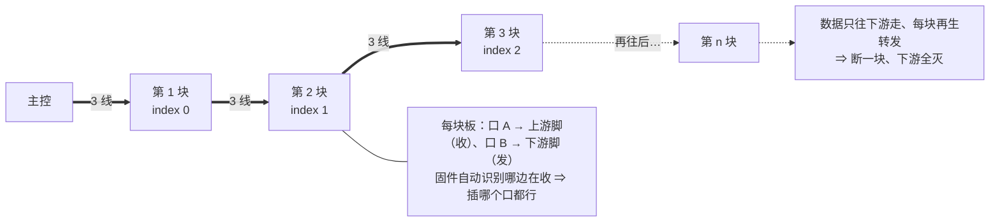
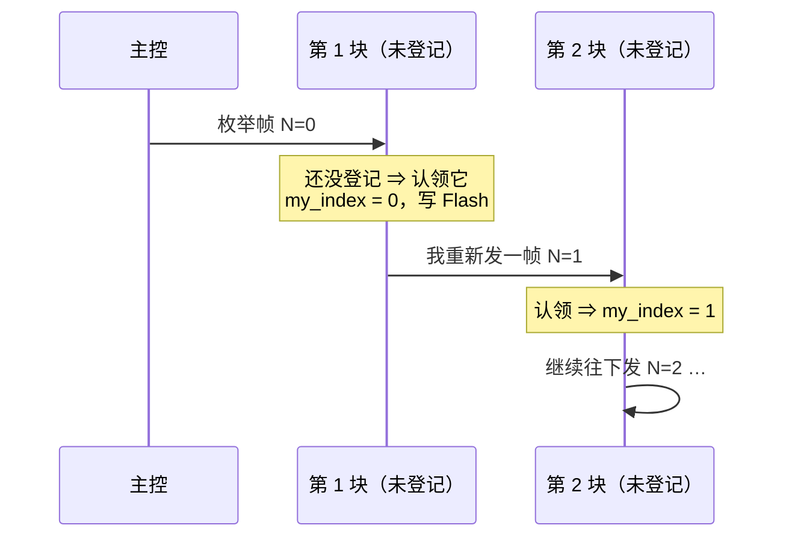
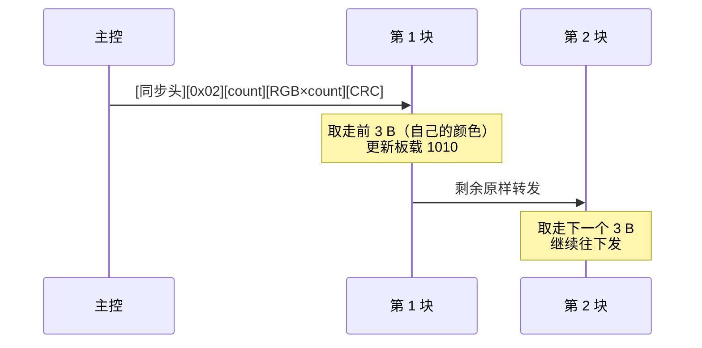
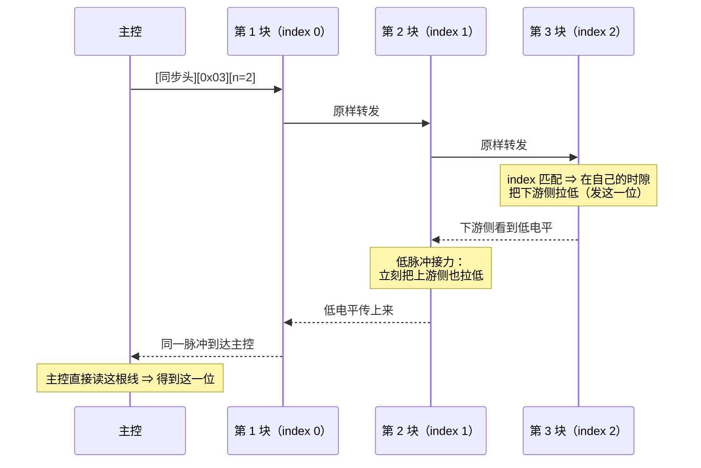
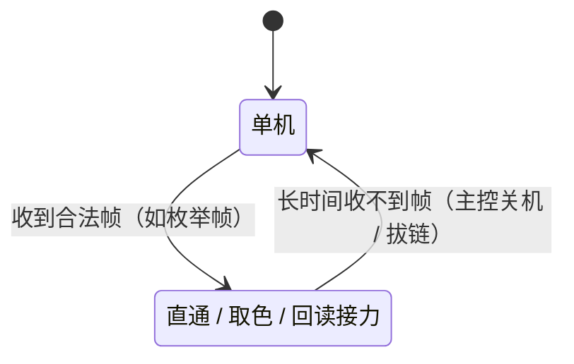
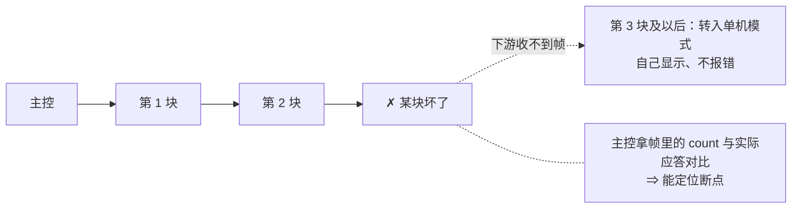

# 像素总线协议（草案）：三线半双工 · WS2812 式隐式寻址

> **状态（2026-09-25）**
> ✅ **用户已定**：① 物理层 = **3 线**（`5V` / `GND` / `DATA`），连接器 **`SH-1.0-3P-V` 立贴**（2026-09-25 由 MX-1.25 换成 SH-1.0 ✓ —— 用户要先把**最小尺寸**做出来看看 ✓）；
> ② 数据 = **半双工**（收发同线，因为 3 针里只剩 1 根数据线）；
> ③ 板尺寸先做 **25 × 25 mm**；④ 元件"尽可能小"（MCU 选型见 `connector-plan.md` §6）。
> ⏳ **本文的位定时与帧格式是草案**，待评审；物理层与寻址思路已定。

## 1. 它是什么（术语）

借鉴 WS2812 的**两条**核心思想 —— 不是它的线码：

| 层面 | 术语 | 我们的做法 |
|---|---|---|
| 拓扑 | **单向菊花链**（unidirectional daisy chain） | 每块两个口，链式串下去 ✓ |
| 线码 | 单线、脉宽编码、自定时 | ← **不照抄** ✗：我们加**主控发的节拍当软时钟**（时序更稳 ✓） |
| 寻址 | **隐式寻址 / 位置寻址**（implicit addressing） | 位置 = 链上先后 ✓ **不用地址字段** ✓ |
| 行为 | **分布式移位寄存器**（distributed shift register） | 每级"取走自己那份、转发剩余" ✓ |

**和 I2C 的关系**：开漏 + 上拉 + 主从轮询这一段**很像 I2C** ✓，但有两处不同 ✗：
① **少了 `SCL` 时钟线** ✗；② **拓扑是链、不是共线总线** ✗（见 §2 ✓）。
⇒ 不能直接用 I2C 外设 ✗；位定时靠**主控发节拍 + 节点自己测时**（或单线 UART —— CH32 是否支持
"单线半双工"模式**需查手册确认** ✗）。

> ⚠️ 芯片里**没有出厂"位置"信息** ✗（就算有唯一 ID 也只是身份、跟物理顺序无关 ✗）⇒ 位置**必须靠枚举**得到。

## 2. 物理层（已定）

- 三根线：`5V` / `GND` / `DATA`；**GND 居中**（万一错插先撞 GND，不把 5V 灌进数据脚 ✓）
- **★ 拓扑：与 WS2812 完全一致的单向接力链**（2026-09-26 用户定 ✓）：数据**只往下游走** ✓，
  每块收到后**再生转发** ✓；**位置 = 物理顺序** ✓，**帧里不带地址** ✓；断一块 ⇒ 下游全灭 ✗（同 WS2812 ✓）。
- **每块用两个脚**（不是同一个脚 ✗）：**上游脚**（收）+ **下游脚**（发）✓—— 14 个备用脚够用 ✓；
  固件自动识别“哪口在收” ⇒ **插哪个口都行** ✓（口 A / 口 B 同型 ✓）
- `DATA`：**开漏 + 上拉 4.7~10 kΩ**，**两端都能驱动** ✓，非说话方一律**高阻** ✓
  （**驱动** = 引脚设成输出 ✓；**不驱动** = **高阻输入**、只听 ✓ —— 上电后、复位后、没轮到时都保持高阻 ✓）
- 每块板两个口的 `DATA` 接到 MCU 的**同一个脚** ✓（否则读数回不来 ✗，见 `connector-plan.md` §0）
- `5V` / `GND` 穿链累积 ✗ ⇒ 电流预算按**全部同时点亮**核；每口 `5V` 串 **PPTC / 保险** ✓
- 每个口的 `DATA` 串 **100 Ω**（阻尼 + 限流，防"两个节点同时驱动"时烧脚 ✓）

## 3. 位定时（草案 · 待评审）

- 主控发**节拍**（高低电平脉冲），节点用定时器在每个节拍的固定相位采样 ✓
- 位编码建议**简单归零码**：一个位周期 T，前半高 = `1`、后半高 = `0`（或主控统一给时钟、节点在固定点回读 ✓）
- ★ **方向：直接照 WS2812 的编码**（2026-09-26 定 ✓ —— 既然拓扑与它一致 ✓）：位周期 **1.25 µs（800 kHz）** ✓、
  `T0H`/`T1H` 按 WS2812 比例 ✓、**长低电平（>50 µs）= 复位** ✓ ⇒ 现成的 WS2812 时序经验可直接复用 ✓
  ⚠️ 但差别要实测 ✗：WS2812 是**硬件**逐位再生 ✓；我们是 MCU ⇒ **逐位再生太紧** ✗ ⇒ 先按
  **逐字节 / 逐帧** 接力做 ✓，实测时序余量后再定（这一项留到固件阶段验证 ✗）
- ⏳ 待定：位周期 T（如 2 µs ⇒ 500 kbit/s ✓）、采样相位、各节点 RC 偏差容限（± % ✗ 要实测）
- 备选：若 USART 单线半双工可用 ⇒ 直接用它 ✓（协议栈最省事 ✓，帧格式照 §4）

## 4. 帧格式（草案 · 待评审）

### 4.1 下行帧（主控 → 下游，逐级转发）

| 字段 | 长度 | 说明 |
|---|---|---|
| 同步头 | 2 B | 节点复位/对齐用（如 `0xAA 0x55` ✓） |
| 命令 | 1 B | `0x01` 枚举 / `0x02` 颜色 / `0x03` 回读请求 |
| 参数 | 1~2 B | 依命令（如 `count` = 链上节点数 ✓） |
| 载荷 | N B | 颜色帧：每节点 3 B（RGB）；枚举帧：1 B 计数 |
| CRC | 1 B | 校验（可选，先跑通再上 ✓） |

### 4.2 位置枚举（上电走一遍，之后位置即地址）

- 每块把收到的 `N` 记成**自己的位置** ✓，再往下游发 `N+1` ✓
- 一路走完，**每块自知第几块** ✓✓；主控**不需要回执** ✓（想知道总长就用"查询"✓）
- 位置存 Flash ✓；若帧里的 `count`/`version` 与记录不符 ⇒ 重新枚举 ✓
- **枚举由主控发起、节点永远被动** ✓（节点不会自己去“找阵列” ✗）⇒ 触发时机：
  **① 上电**走一遍 ✓；**② 之后任何时候**主控发现 `count`/`version` 对不上
  （加了板 ✓、拔了板 ✓、某块重启过 ✓）就**重发一次枚举帧** ✓ —— 不用人工干预 ✓
- **单机 ↔ 链 可热切换** ✓：收不到合法帧 ⇒ 单机模式自己显示 ✓；**一旦收到合法帧就参与** ✓
  （**不用重启** ✓）—— 这正是“没轮到自己就高阻”带来的好处 ✓：可以随时插到一条
  **正在工作**的链上 ✓，或从链上拔下来 ✓

### 4.3 颜色帧（运行时，完全照 WS2812 的思路）

- 帧 = `[同步头][0x02][count][RGB × count][CRC]`
- 每块：**取走前 3 字节**当自己的颜色 ✓，**把剩余原样转给下游** ✓
- ⇒ **不用地址** ✓ 位置即地址 ✓；断一块 ⇒ 下游全灭 ✗（和 WS2812 一样 ✓，靠 `count` 判断断点 ✓）

### 4.4 回读（半双工的反向时隙）

- 主控广播 `[同步头][0x03][n]` ⇒ **位置 = n** 的那块，在随后的 k 个时隙里**开漏拉低下游线**发它的读数位 ✓
- **中间节点做“低脉冲接力”** ✓——这是**唯一一处必要地超出 WS2812** 的地方 ✗
  （WS2812 本身**没有回读** ✗，可我们必须把每个像素的场强收回来 ✓）：
  在**下游侧**看到低电平 ⇒ **立刻把自己的上游侧也拉低** ✓；节点**只“传”不“造”** ✗
  （不主动注入新脉冲 ✓）⇒ 不会撞总线 ✓
- 其余节点（非本次接力路径）一律**高阻** ✓
- 传播延迟 = 逐级叠加（µs 级 ✓）⇒ 时隙预算不变 ✓（下面那行数字仍成立 ✓）
- 10~12 bit ADC ⇒ 每轮 64 块 ≈ 640~768 个时隙 ✓ —— 慢，但场强成像不需要高帧率 ✓

## 5. 节点状态机

铁律：**任何时刻只有"被授权"的节点驱动** ✓；其余全部**高阻**（一个电平都不推 ✗）。

**"驱动"到底指什么**：**驱动** = 引脚设成输出（推挽拉高/拉低 ✓，回读时**开漏拉低** ✓）；
**不驱动** = 引脚设成**高阻输入**、只听 ✓。轮到你时**必须**驱动，共两处：
① **转发**（直通时把帧再发下游 ✓）；② **回读**（`index` 匹配时按自己的时隙开漏拉低 ✓）。

**为什么不许抢驱动**：`DATA` 是**收发共用的线** ✓ —— 两个节点同时驱动（一个推高、一个拉低）
就是**短路** ✗，可能烧引脚 ✗ ⇒ 每节点串 100 Ω 只是"万一"的阻尼 ✓，铁律本身才是保险 ✓。
**两种模式共存（一张图看切换）**：

## 6. 失败模式与对策

| 现象 | 原因 | 对策 |
|---|---|---|
| 下游全灭 | 某块断电/损坏 | 帧里带 `count`，主控能定位断点 ✓；**5V/GND 是穿链并接**的 ⇒ 电源不会断 ✓（但 **`DATA` 是接力链** ✗ ⇒ 坏一块、下游仍全灭 ✗）|
| 总线锁死 | 两个节点同时驱动 ✗ | 只授权时隙驱动 ✓ + 每节点串 100 Ω ✓ |
| 位置错乱 | 上电顺序/丢帧 | 帧头 + `count/version` 校验 ⇒ 不符就重新枚举 ✓ |
| 反压/错插 | 插错口 | 两口**完全等价** ✓（怎么插都对 ✓）；每口 5V 串 PPTC ✓；GND 居中 ✓ |

断链时的现场是这样的（坏一块，下游全部转入单机模式，不会互相干扰 ✓）：

## 7. 固件清单（CH32V003 / V002）

- [ ] 单线半双工收发（USART 单线模式 或 GPIO + 定时软件收发）
- [ ] 位置枚举 + `index` 存 Flash（带版本校验）
- [ ] 颜色帧"取走 3 B + 转发剩余" + **SPI + DMA**（走 `SPI_MOSI` ✓）驱动板载 WS2812-1010
- [ ] 回读：准时在自己的时隙开漏拉低
- [ ] 上电/复位默认**只直通、不驱动**总线 ✓；看门狗 ✓

## 8. 待定 / 待评审

1. **位定时与帧格式**（本文 §3/§4）—— 等你评审
2. **连接器**：✅ **已定 `SH-1.0-3P-V`**（宽 **5.0 mm** ✓，取最小尺寸 ✓）——原候选 `MX-1.25-3P-V`（宽 8.65 mm，更好手焊）作备选保留

**已定（2026-09-25）**：MCU = **`CH32V003F4U6`（QFN20，3 × 3 mm）** ✓（**SPI ✓ + OPA ✓**；`CH32V002F4U6` 同封装 drop-in ✓）；连接器 = **`SH-1.0-3P-V` 立贴** ✓（最小尺寸 ✓）；板 = **25 × 25 mm** ✓
（QFN20 的连带影响 —— 引脚表已重做 / EPAD 独立成网 / 手焊用风枪、批量钢网回流 —— 见 [`connector-plan.md`](connector-plan.md) §6 ✓）
