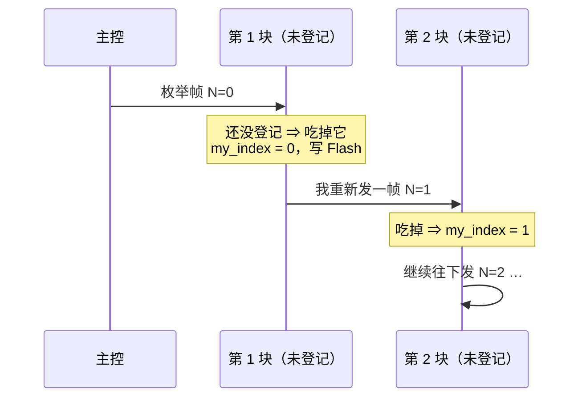
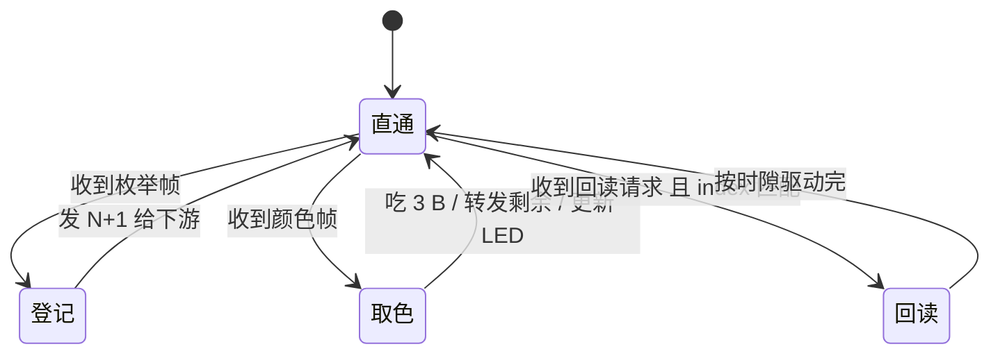

# 像素总线协议（草案）：三线半双工 · WS2812 式隐式寻址

> **状态（2026-09-25）**
> ✅ **用户已定**：① 物理层 = **3 线**（`5V` / `GND` / `DATA`），连接器 **MX-1.25-3P 立贴**；
> ② 数据 = **半双工**（收发同线，因为 3 针里只剩 1 根数据线）；
> ③ 板尺寸先做 **25 × 25 mm**；④ 元件"尽可能小"（MCU 选型见 `connector-plan.md` §6）。
> ⏳ **本文的位定时与帧格式是草案**，待评审；物理层与寻址思路已定。

## 1. 它是什么（术语）

借鉴 WS2812 的**两条**核心思想 —— 不是它的线码：

| 层面 | 术语 | 我们的做法 |
|---|---|---|
| 拓扑 | **单向菊花链**（unidirectional daisy chain） | 每块两个口，链式串下去 ✓ |
| 线码 | 单线、脉宽编码、自定时 | ← **不照抄** ✗：我们加**主控发的节拍当软时钟**（时序更稳 ✓） |
| 寻址 | **隐式寻址 / 位置寻址**（implicit addressing） | 位置 = 链上先后 ✓ **不用地址字段** ✓ |
| 行为 | **分布式移位寄存器**（distributed shift register） | 每级"吃掉自己那份、转发剩余" ✓ |

**和 I2C 的关系**：开漏 + 上拉 + 并联 + 主从轮询这一段**非常像 I2C** ✓，但 **少了 `SCL` 时钟线** ✗
⇒ 不能直接用 I2C 外设 ✗；位定时靠**主控发节拍 + 节点自己测时**（或单线 UART —— CH32 是否支持
"单线半双工"模式**需查手册确认** ✗）。

> ⚠️ 芯片里**没有出厂"位置"信息** ✗（就算有唯一 ID 也只是身份、跟物理顺序无关 ✗）⇒ 位置**必须靠枚举**得到。

## 2. 物理层（已定）

- 三根线：`5V` / `GND` / `DATA`；**GND 居中**（万一错插先撞 GND，不把 5V 灌进数据脚 ✓）
- `DATA`：**开漏 + 上拉 4.7~10 kΩ**，**两端都能驱动** ✓，非说话方一律**高阻** ✓
- 每块板两个口的 `DATA` 接到 MCU 的**同一个脚** ✓（否则读数回不来 ✗，见 `connector-plan.md` §0）
- `5V` / `GND` 穿链累积 ✗ ⇒ 电流预算按**全部同时点亮**核；每口 `5V` 串 **PPTC / 保险** ✓
- 每个口的 `DATA` 串 **100 Ω**（阻尼 + 限流，防"两个节点同时驱动"时烧脚 ✓）

## 3. 位定时（草案 · 待评审）

- 主控发**节拍**（高低电平脉冲），节点用定时器在每个节拍的固定相位采样 ✓
- 位编码建议**简单归零码**：一个位周期 T，前半高 = `1`、后半高 = `0`（或主控统一给时钟、节点在固定点回读 ✓）
- ⏳ 待定：位周期 T（如 2 µs ⇒ 500 kbit/s ✓）、采样相位、各节点 RC 偏差容限（± % ✗ 要实测）
- 备选：若 USART 单线半双工可用 ⇒ 直接用它 ✓（协议栈最省事 ✓，帧格式照 §4）

## 4. 帧格式（草案 · 待评审）

### 4.1 下行帧（主控 → 下游，逐级转发）

| 字段 | 长度 | 说明 |
|---|---|---|
| 同步头 | 2 B | 节点复位/对齐用（如 `0xAA 0x55` ✓） |
| 命令 | 1 B | `0x01` 枚举 / `0x02` 颜色 / `0x03` 回读请求 |
| 参数 | 1~2 B | 依命令（如 `count` = 链上节点数 ✓） |
| 载荷 | N B | 颜色帧：每节点 3 B（RGB）；枚举帧：1 B 计数 |
| CRC | 1 B | 校验（可选，先跑通再上 ✓） |

### 4.2 位置枚举（上电走一遍，之后位置即地址）

- 每块把收到的 `N` 记成**自己的位置** ✓，再往下游发 `N+1` ✓
- 一路走完，**每块自知第几块** ✓✓；主控**不需要回执** ✓（想知道总长就用"查询"✓）
- 位置存 Flash ✓；若帧里的 `count`/`version` 与记录不符 ⇒ 重新枚举 ✓

### 4.3 颜色帧（运行时，完全照 WS2812 的思路）

- 帧 = `[同步头][0x02][count][RGB × count][CRC]`
- 每块：**吃掉前 3 字节**当自己的颜色 ✓，**把剩余原样转给下游** ✓
- ⇒ **不用地址** ✓ 位置即地址 ✓；断一块 ⇒ 下游全灭 ✗（和 WS2812 一样 ✓，靠 `count` 判断断点 ✓）

### 4.4 回读（半双工的反向时隙）

- 主控广播 `[同步头][0x03][n]` ⇒ **位置 = n** 的那块，在随后的 k 个时隙里**开漏拉低总线**发它的读数位 ✓
- **其余节点只听、绝不驱动** ✓（这是避免撞总线的铁律 ✗）
- 10~12 bit ADC ⇒ 每轮 64 块 ≈ 640~768 个时隙 ✓ —— 慢，但场强成像不需要高帧率 ✓

## 5. 节点状态机

铁律：**任何时刻只有"被授权"的节点驱动总线** ✓；其余全部高阻 ✓。

## 6. 失败模式与对策

| 现象 | 原因 | 对策 |
|---|---|---|
| 下游全灭 | 某块断电/损坏 | 帧里带 `count`，主控能定位断点 ✓；5V/GND 在板上是并联的，单块坏不会断链 |
| 总线锁死 | 两个节点同时驱动 ✗ | 只授权时隙驱动 ✓ + 每节点串 100 Ω ✓ |
| 位置错乱 | 上电顺序/丢帧 | 帧头 + `count/version` 校验 ⇒ 不符就重新枚举 ✓ |
| 反压/错插 | 插错口 | 两口**完全等价** ✓（怎么插都对 ✓）；每口 5V 串 PPTC ✓；GND 居中 ✓ |

## 7. 固件清单（CH32V003 / V002）

- [ ] 单线半双工收发（USART 单线模式 或 GPIO + 定时软件收发）
- [ ] 位置枚举 + `index` 存 Flash（带版本校验）
- [ ] 颜色帧"吃掉 3 B + 转发剩余" + **SPI + DMA**（走 `SPI_MOSI` ✓）驱动板载 WS2812-1010
- [ ] 回读：准时在自己的时隙开漏拉低
- [ ] 上电/复位默认**只直通、不驱动**总线 ✓；看门狗 ✓

## 8. 待定 / 待评审

1. **位定时与帧格式**（本文 §3/§4）—— 等你评审
2. **连接器**：`MX-1.25-3P-V`（宽 8.65 mm —— **已定 ✓**）vs `SH-1.0-3P-V`（宽 5.0 mm，备选）

**已定（2026-09-25）**：MCU = **`CH32V003F4U6`（QFN20，3 × 3 mm）** ✓（**SPI ✓ + OPA ✓**；`CH32V002F4U6` 同封装 drop-in ✓）；连接器 = **MX-1.25-3P 立贴** ✓；板 = **25 × 25 mm** ✓
（QFN20 的连带影响 —— 引脚表已重做 / EPAD 独立成网 / 手焊用风枪、批量钢网回流 —— 见 [`connector-plan.md`](connector-plan.md) §6 ✓）
