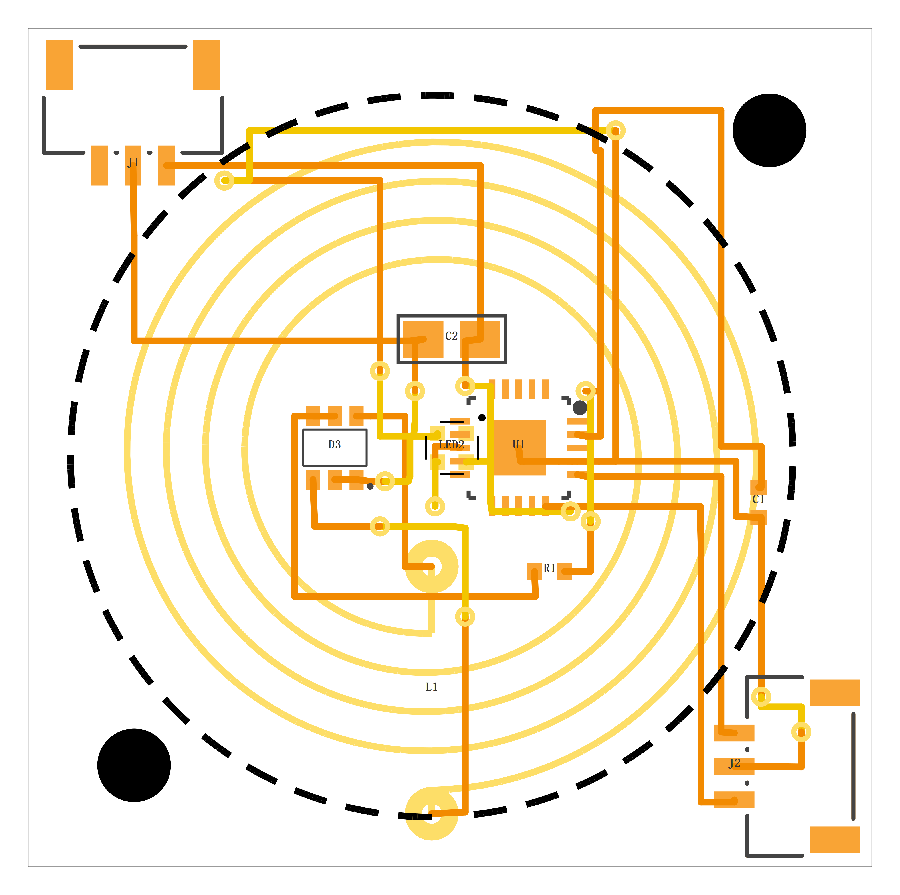

# L1 线圈：规格、可换档位、以及电气代价（2026-10-01 ✓）

> 为什么有这个文档 ✗：布线走到 8/9 卡住时，**所有**"没路"的测量都指向同一件事 ——
> **线圈的铜把板中间占满了** ✓（它在顶层铺 6 圈 ✓，所有走廊都得钻**匝间缝** ✓）。
> 把"参数 ↔ 布线后果 ↔ 电气代价"一次写清 ✓，免得每次从头推 ✓。

## 1. 现在用的规格

**库件**：`fritzing-parts-langhua/svg/NFC-Coil/part.NFC_Coil_20mm_6T_0p2_1.fzp`
**生成器**：`svg/NFC-Coil/gen_coil.py`（4 个常数 + 2 个焊盘半径 ✓，全部参数化 ✓）

| 项 | 值 | 出处 |
|---|---|---|
| 匝数 `TURNS` | **6** | `.fzp` 属性 `turns` ✓ |
| 外半径 `OUTER_R` | **10.0 mm**（OD 20 ✓）| `.fzp` 属性 `outer diameter (mm)` ✓ |
| 阵列安全外半径 `ARRAY_OUTER_R` | **9.5 mm**（OD 19 ✓）| 代码注释：`for isolation at 20 mm pitch` ✓ |
| 空心半径 `INNER_R` | **4.0 mm**（⌀8 ✓）| `.fzp` 属性 `inner diameter (mm)` ✓ |
| 铜宽 `TRACE_W` | **0.200 mm** ✓ | 名字里的 `0p2` ✓ |
| 内端焊盘 `INNER_PAD_R` | r = **3.30 mm** ✓ | `gen_part.py` ✓（特意从 4.0 挪开避开相邻匝 ✓）|
| 外端焊盘 `OUTER_PAD_R` | r = **10.70 mm** ✓ | 同上 ✓ |
| 绕组所在层 | **只有 `copper1`（顶层 ✓）** | 背面要无铜，否则衰减 13.56 MHz 场 ✓ |
| 层结构 | `<g id="copper1">` 里嵌 `<g id="copper0">`（**只有两个端焊盘**是通孔 ✓）| `gen_part.py` ✓ |

**★ 一处不一致（记账 ✓，暂不改 ✗）**：名字/属性写 **20 mm** ✗，而 `gen_part.py` 明说
"single-coil 的面包板/PCB 图**也用阵列那个 19 mm**" ✓ ⇒ 本项目 README 的 BOM 记的也是
「NFC 线圈 **φ19** / 6 匝 / 0.2 mm ✓、实测铜箔外径 **19.0 mm** ✓」✓ ⇒ **19 才是要守的那个数** ✓
（阵列 20 mm 间距要求 ≤19 ✓）。

### 板上实测（`_work/probe_coil_rings.py` ✓ 沿 +x 射线数圈 ✓）
```
6 圈铜 ✓｜圈心半径 ≈ 4.43 / 5.46 / 6.47 / 7.46 / 8.46 / 9.46 mm
⇒ 匝距 ≈ 1.006 mm ✓（与生成器 (10−4)/6 = 1.0 ✓ 吻合 ✓）
⇒ 匝间缝 ≈ 0.75 mm ✓｜空心 ⌀ ≈ 8.6 mm ✓｜外径 ≈ 19.2 mm ✓
```
**为什么这就会挤死** ✓：一条 8 mil 线（0.20 mm ✓）+ 两侧净空 0.15 mm ✓ = 需要 **0.50 mm** ✓，
而缝只有 **0.75 mm** ✓ ⇒ 富余 0.25 mm ✓，再被 **0.15 mm 的布线栅格**一量化 ✓ ⇒ 基本只剩"一格" ✗。

## 2. 换算口径（可复算 ✓）
- **匝距** `s = (r_o − r_i) / N` ✓（实测吻合 ✓；`r_o` 外端中心线 ✓、`r_i` 最内匝中心线 ✓）
- **匝间缝** `= s − 0.2 mm` ✓（铜宽 ✓）
- **感应电压（估算 ✓）** `V ∝ Σ r_k²`，`r_k = r_i + (k − 0.5)·s`（k = 1..N ✓）
  —— 准静态、匀场下"各匝面积相加" ✓；**未**计入负载/频率/自感效应 ✗
- **电感（估算 ✓）** `L ∝ N² · r_mean`，`r_mean = (r_i + r_o)/2` ✓
  —— 经典平面螺旋标度 ✓；精确值要靠场解算或实测 ✗

## 3. 候选档位（外半径固定 r_o ≈ 10.0 mm ⇒ **外径不变** ✓ ⇒ 阵列 20/22 mm 不受影响 ✓）

| 方案 | 匝数 | 空心 ⌀ | 匝距 | **匝间缝** | **感应电压** | **电感** |
|---|---|---|---|---|---|---|
| **A 现在** | 6 | 8.0 | 1.00 | 0.80 | 基准（100%）| 基准（100%）|
| **B 已试 ✓** | **4** | **10.6** | 1.175 | **0.975** | **−23%** | **−51%** |
| C | 4 | 9.6 | 1.30 | 1.10 | −27% | −53% |
| D | 4 | 8.0 | 1.50 | 1.30 | −34% | −56% |
| E | 5 | 8.0 | 1.20 | 1.00 | −17% | −31% |
| F | 3 | 10.6 | 1.567 | 1.37 | −42% | −73% |
| G ✗ 反例 | 6 | 10.6 | 0.783 | **0.58** ✗ | −? | −? |

> **G 是反例** ✓：**只放大空心、不减匝数** ⇒ 匝距被压小 ✓ ⇒ 缝 **更窄** ✗ ——
> "换大空心"必须和"减匝数"一起做 ✓。
> 另外：**只把铜从 0.2 改 0.15** ⇒ 缝 +0.05 mm ✓（基本没用 ✓）。

## 4. 实测：方案 B（4 匝 / 空心 ⌀10.6）跑布线



| 指标 | 现在（6 匝） | **方案 B（4 匝 / ⌀10.6）** |
|---|---|---|
| 连通 | 8/9 ✓ | **8/9** ✓ |
| ④ 短路 / 悬空端点 / ⑦ 过孔压盘 | 0 / 0 / 0 ✓ | 0 / 0 / 0 ✓ |
| 问题总数 | 1 处 ✗ | 1 处 ✗ |
| **未连通的是** | `RC`（**3 个脚**，散在线圈缝里 ✗）| **`DATA_IN`（只有 2 个脚** ✓：`U1.connector2` ↔ `J1.connector2`）|
| 走线 / 过孔 | 115 / 8 | 131 / **14** ✗ |
| 匝间缝（板上实测 ✓）| 0.75 mm | **0.91 mm** ✓ |
| 空心 ⌀（板上实测 ✓）| 8.6 mm | **11.4 mm** ✓✓ |

⇒ 结论 ✓：**线圈这条杠杆确实有用** ✓（`RC` 通了 ✓、缺口换成更好收的 2 脚网 ✓），
而且**空心大了 2.8 mm** ✓ ⇒ 那些原来"挤在洞里没处挪"的件（`U1`/`R1`/`C1`/`D3`/`LED2` ✓）
**现在有重摆的余量** ✓ —— 这是之前做不到的 ✓。

## 5. 选型建议（待用户定 ✓）
1. **先在新空心上重摆** ✓（零电气代价 ✓）：`R1`/`C1`/`D3`/`LED2` 摆松一点 ✓，逐件用
   `_work/move_part.py` 的 ⑧ 判据核 ✓（同层逐图元净距 ≥ 0.25 mm ✓、不出板 ✓）。
2. **再决定匝数** ✓：方案 B（−23% 电压 ✓）或 C（−27% / 缝更宽 ✓）；方案 F 电压代价 −42% ✗ 慎用 ✓。
3. **换规格要按库的规矩做** ✗：新建一个**正式元件**（icon / 面包板 / 原理图 / PCB 四视图 ✓
   + `.fzpz` ✓ + README 与元件箱登记 ✓），**不改**现有那个 6 匝件 ✓。

## 6. 复现命令（都在 `hardware/pixel/` ✓）
```bash
# 变体绕组（4 匝 / 内 r 5.3）：只换绕组与短接段，焊盘/丝印/文件头原样保留 ⇒ 原地替换
py -3.13 _work\coil_variant.py pixel-pcb-v50-place.fzz _work\v50-place-4t.fzz 4 5.3
# 量匝距/匝间缝
py -3.13 _work\probe_coil_rings.py _work\v50-place-4t.fzz
# 跑布线 + 独立复核
py -3.13 _work\run_gen.py _work\v50-place-4t.fzz _work\v85.fzz --nets=pixel_nets.py --partial --check
```
