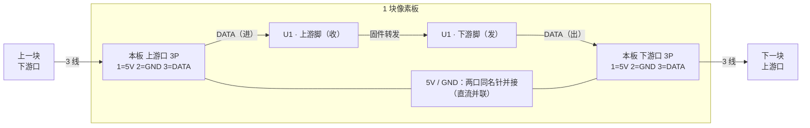

# 像素板接插件方案：3P 三线总线（交叉 / 防呆 / 半双工）

> 状态（2026-09-25）用户已定：① 连接器 = **`SH-1.0-3P-V`（1.0 mm 间距、宽 5.0 mm —— 取最小尺寸）** ✓；② 数据 = **半双工** ✓。
> 本文定针序、口位、交叉与防呆的做法、丝印与电气注意；`pixel.fzz` 按此连线。

*已定座子：`SH-1.0-3P-V`（立贴，库里已有 ✓，宽 5.0 mm ✓）/ 更好手焊的 `MX-1.25-3P-V` 见 §6*

## 0. 先说结论：3P + 半双工 ⇒ 两口**电气等价**，"交叉"问题自然消失

三根针只能给 `5V / GND / DATA`。数据要双向（命令下行 + 读数回传）就只能**半双工**（收发同线、分时）
⇒ 两个口的 DATA **必须接到同一个 MCU 引脚**（若一个口专收、一个口专发，读数就永远回不来 ✗：
链上的线是**单向**的，out 口指向下游，读数没路回家 ✗）。

于是两块板之间就是**一条三线总线**，`IN / OUT` 只剩丝印意义：

- **交叉**：**不需要** ✓ —— 两个口**同型**：口 A 的 `DATA` 进**上游脚**、口 B 的 `DATA` 进**下游脚**，
  固件**自动识别哪边在收** ✓ ⇒ **怎么插都通** ✓（拿哪根线、插哪个口都对 ✓）
  ⚠️ 但**别把两口的第 3 针短接** ✗ —— 短接就成了“全网一根线”的真总线 ✗，不再是接力链 ✗（见本节末 ✓）
- **防呆**：做到最强 ✓✓ —— 两个口**都能当上游或下游用**，**不存在“插到 OUT 上”这种错误** ✓；
  3P 座本身有极性 ✓，插头也插不反 ✓

⚠️ **代价（必须认下来）**：这就是 `README §5.2` 的 **3 线方案**，固件要**寻址/枚举**（文档里标的
“⚠️ 需一次性标定” ✓）；**板上数据仍是两根网** —— `DATA_IN` = `PA2`(pin 3) 收 ✓、
`DATA_OUT` = `PD0`(pin 5) 发 ✓，省掉的只是**板间那根线** ✓（见下）。

> 时序、帧格式、枚举与回读时隙：见 [`bus-protocol.md`](bus-protocol.md) ✓
> **本文只定"接插件与接线"**；协议细节不在本文。

### 为什么板间只用 3 根线，面上却是两根数据网？

**4 线方案是这样的**：每块板有两个数据脚（`PA2` 收 + `PC1` 发），板间**拉两根数据线**：

每根线**只走一个方向** ✓，两根各管一向 ⇒ 可以**同时**收发 = 全双工 ✓。

**3P 只有一个数据针** ⇒ 两块板之间**只有一根数据线** ✓ ⇒ 它得**分时**干两件事 = 半双工 ✓。
⚠️ 但"上游口专收、下游口专发"那种接法是**死路** ✗ —— 一根线只能由**一端**驱动：

下游板要回话就得驱动**自己下游口**那根线 ✗（那是通往再下一级的 ✗）⇒ **读数回不了家** ✗✗。

所以回读不能靠“换一根线”，只能**顺着原路接力回去**：轮到谁时谁把**自己下游侧拉低** ✓，
上游节点见到低电平**立刻在它上游侧也拉低** ✓ ⇒ 一个低脉冲**逐级接力**传到主控 ✓
（这是唯一一处超出 WS2812 的地方 —— WS2812 本身**没有回读** ✗，可我们必须把场强收回来 ✓；
详见 [`bus-protocol.md`](bus-protocol.md) §4.4 ✓）。

⇒ 省掉的是**板间那根线**（回程那根 ✗），**不是板上的脚** ✗ ——
板上始终是 **2 个数据脚 / 2 根网**：`DATA_IN` = `PA2`(pin 3) 收 ✓、`DATA_OUT` = `PD0`(pin 5) 发 ✓；
**不许把两口的第 3 针短接** ✗ —— 短接就把接力链变成“全网一根线”的真总线 ✗，回读时隙会互相打架 ✗，
也失去“与 WS2812 完全一致”的简单性 ✓。

> 类比：4 线方案是**电话**（两根线、双方同时说 ✓）；3 线方案是**接力传话**（一根线、
> 每块“听了再生、再往前传” ✓，想往回说话就一拍一拍往上传 ✓）。

### 4 线方案 与 3 线方案 对比

| | **4 线方案** | **3 线方案**（3P 座）|
|---|---|---|
| 板间线 | `5V` `GND` `DATA↓` `DATA↑` | `5V` `GND` **`DATA`（半双工）** |
| 数据线数 | **2 根**（每方向一根 ✓） | **1 根**（两端轮流用 ✓） |
| MCU 数据脚 | **2 个**（收 + 发各 1 ✓，与现在的 QFN20 也兼容 ✓） | **1 个**（收发切换 ✓，另 1 个空出备用） |
| 同时收发 | 可以 ✓（全双工） | 不行 ✗（要排队，像对讲机 ✓） |
| 读数回传 | 有独立回程线 ✓ 固件简单 | 靠同一根线分时 ✓ 要协议（寻址/时隙）✗ 复杂 |

## 1. 针序（两个口完全一样）

| 针 | 信号 | 说明 |
|---|---|---|
| 1 | `5V` | 穿链；多块同时点亮时按 §5.2 的电流预算核 |
| 2 | **`GND`（居中）** | 万一插错，先撞 GND，而**不是**把 5V 灌进数据脚 ✓ |
| 3 | `DATA` | **接力链**（同 WS2812）：一个口进、另一个口出；每口串 100 Ω到 MCU（§5） |

## 2. 接线（5V/GND 两口并接；`DATA` 一口进、一口出 ✓）

- `5V` / `GND`：两口同名针**直接短接**（1-1、2-2）⇒ 电源是直流并联 ✓
- `DATA`：**一口进、一口出、不并接** ✗ —— 它是**接力链**（同 WS2812 ✓）
  ⇒ 3 针里进 MCU 的是 **2 根数据线**（**上游脚 + 下游脚**）✓，不是 1 根 ✗
- 两个口**同型、不分上下游** ✓（固件自动识别哪边在收 ⇒ 插哪个口都能用 ✓）；
  丝印 `IN / OUT` 只表拼接方向 ✓

## 3. 布局与丝印

- 两个口放板的**两条对边**、**开口朝外** ✓；丝印 `IN ▼` / `OUT ▲`（**只表拼接方向**：
  两个口本身同型、电气上互挨也行 ✓ —— 写它是为了让现场拼接/调试时一眼看出链路走向 ✓）
- 口旁丝印 = `5V` `GND` `DATA` + **1 脚标记**（照嘉立创习惯，**不画 1 脚圆点** ✓）
- `5V` / `GND` 用**短而宽**的铜（≥0.6 mm ✓）；`DATA` 随便 ✓
- 尺寸：`SH-1.0-3P-V` 座宽 **5.0 mm** ✓（原来担心的 8.65 mm 已换掉 ✓）⇒ 20/22 mm 板边放**两个口 + φ19 线圈**宽裕得多 ✓（见 §6）

## 4. 接力链要点（固件侧）

- 空闲（无帧）时，每个节点的**数据脚都高阻** ✓，线靠上拉保持高电平 ✓；
  一块开始发 = 给下游“喂”电平 ✓（“不能同时驱动”的铁律见 [`bus-protocol.md`](bus-protocol.md) §5 ✓）
- 命令**下行**：主控发 → 每块“取走自己那 3 B、把剩下的原样转发”（同 WS2812 ✓）
- 回读：帧里带**时隙号**，轮到谁时谁把自己的**下游侧拉低** ✓；上游节点见到低电平就
  **逐级接力**把它传回去 ✓（见 [`bus-protocol.md`](bus-protocol.md) §4.4 ✓）
- 上电**枚举**：主控发 `N=0` ⇒ 第一块认领 `index 0` **并把 `N+1` 转给下游** ✓
  （地址存 Flash ✓；3 线方案的已知代价 ✓）

## 5. 电气注意

- `5V/GND` 是**穿链累积**的 ✗ ⇒ 插座针数与线径按**最坏（全部同时点亮）**核；不够就**分段供电** ✓
- `DATA`：串 **100 Ω**（限流/阻尼 ✓）+ **上拉 4.7~10 kΩ**（空闲时把线拉高 ✓；接力/回读时靠它恢复高电平 ✓）+ ESD ✓
- 每个口的 `5V` 串 **0.5 A 保险丝 / PPTC**（错插、短路保护 ✓）
- 两口的 `5V`/`GND` 在板上**直流并接** ⇒ 一块板坏掉不会断开整条链的**电源** ✓（短路情形见上一条 ✗）
  ⚠️ 但 `DATA` **不是**全网并接 ✗ —— 它是接力链 ⇒ **坏一块、下游全灭** ✗（见 [`bus-protocol.md`](bus-protocol.md) §2 ✓）

## 6. 已定与待定

### ✅ 已定（2026-09-25 用户拍）

- **连接器**：`SH-1.0-3P-V`（**立贴** ✓ —— 理由：插拔方便 ✓ + 占地最小 ✓）
- **板尺寸**：先做 **25 × 25 mm** ✓
- **MCU**：**`CH32V003F4U6`（QFN20，3 × 3 mm，20 脚 + EPAD）** ✓
  （2026-09-25 演进：`J4M6` 是 **SOP8** ✗ 更正 → 试过 QFN12 `D4U6` ✗（无 SPI）→ 用户定 **回 QFN20** ✓
   —— 只有 20 脚才引得出 `PC5/PC6/PC7`（SCK/MOSI/MISO）✓，于是 **SPI ✓ 与 OPA ✓ 一起回来** ✓）
  `CH32V002F4U6`（12-bit ADC、无 OPA）与它**同封装 drop-in** ⇒ 实测后再定、板子不用改 ✓

**MCU 定案带出的四件事**

1. ✅ **`README §4.2 / §4.3` 引脚表已按 QFN20 重做** ✓（20 脚 + EPAD；18 个 GPIO 里只用了 4 个：
   PA1 = 线圈 ADC / PA2 = 链 DATA / **PC6（`SPI_MOSI`）= LED** / PD1 = SWIO ✓）
2. ⚠️ **EPAD 要独立成网** ✓（库规则：裸露焊盘叫 `EPAD` / `EP`，**不进 `<buses>` 的 GND 总线** ✗
   —— 它要布线时**特意接到 GND**，自动合并会让人以为已经接好了 ✓）
   ⚠️ **但库内 `CH32V003F4U6.fzp` 现在把 EPAD 命名为 `VSS` 且放进了 `<bus id="VSS">`** ✗
   （与 `CH32V002D4U6` 用的 `EPAD` 不一致；`fzp_check.py` 第 ⑥ 条只查名字含 `EPAD/EP` 的 ⇒ **漏检** ✗）
   ⇒ 要不要一并改成 `EPAD` + 移出总线，**等你点头我再动库** ✓
3. ⚠️ **工艺**：QFN20 是**底面焊盘** ⇒ 批量用**钢网 + 回流**；**手焊/返修：风枪 + 焊锡膏即可 ✓**
   （用户实测过 QFN，没有传说中那么难 ✓ —— 2026-09-25 更正了我先前“不能手焊”的说法 ✗）
4. ⚠️ **`pixel.fzz` 已作废** ✗ —— 用户 2026-09-25：「现在的 fzz 文件都已经没有参考意义了」
   （LED 改 1010 / MCU 改 QFN20 / 插件改 MX-3P / 总线改三线半双工）⇒ **不修旧图**，等方案定稿重建 ✓

- ✅ **QFN20 的封装尺寸 + 20 脚定义已核实** ✓（datasheet §4 封装表：3.0 × 3.0 mm / 0.4 mm；
  §2.2 表 2-1：pin 0 = VSS/EPAD ✓、`PC5/PC6/PC7` = SCK/MOSI/MISO ✓）
  ⇒ 已写进 `README §4.2 / §4.3` ✓（旧 QFN12 的“要我去量就说”作废 ✓）

### ✅ 已定：连接器取最小的（2026-09-25）

用户原话：「有意换成 SH-1.0 的，想把最小尺寸的做出来看看」✓

- **`SH-1.0-3P-V`**（宽 **5.0 mm** ✓，1.0 mm 间距）—— **已定 ✓**
- 代价（认下来 ✓）：1.0 mm 间距**较难手焊 / 压线** ✗（MX-1.25 的 1.25 mm 好焊一些 ✓）
- 好处：板边能更窄 ⇒ 将来往 **20 / 22 mm 间距**收的时候有余量 ✓
- 备选保留：`MX-1.25-3P-V`（宽 8.65 mm，好手焊 ✓）
