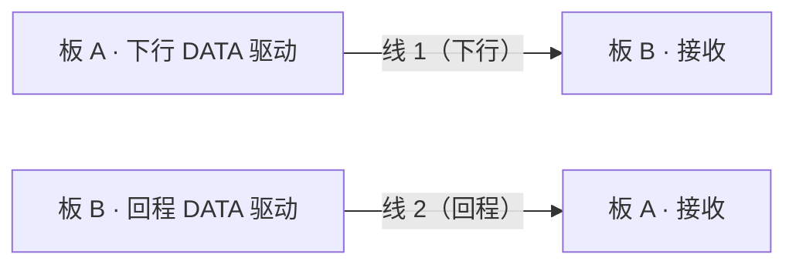
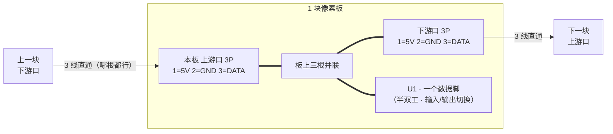

# 像素板接插件方案：3P 三线总线（交叉 / 防呆 / 半双工）

> 状态（2026-09-25）用户已定：① 连接器 = **MX-1.25 3P** ✓；② 数据 = **半双工** ✓。
> 本文定针序、口位、交叉与防呆的做法、丝印与电气注意；`pixel.fzz` 按此连线。

*候选座子：`MX-1.25-3P-V`（立贴，库里已有 ✓）/ 卧贴版见 §6*

## 0. 先说结论：3P + 半双工 ⇒ 两口**电气等价**，"交叉"问题自然消失

三根针只能给 `5V / GND / DATA`。数据要双向（命令下行 + 读数回传）就只能**半双工**（收发同线、分时）
⇒ 两个口的 DATA **必须接到同一个 MCU 引脚**（若一个口专收、一个口专发，读数就永远回不来 ✗：
链上的线是**单向**的，out 口指向下游，读数没路回家 ✗）。

于是两块板之间就是**一条三线总线**，`IN / OUT` 只剩丝印意义：

- **交叉**：**不需要** ✓ —— 两口一一并联，**怎么插都通** ✓（拿哪根线、插哪个口都对 ✓）
- **防呆**：做到最强 ✓✓ —— 两口完全等价，**不存在"插到 OUT 上"这种错误** ✓；
  3P 座本身有极性 ✓，插头也插不反 ✓

⚠️ **代价（必须认下来）**：这就是 `README §5.2` 的 **方案 B**，固件要**寻址/枚举**（文档里标的
"⚠️ 需一次性标定" ✓）；并且原 **A2 的 4 网作废** —— `DATA_IN` / `DATA_OUT` 合成一根，
MCU 只占 **1 个数据脚**（`PA2`，pin 3 ✓ —— 原 SOP8 的 pin3 / pin5 两个脚现在只占 1 个，**空出 1 个** ✓，见 §6）。

> 时序、帧格式、枚举与回读时隙：见 [`bus-protocol.md`](bus-protocol.md) ✓
> **本文只定"接插件与接线"**；协议细节不在本文。

### 为什么 `DATA_IN` / `DATA_OUT` 会合成一根？（把这事说透）

**A2（4 线）是这样的**：每块板有两个数据脚（`PA2` 收 + `PC1` 发），板间**拉两根数据线**：

每根线**只走一个方向** ✓，两根各管一向 ⇒ 可以**同时**收发 = 全双工 ✓。

**3P 只有一个数据针** ⇒ 两块板之间**只有一根数据线** ✓ ⇒ 它得**分时**干两件事 = 半双工 ✓。
⚠️ 但"上游口专收、下游口专发"那种接法是**死路** ✗ —— 一根线只能由**一端**驱动：

板 B 要回话就得驱动**自己下游口**那根线 ✗（那是通往 C 的 ✗）⇒ **读数回不了家** ✗✗。

所以必须把**两个口的第 3 针接到 MCU 的同一个脚** ✓ —— 这根线两端都挂在 MCU 的 GPIO 上，
谁想说就驱动、说完就放开（高阻）✓ ⇒ **真正的半双工总线** ✓✓。这时"进来的"和"出去的"
走的是**同一根线、同一个脚** ⇒ `DATA_IN` / `DATA_OUT` 这个概念**自然合成一根 `DATA`** ✓。

> 类比：A2 是**电话**（两根线、双方同时说 ✓）；3P 是**对讲机**（一个频道、轮流说 ✓）。
> 3P 比 A2 少掉的那根，就是**回程数据线** —— 这就是"4 网作废"的意思 ✓。

### A2 与 3P 方案对比

| | A2（4 线） | 3P 方案（3 线） |
|---|---|---|
| 板间线 | `5V` `GND` `DATA↓` `DATA↑` | `5V` `GND` **`DATA`（半双工）** |
| 数据线数 | **2 根**（每方向一根 ✓） | **1 根**（两端轮流用 ✓） |
| MCU 数据脚 | 2 个（PA2 + PC1 ✓） | **1 个**（收发切换 ✓，另 1 个空出备用） |
| 同时收发 | 可以 ✓（全双工） | 不行 ✗（要排队，像对讲机 ✓） |
| 读数回传 | 有独立回程线 ✓ 固件简单 | 靠同一根线分时 ✓ 要协议（寻址/时隙）✗ 复杂 |

## 1. 针序（两个口完全一样）

| 针 | 信号 | 说明 |
|---|---|---|
| 1 | `5V` | 穿链；多块同时点亮时按 §5.2 的电流预算核 |
| 2 | **`GND`（居中）** | 万一插错，先撞 GND，而**不是**把 5V 灌进数据脚 ✓ |
| 3 | `DATA` | 半双工总线；串 100 Ω 到 MCU（§5） |

## 2. 接线（板上就三根线并联）

- 两口对应针**直接短接**（1-1、2-2、3-3）—— 这是全部"接线"
- 3 针都进 MCU 只有 1 根（`DATA`），另两根是电源 ⇒ **`DATA_IN`/`DATA_OUT` 不再分开** ✓

## 3. 布局与丝印

- 两个口放板的**两条对边**、**开口朝外** ✓；丝印 `IN ▼` / `OUT ▲`（**只表拼接方向**，
  电气上等价 —— 写它是为了让现场拼接/调试时一眼看出链路走向 ✓）
- 口旁丝印 = `5V` `GND` `DATA` + **1 脚标记**（照嘉立创习惯，**不画 1 脚圆点** ✓）
- `5V` / `GND` 用**短而宽**的铜（≥0.6 mm ✓）；`DATA` 随便 ✓
- 尺寸：`MX-1.25-3P-V` 座宽 **8.65 mm** ⇒ 20/22 mm 的板边放**两个口 + φ19 线圈**会很紧 ✗（见 §6）

## 4. 半双工要点（固件侧）

- 空闲时**所有节点**的 `DATA` 都是输入 / 高阻 ✓
- 命令**下行**：主控发 → 每块"吃掉自己那部分、把剩下的转发"（同 WS2812 的思路 ✓）
- 回读：帧里带"回读时隙"，像素在**自己的时隙**里驱动总线（**开漏 + 上拉**最省事 ✓），
  或走**令牌轮询** ✓
- 上电**枚举 / 一次性标定**：给每块分配地址并存进 Flash ✓（方案 B 的已知代价 ✓）

## 5. 电气注意

- `5V/GND` 是**穿链累积**的 ✗ ⇒ 插座针数与线径按**最坏（全部同时点亮）**核；不够就**分段供电** ✓
- `DATA`：串 **100 Ω**（限流/阻尼 ✓）+ **上拉 4.7~10 kΩ**（开漏半双工必需 ✓）+ ESD ✓
- 每个口的 `5V` 串 **0.5 A 保险丝 / PPTC**（错插、短路保护 ✓）
- 两口的 `5V`/`GND` 在板上直流并联 ⇒ 一块板坏掉不会断开整条链的电源 ✓（但会短路时见上一条 ✓）

## 6. 已定与待定

### ✅ 已定（2026-09-25 用户拍）

- **连接器**：`MX-1.25-3P-V`（**立贴** ✓ —— 理由：插拔方便 ✓）
- **板尺寸**：先做 **25 × 25 mm** ✓
- **MCU**：**`CH32V003F4U6`（QFN20，3 × 3 mm，20 脚 + EPAD）** ✓
  （2026-09-25 演进：`J4M6` 是 **SOP8** ✗ 更正 → 试过 QFN12 `D4U6` ✗（无 SPI）→ 用户定 **回 QFN20** ✓
   —— 只有 20 脚才引得出 `PC5/PC6/PC7`（SCK/MOSI/MISO）✓，于是 **SPI ✓ 与 OPA ✓ 一起回来** ✓）
  `CH32V002F4U6`（12-bit ADC、无 OPA）与它**同封装 drop-in** ⇒ 实测后再定、板子不用改 ✓

**MCU 定案带出的四件事**

1. ✅ **`README §4.2 / §4.3` 引脚表已按 QFN20 重做** ✓（20 脚 + EPAD；18 个 GPIO 里只用了 4 个：
   PA1 = 线圈 ADC / PA2 = 链 DATA / **PC6（`SPI_MOSI`）= LED** / PD1 = SWIO ✓）
2. ⚠️ **EPAD 要独立成网** ✓（库规则：裸露焊盘叫 `EPAD` / `EP`，**不进 `<buses>` 的 GND 总线** ✗
   —— 它要布线时**特意接到 GND**，自动合并会让人以为已经接好了 ✓）
   ⚠️ **但库内 `CH32V003F4U6.fzp` 现在把 EPAD 命名为 `VSS` 且放进了 `<bus id="VSS">`** ✗
   （与 `CH32V002D4U6` 用的 `EPAD` 不一致；`fzp_check.py` 第 ⑥ 条只查名字含 `EPAD/EP` 的 ⇒ **漏检** ✗）
   ⇒ 要不要一并改成 `EPAD` + 移出总线，**等你点头我再动库** ✓
3. ⚠️ **工艺**：QFN20 是**底面焊盘** ⇒ 批量用**钢网 + 回流**；**手焊/返修：风枪 + 焊锡膏即可 ✓**
   （用户实测过 QFN，没有传说中那么难 ✓ —— 2026-09-25 更正了我先前“不能手焊”的说法 ✗）
4. ⚠️ **`pixel.fzz` 已作废** ✗ —— 用户 2026-09-25：「现在的 fzz 文件都已经没有参考意义了」
   （LED 改 1010 / MCU 改 QFN20 / 插件改 MX-3P / 总线改三线半双工）⇒ **不修旧图**，等方案定稿重建 ✓

- ✅ **QFN20 的封装尺寸 + 20 脚定义已核实** ✓（datasheet §4 封装表：3.0 × 3.0 mm / 0.4 mm；
  §2.2 表 2-1：pin 0 = VSS/EPAD ✓、`PC5/PC6/PC7` = SCK/MOSI/MISO ✓）
  ⇒ 已写进 `README §4.2 / §4.3` ✓（旧 QFN12 的“要我去量就说”作废 ✓）

### ⏳ 待定：连接器要不要更小的

25 mm 板边放 `MX-1.25-3P-V`（宽 **8.65 mm** ✓）完全够 ✓；要更小可换 `SH-1.0-3P-V`（宽 **5.0 mm** ✓，
但 1.0 mm 间距**较难手焊 / 压线** ✗）。**默认按 MX-1.25 走** ✓。
