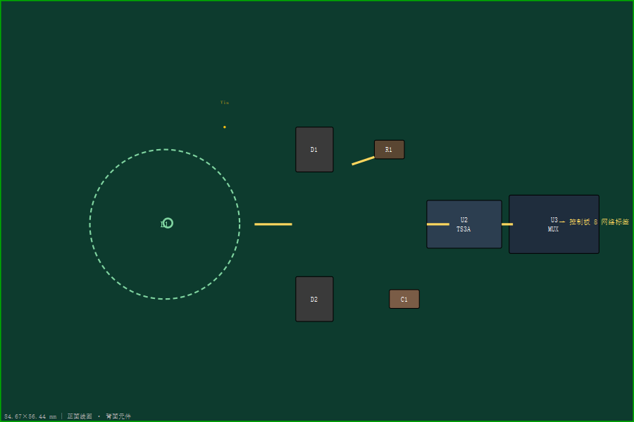

# 单通道子板 PCB 第一版布局方案

> 状态：2026-08-30 用户要求"先摆放一版"。经实测，用脚本移动 Fritzing 元件会破坏已有走线（渲染出现远端垃圾走线），**PCB 布局必须在 Fritzing GUI 里拖动完成**（Fritzing 会自动重布走线和过孔）。本文件给出目标布局的坐标表 + GUI 操作步骤。fzz 已回滚到干净提交状态（5476915），未损坏。

## 1. 板面与当前状态

- 板尺寸：**84.67 × 56.44 mm**（`PCB1`，原点 Fritzing 单位 `(49,1)`；`1 mm = 39.37 单位`）
- 元件清单（PCB 视图共 9 个实体 + 8 个网络标签接口）：
  | 位号 | 元件 | 封装 | 当前层 |
  |---|---|---|---|
  | L1 | NFC 线圈 φ20mm | 定制（双面铜） | copper0（底层）⚠️ 应翻到**顶层** |
  | D1 / D2 | BAT54S 肖特基 | SOT-23 | copper1（顶层）⚠️ 应翻到**底层** |
  | R1 | 限流电阻 | 0603 | copper1 ⚠️ → 底层 |
  | C1 | 电容 | 0603 | copper1 ⚠️ → 底层 |
  | U2 | TS3A44159 模拟开关 | TSSOP-16 | copper1 ⚠️ → 底层 |
  | U3 | CD74HC4067 多路选择器 | TSSOP-24 | copper0 + `bottom="true"` ✅ 已在底层 |
  | Via1 / TXT1 | 过孔 / 丝印文字 | — | copper0 / silkscreen |
- 现状：**全部元件挤在板左上角**（x 62~313、y 15~144 单位 ≈ 板上 0~8mm 区域），板面 95% 空白。
- 信号流（左→右）：`线圈 L1 → 桥整 D1/D2 → RC(R1/C1) → 开关 U2 → MUX U3 → 网络标签`

## 2. 目标布局（坐标表）

板坐标系：原点左上角，X 向右、Y 向下；单位 mm（括号内为 Fritzing 单位 = mm × 39.37）。

| 位号 | 中心位置 | Fritzing 单位 (x, y) | 说明 |
|---|---|---|---|
| **L1 线圈** | (22, 30) mm | (866, 1181) | 左侧居中；φ20 占 x 12~32 / y 20~40 |
| **D1** | (42, 20) mm | (1654, 787) | 桥整上臂 |
| **D2** | (42, 40) mm | (1654, 1575) | 桥整下臂 |
| **R1** | (52, 20) mm | (2047, 787) | RC 上 |
| **C1** | (54, 40) mm | (2126, 1575) | RC 下 |
| **U2** | (62, 30) mm | (2441, 1181) | TS3A 中 |
| **U3** | (74, 30) mm | (2913, 1181) | MUX 最右 |
| **Via1** | (30, 17) mm | (1181, 669) | 线圈内端→底层过孔，紧邻线圈 |
| **TXT1** | (78, 51) mm | (3071, 2008) | 右下角标识 |

> 说明：线圈放左、逐级向右，信号流一目了然；U3 靠右贴近将来接控制板的 8 网络标签方向（网络标签仅 schematic，实物连接点 M3 再加）。

### 目标布局示意图

## 3. 层方案（正面线圈 / 背面元件）

产品形态：**正面（top）= 感应线圈 L1；背面（bottom）= 所有 SMD 元件**。净空规则：
- 线圈孔径（φ20 圆）下**背面禁止铺铜/放元件**——否则衰减 13.56 MHz 感应。
- 4×4 阵列 φ19 / 20mm 间距 → 相邻线圈留 **≥1 mm** 间隙。
- 线圈两端（内端 + 外端）各需过孔到背面接 D1/D2；内端过孔放线圈孔径边缘，别挡感应区。

### GUI 操作步骤（Fritzing PCB 视图）
1. **翻层**：选中 L1 → 翻到正面（top）；选中 D1/D2/R1/C1/U2 → 翻到背面（bottom）。翻层时 Fritzing 会自动把相关走线/过孔改到对应层。
2. **摆放**：按上表拖动元件到目标位置（可在元件属性里直接填 x/y 单位值精确放置）。
3. **重布走线**：拖动后出现金色 airwire（鼠线）属正常，执行 布线→自动布线 或手动布；过孔 Fritzing 跨层自动加。
4. **检查**：线圈孔径内无铜/元件；D1/D2 紧贴线圈两引线端；R1/C1 在桥整→U2 之间；8 网络标签方向朝控制板一侧。

## 4. 遗留待办（本轮不做）
- 真实 PCB 板形按 4×4 阵列（80×80mm、20mm 间距）设计时，本单通道板形会并入，仅作原型验证。
- 实物接口（8 引脚/金手指/M3）在布局定稿后加。
